# 概述
RBF代表径向基函数（RadialBasisFunction），这个技术可以让我们根据一个变换（一个关节的旋转）驱动另一个变换（另一个关节的平移旋转和缩放）。
U额官方提供了PoseDriverConnect插件来帮助我们实现，其中包含maya插件PoseWrangler和UE插件PoseDriverConnect。使用UERBF解算器创建次级动画。
# 安装插件
[Open: 6.0-PoseWrangler的使用-1761533666007.png](attachments/12a72d16a5722267cbe754f974b92fa0_MD5.jpg)
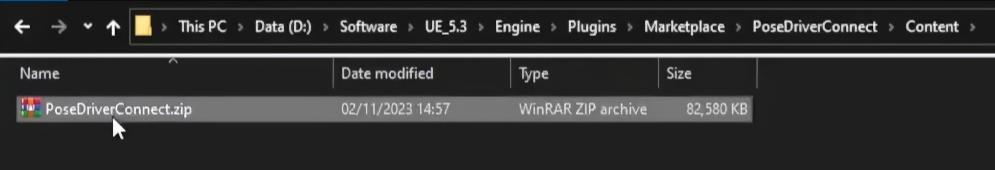
- 复制该压缩包到maya的modules路径，然后解压缩
- [Open: 6.0-PoseWrangler的使用-1761533729534.png](attachments/2e2182d836a3eb53128aa1c45d36b10d_MD5.jpg)
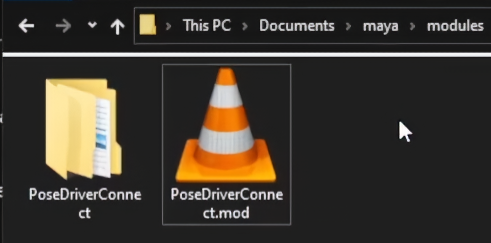
- 在maya中运行python命令：
```python
from epic_pose_wrangler import main
pose_wrangler_instance = main.PoseWrangler()
```
# 界面
[Open: 6.0-PoseWrangler的使用-1761275846258.png](attachments/b6876d5434b34999e741e8e0d7bfea8e_MD5.jpg)
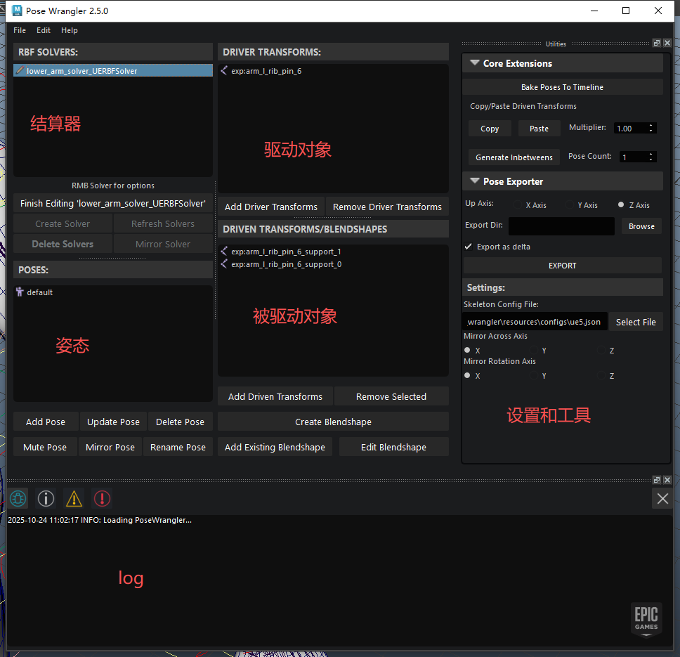
- 如果使用自定义骨骼，则需要修改Settings设置里的SkeletonConfigFile
- [Open: 4.0-PoseWrangler的使用-1761534365445.png](attachments/3eb84dffb223f78ad1f08ba4c8a150a3_MD5.jpg)

- retargeting和mirror_mapping根据自己的需要进行修改
# 使用流程
## 创建解算器
- 选中驱动骨骼点击CreateSolver
- 每个驱动对象一个解算器，比如上臂一个解算器，前臂一个解算器，锁骨一个解算器。
- [Open: 6.0-PoseWrangler的使用-1761277647020.png](attachments/49eaac68dd91d4913f68ba3c77bd619a_MD5.jpg)
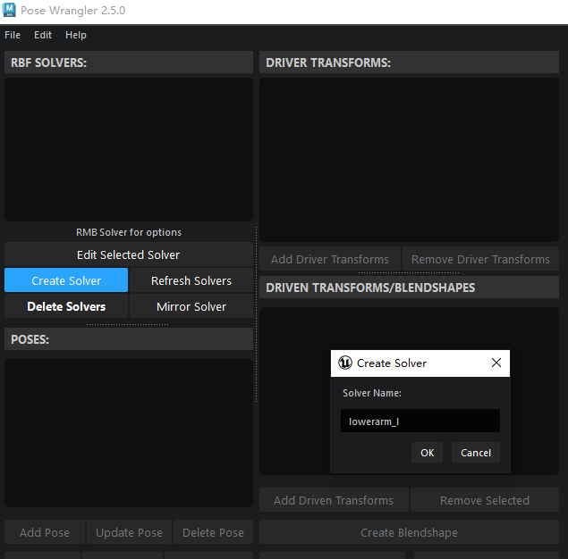
## 添加被驱动对象
- 选中被驱动对象点击AddDrivenTransforms
[Open: 6.0-PoseWrangler的使用-1761277779253.png](attachments/b6f16d7a6c04cfc85c869535007062ac_MD5.jpg)
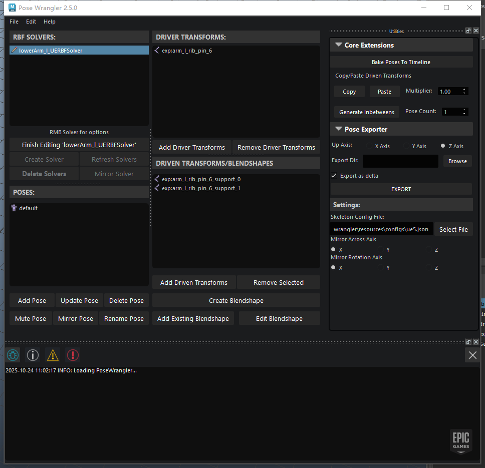
## 创建姿势
同时调整驱动对象和被驱动对象到目标姿态，然后点击AddPose，即可创建姿势
[Open: 6.0-PoseWrangler的使用-1761291798699.png](attachments/1113456cbe158617060c94d54db66f1c_MD5.jpg)
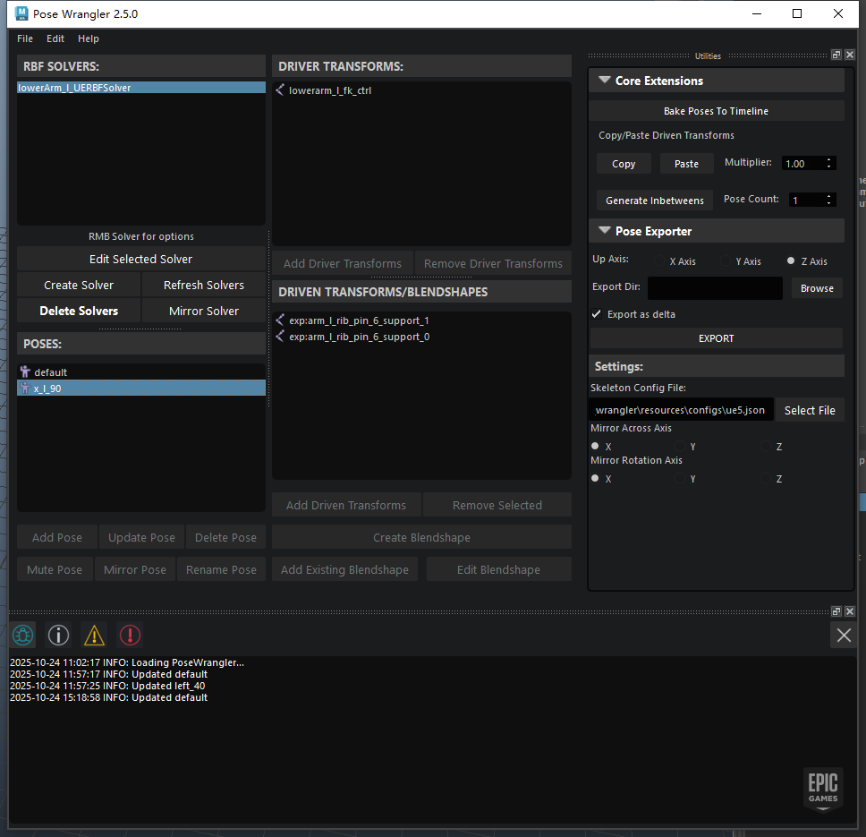
# 解算器设置
- 在大纲视图取消勾选ShowDagNodeOnly,然后搜索"rbf"，即可找到创建的RBF结算期节点
- [Open: 6.0-PoseWrangler的使用-1761291918713.png](attachments/d580c8e04f7ea90ff05675eced994705_MD5.jpg)
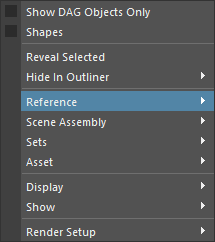[Open: 6.0-PoseWrangler的使用-1761291998437.png](attachments/eb496bc09b6504796996cddc20fd69b4_MD5.jpg)
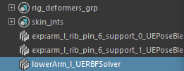
- 可查看其属性设置
[Open: 6.0-PoseWrangler的使用-1761292110602.png](attachments/c55184cdb2901e3314f0ae1fa86338dc_MD5.jpg)
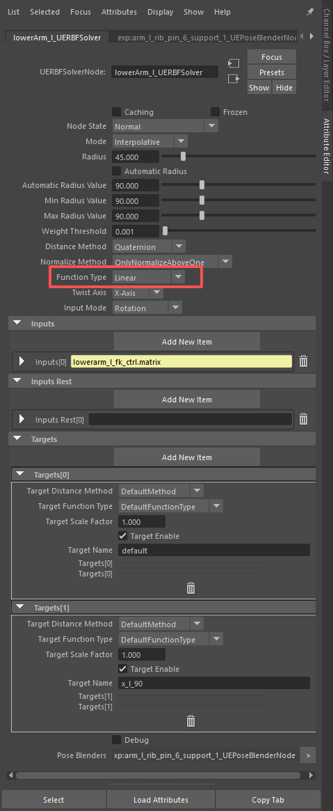
- FunctionType：功能类型，可以选择哪种插值方式来计算每个姿势之间的混合。包含：
	- Quintic：五次，比Cubic更激进。
	- Cubic：三方，会先加速，接近目标时减速
	- Exponential：指数，开始时缓慢，当接近目标姿势时加速
	- Gaussion：高斯，是一个钟形曲线插值，建议使用。
	- Linear：线性，是线性插值
- Radius：半径，半径越大夹角越大。决定了驱动变换必须与目标姿势有多近，姿势才能被激活。如果值为45，则说明我们的驱动对象必须在目标姿势的45度范围之内才能被激活。可考虑勾选AutomaticRadius（自动半径），将计算默认姿势与每个目标姿势之间的平均夹角来计算半径。
	- AutomaticRadius、MinRadiusValue、MaxRadiusValue：这三个是计算自动半径调试值，为了让你看到底层发生了什么。
	[Open: 6.0-PoseWrangler的使用-1761530112610.png](attachments/e84cbf7b1938004e3ed90984db4e4d18_MD5.jpg)
	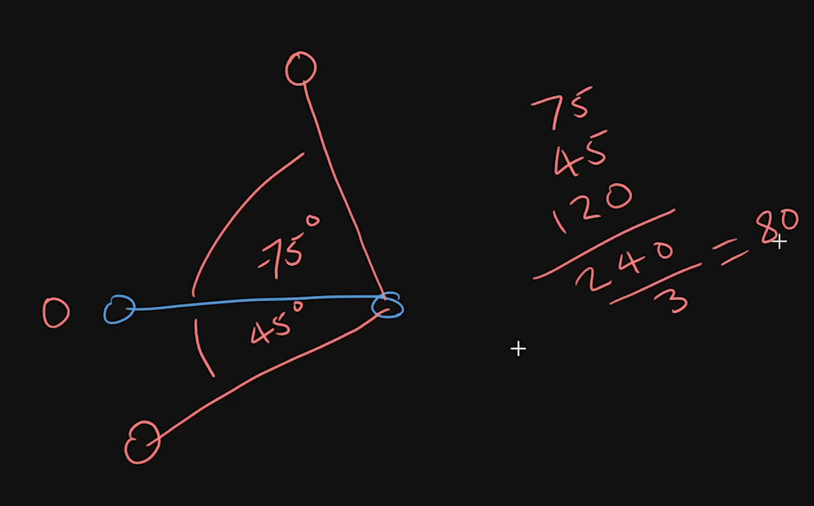
	- 如图所示，蓝色为驱动对象，向上的pose为-75度夹角，向下的pose为45度夹角，计算为：
	(70+45+(75+45)) / 3，则MinRadiusValue=45，MaxRadiusValue=120，AutomaticRadius=80。
- NormalizeMethod：当你旋转驱动对象时，结算器会计算一个权重（0:1），以显示姿势被激活的程度。在某些情况下总权重可能超过1，这就是归一化权重发挥作用的地方。
	- OnlyNormalizeAboveOne：只有用权重超过1时才进行归一化
	- AlwaysNormalize：总是归一化，建议使用
	- NoNormalize：不尽兴归一化
- WeightThreshold：权重阈值，是姿势激活所需的最小归一化距离。值过大会导致骨骼跳变。这个权重阈值适用于结算器所有姿势，而不单单时一个姿势，所以要提前预设好。
- DistanceMethod：距离方法
	- Euclidean：欧几里得
	- Quaternion：四元数，使用四元数来计算驱动对象旋转
	- SwingAngle：摆动角度，仅使用摆动角度来计算驱动对象旋转，忽略扭转角度
	- TwistAngle：扭转角度，仅使用扭转角度来计算驱动对象旋转，忽略摆动角度
- TwistAxis：扭转轴向，

# 数据导出maya
- 数据导出要使用PoseExporter，勾选向上轴向，选择导出地址，然后导出
- [Open: 6.0-PoseWrangler的使用-1761531387001.png](attachments/af0c9fde99e536adc55fad2e4cfc36e5_MD5.jpg)
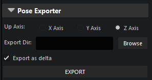
- 导出时，程序将为每个解算器导出一个单独的FBX文件，FBX文件中将包含一个动画片段，其中每个姿势一帧
- 如果勾选了ExportAsDelta，则导出数据中的姿势不是以绝对矩阵导出，而是将其导出为默认姿势和目标姿势之间的差值（Delta）。这意味着如果你有一个比例相似的骨架，你可以复用这个RBF数据，然后再对该骨架进行调整和润色。
- 还会导出一个Json文件用于记录RBF设置数据
# 数据导入UE
- 加载插件
- [Open: 6.0-PoseWrangler的使用-1761531956457.png](attachments/cb461670e27a6f93504127ec667ce0d0_MD5.jpg)
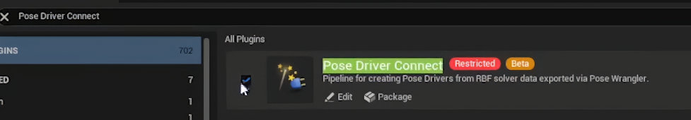
- 打开插件，在Tools目录下
- [Open: 6.0-PoseWrangler的使用-1761531993832.png](attachments/65dba7f1bc98d13db16834cb96176bfe_MD5.jpg)
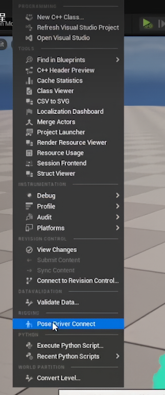

[Open: 6.0-PoseWrangler的使用-1761532041971.png
- ](attachments/6105de875fdcaf8129db8bab8f50d151_MD5.jpg)
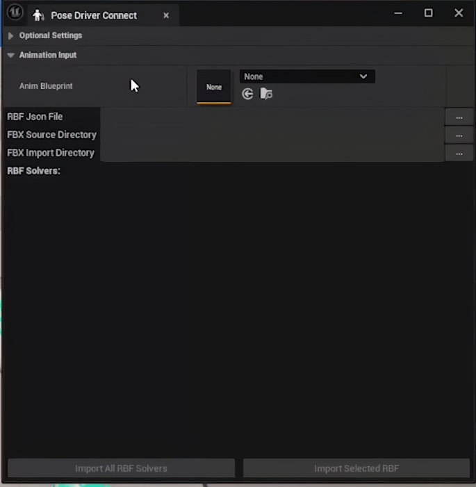
- 使用插件
- 载入后处理动画蓝图（要使用PoseDriver的动画蓝图）
- 载入Jason文件
- 载入RBF导出的FBXs所在的文件夹
- 载入引擎RBF文件夹路径，引擎中用于储存FBX数据
- 然后点击ImportAllRBFSolver
[Open: 6.0-PoseWrangler的使用-1761532268053.png](attachments/ff03485827957a2c9877df7a4bc72dcc_MD5.jpg)
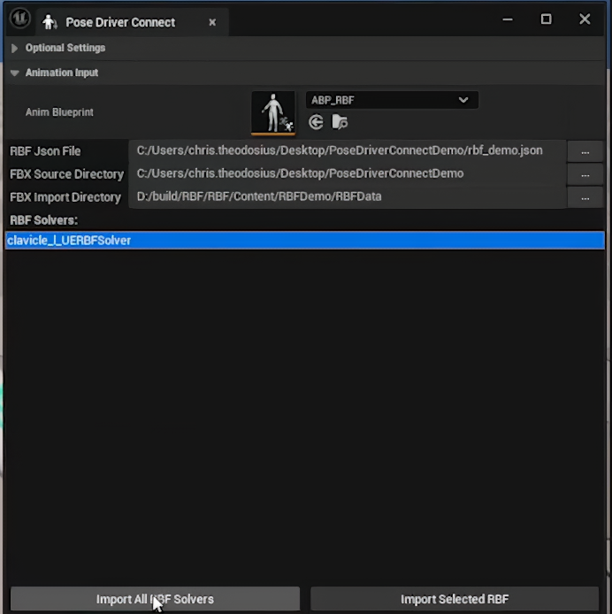
- 会在指定的路径下发现动画序列和姿势资产
- [Open: 6.0-PoseWrangler的使用-1761532345661.png](attachments/1c7ecb67a72e8da4d1cc82e781b54660_MD5.jpg)
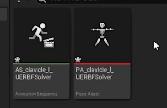
- 在后处理动画蓝图中发现PoseDrive节点
- [Open: 6.0-PoseWrangler的使用-1761532431173.png](attachments/d0effc5c01cefdec0659bf65681648f4_MD5.jpg)
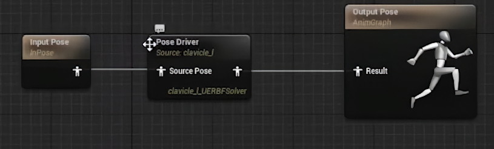
- 