本文基于：
- https://dev.epicgames.com/documentation/en-us/metahuman/metahuman-documentation
# 安装MetaHuman创建器核心数据和插件
- 在虚幻引擎的选项中[Open: 8.0-MetaHuman For Maya-1763959247766.png](attachments/95ca4183a06982291f6784d8a1b146a1_MD5.jpg)

- 勾选MetaHumanCreatorCoreData
- [Open: 8.0-MetaHuman For Maya-1763959291673.png](attachments/e3c981878add001107375b11ec2b2f99_MD5.jpg)
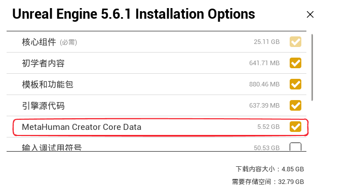
- 启动引擎后勾选所有关于MetaHuman的插件
- [Open: 8.0-MetaHuman For Maya-1763959341225.png](attachments/f6f24d74f64f404796e221a51a033cc8_MD5.jpg)

- 其中MetaHumanForMaya需要Fab上下载安装
- [Open: 8.0-MetaHuman For Maya-1763959422481.png](attachments/804631b4ab6e4d7b293c1aee9fa8022a_MD5.jpg)

- 在maya中安装MetaHumanForMaya，并启用插件
	- H:\EpicGames\UE_5.6\Engine\Plugins\Marketplace\MetaHumanForMaya_5.6\Content\MetaHumanForMaya-v1.1.14.msi
	- 不建议在同一会话中使用Quixel Bridge Maya插件（`MayaUERBFPlugin.mll`和`embeddedRL4.mll`）和MetaHuman for Maya。
# 从Quixel Bridge下载Metahuman（旧方法）
- Metahuman资产如果下载缓慢，最好开梯子。如果超过三小时下载项目会被停止，不会续传。
- 下载开始一段时间之后，点击

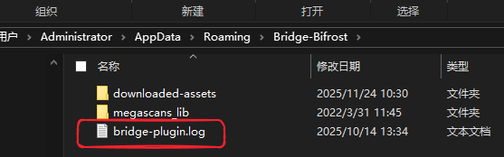
- 
- 打开log文件查找metahuman的名称，名称在downloaded-assets文件夹内


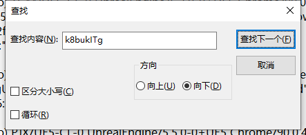
- 一直查找下一个，直到找到下载网址，将网址粘贴进浏览器进行下载，有两个网址，一个是图片PNG一个是压缩包ZIP，可以都下载
- 

- 资产下载完成之后打开Quixel Bridge的preference选项找到下载目标地址
- 
[Open: 8.0-MetaHuman For Maya-1763953039464.png](attachments/b7495eb886d23e31aabc51245885fda1_MD5.jpg)

- 在路径下重新按照官方要求布置文件夹
- Megascans Library\Downloaded\UAssets\metahuman角色编号\Tier0\asset_ue\压缩包解压内容
[Open: 8.0-MetaHuman For Maya-1763955447767.png](attachments/e1917abc309999ed683465cefb708efc_MD5.jpg)

- 在k8bukITg文件夹下放置图片和一个json文件（查看之前的怎么写的，改一下就行）
- [Open: 8.0-MetaHuman For Maya-1763954944364.png](attachments/324153b6252f4b9236b3f9acac38a3d2_MD5.jpg)

```json
{
    "name": "Taro",
    "preview": "C:\\Users\\Administrator\\Documents\\Megascans Library\\Downloaded\\UAssets\\k8bukITg\\k8bukITg.png",
    "previews": {
        "images": {
            "aspectRatio": 1,
            "preview": "C:\\Users\\Administrator\\Documents\\Megascans Library\\Downloaded\\UAssets\\k8bukITg\\k8bukITg.png",
            "thumb": "C:\\Users\\Administrator\\Documents\\Megascans Library\\Downloaded\\UAssets\\k8bukITg\\k8bukITg.png",
            "thumbJpg": "C:\\Users\\Administrator\\Documents\\Megascans Library\\Downloaded\\UAssets\\k8bukITg\\k8bukITg.png",
            "thumbRetina": "",
            "thumbRetinaJpg": ""
        }
    },
    "missingLODs": false,
    "isDHIAsset": true,
    "points": 0,
    "createdAt": 1655258579.148,
    "updatedAt": 1655278765.807,
    "id": "k8bukITg",
    "asset": "k8bukITg",
    "type": "metahuman",
    "assetType": "metahuman",
    "categories": [],
    "category": "",
    "subCategory": "",
    "objectID": "k8bukITg",
    "contains": [],
    "theme": [],
    "descriptive": [],
    "href": {
        "pathname": "",
        "search": ""
    },
    "pack": null,
    "tags": [],
    "environment": {
        "biome": "",
        "region": ""
    },
    "version": 1,
    "averageColor": "",
    "properties": [],
    "revision": 0,
    "meta": [
        {
            "key": "",
            "name": "",
            "value": ""
        }
    ],
    "semanticTags": {
        "assetCategories": {
            "metahuman": {}
        },
        "subject_matter": "",
        "name": "Taro",
        "latin_name": [],
        "asset_type": "metahuman",
        "contains": [],
        "theme": [],
        "descriptive": [],
        "environment": [],
        "season": [],
        "interior_exterior": [],
        "architectural_style": {},
        "state": [],
        "country": "",
        "region": "",
        "industry": [],
        "3d_mesh": "",
        "resolution": "",
        "locations": {},
        "maxSize": "",
        "minSize": ""
    }
}
```
- 点击Add按钮，弹出选项中选择迁移
- [Open: 8.0-MetaHuman For Maya-1763957687382.png](attachments/e63605c44277673049cc4bbb1e0ff3d0_MD5.jpg)
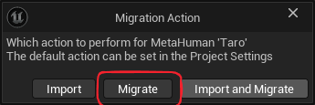
- 会将MetaHuman的资产迁移至虚幻引擎
- [Open: 8.0-MetaHuman For Maya-1763965970002.png](attachments/8028418dad5e51134bfc17d34c165b90_MD5.jpg)

# 在unreal engine中创建MetaHuman（新方法）
- 创建一个Metahuman Character资产
- [Open: 8.0-MetaHuman For Maya-1764037436021.png](attachments/fa55470b1f68792c47fc75ef26700aa6_MD5.jpg)
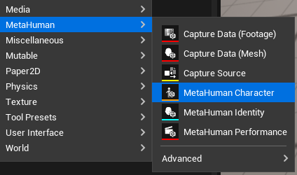
- 打开资产，场景内会有一个预设角色，自定义即可，在自定义中可使用自定义模型来组装MetaHuman
	- 源身体网格体采用标准的MetaHuman拓扑。
	- 源身体网格体拓扑具有标准的MetaHuman UV布局。
	- 如果导入关节，你必须保留原始的关节层级和命名规范。
- 要适配没有标准MetaHuman拓扑的身体网格体，例如不同的顶点顺序、三角剖分的多边形或不同的顶点数量，请启用**_按UV匹配顶点_（Match Vertices by UVs）**。
- 从UE将MetaHuman骨骼网格体导出为`.fbx`将导致非标准的MetaHuman拓扑（在UV边界进行三角剖分、分割顶点）。 要使用这些网格体进行适配，你必须启用_"按UV匹配顶点（Match Vertices by UVs）"_选项。
- 选择身体模型

- 选择头部模型，需要四个模型：头部，左眼，右眼，牙齿


- 最后可组装为DCC导出或UE内使用
- [Open: 8.0-MetaHuman For Maya-1764038398700.png](attachments/eeb7a20c0f656133d354eb6a6345904b_MD5.jpg)
- 
	- **UE电影级（UE Cine）**是指unreal engine Cinema高质量组装，用于对质量要求高于性能的离线电影级渲染和实时渲染。
	- **UE优化版（UE Optimized）** 是指可自定义质量组装，此组装管线提供高、中、低三种优化级别。
	- UEFN Export是指UEFN堡垒之夜编辑器导出
	- DCC Export 是指3D软件导出，可供Maya、Houdini等第三方DCC软件直接使用。
	- 使用扫描头部模型要使用**MetaHuman Identity**：
		- https://dev.epicgames.com/documentation/zh-cn/metahuman/from-mesh
# 载入metahuman,导出DNA文件

- 双击打开资产，并点击左上角的CreateFullRig，需要挂梯子链接服务器
- [Open: 8.0-MetaHuman For Maya-1763966070168.png](attachments/cb2074fc9936955d6822515f75210bdf_MD5.jpg)
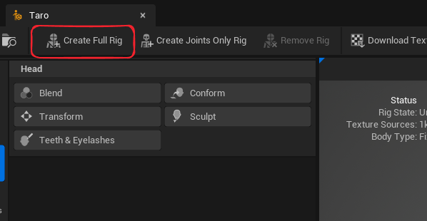
- 点击DownloadTextureSource，下载材质贴图
- [Open: 8.0-MetaHuman For Maya-1763966387976.png](attachments/099c4fc3d667818d5ce774698cde17b5_MD5.jpg)
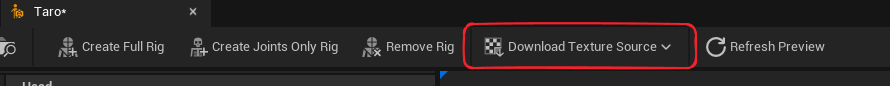
- 之后进入组装（Assemble）菜单，进行设置组装为DCC导出，并设置导出路径
- [Open: 8.0-MetaHuman For Maya-1763966599837.png](attachments/871bc817f6a18a8b56c6fc5e4d70eaab_MD5.jpg)

- 然后点击最下方的绿色组装（Assemble）按钮
# Maya操作

[Open: 8.0-MetaHuman For Maya-1763968355254.png](attachments/8ee26422baa7f155ae88c0e6560a4248_MD5.jpg)
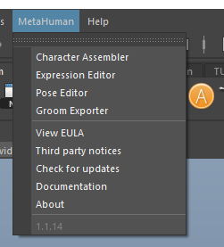
## CharacterAssembler角色组装器
- 用于载入整个角色
- [Open: 8.0-MetaHuman For Maya-1763969149987.png](attachments/f5854c8a1963eff98c679d1c11028ff0_MD5.jpg)
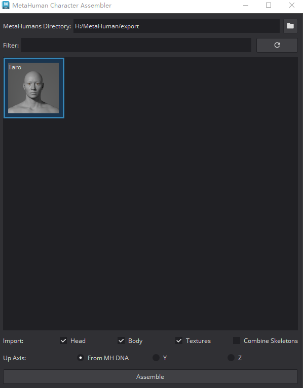
- 选择导出的资产路径，选择要处理的角色，点击组装Assemble
- [Open: 8.0-MetaHuman For Maya-1763969781552.png](attachments/a8106e2033f7062bb4bbac48c7120d27_MD5.jpg)

## ExpressionEditor（表情编辑器）
- 用于编辑表情效果
- [Open: 8.0-MetaHuman For Maya-1764056748413.png](attachments/ad697b9610803dba292f907f8d950bf3_MD5.jpg)

### 中性姿势
- 用于修改模型绑定姿态时的顶点位置和骨骼位置
- [Open: 8.0-MetaHuman For Maya-1764057043941.png](attachments/7fbbb0722abd0d84f3897c49a28feeec_MD5.jpg)

- 右上角功能按钮依次为
	- 组装选中的LOD，一般为选择LOC0
	- 传递顶点位置，修改模型后点击
	- 更新顶点，会根据最新的顶点位置计算骨骼位置
	- 更新骨骼，会更新子定位的骨骼位置，你可能修改眼球骨骼位置和嘴唇骨骼位置
	- 保存DNA，会从LOD0向下计算保存DNA
- 骨骼位置，MetaHuman中有一些骨骼在姿势更新时会自动定位的，有一些骨骼更新时不会自动定位的。以下关节在绑定姿势更新时不会自动定位的体积关节：

|                                                                                                                                                                                                                              |                                                                                                                                                                                                                                        |                                                                                                                                                                                                                                                     |
| ---------------------------------------------------------------------------------------------------------------------------------------------------------------------------------------------------------------------------- | -------------------------------------------------------------------------------------------------------------------------------------------------------------------------------------------------------------------------------------- | --------------------------------------------------------------------------------------------------------------------------------------------------------------------------------------------------------------------------------------------------- |
| FACIAL_C_Skull<br><br>FACIAL_L_EyelidUpperB<br><br>FACIAL_R_EyelidUpperB<br><br>FACIAL_L_EyelidUpperA<br><br>FACIAL_R_EyelidUpperA<br><br>FACIAL_L_Eye<br><br>FACIAL_L_EyeParallel<br><br>FACIAL_L_Pupil<br><br>FACIAL_R_Eye | FACIAL_R_EyeParallel<br><br>FACIAL_R_Pupil<br><br>FACIAL_L_EyelidLowerA<br><br>FACIAL_R_EyelidLowerA<br><br>FACIAL_L_EyelidLowerB<br><br>FACIAL_R_EyelidLowerB<br><br>FACIAL_C_Nose<br><br>FACIAL_C_NoseTip<br><br>FACIAL_C_MouthUpper | FACIAL_C_TeethUpper<br><br>FACIAL_C_LowerLipRotation<br><br>FACIAL_C_MouthLower<br><br>FACIAL_C_TeethLower<br><br>FACIAL_C_Tongue1<br><br>FACIAL_C_Tongue2<br><br>FACIAL_C_Tongue3<br><br>FACIAL_C_Tongue4<br><br>FACIAL_C_Jaw<br><br>FACIAL_C_Chin |
- 上表中，下列两个关节还具有额外的区别特征：`FACIAL_L_Pupil`以及`FACIAL_R_Pupil`。 只有这两个关节会动态地改变缩放组件以影响网格体。
- 最后，以下三个身体关节需要始终保持原样：`FACIAL_C_Neck1Root`、`FACIAL_C_Neck2Root`以及`FACIAL_C_FacialRoot`。 这三个关节需要始终匹配身体，并且依赖身体绑定的选择。
- 举例说明
	- 睛可以简单地与眼球的体积相匹配（注意不要意外移动它们的子项，这些子项将通过表面定位放置在网格体的正确区域上）。以左眼为例：`FACIAL_L_EyelidUpperB`、`FACIAL_L_EyelidUpperA`、`FACIAL_L_EyelidLowerA`、`FACIAL_L_EyelidLowerB`、`FACIAL_L_Eye`以及`FACIAL_L_EyeParallel`都会被移动到眼球网格体中间环的几何体中心位置。
	- 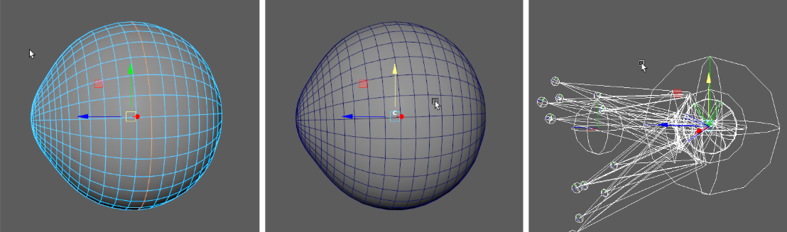
	- 嘴巴与眼睛相似，但它有几个需要分组处理的关节，其定位虽然直观，但需要根据嘴唇肉质部分的体积进行目测。
	- 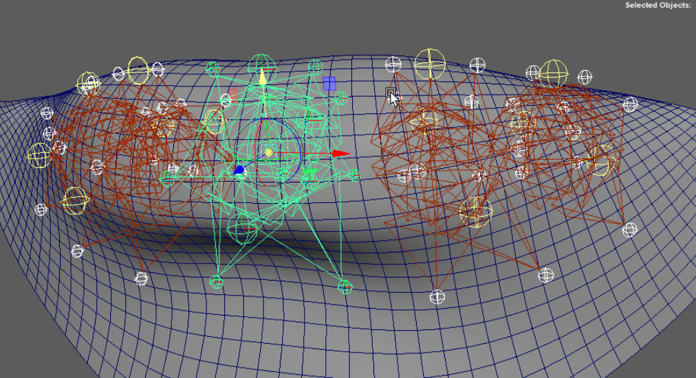
	- [Open: 8.0-MetaHuman For Maya-1764062772259.png](attachments/316b8e9a8b3f31feeeb188d83470fce4_MD5.jpg)

- 编辑骨骼位置脚本
```python
import maya.cmds as cmds

# 调整骨骼位置 主要体积骨骼
# 眼球
cmds.select('FACIAL_L_EyelidLowerB', 'FACIAL_L_EyelidUpperA','FACIAL_L_EyelidUpperB', 'FACIAL_L_EyelidLowerA', 'FACIAL_L_Eye', r=1)
cmds.select("FACIAL_L_Pupil", r=1)

# 鼻子
cmds.select("FACIAL_C_Nose", r=1)
cmds.select("FACIAL_C_NoseTip", r=1)
cmds.select("FACIAL_L_Nostril", r=1)
cmds.select("FACIAL_C_NoseLower", r=1)

#上牙
cmds.select("FACIAL_C_TeethUpper", r=1)

#下牙+舌头
cmds.select("FACIAL_C_TeethLower", r=1)

#嘴部
cmds.select("FACIAL_C_MouthUpper", "FACIAL_C_MouthLower", r=1)

#下巴
cmds.select("FACIAL_C_Jaw", "FACIAL_C_LowerLipRotation", r=1)

#镜像体积骨骼
for i in cmds.ls("FACIAL_L_*", type="joint"):
    if len(i.split("_")) == 3 and cmds.listRelatives(i):
        pos = cmds.xform(i, q=1, t=1, ws=1)
        cmds.xform(i.replace("_L_", "_R_"), t=[-pos[0], pos[1], pos[2], ws=1)
```
###  蒙皮权重
[Open: 8.0-MetaHuman For Maya-1764057751638.png](attachments/54b6d030d1cd0932433b481b13edccaf_MD5.jpg)

- 蒙皮全中的修改不会自动计算DNA，需要手工逐个修改
- 左上方两个按钮为：
	- 组装选中的LOD
	- 保存DNA
- 左侧四个按钮为：
	- 选择镜像方向（从左到右或者从右到左）
	- 镜像蒙皮全中，可以是整个模型也可以是选中的顶点
	- 分析蒙皮镜像数据
	- 开关顶点着色
### 表情姿势
[Open: 8.0-MetaHuman For Maya-1764058570203.png](attachments/abb2d1b317e2b63d0fff7e515d3b1619_MD5.jpg)

- 图表中有七列表情节点，他们有上下游的依赖关系，第二列表情会依赖第一列表情，以此类推，最后一列会依赖前面六列中的表情
- 每个节点上会有一把锁，当节点被锁定后，修改其上游节点将不会影响被锁定的下游节点，否则将会传播影响。
- 右上按钮功能依次是：
	- 组装场景
	- 载入faceboard测试动画，插件自带：
		- C:\Program Files\Epic Games\MetaHumanForMaya\lib\mh_expression_editor\1.10.1\mh_expression_editor\res\gui_technical_rom.fbx
	- 载入RigLogic 原始动画，插件自带：
		- C:\Program Files\Epic Games\MetaHumanForMaya\lib\mh_expression_editor\1.10.1\mh_expression_editor\res\raw.fbx
	- 分析表情帧
	- 编辑表情
	- 从场景中更新DNA
	- 保存DNA
- 右侧是一个标签按钮，保存常修改的节点位置
- 当你点击编辑表情之后，会进入编辑模式
- [Open: 8.0-MetaHuman For Maya-1764061558655.png](attachments/ee828bd190f58c403c43d32c25efd9e9_MD5.jpg)
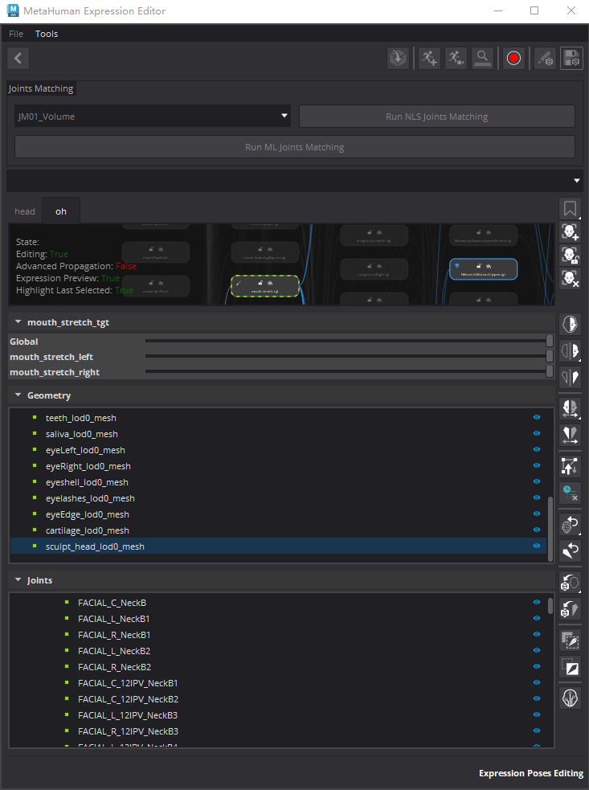
- 右侧有一列功能按钮
- 前三个用于创建和移除预览表情模型
- 下三个用于镜像变形和骨骼
- 下两个用于反转选择
- 下两个用于传递顶点位置和删除模型历史
- 下两个用于重置模型和骨骼
- 下两个用于重置模型和骨骼到DNA描述的状态
- 下两个用于拷贝和粘贴骨骼状态
- 最后一个就厉害了，ML Joints Matching利用机器学习根据模型修改来修正骨骼位置，也可以在修改全部完成后点击上面的大按钮Run ML Joints Matching
# Wrap4D
[Open: 8.0-MetaHuman For Maya-1763975107174.png](attachments/52a1feca07d6fa675103de7a9a17b8ef_MD5.jpg)

- 可以依赖Wrap4D软件来实现一个模型：拥有MetaHuman的布线，拥有自定义模型的外观，节点图如下
- [Open: 8.0-MetaHuman For Maya-1763975229529.png](attachments/db6d0f214e5889788fd0a129ac5b4b90_MD5.jpg)


- 在maya中传递点顺序，先依次选择源模型的三个点，再选择目标模型的对应三个点，实现点顺序从源模型到目标模型传递
- [Open: 8.0-MetaHuman For Maya-1763975751024.png](attachments/8b507ec0dc6ea480891628972d4dd509_MD5.jpg)

- 