# 骨骼位置
- 我们经常会遇到这种手指变形，手指弯曲后中间有个大窟窿
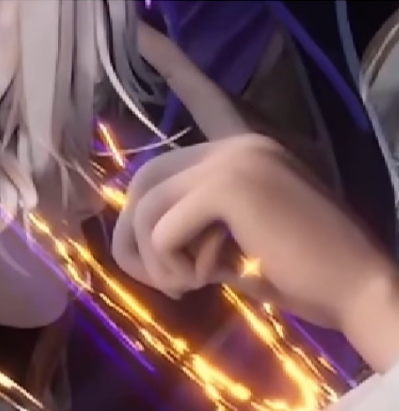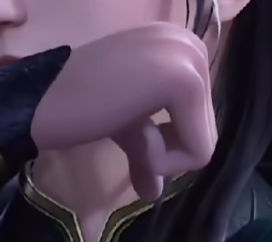
- 正确的形态应该是这样的
- [Open: 8.0-手指绑定-1765266064536.png](attachments/e5311725c68f9b8f2208b2e4af12aa85_MD5.jpg)
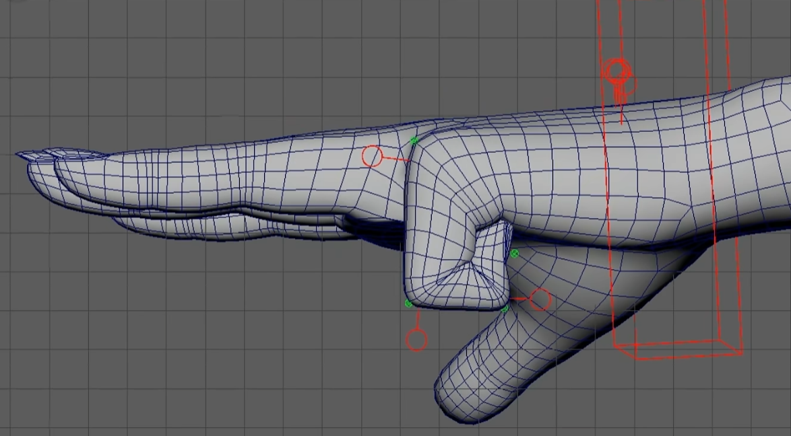
- 就算是修形之前，间隙也应该很小才对
- [Open: 8.0-手指绑定-1765266118167.png](attachments/4969557fd4f08f8b6d8a1ece9035cca0_MD5.jpg)
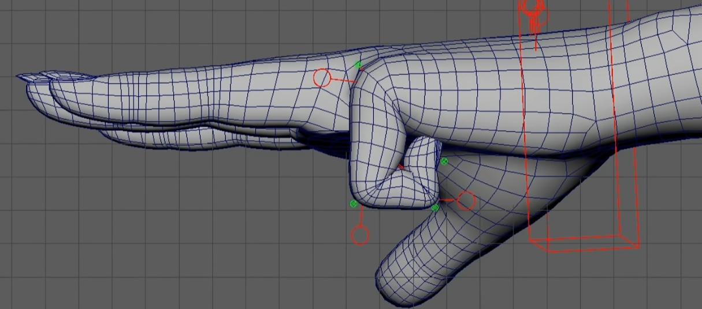
- 其关键在于骨骼位置，手指的骨骼应该要靠上一点
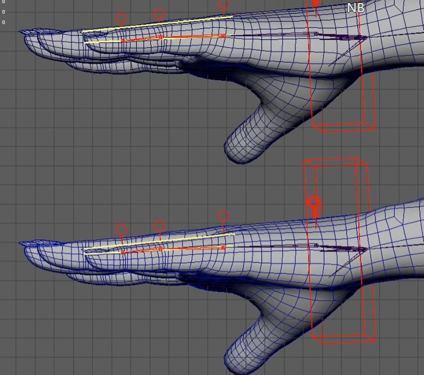

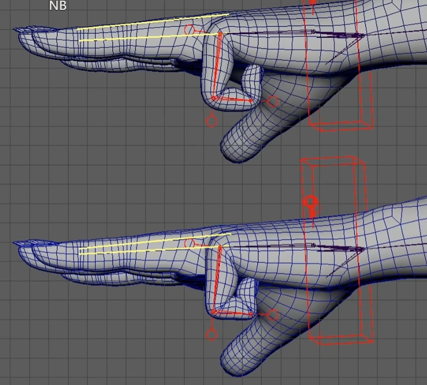
- 对于更细的手指，骨骼甚至要高于模型
- [Open: 8.0-手指绑定-1765266323651.png](attachments/6a1be2bd1b80ba9d928014a79bfca62b_MD5.jpg)
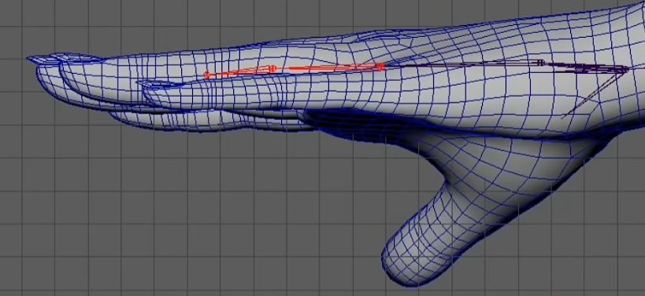
- [Open: 8.0-手指绑定-1765266342566.png](attachments/9704ad91fd9a893b1907448b5abb6c91_MD5.jpg)
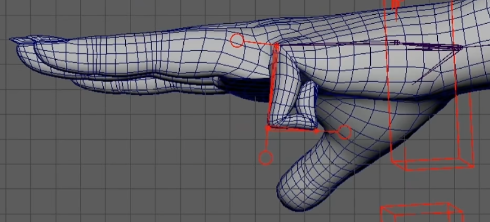
- 加入修形
- [Open: 8.0-手指绑定-1765266378847.png](attachments/52f3dac4fe1babe30a80f8a1b350d0c9_MD5.jpg)
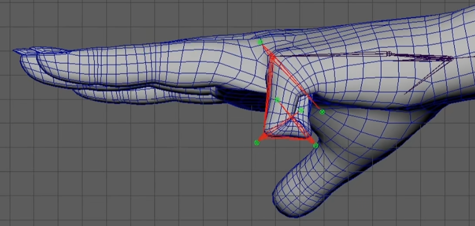
- 最好形态
- [Open: 8.0-手指绑定-1765266493390.png](attachments/247b7b50efe3548dd814272a9344b0dd_MD5.jpg)
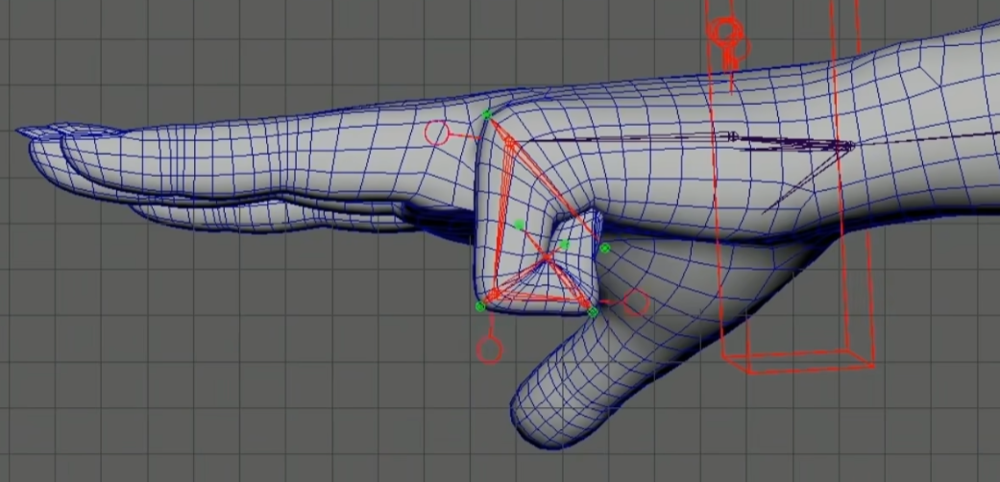
# 计算原理
- 伸展形态，骨骼之间的距离称为：0,1,2,3...。骨骼和手指下表面之间的距离称为：h0,h1,h2,h3...
[Open: 8.0-手指绑定-1765266566388.png](attachments/d5af1b1ac48cf87cba8e98fb5434f9a4_MD5.jpg)
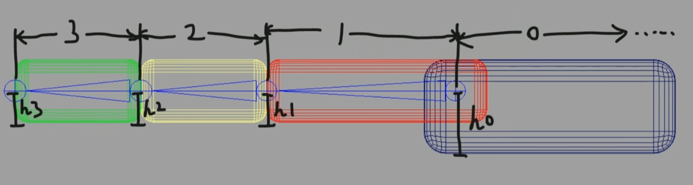
- 弯曲形态，我们发现：1指节长度 = 3指节长度 + 掌骨高度
[Open: 8.0-手指绑定-1765266690658.png](attachments/4d219c503a875ac1d5341ee65a398f49_MD5.jpg)
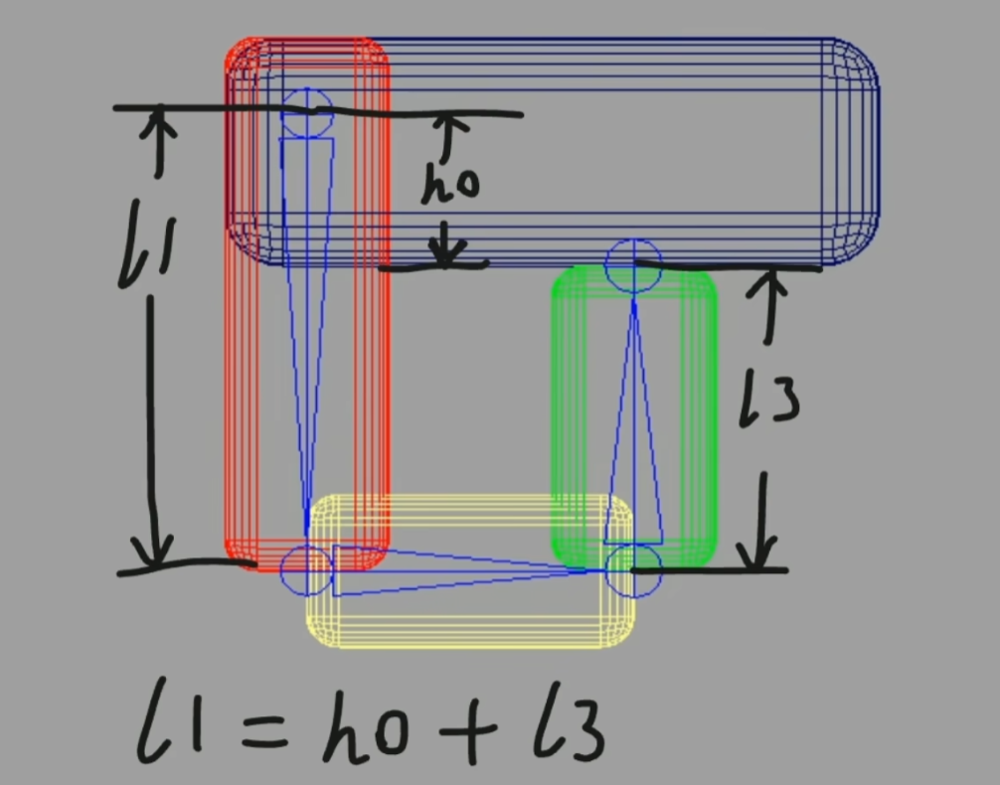
- 并且，2指节长度 = 1指节骨骼高度 + 3指节骨骼高度
- [Open: 8.0-手指绑定-1765266838888.png](attachments/984d993884e08cdcc6644f148f1e4b08_MD5.jpg)
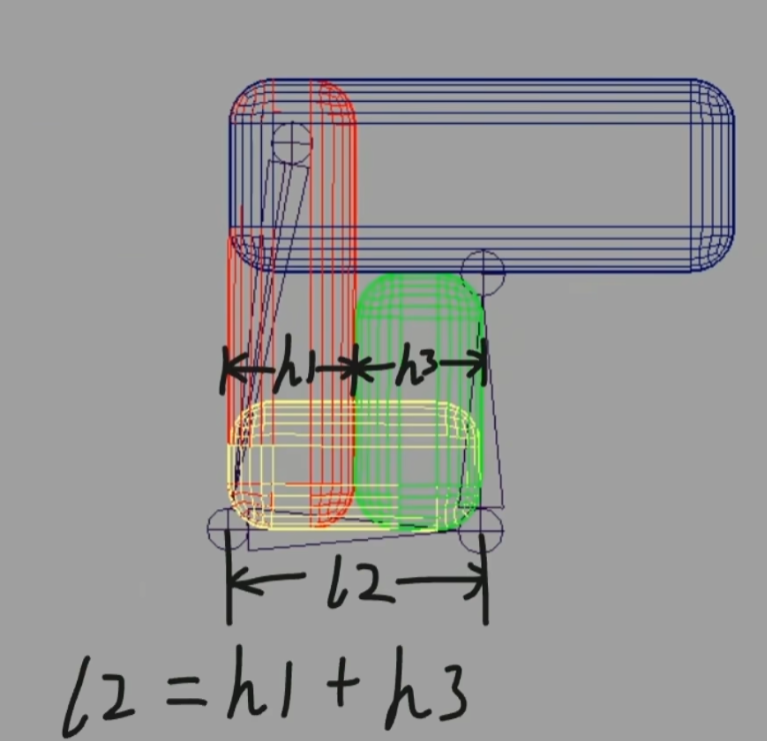
# 总结
- 我们发现手指的变形效果跟手指的长度和粗度有关，
	- 如果是粗一点的手指，需要将骨骼位置向下移动
	- 如果是细一点的手指需要将骨骼位置向上移动
- 1指节长度 = 3指节长度 + 掌骨高度
- 2指节长度 = 1指节骨骼高度 + 3指节骨骼高度