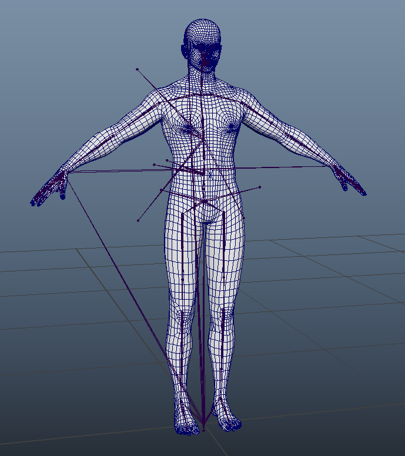
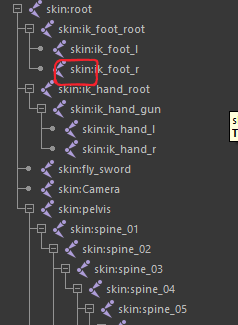
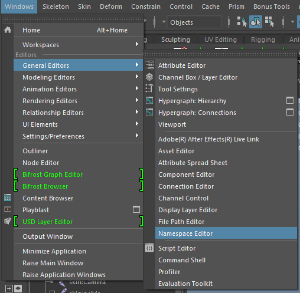
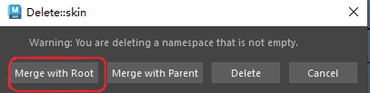
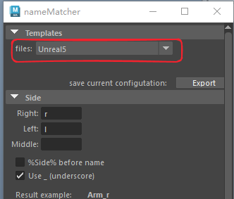
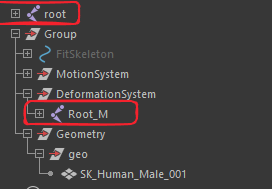
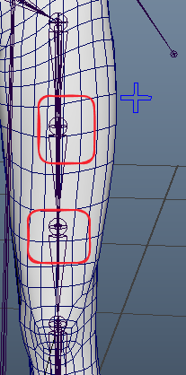

# 绑定插件安装
- https://animationstudios.com.au/advanced-skeleton-download/
# 骨骼模型导入maya
- 根据项目需要设置场景为Z轴向上或Y轴向上，将骨骼模型导入maya

# 移除空间名称
- 骨骼名称可能带有命名空间，如果有要去掉命名空间

- 打开空间名称编辑器

- 删除空间名称

- 在弹出窗口选择合并到根

# 绑定
- 使用advanced skeleton插件的NameMatcher工具进行绑定

- 模板选择Unreal 5

- 点击下面的check按钮，会弹出提示，所有提示一律点击OK。

- 然后点击Create + Place FitSkeleton，插件会生成对位骨骼
- 然后点击BuildAdvancedSkeleton，创建绑定
- 最后点击ConstraintToJoints，绑定到骨骼
# 后续
- 因为插件的原因，手臂和腿的扭转骨骼并没有被约束，需要手动实现约束

- 需要用下面一套骨骼（Root_M）的扭曲骨骼父子约束上面一套骨骼（root）的扭曲骨骼，具体约束为：
	- ShoulderPart1_L 约束 upperarm_twist_01_l
	- ShoulderPart2_L 约束 upperarm_twist_02_l
	- ElbowPart1_L 约束 lowerarm_twist_02_l
	- ElbowPart2_L 约束 lowerarm_twist_01_l 
	- HipPart1_L 约束 thigh_twist_01_l
	- HipPart2_L 约束 thigh_twist_02_l
	- KneePart1_L 约束 calf_twist_02_l
	- KneePart2_L 约束 calf_twist_01_l
	- 右侧骨骼也是一样只不过骨骼名称从 L 改为 R

- 腿部也一样

- 这样绑定就完成了