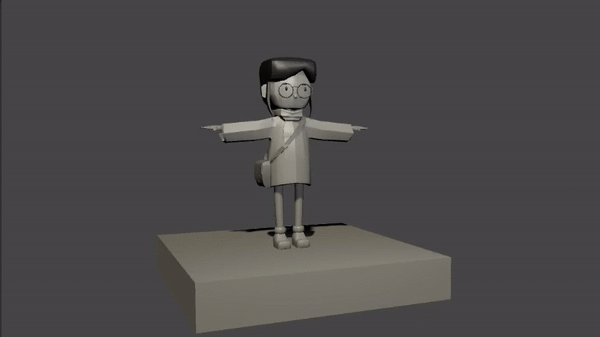
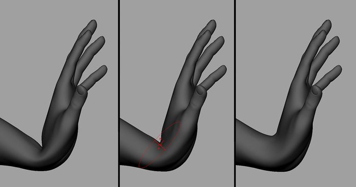
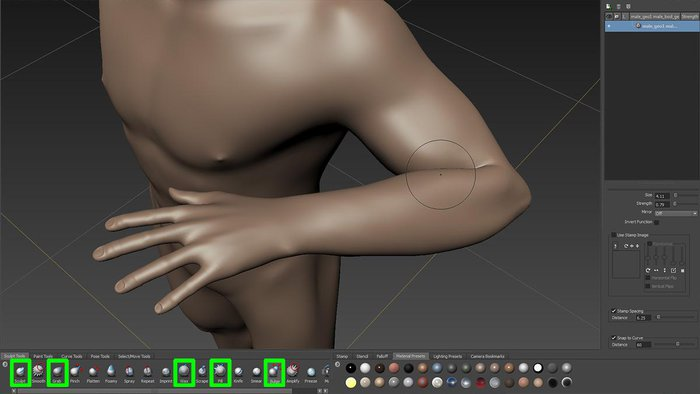
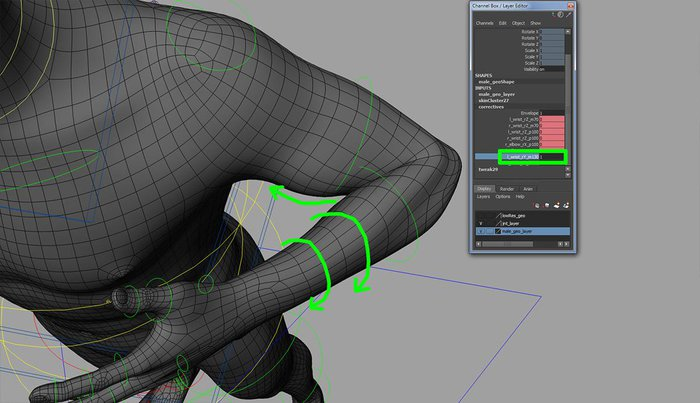
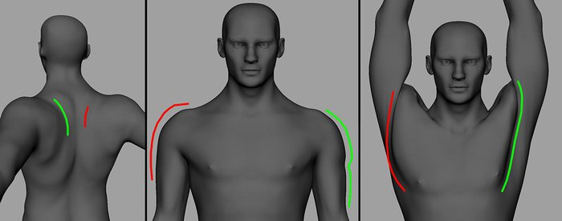
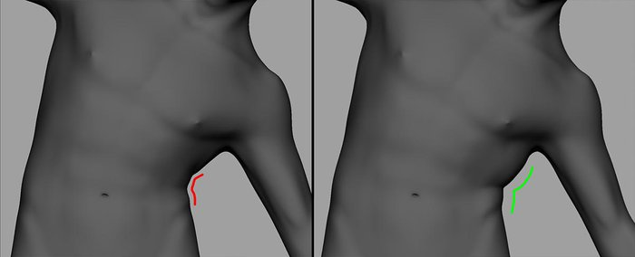
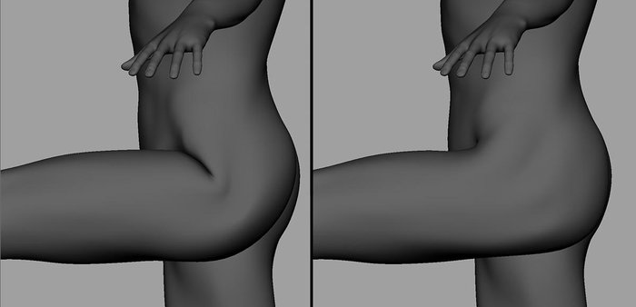
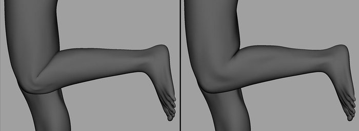

# 修形（Corrective Shapes）能力提升指南

> 背景：在 Maya-UE5 管线（MetaHuman 角色）中制作姿态修形（joint delta / blendshape）时，常感觉肌肉姿态不够自然。修形质量 ≈ **解剖学理解 × 参考素材质量 × 工作流效率**，三者缺一不可。本笔记整理系统性的提升路径。

## 一、根本问题：肌肉姿态不自然，90% 是解剖认知不足

修形做不好，往往不是雕刻手法问题，而是**不知道那个姿态下软组织"应该"长什么样**。

### 解剖学习资源（TA/绑定师向，非画师向）

- **《Anatomy for 3D Artists》**（3dtotal / Uldis Zarins）：专讲动态姿态下的肌肉形变，大量"同一部位不同姿态"对比图，几乎是为做修形的人写的。
- **《Anatomy of Facial Expression》**（Uldis Zarins）：面部修形必读。
- **Scott Eaton — Anatomy for Artists 课程**：业界 TA 圈公认最强，重点讲**肌肉在收缩/拉伸/受压时的体积变化**，正是修形的核心。

### 需要吃透的关键概念

- 肌肉**收缩时变短变粗、拉伸时变长变扁**；
- 骨骼 landmark（肘尖、髌骨、肩峰）位置不动，但**周围软组织在其上滑动**；
- **脂肪与皮肤的堆积挤压**：腋窝、肘窝、腹股沟、弯腰时的腹部堆叠。

### 最有价值的参考：真实扫描数据

- **3D Scan Store、Ten24** 的 pose scan 包：同一人几十个姿态的高精度扫描。把扫描对齐到绑定骨架上，直接对比自己的修形与真实形变的差异——**提升最快的路径**。
- 免费学术数据集：**DYNA / DFAUST / AMASS**（4D 人体扫描序列）。
- 土办法：手机绕着真人手臂弯曲姿态拍一圈，photogrammetry 出糙模当参考。

## 二、工作流层面：让修形"做得对"且"改得快"

### 1. 在正确的空间里雕刻

- 确保在 **pose space** 下雕刻：用 Maya 的 Pose Interpolator（Pose Editor），或 `invertShape` 类工具反算 corrective delta。
- 如果还在"手动摆姿态 → 复制 mesh → 雕 → 求 delta"，先把流程自动化——**迭代速度决定质量上限**。
- 修形触发用 **swing/twist 分解 + RBF** 驱动，而非裸欧拉角（欧拉角有万向锁和顺序依赖问题）。这也是 MetaHuman body 的做法：UE 端是 Pose Driver（RBF solver），Maya 端 DNA behavior 层同样由 swing/twist 驱动。参见 [2.0-将旋转分解为扭转和摆动](../常用算法和问题/2.0-将旋转分解为扭转和摆动.md)、[1.0-PoseWrangler的使用](1.0-PoseWrangler%E7%9A%84%E4%BD%BF%E7%94%A8.md)。

### 2. 分层修形，不要一个 shape 打天下

| 层级 | 职责 | 典型手段 |
| --- | --- | --- |
| 第一层：体积保持 | 解决关节弯折处的体积塌陷（糖果纸效应） | joint-based 修形、dual quaternion、delta mush |
| 第二层：肌肉激活形态 | "发力感"：bicep bulge、三角肌收缩 | 姿态驱动 blendshape |
| 第三层：软组织挤压/接触 | "肉感"：肘窝挤压、腋下贴合、腹部堆叠 | 姿态驱动 blendshape（幅度、区域独立控制） |

肌肉不自然通常是第二、三层混在一个 shape 里雕，导致**中间插值状态崩坏**；拆开后每层的中间态都可控。blendshape 基础见 [1.21-blendshape](../初级/1.21-blendshape.md)，joint/BS 互转见 [6.0-joint skin和blend shape之间的转换](../常用算法和问题/6.0-joint%20skin和blend%20shape之间的转换.md)。

### 3. 中间姿态是照妖镜

修形在极限姿态（90° 屈肘）看着 OK、45° 时崩了，说明需要 **in-between shape** 或调整 RBF 插值曲线。养成习惯：每做一个修形，把关节从 0 扫到极限，盯着**轮廓线（silhouette）**看中间态。

### 4. 用肌肉模拟结果反推修形

条件允许时，用 **Ziva VFX**（已归 Unity，旧版仍可用）、Maya Muscle / tension map，甚至简单的 cloth/jiggle 模拟，把模拟结果 bake 下来当参考，再手工提炼成干净的 blendshape。**模拟给出"物理上合理"的答案，人负责艺术化提炼。**

## 三、骨骼修形（Joint-Based Correctives）

游戏管线里骨骼修形往往比 blendshape 更重要：**蒙皮计算是引擎里"免费"的**（GPU skinning 本来就要算），而 blendshape 有额外的内存与带宽开销、LOD 处理麻烦。MetaHuman 的 **body 部分就是纯骨骼修形**（RBF 驱动 joint delta，没有一个 body blendshape），只有 face 才大量用 BS——这个取舍本身就说明了两者的定位。

### 1. 辅助骨骼（helper joints）类型体系

骨骼修形的"雕刻"，本质是**摆辅助骨的 TRS + 调蒙皮权重**。常见辅助骨按职责分四类：

| 类型                  | 职责                                 | 典型做法                                                                                                                                                        |
| ------------------- | ---------------------------------- | ----------------------------------------------------------------------------------------------------------------------------------------------------------- |
| **Twist 骨**         | 把前臂/大臂/大腿的扭转量分段分配，避免"拧麻花"          | 沿骨骼链插 1~3 根，各承接 25%~75% 的 twist；见 [1.14-Roll & Twist Joints](../初级/1.14-Roll%20%26%20Twist%20Joints.md)、[6.0-Twist & Roll](../进阶/6.0-Twist%20%26%20Roll.md) |
| **Half-rotation 骨** | 关节弯折处跟随 50% 旋转，保住弯折外侧体积（糖果纸效应的主力解） | 肘、膝、腕、肩各放一根，旋转值 = 子骨的一半；MetaHuman 的 `*_bicepsCorrectiveRoot` / `*_kneeCorrective` 系列就是这类                                                                    |
| **Push/bulge 骨**    | 肌肉隆起与"发力感"：屈肘时肱二头肌鼓起、抬臂时三角肌撑开      | 姿态驱动**平移 + 缩放**（不只是旋转！），把肉从里往外顶                                                                                                                             |
| **Contact/挤压骨**     | 软组织受压变平：肘窝、腋下、臀部坐压                 | 姿态驱动负方向平移/非均匀缩放，把体积压回去                                                                                                                                      |

一个成熟的产线身体骨架（包括 MetaHuman body），**辅助骨数量常常超过 FK 主骨架**——肩部一个区域就可能有 5~8 根修形骨。感觉"joint 修形做不像"，第一个要检查的是**辅助骨的数量和职责划分够不够**，而不是急着雕 BS。

### 2. 驱动方式（从简到繁）

1. **SDK（Set Driven Key）**：单轴驱动单效果，肘/膝这种基本只绕一根轴转的关节够用；见 [1.04-Set Driven Keys & Utility Nodes](../初级/1.04-Set%20Driven%20Keys%20%26%20Utility%20Nodes.md)。
2. **Pose Interpolator / RBF**：肩、髋这种球窝关节必须用姿态空间驱动。Maya 端用 Pose Editor 或 **PoseWrangler**（Epic 官方，直接对应 UE 的 Pose Driver 节点，可无损往返）；见 [1.0-PoseWrangler的使用](1.0-PoseWrangler%E7%9A%84%E4%BD%BF%E7%94%A8.md)。
3. **MetaHuman DNA behavior 层**：swing/twist 输入 → PSD（Pose Space Deformation）矩阵 → 批量输出 joint delta，本质是把方式 2 的驱动关系序列化进 DNA；原理见 [5.1-RigLogic架构设计-OpenRigLogic](../../../Unreal/MetaHuman/5.1-RigLogic架构设计-OpenRigLogic.md)。

**关键原则和 blendshape 一致**：驱动输入用 swing/twist 分解，不要用裸欧拉角。

### 3. 骨骼修形的制作流程

1. **蒙皮打底**：权重质量决定形变下限的 70%。先只用主骨架 + twist 骨把权重刷到"中间姿态不塌"，再谈修形。
2. **Half-rotation 骨修大形**：解决弯折处的体积塌陷，这一步之后大部分姿态应该已经"能看"。
3. **Push/contact 骨做肌肉与挤压**：逐姿态调辅助骨的 TRS 目标值。技巧：**先雕一版理想形（或用扫描/模拟结果），再反向拟合骨骼变换**——手动拟合就是对着理想形摆辅助骨；自动拟合用 **DemBones**（EA 开源的 skinning decomposition，把任意网格形变分解成骨骼 TRS + 权重），Epic 自家从模拟到 body rig 的流程也是这个思路。
4. **BS 只补骨骼够不着的残差**：拟合后仍有的贴皮细节（皮肤滑动、细微褶皱）才交给 corrective blendshape。这样 BS 的 delta 量很小，LOD 里直接丢掉也不心疼。

### 4. joint vs blendshape 怎么选

| 维度 | 骨骼修形 | blendshape 修形 |
| --- | --- | --- |
| 运行时开销 | 免费（蒙皮本来就算） | 内存 + 带宽，目标数多时显著 |
| LOD | 天然友好（低模共用骨架） | 每级 LOD 要重新传递/裁剪 |
| 形变自由度 | 受蒙皮插值限制，做不了高频细节 | 逐顶点自由 |
| 中间态质量 | 旋转插值天然平滑 | 依赖 in-between，容易线性穿插 |
| 修改成本 | 改驱动值即可全局生效 | 改一个姿态要重雕一个 shape |
| 典型分工 | 体积保持、大块肌肉、四肢躯干 | 面部、皮肤滑动、高频褶皱 |

经验法则：**能用骨骼做到 80 分的先用骨骼做满，blendshape 只补最后 20 分**。反过来（BS 打底、骨骼补细节）在游戏管线里基本是错的。

### 5. 坑点

- **非均匀缩放**：push 骨用了 non-uniform scale 时注意 UE 端蒙皮对 scale 的支持（需要开启相应的 skinning 设置，且父子层级下剪切会传染）；保守做法是尽量用平移表达"顶出"，缩放只做均匀缩放。
- **关节数预算**：辅助骨也占骨骼矩阵调色板，移动端每 mesh 骨数上限（如 75/256）要提前和 TA 管线确认。
- **导出链路**：Maya 里用约束/表达式驱动的辅助骨，导 FBX 前必须 bake；进 UE 后驱动逻辑要在 AnimBP（Pose Driver）或 Control Rig 里重建——PoseWrangler 的价值就是让这份驱动数据两边同步。

## 四、MetaHuman 特有的角度

1. **逆向学习官方修形**：MetaHuman body/face 的 DNA behavior 层里存着 Epic 团队做的全套 corrective（joint delta + blendshape + RBF 驱动关系）。用 DNA 工具把官方角色某姿态的修形 delta 提取出来可视化，看 Epic 的绑定师**怎么拆分驱动、delta 给了多大量、哪些区域动了**——相当于免费拿到一线团队的参考答案。例如导出肩部 half-rotation 各档位的 joint delta 对比，会发现他们对锁骨联动、斜方肌区域的处理量级，和凭感觉做的差很远。相关工具链见 [5.0-OpenRigLogic 是什么](../../../Unreal/MetaHuman/5.0-OpenRigLogic%20%E6%98%AF%E4%BB%80%E4%B9%88.md)、[5.6-MoBu-MetaHuman身体修形驱动-OpenRigLogic](../../../Unreal/MetaHuman/5.6-MoBu-MetaHuman身体修形驱动-OpenRigLogic.md)。

2. **对比 UE 端 ML Deformer**：Epic 给 MetaHuman 配的 ML Deformer，训练数据就是肌肉模拟结果。看 UE 官方 ML Deformer sample（带肌肉模拟的手臂/身体资产），能直观感受"模拟级形变 vs 纯 RBF 修形"差在哪——这些差异正是手工修形要补的东西。

3. 面部修形参考 FACS 体系：见 [4.4-制作FACS的混合变形](../../../Unreal/MetaHuman/4.4-制作FACS的混合变形.md)。

## 五、建议的刻意练习路径

1. 买/找一套 pose scan（优先**手臂 + 肩部**，形变最复杂的区域）；
2. 用 MetaHuman body 骨架匹配扫描姿态，把自己的修形结果和扫描叠着对比，记录差异（通常是：体积丢失、landmark 漂移、挤压堆积缺失三类）；
3. 每周精做一个部位（肩 → 肘 → 腕 → 髋 → 膝），配合 Scott Eaton 对应章节；
4. 用 DNA 工具拆官方 MetaHuman 对应部位的修形做对照。

肩、肘、髋、膝四个大关节吃透（约两三个月），其他部位触类旁通。
## 六、部分修形参考

[修形参考视频 (Vimeo)](https://vimeo.com/388830109)

## 相关笔记

- [1.0-PoseWrangler的使用](1.0-PoseWrangler%E7%9A%84%E4%BD%BF%E7%94%A8.md)（Epic 官方 RBF 姿态驱动工具）
- [2.0-将旋转分解为扭转和摆动](../常用算法和问题/2.0-将旋转分解为扭转和摆动.md)
- [6.0-joint skin和blend shape之间的转换](../常用算法和问题/6.0-joint%20skin和blend%20shape之间的转换.md)
- [1.21-blendshape](../初级/1.21-blendshape.md) / [1.22-DeltaMush](../初级/1.22-DeltaMush.md)
- [5.1-RigLogic架构设计-OpenRigLogic](../../../Unreal/MetaHuman/5.1-RigLogic架构设计-OpenRigLogic.md)（DNA behavior 层原理）
