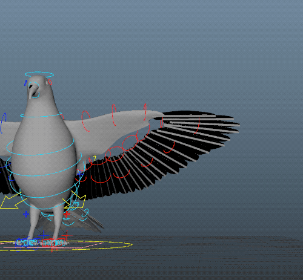
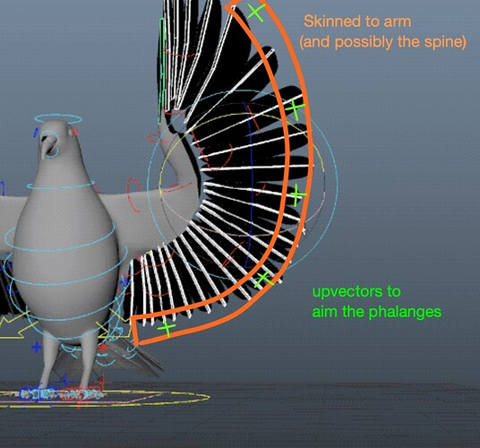

我不知道有什么现成的鸟类模型模板。我做过一些鸟类模型，但通常都是卡通风格或者很短的商业广告。以我的经验来看，模型绑定可以很简单，而这恰恰是最简单的部分。你基本上可以用一个修改过的双足模型模板，去掉手部，再添加一些额外的指骨来控制翅膀。

难点在于如何设置羽毛，而Shifter组件并没有提供相应的功能。你需要进行一些自定义设置，可能需要用到NURBS曲面，如果你使用的是像Yeti这样的渲染器，还需要自定义上向量。这主要取决于你想要达到的效果有多逼真。

我没有相关的教程。不过这里有一个GIF动图，我会简单解释一下我用过的一种技巧（这不是Shifter）：

1. 设置一个非常基本的IK/FK手臂模型，末端可能只有一个手指。
2. 设置几个指骨来控制翅膀的弧度。我猜鸟类不像蝙蝠那样有指骨，但鸟类**飞行器**肯定可以！
3. 在机翼下缘放置一个 NURBS 曲面。将该曲面与机械臂连接起来。（不要连接到指骨！指骨将由该曲面驱动。）
4. 在NURBS平面表面附着一些毛囊/UVpin。将它们用作指骨的向上向量，使它们能够瞄准并保持良好的扩散和弧度。
5. 有时我会剥去手臂和指骨上的一层致密网状皮，然后用这层网状皮将羽毛固定住，而不是剥去皮。这样就能得到光滑漂亮的效果。
    - 晶格还可以驱动 Yeti 或 xgen 等设备的任何引导曲线。
    - 如果我这样做，我还会尝试为每根羽毛制作偏移控制，以便在需要时调整姿势。
    - 实际上，我为了避免篇幅过长而简化了步骤。我实际上是**在网格内部放置了 NURBS 曲面条带**，并在这些曲面条带上放置了 5 到 8 个毛囊/UV 针。然后，将羽毛的蒙皮绑定到这些曲面条带上。这样，在网格内部就拥有了额外的弯曲控制。但这会变得有点复杂，而且你需要在网格之前进行局部控制。因此，一个局部控制用于弯曲羽毛，另一个控制用于跟随骨骼，而跟随控制又会驱动局部控制。（希望我解释清楚了。）对于非常快速且廉价的骨骼绑定，有时只需要网格就足够了。

[

screenshot_2024-05-24_08-12-47972×906 189 KB

](http://forum.mgear-framework.com/uploads/default/original/2X/2/2a186ef3bbaf72c2ffead5a2cbaaea7c12744d5a.jpeg "screenshot_2024-05-24_08-12-47")