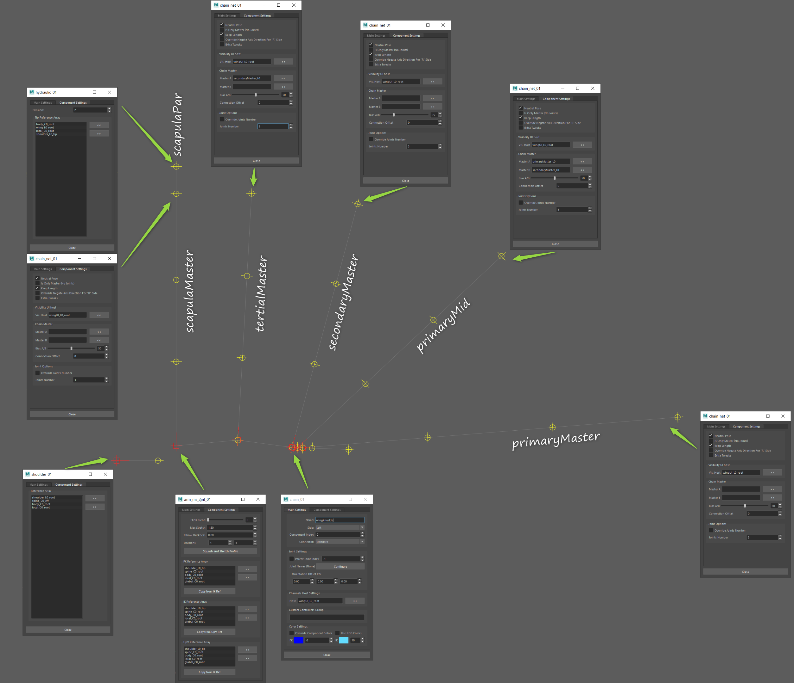

1. 设置一个相当基本的 IK/FK 手臂，末端可能有一个手指。
2. 设置几个指骨来控制翅膀的弧度。我想鸟类没有像蝙蝠那样的指骨，但鸟类**绑定**肯定可以！
3. 在翅膀的底边放置一个 NURBS 平面。将其绑定到手臂上。（不是指骨！指骨将由此驱动。）
4. 在NURBS平面表面上附加一些毛囊/uvpin。将它们用作指骨的上向量，以便它们朝向并保持良好的分布和弧度。
5. 然后有时我会在手臂和指骨上制作一个密集的格子。我通过格子驱动羽毛，而不是直接皮肤化处理。这样可以得到一个光滑的效果。
    - 这个格子也可以驱动任何引导曲线，比如 Yeti 或 xgen。
    - 如果我这样做，那么我还会尝试为每根羽毛制作偏移控制，以便在需要时可以调整姿势。
    - 实际上我在简化这个过程，所以不会太长。我实际上把 **nurbs 带放在格子里面**。并在带子上放置 5 到 8 个毛囊/uv 针。然后将羽毛皮肤化处理到那个带子上。这样你就可以在格子内部获得额外的弯曲控制。但是这有点复杂，你需要控制在格子之前是局部的。因此，一个局部控制是弯曲羽毛。另一个控制是跟随绑定，跟随控制驱动局部控制。（我希望这能让你明白。）对于非常快速和便宜的绑定，有时格子就是你所需要的一切。

[
