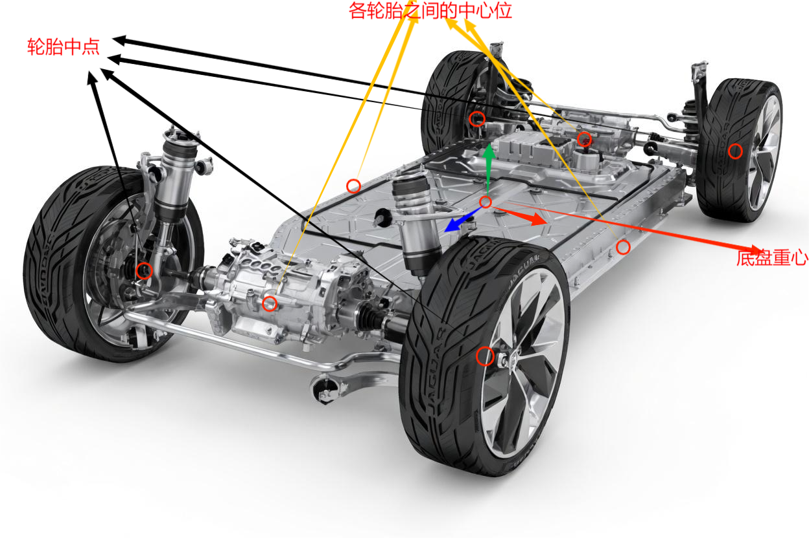
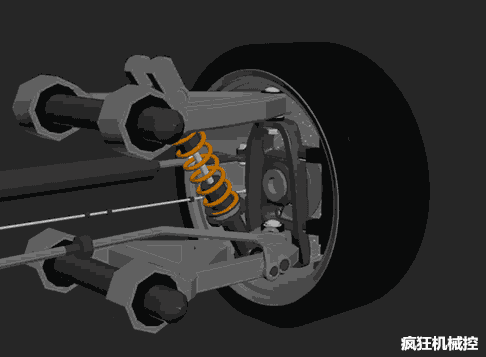

# 带盘系统

- 汽车中点位置：即轮胎的中心点
- 各轮胎之间的中心位：即轮胎中点两两之间的中心位
- 底盘重心位置：四个轮胎中点之间的中心位
- 汽车底盘的绑定，主要是求出轮胎上下移动时底盘重心的位移和旋转
	- 底盘重心的位移：四个轮胎各影响四分之一，即四个轮胎分别给底盘重心点约束，四轮胎平分约束权重
	- 底盘重心的旋转：确保底盘重心 Z 轴指向前两个轮胎的中心位，X轴指向左侧两个轮胎的中心位，使用瞄准约束来实现：使用前胎中心位瞄准约束底盘重心，使用左侧胎中心位作为次轴。
# 悬挂系统

- 主要通过瞄准约束等约束节点来实现汽车的悬挂系统
# 车轮自动旋转
- 公式：`rotate_degree = distance * 360/2πr`