随着 Maya 2020 的发布，Autodesk 增加了一些[新功能](https://www.riggingdojo.com/2019/12/10/introducing-maya-2020-rigging-features/)，使得基于矩阵的绑定工作流程得到了改进。和许多人一样，这让我对绑定的未来非常兴奋，因为现在完全用矩阵连接构建的绑定系统将成为可能。然而，虽然[约束](https://bindpose.com/maya-matrix-based-functions-part-1-node-based-matrix-constraint/)和[IK求解](http://www.cultofrig.com/2018/01/17/season-01-episode-08-ik-explained/)器的解决方案已经存在一段时间了，但我还没见过有人尝试替代Maya的样条节点。

花键或_NURB_是绑定脊柱、弹性肢体或衣物的重要工具。但用矩阵绑定时，使用起来会有点笨拙。它们需要在场景中创建并存储专用的DAG节点，并且设计上是针对向量而非矩阵。

过去一年我尝试完全用矩阵连接构建样条。随着时间推移，这些成果变得越来越具生产可行性。在本文中，我提出了一个只使用原版Maya节点的矩阵友好替代方案。即使这个解法不适合你，我也希望这个实验至少能帮你解开样条背后的数学谜团。

## 概述

在详细介绍设置之前，先看一下Maya的演示。注意大纲器中没有任何 `nurbsCurve`节点：

请按回车或点击查看全尺寸图片

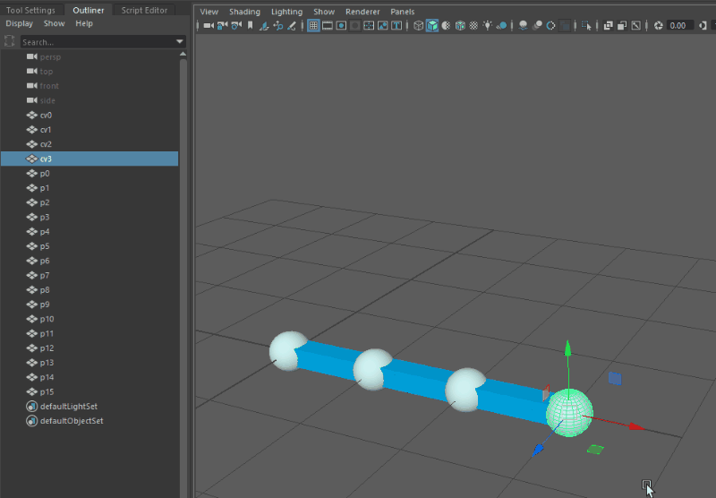

只有网格和矩阵，根本看不到 nurbsCurve 节点！

但这个实现在节点编辑器中表现如何？令人惊讶的是，这个解决方案节点相当轻量，且与 `curveInfo` 节点的工作流程相当。尤其是在Maya 2020中，我们可以利用Maya新增的`aimMatrix`节点。以下是曲线上单点的输入连接：

请按回车或点击查看全尺寸图片

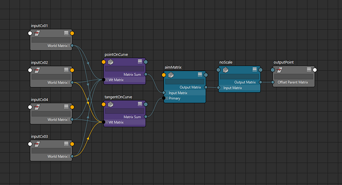

请记住，这是一个完整的NURBS实现，因此支持任意数量的控制点以及用于循环曲线的自定义结矢量：

请按回车或点击查看全尺寸图片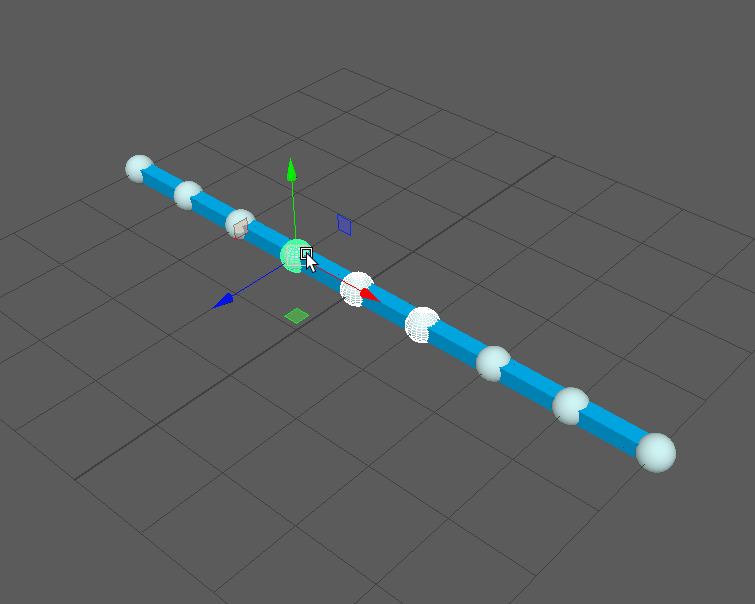

请按回车或点击查看全尺寸图片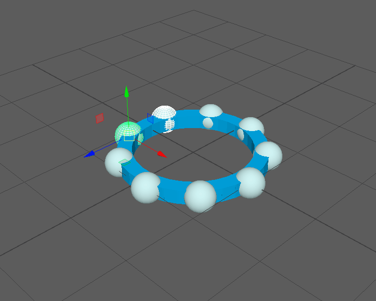

这种方法不仅适用于曲线，还支持曲面：

请按回车或点击查看全尺寸图片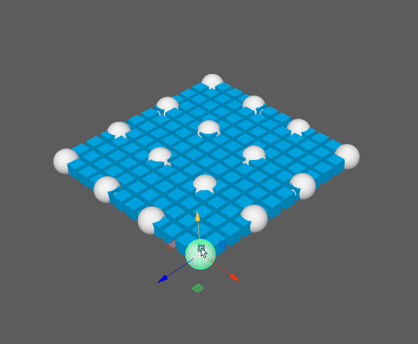

请按回车或点击查看全尺寸图片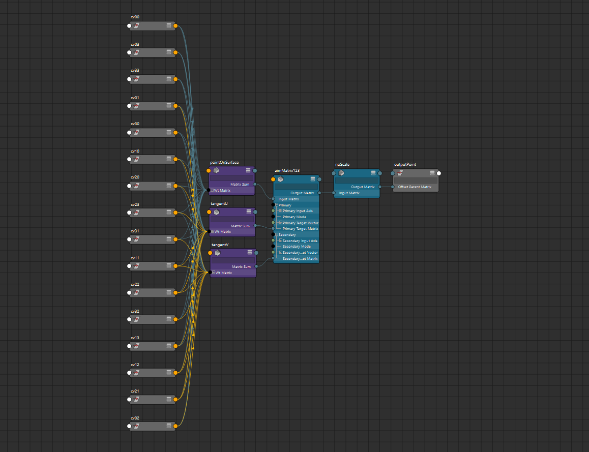

曲面只需一个额外节点即可实现！

这里的秘密成分是 Maya 的 `wtAddMatrix`节点。我们利用这些节点以矩阵形式获得曲线上的位置和切线。然而，这两张图片都没有展示完整的画面。这些节点使用由静态**参数**、**度数**和**结**值生成的特定权重。

我暂时不打算深入数学，但本质上通过将这些参数烘焙到权重值中，我们可以将所需的运算简化为加权和。虽然这简化了我们的网络，但遗憾的是，这些值无法通过属性连接驱动。虽然这些操作可以以节点形式复制，但这需要更多的连接，并且会显著影响性能。

## 用途

虽然实际的节点网络设置相当简单，但矩阵权重本身最好通过代码生成。幸运的是，我把所有数学都装进了[Python模块](https://gist.github.com/obriencole11/354e6db8a55738cb479523f15f1fd367)。

该模块包含多个功能，旨在生成样条曲线或曲面的控制点或切权重。给定一个控制点列表，它们会返回控制点与权重值的映射。这些函数都是完全用原版 Python 编写的，所以理论上可以在 Maya 环境之外使用。

该输出权重映射可用于生成加权和。在Maya里，你基本上有两个选择。矩阵方面，你只能用前面提到的`wtAddMatrix`节点，但理论上它们也可以配合`blendWeighted`节点处理单维值。

请记住，使用矩阵时整个矩阵都会被混合。这在使用混合旋转来生成向上矢量时会很方便，但通常需要确定缩放。切矩阵将切值存储在矩阵平移中，而非旋转。所以要直接访问这个向量，你需要使用`decomposeMatrix`节点。

提供的模块还包含三个函数，用于生成本文所用的示例设置。每个函数都应该能在 Maya 2020 和 2020 之前的版本中工作。这些示例函数旨在测试或作为其他用途的起点。不过它们并不是设计成完全功能的自动绑定器。

## 优点与限制

这种方法有很多优点，但并非所有问题的解决方案。虽然我过去一年在生产环境中测试过类似的方法，但我认为在实施之前权衡利弊很重要。

### 优点

- **节点简单性。** 有许多替代方法可以将变换附加到曲线上，但通常涉及与_NURBS_节点之间的复杂转换。这里所有的繁重工作都靠几个矩阵节点完成。
- **矩阵友好型。**该方法包含矩阵输入和输出而非矢量，因此非常适合在 Maya 2020 中使用新的矩阵节点。
- **没有DAG节点。**虽然隐藏DAG节点对动画师来说不是_大_问题，但消除它们确实能减少大纲工具的杂乱，避免臭名昭著的_DO_NOT_TOUCH_组。这在通过代码构建 rig 时也很有帮助，因为没有残留的 DAG 节点需要担心。
- **表现。**我不是性能测试专家，但在我用 `dgtimer` 做的简单测试中，这种设置的表现几乎是使用 `curveInfo` 节点**的 40 倍**。优化不是这个工作流程的目标，但这是个不错的福利！

### 局限性

- **静态参数和结。** 这大概是任何想实施这种方法的人最大的底线。这意味着你不能创建沿样条线滑动的骨架，或者长度锁定的样条。
- **内置工具支持**。Maya 的样条节点包含许多内置的工具和工具，但这些工具与该工作流程不兼容。这意味着我们不能用变形器或仿真驱动曲线，也不能用Maya的API查询曲线数据。
- **Python 设置。** 虽然[提供的模块](https://gist.github.com/obriencole11/354e6db8a55738cb479523f15f1fd367)应该很容易复制粘贴，但如果你习惯手工绑定，这可能会有点麻烦。

另外我还得提一下，节点插件性能可能更高，节点网络也会更简单。不过，如果说我从职业工作中学到的一件事是避免外部依赖。用插件创建绑定会让它们更难分享，并且会被锁定在Maya版本中。对于某些管道插件可能是解决方案，但我个人总是更喜欢原版。

## 数学时间

到目前为止，我主要关注这种方法的实际应用。但在弄明白这些的过程中，我学到了很多关于样条背后的数学知识。虽然网上有一些很好的资源（这本[入门](https://pomax.github.io/bezierinfo/)书帮了我很大忙），但它们往往比较泛泛，或者需要大量先验知识。所以虽然我不是专家，但我觉得至少应该尽力从Maya绑定的角度解释数学原理。

### 贝塞尔曲线

在讨论样条之前，我应该先讲讲贝塞尔曲线。虽然这两者不完全相同，但理解曲线对于理解样条曲线至关重要。

解释贝塞尔曲线的一种方式是将控制点加权。控制点的数量决定了曲线的**顺序**。但在玛雅语中，我们通常用度数来描述曲线，这比顺序少一个。因此，度数为三的曲线将有四个控制点。

曲线上的位置由**参数**或**时间（t）**值描述。这个单一值通常范围为0–1，从第一个控制点开始，到最后一个。贝塞尔函数本质上是插值函数。事实上，二度曲线是必不可少的：线性插值或_LERP_函数。

贝塞尔曲线的方程本身相当简单。[维基百科](https://en.wikipedia.org/wiki/B%C3%A9zier_curve)上关于三度曲线的公式如下：

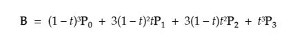

其中**t**是参数值，**P**是输入控制点，**B**是输出贝塞尔点。

这个公式其实没什么特别复杂的，转换成 Python 代码应该相当简单。遗憾的是，这种格式在 Maya 中表示为节点网络并不方便。要获得一个点，需要大约十几个节点来进行加法和乘法。相反，如果我们使用静态时间值，可以将方程简化为如下加权和：

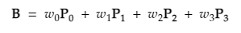

这样好多了！最重要的是，如果我们将点组成矩阵，我们可以将该方程压缩到单个`wtAddMatrix`节点中。如果我们按原样实现这个函数，我们会得到一个这样的网络：

请按回车或点击查看全尺寸图片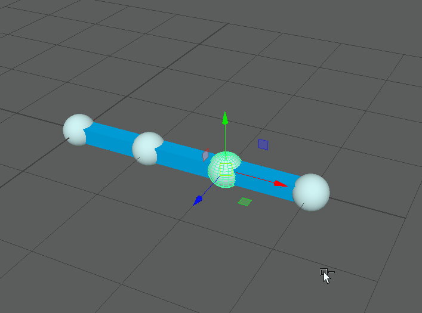

请按回车或点击查看全尺寸图片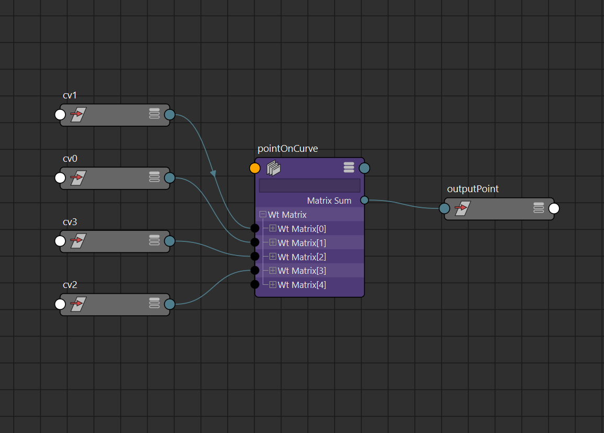

注意比例和旋转也有效！混合矩阵的一个有趣副作用。

不过，我们仍然缺少花键绑定的关键元素。目前所附点与曲率不匹配，正如我们预期的那样。如前所述，这个过程通常涉及在曲线上得到一个**切线**。这个切向量和一个选得好的_向上向量_可以用来创建旋转矩阵。这部分在[别处](https://bindpose.com/maya-matrix-nodes-part-3-matrix-rivet/)有详细介绍，所以我将重点讲述我们如何实际生成这个切向量。

那么切线到底是什么？本质上，这个向量描述了某一点的变化速率。在微积分中，这通常被称为函数_的导数_。幸运的是，[维基百科](https://en.wikipedia.org/wiki/B%C3%A9zier_curve#Derivative)还包含了贝塞尔导数的一个方程：

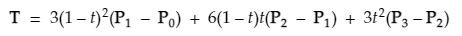

这看起来可能比位置方程更复杂，但实际上也可以简化为加权点和：

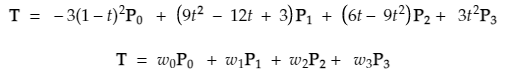

这意味着我们可以使用相同的控制点但权重不同，为切线创建第二个矩阵节点。以下是现在Maya的效果：

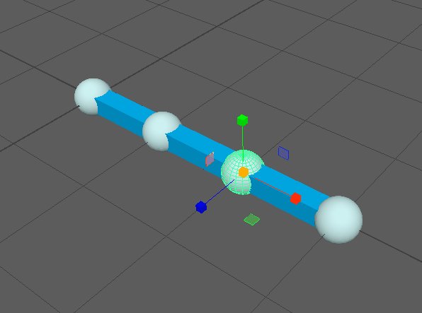

这个版本取消了缩放，但旋转仍用于向上向量。

此时我们可以停止，因为结果看起来和我第一个示例完全相同，但我们有非常严格的限制，控制**点数量受度**数限制。所以三度曲线只能有四个控制点。

解决这个问题的一个方法是使用次数递增的曲线。这样我们就能增加更多的控制点，但结果并不理想：

请按回车或点击查看全尺寸图片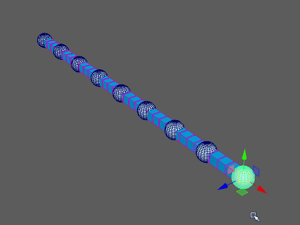

请按回车或点击查看全尺寸图片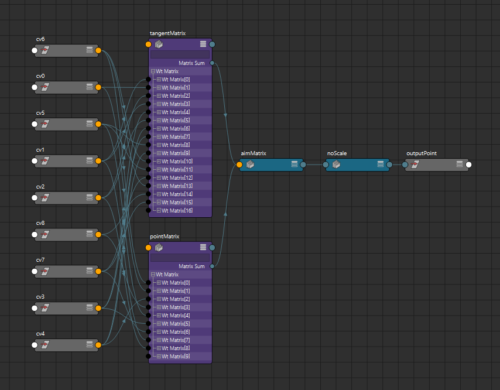

注意每个立方体都会被高亮显示，即使它没有受到影响！

除了影响绑定性能，动画的最大问题是**每个控制点都会影响曲线上的每个位置**。这很浪费，动画制作起来可能不直观。

另一个可能的解决方案是增加更多贝塞尔曲线，将它们端对端连接。这对某些设置来说可能更好，但我觉得这样会增加太多控制点，复杂度也大大增加。我也更倾向于避免区分哪些控制点对应哪条曲线。

我提到这个问题是因为这很可能是Maya不实现这种贝塞尔曲线的部分原因。相反，Autodesk 使用一种更高级的曲线，称为 _NURBS_ 或样条曲线！

## 样条曲线

虽然贝塞尔曲线可以被解释为插值点的方法，_但NURBS_可以被视为插值贝塞尔曲线的方法。_NURBS_代表_非均匀有理B样条，_长话说它是一种**样条**。样条通过使用多条曲线混合来解决控制点问题。所以我们仍然可以有一个三度曲线，控制点超过四个。

这里有一个样条的例子，控制点数和之前相同，但度数是三。注意，每个立方体现在只受到四个控制点的影响：

请按回车或点击查看全尺寸图片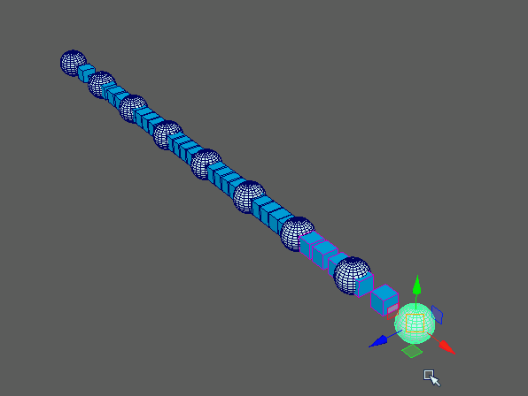

请按回车或点击查看全尺寸图片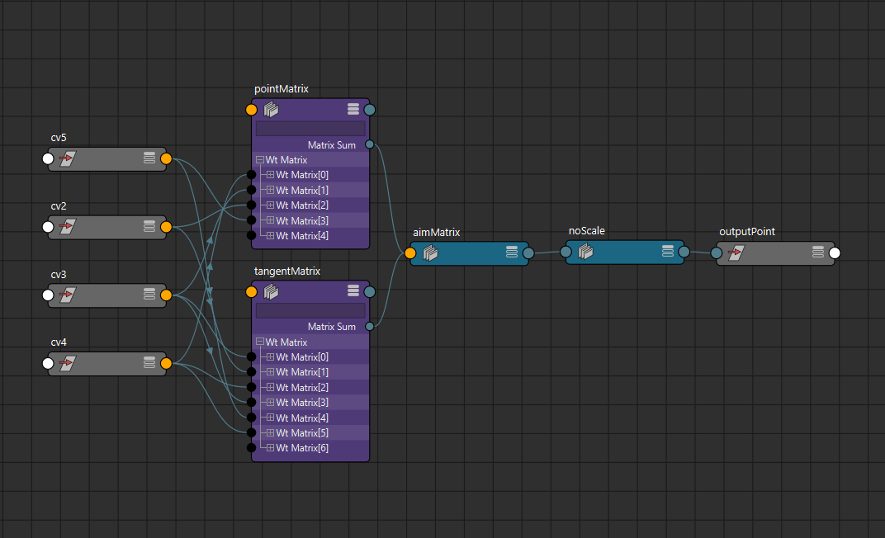

还要注意，每个控制点只高亮了部分立方体！

所以虽然样条曲线看起来更复杂，但实际上它们比贝塞尔曲线轻得多！而且由于它们仍然是由贝塞尔曲线构成的，任何有效的贝塞尔曲线都可以构建为样条曲线。Maya版本的“贝塞尔曲线”很可能是通过样条实现的。

然而，为了实现样条，我们需要一个包含额外参数的更新公式。

### 结

如果你曾经用 Maya 写过曲线序列化工具，你很可能用过结。结本质上描述了每个控制点对曲线各部分的影响程度。它们还允许我们通过添加角或形成环来改变曲线形状。一个基本的结矢量可能看起来像这样：

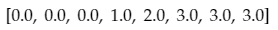

该向量的长度由曲线度数和控制点数决定，如下：

请按回车或点击查看全尺寸图片

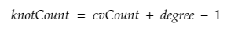

这意味着之前的结向量可能描述一条具有六个控制点的三度曲线。该样条将包含三条插值的贝塞尔曲线。

生成这些向量似乎有点艺术，我不是专家，所以不会深入讲解。不过，知道重复数值会在曲线上形成转角或终点，这点还是很有帮助的。上述结矢量在两端有三个重复的值，使曲线在第一个和最后一个控制点终止。然而，环形曲线的结矢量则不会，可能看起来像这样：

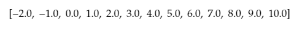

不过大多数情况下，我用脚本自动生成结。我在提供的代码中包含了 `defaultKnots()` 函数，用于处理结的生成。如果没有提供默认结，所有包含的功能也会生成默认结。我仍然认为理解自定义结矢量的价值很重要，因为它们在创建更复杂曲线时非常强大。

### 样条的评估

讲完结的说明后，我们实际上可以开始计算样条上的一个点。这里情况会更复杂，我觉得展示公式并不像贝塞尔曲线那样有帮助。与贝塞尔曲线不同，我们通常使用算法生成样条曲线上的点。我个人用的是**de Boor算法**，因为[维基百科](https://en.wikipedia.org/wiki/De_Boor%27s_algorithm)页面提供了简单的Python代码来实现。

类似于贝塞尔公式，求切线也包括取导数。虽然不如曲线那么直接，但我在 [Stack Overflow](https://stackoverflow.com/questions/57507696/b-spline-derivative-using-de-boors-algorithm) 上找到了一个相当有用的实现。

这也是玛雅语境中情况稍微复杂的地方。De Boors 算法是递归的，通过多次迭代找到一个点。该过程优化用于在代码中寻找某个点，但不适合在 Maya 中创建节点网络。幸运的是，我创建了一个修改版，可以为每个控制点生成权重。这可以在[提供的代码](https://gist.github.com/obriencole11/354e6db8a55738cb479523f15f1fd367)中的 `pointOnCurveWeights()` 和 `tangentOnCurveWeights()` 函数中找到。

这也是为什么限制曲线为静态结和参数对样条尤其重要。操作量可能很大，可能会影响性能。样条线上的每个点也都需要从每个控制点连接，这就失去了初衷。

### 样条曲面

数学解释大致结束后，我想用一个关于曲面的简要解释来结束。虽然它们看起来比样条曲线复杂，但实际上非常相似，只需要一个额外的矩阵节点。

本质上，样条曲面由控制点的行列组成。这些点被共享以形成重叠样条。

要找到曲面上的位置，我们需要两个参数，而不是一个。Maya 称这些为 **u** 和 **v** 参数，我在提供的代码中就是用这个。我们还需要两组结矢量，一组用于行，一组用于列。至少在我的实现中，所有行和列的长度都必须相同。

利用这两个参数，我们可以分别找到行样条和列样条的控制点权重。然后我们把它们相乘得到最终权重。虽然大部分繁重工作都在曲线函数中完成，但我在[提供的代码](https://gist.github.com/obriencole11/354e6db8a55738cb479523f15f1fd367)中加入了专门的曲面权重函数。

对于曲面，我们最终也会得到两个切线，而不是一个。这实际上可以稍微简化我们的节点网络，因为我们不再需要上向量。这些矩阵可以作为主矩阵和备矩阵插入 Maya `aimMatrix`节点，或分解后手动组装。

## 结论

在这个实验之前，我以为样条会比实际复杂得多。经过调查，发现它们可以提炼成简单的加权和。一旦我意识到这一点，我开始注意到这个模式在各处都是绑定。点乘法、矩阵乘法、RBF求解器和皮肤权重其实都是加权和的一种形式！

不过这些话题我会留到以后再说。我相信发表后我会发现另一种各方面都更好的方法。不过我希望这个解释能帮助更多技术动画师理解他们绑定背后的数学原理。Maya里的绑定充满了抽象数学，我坚信我们越接近基本原理越好！