# 概述
- 使用mGear绑定框架来绑定角色用于UE引擎，优点主要有：
	- 绑定性能优秀，开销低，MetaHuman绑定可以在120fps左右。
	- Python语言编写且开源，可以调用其中的API进行自动化处理
	- IKFK和控制器空间切换烘焙算法更优异，速度更快，不容易出错。
	- 有丰富的右键菜单和人性化的picker，动画师友好
	- 与UE引擎联系更紧密，可直接使用UE骨骼模板

# 步骤
## 插件安装
[https://github.com/mgear-dev/mgear](https://github.com/mgear-dev/mgear/releases)
- 目前推荐使用mGear 5.2.1
## 设置模板
### 载入模板
- 载入Epic Mannequin Template
- 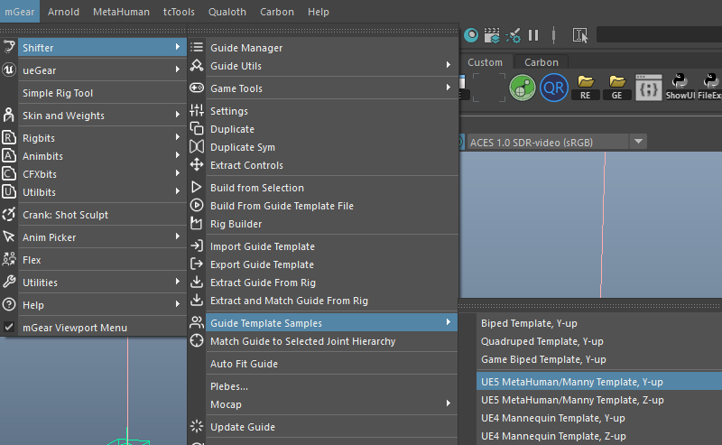
### 修改根控制器
- 原始模板层级为：

- 为了使根骨骼可以被自由控制，用于调整根骨骼动画，我们将其修改为：
- 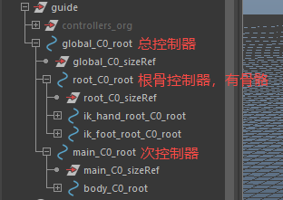
- 这样一来我们生成的控制器为
	- world：总控制器
	- global：次控制器
	- main：主控制器：控制身体但是不控制根骨骼
	- root：根骨骼控制器，只控制根骨骼
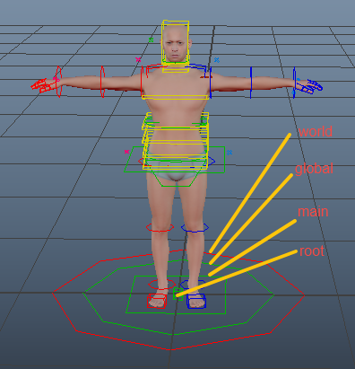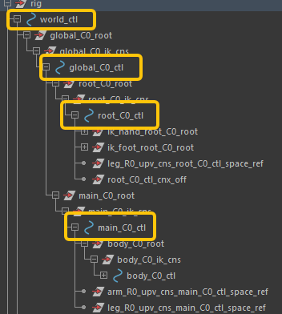
### 调整模板
- 删除一半的模板，后面调整完毕，可镜像

#### 调整模板部件朝向和位置
- 使用命令自动对齐模版位置，但是不会对齐手指旋转和手指末端位置
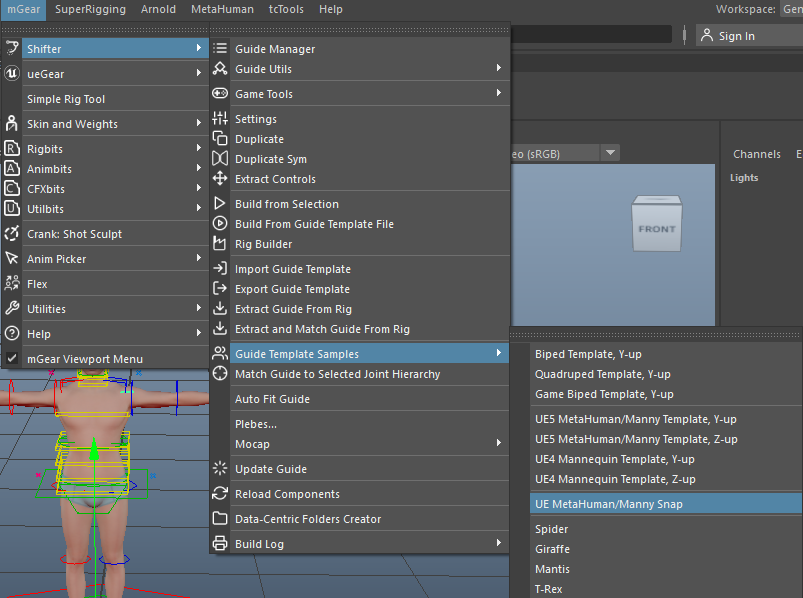
- 提供对位脚本，一键对齐模板位置和手指旋转
```python
from mgear.shifter import io
import mgear.pymaya as pm


# 常量
snap_dict = {
    "thumb_L0_root": "thumb_01_l",
    "thumb_L0_0_loc": "thumb_02_l",
    "thumb_L0_1_loc": "thumb_03_l",
    "index_metacarpal_L0_root": "index_metacarpal_l",
    "index_L0_root": "index_01_l",
    "index_L0_0_loc": "index_02_l",
    "index_L0_1_loc": "index_03_l",
    "middle_metacarpal_L0_root": "middle_metacarpal_l",
    "middle_L0_root": "middle_01_l",
    "middle_L0_0_loc": "middle_02_l",
    "middle_L0_1_loc": "middle_03_l",
    "ring_metacarpal_L0_root": "ring_metacarpal_l",
    "ring_L0_root": "ring_01_l",
    "ring_L0_0_loc": "ring_02_l",
    "ring_L0_1_loc": "ring_03_l",
    "pinky_metacarpal_L0_root": "pinky_metacarpal_l",
    "pinky_L0_root": "pinky_01_l",
    "pinky_L0_0_loc": "pinky_02_l",
    "pinky_L0_1_loc": "pinky_03_l",
}
mesh_node = pm.PyNode("body_lod0_mesh")
vertex_indices = [2662, 450, 327, 633, 209, 4465, 4313, 4154, 4584, 3996]
ctrl_name_list = [
    "thumb_L0_2_loc",
    "index_L0_2_loc",
    "middle_L0_2_loc",
    "ring_L0_2_loc",
    "pinky_L0_2_loc",
    "thumb_R0_2_loc",
    "index_R0_2_loc",
    "middle_R0_2_loc",
    "ring_R0_2_loc",
    "pinky_R0_2_loc",
]


def safe_snap_to_joints(src, tgt):
    if not (pm.objExists(src) and pm.objExists(tgt)):
        return

    pm.matchTransform(src, tgt, position=True, rotation=True)


def safe_snap_to_vtx(ctrl, index):
    vtx_position = mesh_node.vtx[index].getPosition()
    ctrl_node = pm.PyNode(ctrl)
    ctrl_node.setTranslation(vtx_position, space="world")


def main():
    # 对齐所有控制器位置
    io.metahuman_snap()
    # 对齐手指的位移和旋转
    for source, target in snap_dict.items():
        # L side
        safe_snap_to_joints(source, target)

        # R side
        r_source = source.replace("_L0_", "_R0_")
        r_target = target[:-2] + "_r" if target.endswith("_l") else target

        safe_snap_to_joints(r_source, r_target)
    # 对齐手指末端
    for ctrl, index in zip(ctrl_name_list, vertex_indices):
        safe_snap_to_vtx(ctrl, index)


if __name__ == "__main__":
    main()

```
- 为了手指握拳姿态能够自然写实，我们还要调整手指控制器朝向
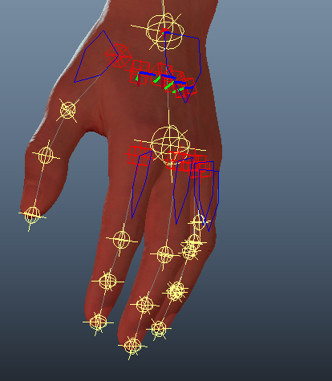
- 需要调整的主要是手指位置朝向的蓝色箭头，使得手指握拳时形态更佳，这里主要有两个属性：第一个是朝向，第二个是箭头大小
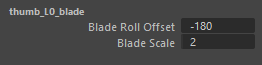
- 如果最终创建的控制器握拳姿态不佳，还可以退回来继续调整
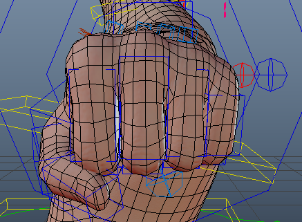
- 最后是脚部轴心点的设置
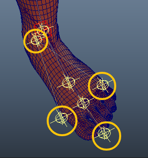

#### 设置部件的参数
- 以下设置如果想要保留缩放也可以。
- Spine部件移除缩放
- 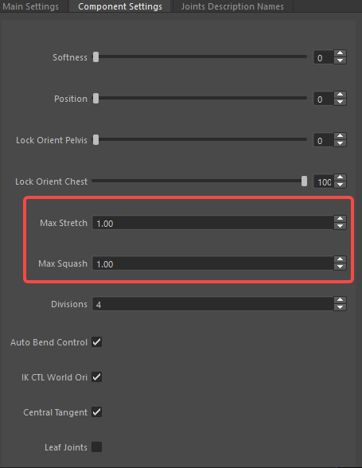
- 手臂设置，移除缩放，分段设为0（MetaHuman的RigLogic会自动结算分段选转），返回Tpose
- 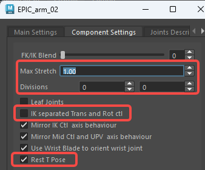
- 腿部设置，移除缩放，分段设为0（MetaHuman的RigLogic会自动结算分段选转），返回Tpose
- 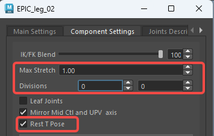
- 头部设置，移除缩放
- 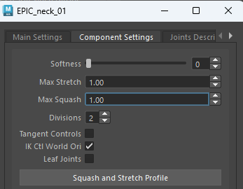
#### 镜像模板
- 选中肩部模板组件，右键DuplicateSymme，或者在ShifterGuideManager中点击对应按钮，即可实现镜像
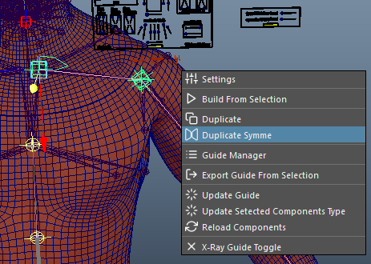
- 腿部也是一样
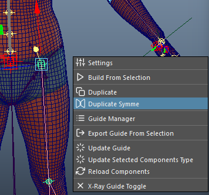
- 镜像后我们发现，右侧的模板并没有跟骨骼重合，因为扫描的人体模型并非完全左右镜像，因此我们还要再应用一次吸附
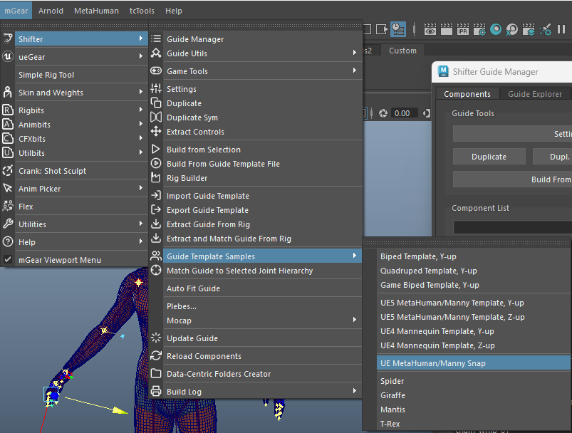
- 现在选中模板跟对象，点右键即可创建绑定
- 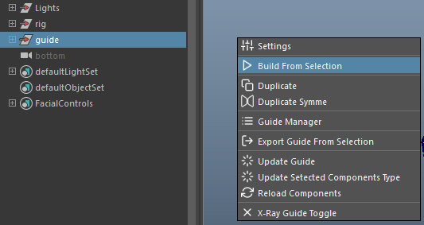
- 以上步骤已经构建好模板，直接导入对位，构建即可生成绑定：
```
D:\X12RawFile\CharactersArt\Common\rig_template\guide_metahuman_temp.sgt
```
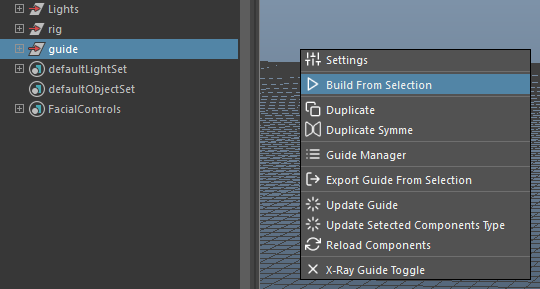
## 数据化资产（可选）
- 构建角色绑定资产路径
- 
- 其中：
	- assets文件夹放置角色模型资产
	- data文件夹放置模板、变形（shapes）和蒙皮（skin）数据
	- script文件夹放置生成控制器前置（pre）和后置（post）脚本
### 放置资产
- 将模型资产（未蒙皮）放置到assets文件夹
- 将guide template导出放置到data文件夹
- 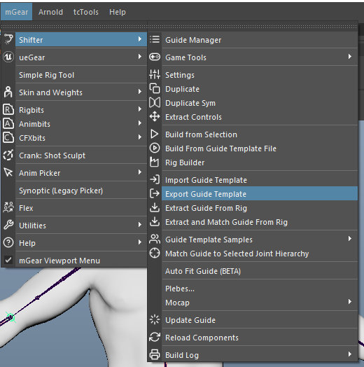
- 将蒙皮资产导出到skin文件夹
- 
- 编写前置和后置脚本放入script文件夹的pre和post文件夹
- 其中前置脚本为import_geo.py，该脚本用于生成绑定前导入模型
```python
import mgear.shifter.custom_step as cstp
import os
import pymel.core as pm


class CustomShifterStep(cstp.customShifterMainStep):
    """Custom Step description"""

    def setup(self):
        """
        Setting the name property makes the custom step accessible
        in later steps.

        i.e: Running  self.custom_step("import_go")  from steps ran after
             this one, will grant this step.
        """
        self.name = "import_go"

    def run(self):
        """Run method.

            i.e:  self.mgear_run.global_ctl
                gets the global_ctl from shifter rig build base

            i.e:  self.component("control_C0").ctl
                gets the ctl from shifter component called control_C0

            i.e:  self.custom_step("otherCustomStepName").ctlMesh
                gets the ctlMesh from a previous custom step called
                "otherCustomStepName"

        Returns:
            None: None
        """
        self.import_geometry()
        try:
            pm.select("guide")
        except Exception as exc:
            print(exc)
        return

    def import_geometry(self):
        """Import geometry from a file"""
        main_path = "\\".join(
            os.path.abspath(os.path.dirname(__file__)).split("\\")[:-2]
        )
        pm.importFile(os.path.join(main_path, "assets", "SM_Human_male_001.fbx"))

```
- 后置脚本为import_skin.py，process_joint.py和hide_unused_control.py
- import_skin.py，该脚本用于生成绑定后导入蒙皮信息
```python
import os
import mgear.shifter.custom_step as cstp
from mgear.core import skin


class CustomShifterStep(cstp.customShifterMainStep):
    """Custom Step description"""

    def setup(self):
        """
        Setting the name property makes the custom step accessible
        in later steps.

        i.e: Running  self.custom_step("import_skin")  from steps ran after
             this one, will grant this step.
        """
        self.name = "import_skin"

    def run(self):
        """Run method.

            i.e:  self.mgear_run.global_ctl
                gets the global_ctl from shifter rig build base

            i.e:  self.component("control_C0").ctl
                gets the ctl from shifter component called control_C0

            i.e:  self.custom_step("otherCustomStepName").ctlMesh
                gets the ctlMesh from a previous custom step called
                "otherCustomStepName"

        Returns:
            None: None
        """
        self.import_skin_data()
        return

    def import_skin_data(self):
        main_path = "\\".join(
            os.path.abspath(os.path.dirname(__file__)).split("\\")[:-2]
        )
        skin.importSkinPack(
            os.path.join(main_path, "data", "skin", "Skin_Human_Male_001.gSkinPack")
        )

```
- process_joint.py，该脚本用于生成绑定后连接root和Pelvis骨骼，将骨骼放入世界层级，并给骨骼添加名称空间，用于后续的动画导入。
```python
import mgear.shifter.custom_step as cstp
import pymel.core as pm


class CustomShifterStep(cstp.customShifterMainStep):
    """Custom Step description"""

    def setup(self):
        """
        Setting the name property makes the custom step accessible
        in later steps.

        i.e: Running  self.custom_step("add_jnt_namespace")  from steps ran after
             this one, will grant this step.
        """
        self.name = "process_joint"

    def run(self):
        """Run method.

            i.e:  self.mgear_run.global_ctl
                gets the global_ctl from shifter rig build base

            i.e:  self.component("control_C0").ctl
                gets the ctl from shifter component called control_C0

            i.e:  self.custom_step("otherCustomStepName").ctlMesh
                gets the ctlMesh from a previous custom step called
                "otherCustomStepName"

        Returns:
            None: None
        """
        # 将root骨骼层级放置在pelvis之上作为根骨骼
        pm.parent("pelvis", "root")
        # 将根骨骼放入世界层级
        pm.parent("root", world=1)
        # 给骨骼添加命名空间
        ns = "skin"

        if pm.namespace(exists=ns):
            print(f"Namespace {ns} already exists")
        else:
            pm.namespace(add=ns)

        joints = pm.ls("root", dag=True, type="joint")
        for jnt in joints:
            pm.rename(jnt, f"{ns}:{jnt}")
        return

```
- hide_unused_control.py，该脚本用于隐藏不会使用的IK骨骼控制器
```python
import mgear.shifter.custom_step as cstp
import pymel.core as pm


class CustomShifterStep(cstp.customShifterMainStep):
    """Custom Step description"""

    def setup(self):
        """
        Setting the name property makes the custom step accessible
        in later steps.

        i.e: Running  self.custom_step("add_jnt_namespace")  from steps ran after
             this one, will grant this step.
        """
        self.name = "add_jnt_namespace"

    def run(self):
        """Run method.

            i.e:  self.mgear_run.global_ctl
                gets the global_ctl from shifter rig build base

            i.e:  self.component("control_C0").ctl
                gets the ctl from shifter component called control_C0

            i.e:  self.custom_step("otherCustomStepName").ctlMesh
                gets the ctlMesh from a previous custom step called
                "otherCustomStepName"

        Returns:
            None: None
        """
        # 清除选择
        pm.select(clear=True)
        # 创建显示层
        pm.createDisplayLayer(name="IK_Controlls", number=1, nr=1)

        # 编辑显示层成员
        pm.editDisplayLayerMembers(
            "IK_Controlls", "ik_hand_root_C0_ctl", "ik_foot_root_C0_ctl", noRecurse=1
        )

        # 隐藏显示层中的对象
        layer = pm.PyNode("IK_Controlls")
        layer.visibility.set(False)
        return

```
- 最终修改guide template设置，将脚本放入。并导出模板
