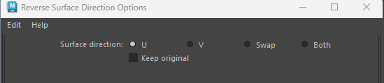
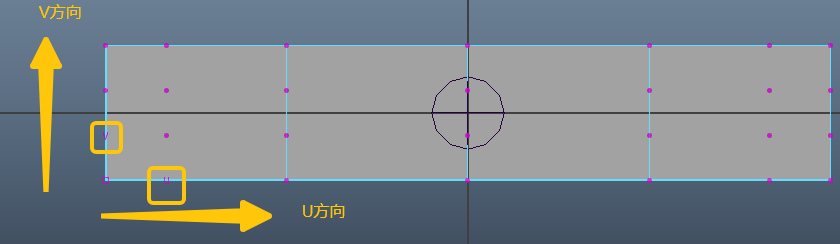
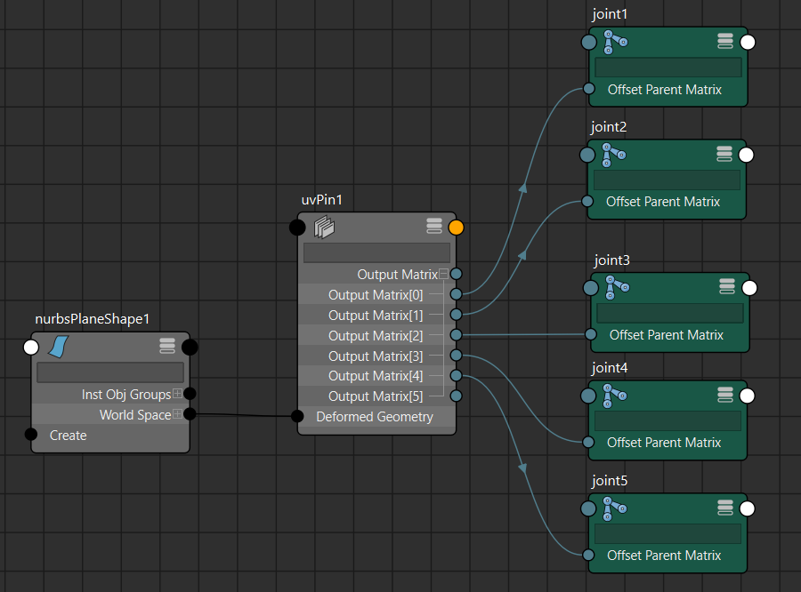
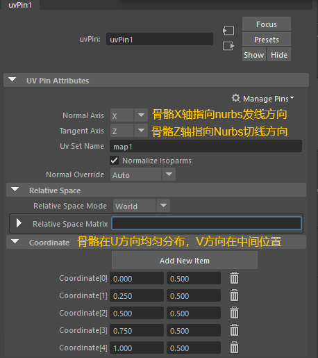
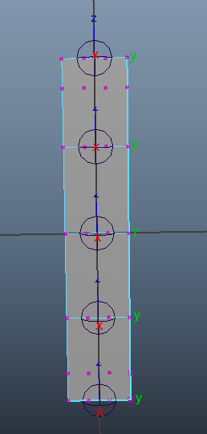
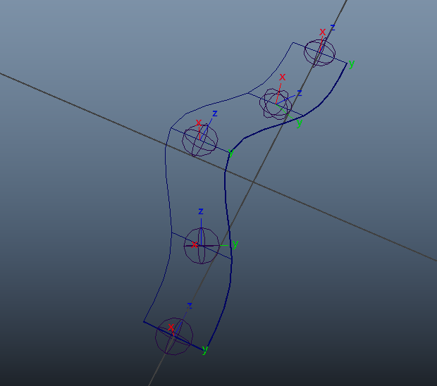

# 概述
- 使用矩阵计算带代替毛囊创建Ribbon绑定结构，开销更小，稳定性更高

# 原理
[Open: Pasted image 20250828203215.png](attachments/b12d68ca6fa9814b8521600df5253356_MD5.jpeg)

- 将一个骨骼Pin到nurbs 平面上，其中UVPin节点的CoordinateU、V 的值需要设置，他们是0:1的值，用来确定骨骼在平面的位置
- 注意：Nurbs平面要在U方向上细分，而不是V方向，在V方向上细分会导致某个方向移动平面控制点时，驱动对象不旋转。
- 控制Nurbs平面UV方向使用ReverseSurfaceDirection命令
- 
	- 其中，Swap选项用于交换UV方向，Both选项用于反向UV方向
	- 如果Swap后法线方向也反了（表面“翻面变黑”），可以再执行一次Both
```python
# swap
pm.reverseSurface("Ribbon_plane",direction=3, constructionHistory=1, replaceOriginal=1)
# both
pm.reverseSurface("Ribbon_plane",direction=2, constructionHistory=1, replaceOriginal=1)
```

# 步骤
- 创建Nurbs平面，确保Nurbs平面要在U方向上细分

- 节点编辑器逻辑

- 节点设置

# 最终效果

