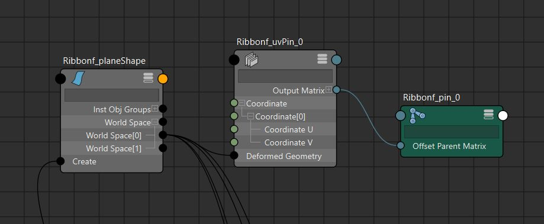

# 节点
在Autodesk Maya中，**UVPin**、**ProxPin** 和 **Rivets** 是用于将物体附着到变形网格表面的强大工具，常用于角色绑定、动画和特效中。以下是对这三个工具的详细介绍：

---

### **1. UVPin**
**UVPin** 是一种节点，允许用户将物体（通常是定位器或控制器）绑定到几何体的特定UV坐标位置，从而使其跟随几何体的变形（如皮肤、布料等）。它通过UV坐标来定位，非常适合在需要精确控制的场景中使用。

#### **特点**：
- **基于UV坐标**：UVPin 使用几何体的UV贴图来确定附着点的位置。即使几何体发生变形，附着物也会保持在指定的UV位置。
- **创建方式**：
  1. 选择几何体上的顶点、边、面或UV。
  2. 在Animation（F4）或Rigging（F3）菜单集中，选择 **Constrain > UV Pin**。
  3. 在UV Pin选项窗口中，设置“Pin Location”为“Components”，并选择输出方式（例如，定位器或矩阵输出）。
- **节点结构**：UVPin 会在Node Editor中生成一个 **uvPin** 节点，可通过属性编辑器调整其行为。
- **用途**：
  - 将道具（如按钮、徽章）附着到角色衣服的特定UV位置。
  - 用于精确控制物体在变形表面的位置。
- **优点**：
  - 精确，基于UV坐标的定位非常稳定。
  - 支持多点绑定（一个UVPin节点可以处理多个附着点）。
- **局限性**：
  - 需要几何体有清晰的UV贴图。
  - 对于旧版本的Maya（如2018或更早），UVPin不可用，可能需要自定义解决方案。[](https://michaeldavydov.com/entry/custom-uv-pin-node-in-python)

#### **注意事项**：
- UVPin 的性能优于传统的毛囊（follicle）方法，因为它避免了毛囊的复杂计算。
- 如果UV贴图发生变化，UVPin的附着点可能会偏移。

---

### **2. ProxPin**
**ProxPin**（Proximity Pin）是一种更灵活的附着工具，基于几何体的表面位置而非UV坐标。它通过输入变换矩阵来计算物体与几何表面之间的最近点，使其能够附着在没有UV贴图或复杂变形的几何体上。

#### **特点**：
- **基于接近性**：ProxPin 根据输入变换矩阵找到几何表面上的最近点，而不需要依赖UV坐标。
- **创建方式**：
  - 与UVPin类似，在Animation或Rigging菜单集中选择 **Constrain > Proximity Pin**。
  - 需要指定输入变换（例如一个定位器或控制器的矩阵），ProxPin会自动计算最近的表面点。
- **用途**：
  - 适合没有UV贴图的几何体（如模拟缓存的物体）。
  - 用于将控制器或物体附着到动态变形的表面（如布料模拟）。
- **优点**：
  - 不依赖UV贴图，适用范围更广。
  - 适合处理复杂的非UV相关变形。
- **局限性**：
  - 计算复杂度可能高于UVPin，尤其在高密度几何体上。
  - 需要额外的变换输入来定义附着点。

#### **注意事项**：
- ProxPin 是Maya 2020+新增的功能，优化了性能，减少了对毛囊的依赖。[](https://jamesbdunlop.github.io/generalmaya/2021/06/27/ribbon.html)
- 适合需要动态调整附着点的场景。

---

### **3. Rivets**
**Rivets** 是一种便捷的工具，简化了将物体附着到变形网格的过程。它本质上是UVPin的一个简化接口，通过一键操作创建附着点，适合快速绑定任务。

#### **特点**：
- **简化操作**：Rivet命令通过选择几何体的面、点或UV，快速创建附着定位器，内部依赖UVPin节点。
- **创建方式**：
  1. 选择几何体上的面、点或UV。
  2. 在Animation（F4）或Rigging（F3）菜单集中，选择 **Constrain > Rivet**。
  3. Rivet会自动生成一个定位器，并通过UVPin节点附着到选定的位置。
- **节点结构**：Rivet命令会在Node Editor中生成一个 **uvPin** 节点，连接到定位器，允许进一步调整。
- **用途**：
  - 快速将道具（如按钮、徽章）附着到角色表面。
  - 适合需要快速设置的绑定任务，如动画中的临时道具。
- **优点**：
  - 操作简单，适合快速工作流程。
  - 自动创建定位器，减少手动设置。
- **局限性**：
  - 相比UVPin和ProxPin，Rivet的自定义性较低。
  - 依赖UVPin节点，因此也受限于UV贴图的限制。

#### **注意事项**：
- Rivet 是UVPin的快捷方式，适合初学者或快速任务，但高级用户可能更倾向于直接使用UVPin或ProxPin以获得更多控制。
- 在Python脚本中，`cmds.Rivet()` 会创建UVPin和定位器节点，但不返回节点名称，可能需要通过选择列表或其他方式获取节点。[](https://forums.autodesk.com/t5/maya-programming-forum/creating-and-managing-rivets-with-cmds-rivet/td-p/11877014)

---

### **三者对比**

| 特性                | UVPin                          | ProxPin                        | Rivets                        |
|---------------------|--------------------------------|--------------------------------|-------------------------------|
| **定位方式**        | 基于UV坐标                     | 基于几何表面最近点             | 基于UV坐标（UVPin的快捷方式） |
| **依赖UV贴图**      | 是                            | 否                            | 是                           |
| **创建方式**        | Constrain > UV Pin            | Constrain > Proximity Pin     | Constrain > Rivet            |
| **灵活性**          | 高（可调整UVPin节点属性）      | 高（适合无UV几何体）          | 中（简化的UVPin接口）        |
| **性能**            | 高（优于毛囊）                | 中（取决于几何复杂度）        | 高（基于UVPin）              |
| **适用场景**        | 精确UV定位                    | 动态表面附着                  | 快速道具附着                 |
| **Maya版本支持**    | Maya 2020+                    | Maya 2020+                    | Maya 2020+                   |

---

### **高级用法与优化**
1. **性能优化**：
   - UVPin 和 ProxPin 比传统毛囊（follicle）方法更高效，尤其在并行评估（Parallel Evaluation）中。[](https://jamesbdunlop.github.io/generalmaya/2021/06/27/ribbon.html)
   - 使用矩阵节点（如 **fourByFourMatrix**）可以进一步简化Rivets设置，减少对约束的依赖，获得更干净的节点图。[](https://lesterbanks.com/2017/07/make-maya-rivet-matrix-nodes/)[](https://bindpose.com/maya-matrix-nodes-part-3-matrix-rivet/)

2. **矩阵Rivets**：
   - 高级用户可以通过矩阵节点（如 **pointOnSurfaceInfo** 和 **fourByFourMatrix**）手动构建Rivets，绕过毛囊或aimConstraint，提供更快的计算和更简洁的节点图。[](https://bindpose.com/maya-matrix-nodes-part-3-matrix-rivet/)[](https://www.jonah-reinhart.com/single-post/2018/02/18/custom-rivet)

3. **脚本化**：
   - 使用Python脚本（如 `cmds.Rivet()` 或自定义UVPin节点）可以批量创建和命名Rivets，但需要注意 `cmds.Rivet()` 不返回节点名称，需通过选择列表获取。[](https://forums.autodesk.com/t5/maya-programming-forum/creating-and-managing-rivets-with-cmds-rivet/td-p/11877014)

4. **替代毛囊**：
   - UVPin 和 ProxPin 是Maya 2020+中对毛囊的优化替代，减少了节点图的复杂性和计算开销。[](https://jamesbdunlop.github.io/generalmaya/2021/06/27/ribbon.html)

---

### **总结**
- **UVPin**：适合基于UV贴图的精确附着，性能高，灵活性强。
- **ProxPin**：适合无UV贴图或动态变形的场景，基于表面最近点。
- **Rivets**：UVPin的简化版，适合快速绑定任务，操作便捷但自定义性较低。

# 原理
[Open: Pasted image 20250828203215.png](attachments/b12d68ca6fa9814b8521600df5253356_MD5.jpeg)

- 将一个骨骼Pin到nurbs 平面上，其中UVPin节点的CoordinateU、V 的值需要设置，他们是0:1的值，用来确定骨骼在平面的位置
# 代码
```python
# -*- encoding: utf-8 -*-
"""
@File    :   matrix_ribbon.py
@Time    :   2025/08/28 11:30:20
@Author  :   Charles Tian
@Version :   1.0
@Contact :   tianchao0533@gmail.com
@Desc    :   当前文件作用
"""

import traceback
import pymel.core as pm
from Qt import QtCore, QtWidgets


class RibbonCreator(QtWidgets.QDialog):
    _ui_instance = None

    def __init__(self, parent=None):
        if parent is None:
            parent = RibbonCreator.get_maya_main_window()
        super().__init__(parent)

        self.setWindowTitle("Ribbon Creator")
        self.setMinimumSize(300, 200)

        self.ribbon_name = "Ribbon"
        self.create_ctrl = False
        self.ribbon_axis = (1, 0, 0)
        self.ribbon_width = 5
        self.ribbon_length = 20
        self.ribbon_segment_count = 5
        self.ribbon_pin_num = 5
        self.ribbon_ctrl_num = 3

        self.nurbs_plane = None

        self.create_widgets()
        self.create_layouts()
        self.create_connections()

    def create_widgets(self):
        self.name_line = QtWidgets.QLineEdit()
        self.name_line.setText("Ribbon")
        self.name_line.setFixedWidth(80)

        self.orient_comb = QtWidgets.QComboBox()
        self.orient_comb.addItem("x", (1, 0, 0))
        self.orient_comb.addItem("y", (0, 1, 0))
        self.orient_comb.addItem("z", (0, 0, 1))
        self.orient_comb.addItem("-x", (-1, 0, 0))
        self.orient_comb.addItem("-y", (0, -1, 0))
        self.orient_comb.addItem("-z", (0, 0, -1))

        self.width_double_spin = QtWidgets.QDoubleSpinBox()
        self.width_double_spin.setFixedWidth(60)
        self.width_double_spin.setMinimum(0.1)
        self.width_double_spin.setMaximum(10000.0)
        self.width_double_spin.setValue(5.0)

        self.length_double_spin = QtWidgets.QDoubleSpinBox()
        self.length_double_spin.setFixedWidth(60)
        self.length_double_spin.setMinimum(0.1)
        self.length_double_spin.setMaximum(10000.0)
        self.length_double_spin.setValue(20.0)

        self.segment_spin = QtWidgets.QSpinBox()
        self.segment_spin.setFixedWidth(60)
        self.segment_spin.setMinimum(1)
        self.segment_spin.setMaximum(10000)
        self.segment_spin.setValue(5)

        self.ctrl_cb = QtWidgets.QCheckBox("Add Ctrl")

        self.pin_label = QtWidgets.QLabel("pin_num: ")

        self.pin_spin = QtWidgets.QSpinBox()
        self.pin_spin.setFixedWidth(60)
        self.pin_spin.setMinimum(1)
        self.pin_spin.setMaximum(10000)
        self.pin_spin.setValue(5)

        self.ctrl_label = QtWidgets.QLabel("ctrl_num: ")

        self.ctrl_spin = QtWidgets.QSpinBox()
        self.ctrl_spin.setFixedWidth(60)
        self.ctrl_spin.setMinimum(1)
        self.ctrl_spin.setMaximum(10000)
        self.ctrl_spin.setValue(3)

        self.button = QtWidgets.QPushButton("Create Ribbon")

    def create_layouts(self):
        nurbs_layout = QtWidgets.QGridLayout()
        nurbs_layout.setSpacing(5)
        nurbs_layout.setColumnStretch(0, 0)  # 左 label列，不伸缩
        nurbs_layout.setColumnStretch(1, 0)  # 左输入列，不伸缩
        nurbs_layout.setColumnStretch(2, 1)  # 中间空隙，伸缩
        nurbs_layout.setColumnStretch(3, 0)  # 右 label列，不伸缩
        nurbs_layout.setColumnStretch(4, 0)  # 右输入列，不伸缩

        nurbs_layout.addWidget(QtWidgets.QLabel("name: "), 0, 0)
        nurbs_layout.addWidget(self.name_line, 0, 1)
        nurbs_layout.addWidget(QtWidgets.QLabel("orient: "), 0, 3)
        nurbs_layout.addWidget(self.orient_comb, 0, 4)

        nurbs_layout.addWidget(QtWidgets.QLabel("width: "), 1, 0)
        nurbs_layout.addWidget(self.width_double_spin, 1, 1)
        nurbs_layout.addWidget(QtWidgets.QLabel("length: "), 1, 3)
        nurbs_layout.addWidget(self.length_double_spin, 1, 4)

        nurbs_layout.addWidget(QtWidgets.QLabel("segment: "), 2, 0)
        nurbs_layout.addWidget(self.segment_spin, 2, 1)
        nurbs_layout.addWidget(self.ctrl_cb, 2, 4)

        nurbs_grp = QtWidgets.QGroupBox("NURBS Arguments")
        nurbs_grp.setLayout(nurbs_layout)

        ribbon_layout = QtWidgets.QHBoxLayout()
        ribbon_layout.addWidget(self.pin_label)
        ribbon_layout.addWidget(self.pin_spin)
        ribbon_layout.addStretch()
        ribbon_layout.addWidget(self.ctrl_label)
        ribbon_layout.addWidget(self.ctrl_spin)

        ribbon_grp = QtWidgets.QGroupBox("Ribbon Arguments")
        ribbon_grp.setLayout(ribbon_layout)

        main_layout = QtWidgets.QVBoxLayout(self)
        main_layout.addWidget(nurbs_grp)
        main_layout.addWidget(ribbon_grp)
        main_layout.addWidget(self.button)

    def create_connections(self):
        self.orient_comb.currentTextChanged.connect(self.on_orient_comb_changed)
        self.width_double_spin.valueChanged.connect(self.on_width_spin_changed)
        self.length_double_spin.valueChanged.connect(self.on_length_spin_changed)
        self.segment_spin.valueChanged.connect(self.on_segment_spin_changed)
        self.pin_spin.valueChanged.connect(self.on_pin_spin_changed)
        self.ctrl_spin.valueChanged.connect(self.on_ctrl_spin_changed)
        self.ctrl_cb.toggled.connect(self.on_ctrl_cb_toggled)
        self.button.clicked.connect(self.on_button_clicked)

    @QtCore.Slot()
    def on_orient_comb_changed(self, text):
        self.ribbon_axis = self.orient_comb.currentData()

    @QtCore.Slot()
    def on_width_spin_changed(self, value):
        self.ribbon_width = value

    @QtCore.Slot()
    def on_length_spin_changed(self, value):
        self.ribbon_length = value

    @QtCore.Slot()
    def on_segment_spin_changed(self, value):
        self.ribbon_segment_count = value

    @QtCore.Slot()
    def on_pin_spin_changed(self, value):
        self.ribbon_pin_num = value

    @QtCore.Slot()
    def on_ctrl_spin_changed(self, value):
        self.ribbon_ctrl_num = value

    @QtCore.Slot()
    def on_ctrl_cb_toggled(self, check):
        self.create_ctrl = check

    @QtCore.Slot()
    def on_button_clicked(self):
        self.ribbon_name = self.name_line.text()
        try:
            self.nurbs_plane = self.create_nurbs_plane(
                self.ribbon_name,
                self.ribbon_axis,
                self.ribbon_width,
                self.ribbon_length,
                self.ribbon_segment_count,
            )
            self.create_ribbon(
                self.nurbs_plane,
                self.ribbon_name,
                self.ribbon_pin_num,
                self.ribbon_ctrl_num,
                self.create_ctrl,
            )
        except Exception as e:
            traceback.print_exc()
            pm.displayWarning(e)

    @staticmethod
    def get_maya_main_window():
        app = QtWidgets.QApplication.instance()
        if app:
            for widget in app.topLevelWidgets():
                if widget.objectName() == "MayaWindow":
                    return widget
        return None

    @classmethod
    def show_dialog(cls):
        if not cls._ui_instance:
            cls._ui_instance = RibbonCreator()
        if cls._ui_instance.isHidden():
            cls._ui_instance.show()
        else:
            cls._ui_instance.raise_()
            cls._ui_instance.activateWindow()

    def create_nurbs_plane(
        self, ribbon_name, axis, width, length, segment_count
    ) -> pm.nodetypes.Transform:
        """创建NURBS平面，用于制作Ribbon

        Args:
            axis (tuple): 平面朝向：(0,0,1)
            width (float): 宽度
            length (float):长度
            segment_count (ont): 段数

        returns:
            nt.Transform

        """
        length_ratio = length / width
        nurbs_plane = pm.nurbsPlane(
            name=f"{ribbon_name}_plane",
            pivot=(0, 0, 0),
            axis=axis,
            width=width,
            lengthRatio=length_ratio,
            degree=3,
            u=1,
            v=segment_count,
            constructionHistory=0,
        )[0]
        return nurbs_plane

    def create_ribbon(
        self, nurbs_plane, ribbon_name, pin_num, ctrl_num, create_ctrl=False
    ):
        """使用矩阵节点实现Ribbon，主要用到"uvPin"和"pointOnSurfaceInfo"节点

        Args:
            nurbs_plane (pm.nodetypes.Transform): 要创建Ribbon的nurbsPlane
            pin_num (int): pin骨骼数量
            ctrl_num (int): 控制骨骼数量

        Returns:
            tuple[list, list]: 返回控制骨骼列表和pin骨骼列表
        """
        if isinstance(nurbs_plane, str) and pm.objExists(nurbs_plane):
            nurbs_plane = pm.PyNode(nurbs_plane)
        elif isinstance(nurbs_plane, pm.nodetypes.Transform):
            pass
        elif isinstance(nurbs_plane, pm.nodetypes.NurbsSurface):
            nurbs_plane = nurbs_plane.getTransform()
        else:
            raise TypeError("Invalid surface object specified.")

        if not isinstance(pin_num, int) or pin_num <= 0:
            raise ValueError("pin_num must be a positive integer.")
        if not isinstance(ctrl_num, int) or ctrl_num <= 0:
            raise ValueError("ctrl_num must be a positive integer.")

        nurbs_shape = nurbs_plane.getShape()
        paramLengthV = nurbs_shape.minMaxRangeV.get()  # 一般为0:1

        pin_jnt_list = []
        for i in range(pin_num):
            v_pose = 0.0 if pin_num == 1 else (i / float(pin_num - 1)) * paramLengthV[1]
            uvPin_node = pm.createNode("uvPin", name=f"{ribbon_name}_uvPin_{i}")
            pin_jnt = pm.joint(name=f"{ribbon_name}_pin_{i}", radius=1)

            uvPin_node.coordinate[0].coordinateU.set(0.5)
            uvPin_node.coordinate[0].coordinateV.set(v_pose)

            nurbs_shape.worldSpace[0].connect(uvPin_node.deformedGeometry)
            uvPin_node.outputMatrix[0].connect(pin_jnt.offsetParentMatrix)
            pin_jnt_list.append(pin_jnt)

        ctrl_jnt_list = []
        ctrl_grp_list = []
        for i in range(ctrl_num):
            v_pose = 0 if ctrl_num == 1 else (i / float(ctrl_num - 1)) * paramLengthV[1]
            posi_node = pm.createNode(
                "pointOnSurfaceInfo", name=f"{ribbon_name}_posi_{i}"
            )
            ctrl_jnt = pm.joint(name=f"{ribbon_name}_ctrlJnt_{i}", radius=5)
            posi_node.parameterU.set(0.5)
            posi_node.parameterV.set(v_pose)
            nurbs_shape.worldSpace[0].connect(posi_node.inputSurface)
            position = posi_node.result.position.get()
            if position:
                ctrl_jnt.setTranslation(position)
                if create_ctrl:
                    ctrl_name = f"{ribbon_name}_ctrl_{i}"
                    ctrl = pm.circle(
                        name=ctrl_name,
                        constructionHistory=False,
                        normal=self.ribbon_axis,
                        radius=8,
                    )[0]
                    ctrl_offset_grp = pm.group(ctrl, name=f"{ctrl_name}_offset")
                    pm.matchTransform(ctrl_offset_grp, ctrl_jnt)
                    pm.parentConstraint(ctrl, ctrl_jnt)
                    pm.scaleConstraint(ctrl, ctrl_jnt)
                    ctrl_grp_list.append(ctrl_offset_grp)
            ctrl_jnt_list.append(ctrl_jnt)
            pm.delete(posi_node)

        pm.skinCluster(nurbs_plane, ctrl_jnt_list)

        pin_jnt_grp = pm.group(pin_jnt_list, name=f"{ribbon_name}_pin_Jnt_grp")
        ctrl_jnt_grp = pm.group(ctrl_jnt_list, name=f"{ribbon_name}_ctrl_Jnt_grp")

        if create_ctrl:
            ctrl_grp = pm.group(ctrl_grp_list, name=f"{ribbon_name}_ctrl_grp")
            pm.group(
                nurbs_plane,
                pin_jnt_grp,
                ctrl_jnt_grp,
                ctrl_grp,
                name=f"{ribbon_name}_grp",
            )
        else:
            pm.group(
                nurbs_plane,
                pin_jnt_grp,
                ctrl_jnt_grp,
                name=f"{ribbon_name}_grp",
            )


if __name__ == "__main__":
    RibbonCreator.show_dialog()

```