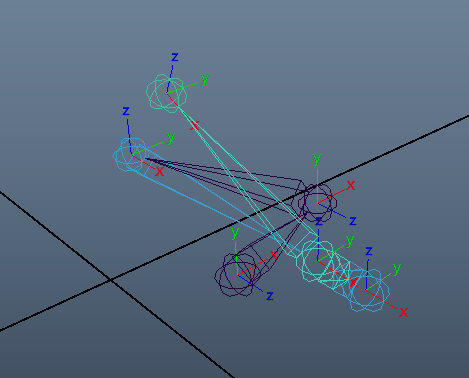
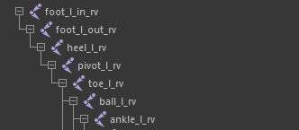
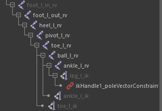
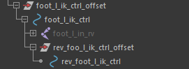
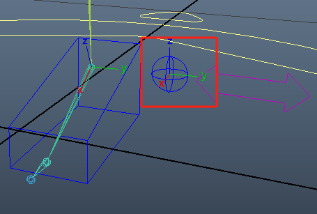
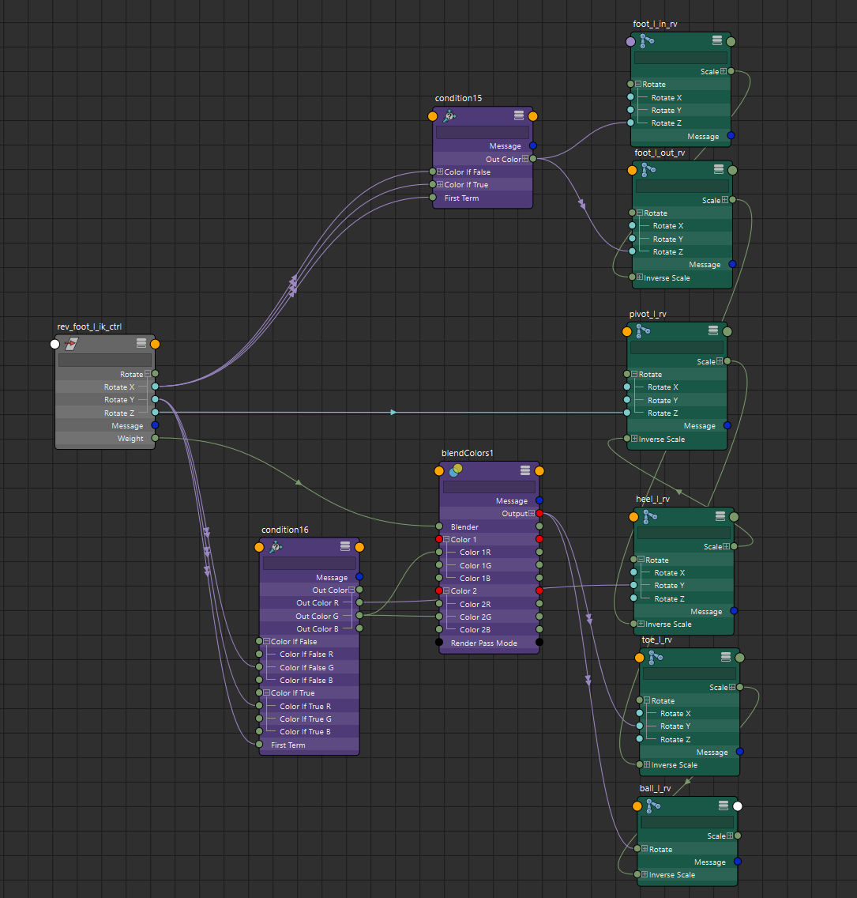

# 骨骼架设

- 比起之前的架构新增了脚部内外两侧的Bank骨骼和heel与Toe之间的pivot骨骼（Pivot骨骼用于以脚前掌为轴左右旋转脚部）
- 将反转脚骨骼层级置于脚部IK控制器层级之下，将腿脚骨骼的IKhandle作为反转脚骨骼对应骨骼的子对象
- 
# 控制器设置
- 在脚部控制器层级之下创建反转脚控制器rev_foot_l_ik_ctrl
- 
- 使用控制器旋转属性控制反转脚
	- 控制器X周旋控制Bank
	- 控制器Y轴旋转控制Roll
	- 控制器Z轴旋转控制Pivot
- 
- 其中控制器weight属性用于增加Ball旋转之后的Toe旋转（可以使用驱动关键帧替代此功能）