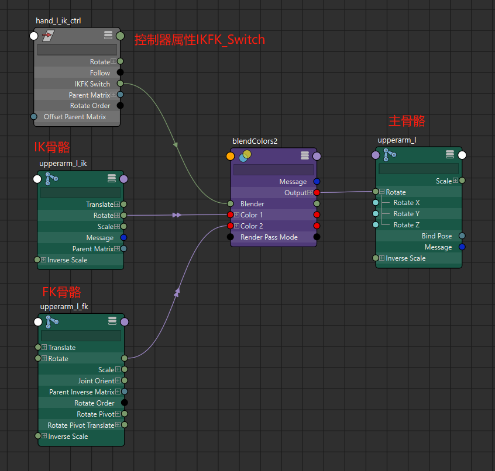

# 新的IKFK切换策略
- 不再使用约束节点，而是使用blend colors节点
- 
- 上臂、前臂、手腕皆是如此
# 添加代理属性
```python
import pymel.core as pc
# 为选中的控制器添加代理属性
base_ctrl = "hand_l_ik_ctrl"
attr = "IKFK_Switch"
for ctrl in pc.selected():
    pc.addAttr(ctrl, longName=arrt, proxy=f"{base_ctrl}.{attr}", at="float", min=0, max=1,k=1)
```