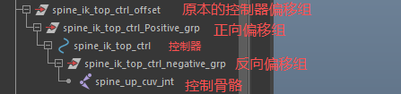
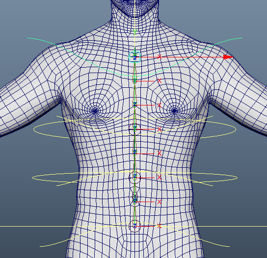
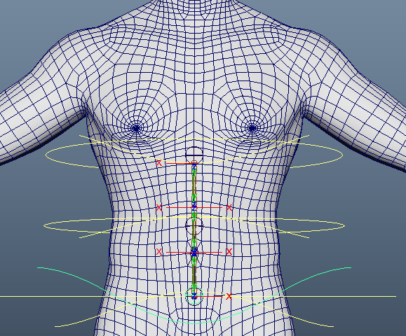
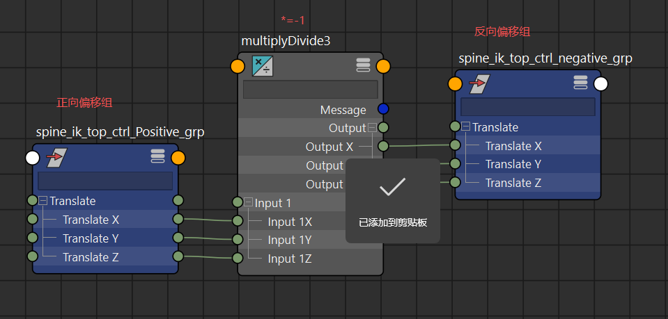

# 概述
- 在Spine的ik绑定中，设置可滑动的IK控制器，以提高操控性
- 一般来说，使用SplineIK来绑定脊椎骨，使用CtrlJnt蒙皮到SplineIKCurve曲线，再将CtrlJnt作为IK控制器的子对象来操控CtrlJnt
# 实现
- 我们在CtrlJnt上方打组 spine_ik_top_ctrl_negative_grp ，这是一个反向移动组
- 在控制器上方打组 spine_ik_top_ctrl_Positive_grp ，这是一个正向移动组

- 在控制器上添加属性CtrlPosition，浮点值，0:1，默认为1
- 使用驱动关键帧：
	- 当CtrlPosition的值为1时，正向偏移组位置在原本位置
	- 
	- 当CtrlPosition的值为0时，正向偏移组移动到在腰部位置，只移动主轴即可
	- 
- 在节点编辑器中对正向偏移组和反向偏移组实现移动反向

这样我们就实现了一个可滑动IK控制器