# HippyDrome 身体articulation参考资料

> 背景：Brian Tindall（Pixar 十年角色 TD、2 次 VES 获奖）的 hippydrome.com 是绑定圈公认的**身体 articulation 变形参考**站点。2020 年后作者下线了全站教学图并向 Internet Archive 提交了整站屏蔽，这批素材一度失传。本笔记记录抢救回来的变形演示素材、官方免费视频清单，以及配套书籍《The Art of Moving Points》的现状。
>
> 素材抢救于 2026-08，全部图片经 GIF 调色板灰阶分析验证为原始素模渲染（100% 灰阶、平均饱和度 0.000）。

## 一、这批素材解决什么问题

做修形（corrective shape）和检查蒙皮质量时，最缺的不是雕刻手法，而是**「这个姿态下软组织应该长什么样」的可靠参考**。

hippydrome 的素材价值在于它不是解剖插画，而是**同一个素模在单一自由度上循环运动的 GIF**——每张图只演示一个关节的一个旋转轴，把变形问题拆到了最小单元。这正好对应绑定工作里逐关节调权重的粒度。

配合本库 [修形（Corrective Shapes）能力提升指南](../解决方案/11.0-修形CorrectiveShapes能力提升指南.md) 里讲的「参考素材质量」一环使用：那篇讲去哪找解剖学习资源和扫描数据，本篇提供的是**已经绑好、正在运动的素模对照**。

## 二、躯干变形演示

躯干被作者拆成四段（Hips / Chest / UpChest / Torso 整体），每段都做前后（FB）和左右（LR）两个方向。这种拆法本身就是他的教学重点：**脊椎变形不是一根链子的事，而是分段叠加**。

髋部左右摆动（即最初丢失的 `HipsLRSolid.gif`）：

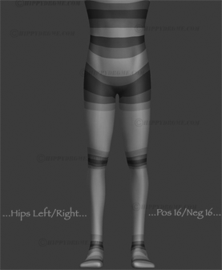

上胸侧向与胸部前后：

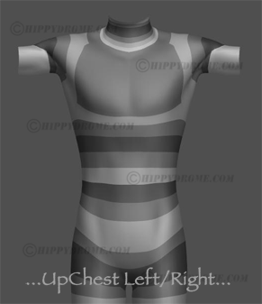

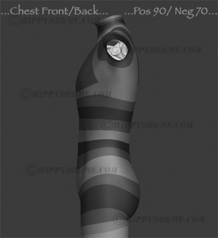

四段叠加后的躯干整体运动（这两张是全套素材里信息量最大的，600px 高）：

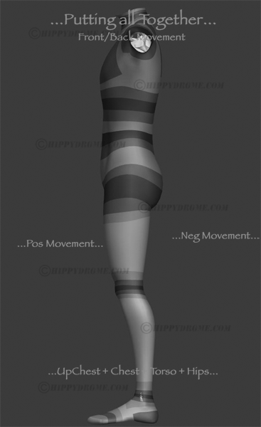

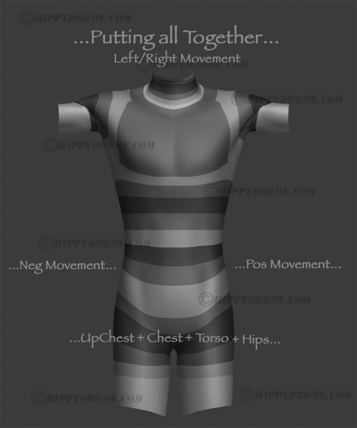

躯干四段拆分的静帧对照图：

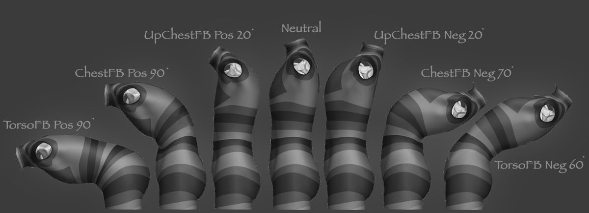

## 三、四肢与关节

腿部整体与大腿前后。注意大腿根部的体积保持——这是 skinCluster 单靠权重做不出来的，需要修形或额外的 twist 骨：

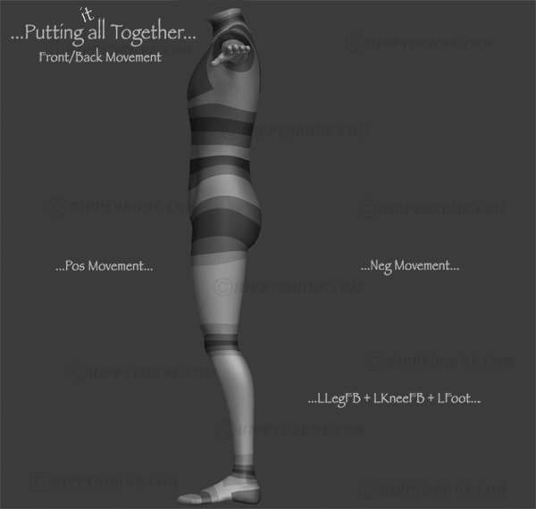

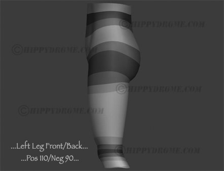

肘部变形。这张 580x255 的横构图同时给了多个弯曲角度：

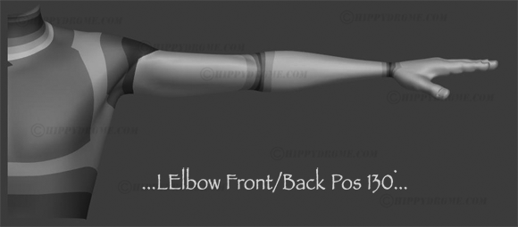

肩臂旋转，三个不同角度：

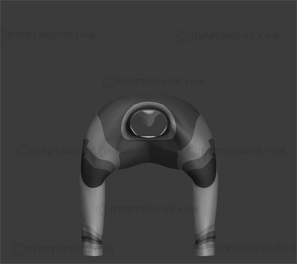

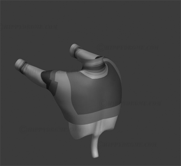

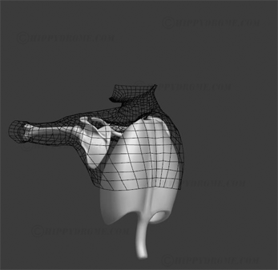

举臂动作的 Solid / Wire 对照——**这组对照是全套素材里最有价值的**，因为它让你直接看到布线如何随变形拉伸：

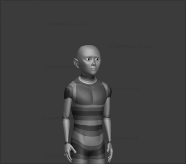

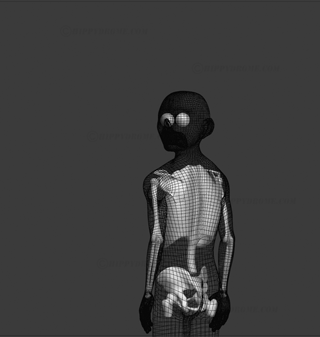

脚部前后（线框版，580x708，17 帧）：

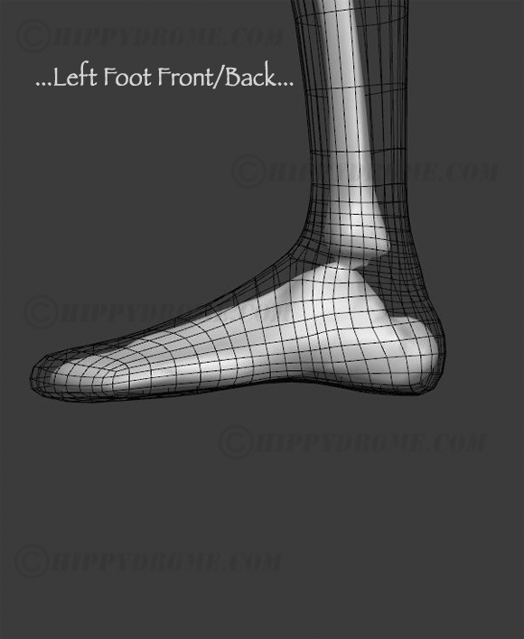

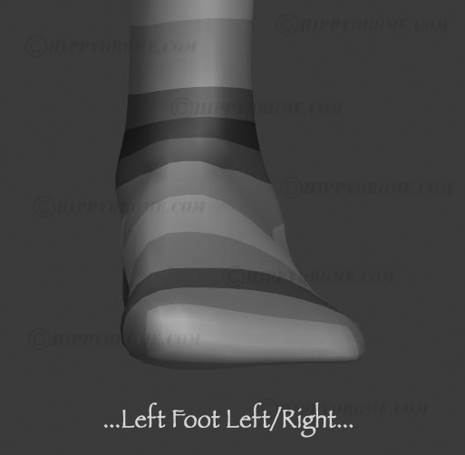

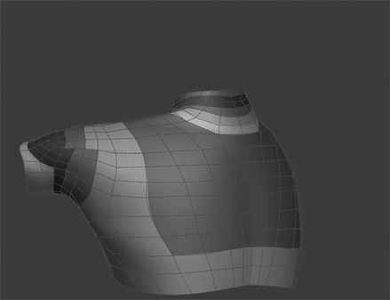

触趾（弯腰摸脚）全身联动，21 帧：

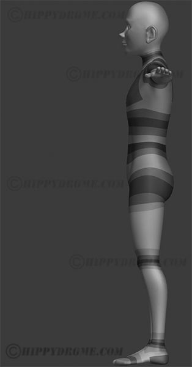

## 四、面部与拓扑总览

面部绑定演示，1032x385、35 帧，是全套里帧数最多的：

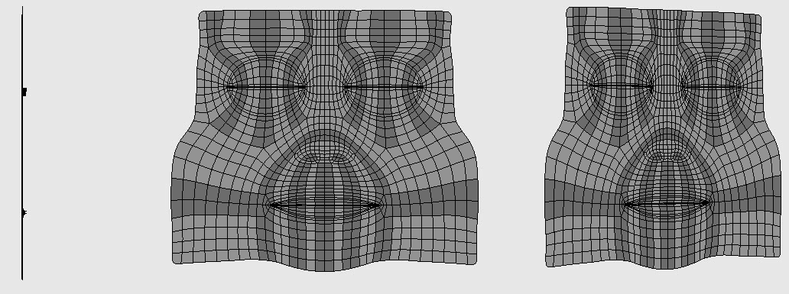

Polycount Wiki 镜像的官方拓扑图（这三张是作者授权 Polycount 引用的，因此躲过了原站清理）：

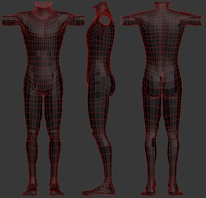

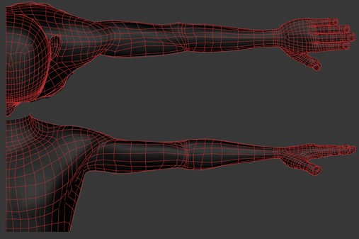

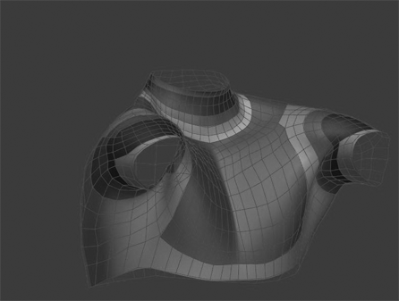

## 五、官方原始模型（免费）

Rigging Dojo 仍托管着作者官方免费发布的模型，**这就是上面所有演示动画所用的本体**：

```
https://www.riggingdojo.com/wp-content/uploads/2013/07/hippydrome.zip   (3.2 MB)
├── hippydrome.ma              # Maya ASCII
├── hippydrome_maya2014.ma
├── hippydrome.fbx
├── hippydrome_2014.fbx
└── readme.txt
```

用法建议：把 `.ma` 打开，对着上面的 GIF 逐个关节摆姿态，看自己的权重方案和作者的布线设计差在哪。比单看图有效得多。

## 六、官方免费视频（14 个，共约 66 分钟）

作者在 Vimeo `vimeo.com/hippydrome` 免费公开了 14 个视频，**其中 12 个描述里明确标注 "From my iBook《The Art of Moving Points》"**——是书内片段的官方公开部分。按主题整理：

### 建模与布线基础

| 视频 | 时长 | 播放量 | 链接 |
|---|---|---|---|
| Modeling for Articulation（Span Layout） | 18:39 | 49505 | https://vimeo.com/25969681 |
| SpansMovie | 5:05 | 1489 | https://vimeo.com/144021801 |
| FivePointSpanShift | 5:04 | 1736 | https://vimeo.com/144020205 |

第一个 18 分钟的 *Modeling for Articulation* 是播放量最高的（近 5 万），讲 span（布线段数）如何决定后续变形能力，属于「先把网格做对」的前置课。

### 嘴部与嘴唇

| 视频 | 时长 | 播放量 | 链接 |
|---|---|---|---|
| Lip Theory Part 01 | 2:02 | 35895 | https://vimeo.com/53058768 |
| Lip Theory Part 02 | 2:18 | 8821 | https://vimeo.com/53058916 |
| Mouth Twist Balance | 5:20 | 15226 | https://vimeo.com/48700731 |

*Lip Theory 01* 播放 3.6 万，是书出版前的预告片段，圈内传播最广的一个。

### 三曲线与分区（书的理论核心）

| 视频 | 时长 | 链接 |
|---|---|---|
| iBookThreeWaveDemo | 6:26 | https://vimeo.com/144022577 |
| Cross One To One Zones | 4:00 | https://vimeo.com/205963398 |

### 眼睑与眉毛

| 视频 | 时长 | 链接 |
|---|---|---|
| EyeLidOpening | 2:17 | https://vimeo.com/205961282 |
| EyeLidMaskVideo | 2:26 | https://vimeo.com/205962493 |
| EyeLidZonesOverLapping3 | 1:49 | https://vimeo.com/144023591 |
| LBrowMovie01 | 3:29 | https://vimeo.com/144024831 |

### Demo Reel

| 视频 | 时长 | 链接 |
|---|---|---|
| Character and Articulation Demo Reel 2012（©Disney/Pixar） | 3:41 | https://vimeo.com/43344320 |

## 七、《The Art of Moving Points》购买现状

这本书的渠道**换过地方**，网上很多"哪里还能买"的提问就是因为老链接死了：

| 渠道 | 状态（2026-08 实测） |
|---|---|
| Apple Books / iTunes（原版 $33.99） | **HTTP 404，已下架** |
| **Ozone3D 官方新版** | **HTTP 200，$9.99，Lifetime Access** ✅ |

作者现在在 Ozone（做 UE5 实时细分的公司）负责 Training 线，书被官方重新发布为 **E-Book + Videos** 形式：

- 11 章，文字 + 插图 + 循环参考视频 + 交互式图库
- 官方页面列出的理论支柱：**Three Curve Principle**（三曲线原理）、**the Math of 10**、Weighted Deformer + Sculpt 分离（运动与体积独立可调）
- 实操链条：为运动设计网格 → 面部分区 → 构建 point weight container → 挂 deformer 并排 Order of Operation → 叠加 macroed sculpt → Avars/控制器/命名

购买页：https://ozone3d.com/products/art-of-moving-points/

书的定位需要说清楚：**它不教你在某个软件里搭技术 rig**，而是讲 rig 搭好之后，articulator 到底在做什么艺术决策——点信息如何累加成面部特定形状。这跟本库 [blendshape](../初级/1.21-blendshape.md) 那篇讲的节点机制是互补关系：一篇讲机制，一篇讲审美判断。

## 八、素材抢救过程（方法可复用）

原站图片已删 + Wayback 被站长屏蔽（`AdministrativeAccessControlException: Blocked Site Error`），常规存档路线全断。最终靠四条来源拼回：

| 来源 | 作用 |
|---|---|
| **Common Crawl** 索引 | 取回 28 个原站页面 HTML，还原出 39 个 GIF 的**完整原始路径清单**（它不受站长屏蔽约束） |
| **Pinterest 缓存** | pin 的 `og:see_also` meta **保留了 hippydrome 原始 URL**；`og:image` 的 hash 可转 `i.pinimg.com/originals/<hash>.gif` 取全尺寸原图 |
| **Polycount Wiki** | MediaWiki API 开放，3 张官方引用镜像 |
| **Rigging Dojo** | 官方模型 zip |

甄别真伪的办法：解析 GIF 全局调色板算饱和度分布。hippydrome 原图特征是 **100% 灰阶、平均饱和度 0.000**，据此从 Pinterest board 里剔掉了 5 个彩色无关素材和 35 个来源不明静态图。

## 九、仍缺失的文件（约 17 个）

原站 39 个 GIF 里，以下没找到任何第三方转载，**几乎全是 Wire（线框）配对版本**：

```
Hips/HipsLRWire.gif       Hips/HipsFBSolid.gif      Hips/HipsFBWire.gif
Hips/ChestFBWire.gif      Hips/ChestLRSolid.gif     Hips/ChestLRWire.gif
Hips/TorsoFBSolid.gif     Hips/TorsoFBWire.gif      Hips/TorsoLRSolid.gif
Hips/TorsoLRWire.gif      Hips/UpChestFBSolid.gif   Hips/UpChestFBWire.gif
Hips/UpChestLRWire.gif    Hips/RowXRay.gif          Legs/LLegTwWire.gif
Legs/LKneeFBWire.gif      Legs/AllTogetherWire.gif
AnimGiffs/FaceMorph.gif   AnimGiffs/Twins.gif       Face/BookSample.gif
```

原因很清楚：转载的人只挑 Solid 实体版发社交平台，线框版几乎无人转。除非有人本地存了当年的完整备份，这些大概已永久丢失。

另有 3 个动图确认属于本系列（灰阶特征吻合）但**部位待辨认**，暂按尺寸命名：


## 十、参考链接

- 原站（图已删，仅存书籍推广页）：https://hippydrome.com/
- 官方 Vimeo（14 个免费视频）：https://vimeo.com/hippydrome
- 官方免费模型：https://www.riggingdojo.com/free-model-from-hippydrome-com/
- 书籍官方购买页（$9.99）：https://ozone3d.com/products/art-of-moving-points/
- Polycount 讨论帖（作者本人参与）：https://polycount.com/discussion/160019/the-art-of-moving-points
- Polycount Wiki 拓扑条目：http://wiki.polycount.com/wiki/BodyTopology

## 相关笔记

- [修形（Corrective Shapes）能力提升指南](../解决方案/11.0-修形CorrectiveShapes能力提升指南.md) —— 那篇讲解剖认知与扫描数据等参考来源，本篇提供素模变形对照
- [blendshape](../初级/1.21-blendshape.md) —— blendShape 节点机制
- [Face Rig - Joints & Controls](../初级/1.13-%20Face%20Rig%20-%20Joints%20&%20Controls.md) —— 面部骨骼搭建流程
- [绑定性能](8.0-绑定性能.md) —— 变形器叠加的性能代价
