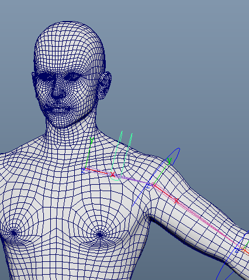

# 创建控制器

- 创建控制器并添加属性Local_Global_Arm，float，0:1
- 使用控制器旋转约束肩膀骨骼，此时手臂IK骨骼的肩膀控制已经完成，但是FK控制器还没有没控制，我们要使用空间切换
- 在上臂根部位置创建两个Locator：clavicle_local_l，clavicle_Global_l。
- 使用这两个定位器旋转约束上臂FK控制器偏移组，这样我们就能控制上臂旋转是局部的还是全局的
- 将clavicle_local_l定位器置于肩膀骨骼层级之下，将clavicle_Global_l定位器置于角色主控制器层级之下
- 然后使用Local_Global_Arm属性驱动旋转约束节点
- 将手臂FK控制器序列层级置于肩膀控制器之下