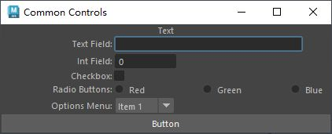

# 骨骼
## **选择骨骼层级**

```python
import pymel.core as pm

# 获取选中的关节
jnts = pm.selected(type='joint')

# 检查是否选择了关节
if not jnts:
    pm.warning("未选择任何关节！")
else:
    # 获取所有选中关节的层级并展平
    jnt_hierarchy = [jnt for jnt in pm.ls(jnts, dag=True, type="joint")]
    
    # 选择层级中的所有关节
    pm.select(jnt_hierarchy)
```

## 确定镜像关节方向
```python
import pymel.core as pm
def orient_mirrored_joint(jnt_list: list):
    """
    rient joints when joints primary axis is -x
    jnt_list:list(pm.nodetypes.Joint)
    """
    if not jnt_list:
        jnt_list = pm.selected()
    for i, jnt in enumerate(jnt_list):
        pm.joint(jnt, edit=True, orientJoint='xyz', secondaryAxisOrient='yup', children=1, zeroScaleOrient=1)
        pm.rotate(f"{jnt}.rotateAxis", 0, 0, 180, relative=1, objectSpace=1)

```
## 创建极向量显示平面
```python
import pymel.core as pm

objs = pm.selected()
position_list = []
for obj in objs:
    position = obj.getTranslation(space="world")
    position_list.append(position)
pm.polyCreateFacet(p=position_list)

```
## 根据长名称获取骨骼列表的父子关系

```python
def getRelParent(self,jnt_list,root):
    """getRelParent 根据长名称获取骨骼列表的父子关系
    :param jnt_list: 蒙皮骨骼列表
    :type jnt_list: list
    :param root: 根骨骼
    :type root: [pymel.core.nodetypes.Joint] 
    :return: 骨骼的父子关系
    :rtype: dict
    """    
    jnt_parent = {}
    for jnt in jnt_list:
        hi_tree = jnt.longName().split("|")[1:-1]
        parent = None
        while parent not in jnt_list:
            if not hi_tree: 
                parent = root
                break
            parent = pm.PyNode(hi_tree.pop())
        jnt_parent[jnt] = parent if parent != root else parent
    return jnt_parent
```
## 在选定定点或对象创建骨骼
```python
import math
import pymel.core as pm
import pymel.core.datatypes as dt
import pymel.core.nodetypes as nt


def unit_vector_to_euler_angles(unit_vector, reference_vector=(1, 0, 0)):
    """单位向量到欧拉角的转化
    1. 计算旋转轴和旋转角度
        1.旋转轴:用单位向量 u 和参考向量 ref (通常是一个全局轴，如(1,0,0))之间的叉积来计算旋转轴 rotation_axis
        2.旋转角度:用单位向量 u 和参考向量之间的点积和大小来计算旋转角度。
    2.将旋转轴和角度转化为欧拉角
        1.利用旋转轴和角度，可以构造旋转矩阵或四元数，然后从旋转矩阵或四元数中提取欧拉角。
    Args:
        unit_vector (tuple): 要转化为欧拉角的单位向量.
        reference_vector (tuple, optional): 参考向量即全局轴，默认为 (1, 0, 0).
 
    Returns:
        tuple: 欧拉角,单位为度
    """
    # 将输入向量和参考向量转换为MVector
    u = dt.Vector(unit_vector)
    ref = dt.Vector(reference_vector)

    # 计算旋转轴:两向量叉乘得到与两向量组成平面垂直的向量，即为旋转轴
    rotation_axis = ref ^ u

    # 如果旋转轴长度为零，说明向量是平行的，不需要旋转
    if rotation_axis.length() == 0:
        return (0, 0, 0)

    # 将旋转轴归一化
    rotation_axis.normalize()

    # 计算旋转角度：angle函数用于获得两向量夹角
    angle = ref.angle(u)

    # 创建旋转四元数，参数1为旋转角度，参数2为旋转轴
    quaternion = dt.Quaternion(angle, rotation_axis)

    # 将四元数转换为欧拉旋转
    euler_rotation = quaternion.asEulerRotation()

    # 将欧拉旋转转换为向量
    vector_rotation = euler_rotation.asVector()
    # 弧度转换为度
    euler_angles = [
        math.degrees(x) for x in vector_rotation
    ]
    # 返回欧拉角
    return euler_angles


def joint_at_selected_vertexes(vertexes: list):
    """此函数计算所选顶点的中心点和中心法线并在中心点位置创建一个朝向中心法线的骨骼。

    Raises:
        RuntimeError: 未选择目标

    Returns:
        nt.Joint: 创建的骨骼对象
    """

    # 获取所选的定点数量
    vertexes_num = len(vertexes)
    # 创建两个变量用于接收顶点的位置和法线的和
    sum_pos = dt.Point([0, 0, 0])
    sum_normal = dt.Vector([0, 0, 0])
    # 遍历顶点
    for vertex in vertexes:
        vertex_pos = vertex.getPosition(space="world")  # 获取顶点的位置
        vertex_normal = vertex.getNormal()  # 获取顶点的法线
        sum_pos += vertex_pos  # 将顶点的位置加到总和中
        sum_normal += vertex_normal  # 将顶点的法线加到总和中

    # 计算顶点中心点和顶点法线的平均值向量
    center_point = sum_pos / vertexes_num
    center_normal = sum_normal / vertexes_num

    # 法线的平均值向量 转化为 欧拉角旋转，即法线的平均值向量和(1, 0, 0)向量之间的欧拉角(x,y,z)
    center_rotate = unit_vector_to_euler_angles(
        center_normal, reference_vector=(1, 0, 0)
    )
    pm.select(clear=True)  # 清除选择
    # 在 顶点中心点位置 创建 朝向顶点法线平均值向量 的骨骼
    creat_joint = pm.joint(position=center_point, orientation=center_rotate)
    # 返回该骨骼
    return creat_joint


def create_joint_per_mesh(sel_obj: list):
    """为每个选中的模型在边界框(bounding box)中心创建一个骨骼

    Args:
        sel_obj (list): 模型列表

    Returns:
        list: 骨骼列表
    """

    jnt_list = []  # 用于接收骨骼列表
    # 遍历选中的对象
    for obj in sel_obj:
        pm.select(cl=True)  # 清除选择
        center_position = obj.c.get()  # 获取对象中心位置
        jnt = pm.joint(
            name=f"jnt_{obj}", position=center_position
        )  # 在选中的对象的中心创建一个骨骼
        jnt_list.append(jnt)  # 将创建的骨骼添加到骨骼列表
    return jnt_list  # 返回骨骼列表


def create_joints():
    """创建骨骼

    Raises:
        RuntimeError: 未选择目标

    Returns:
        list: 骨骼列表
    """
    # 获取选中的对象
    select_objs = pm.ls(sl=True, flatten=True)
    # 判断是否有选中的对象
    if not select_objs:
        raise RuntimeError("请至少选择一个对象")
    # 如果所选对象为模型，则执行create_joint_per_mesh函数
    if isinstance(select_objs[0], nt.Transform):
        joint_list = create_joint_per_mesh(select_objs)
        return joint_list
    # 如果所选对象为顶点，则执行joint_at_selected_vertexes函数
    if isinstance(select_objs[0], pm.general.MeshVertex):
        creat_joint = joint_at_selected_vertexes(select_objs)
        return creat_joint


if __name__ == "__main__":
    create_joints()

```
# 蒙皮

## 获取skinCluster

```python
import pymel.core as pm
jnt = pm.selected()[0]#选择骨骼
skinCluster2 = pm.listConnections(jnt, type='skinCluster')#通过骨骼选择蒙皮节点
obj = pm.selected()[0]#选择模型
skinCluster1 = pm.listHistory(obj,type='skinCluster')#通过模型选择蒙皮节点
```

```python
import pymel.core as pm
jnt = pm.joint()
sphere, = pm.polySphere(ch=0)
pm.select(jnt,sphere)
pm.mel.SmoothBindSkin()
print (pm.mel.findRelatedSkinCluster(sphere))
# skinCluster1
```
## **蒙皮和绑定姿态**

```python
import pymel.core as pm
#蒙皮的启用与关闭
pm.skinCluster('skinCluster2', moveJointsMode=0, edit=True)
#选择所有骨骼
jntList = pm.ls(sl=True,dag=True,type="joint")
pm.select(jntList)
#查询绑定姿态
dagPose = pm.dagPose(bindPose=True,q=True)
#删除所有绑定姿势
pm.delete(dagPose)
#保存当前绑定姿态
pm.dagPose(bindPose=True,save=True)
#为蒙皮模型添加tweak调整节点，使模型蒙皮后仍可以调整点
pm.deformableShape('SK_Human_Male_001', createTweakNode=0)
pm.dagPose(name="rest",save=True)  # 储存dagpose
pm.dagPose(name="rest",restore=True)  # 返回dagpose
```

## **通过模型获取蒙皮骨骼**

```python
import pymel.core as pm
def get_skinned_joints(model_name):
    """
    获取参与模型蒙皮的骨骼列表
    :param model_name: str, 模型的名称
    :return: list, 参与蒙皮的所有骨骼列表
    """
    # 获取模型节点
    model = pm.PyNode(model_name)
    # 获取模型的蒙皮集群节点列表
    skin_clusters = pm.listHistory(model, type='skinCluster')
    # 如果模型未绑定到任何集群，则返回空列表
    if not skin_clusters:
        return []
    # 获取集群的所有骨骼，并将其添加到骨骼列表中
    skin_joints = []
    for cluster in skin_clusters:
        joint_list = pm.skinCluster(cluster, q=True, inf=True)
        skin_joints.extend(joint_list)
    return list(set(skin_joints))
```
## 两个骨骼之间互换蒙皮权重
```python
import pymel.core as pm


def move_skin_weights(jnt: str, other_jnt: str) -> None:
    """
    两个骨骼之间互换蒙皮权重
    Args:
            jnt: 移动权重的骨骼
            other_jnt: 被移动权重的骨骼

    Returns:None

    """
    pm.select(cl=True)  # 取消所有选择
    skin_clusters = pm.listConnections(jnt, type="skinCluster")  # 获取蒙皮节点
    # 列表去重
    skin_list = list(set(skin_clusters))
    for skin_cluster in skin_list:
        pm.skinCluster(skin_cluster, edit=True, selectInfluenceVerts=jnt)  # 选择父骨骼蒙皮影响的点
        pm.skinPercent(
            skin_cluster, transformMoveWeights=[jnt, other_jnt]
        )  # 传递父骨骼的蒙皮权重到子骨骼
```
## 给骨骼创建子骨骼，并传递权重给子骨骼
```python
import pymel.core as pm


def child_jnt_creater(jnt, child_jntname):
    """给骨骼创建子骨骼，并传递权重给子骨骼

    Args:
            jnt (str): 骨骼名称
            child_jntname (str): 子骨骼名称
    """
    pm.select(cl=True)  # 取消所有选择
    child_jnt = pm.duplicate(jnt, name=child_jntname, parentOnly=True)[
        0
    ]  # 复制骨骼为子骨骼并重命名
    pm.parent(child_jnt, jnt)  # 设置子骨骼父子关系
    skin_clusters = pm.listConnections(jnt, type="skinCluster")  # 获取蒙皮节点
    # 列表去重
    skin_list = list(set(skin_clusters))
    for skin in skin_list:
        pm.skinCluster(
            skin, edit=True, addInfluence=str(child_jnt), weight=0
        )  # 将子骨骼添加到蒙皮节点
        pm.skinCluster(
            skin, edit=True, selectInfluenceVerts=jnt
        )  # 选择父骨骼蒙皮影响的点
        pm.skinPercent(
            skin, transformMoveWeights=[jnt, child_jnt]
        )  # 传递父骨骼的蒙皮权重到子骨骼
```
## 将子骨骼权重赋予根骨骼后，移除子骨骼权重
```python
def remove_childJoint_Influence(mesh, rootJoint, parentJoint):
    """
    将面部子骨骼权重赋予面部根骨骼后，移除面部子骨骼权重

    Args:
        mesh (meshtransform): 要处理的模型
        rootJoint (joint): 要处理蒙皮骨骼链的根骨骼
        parentJoint (joint): 要处理蒙皮骨骼链的父骨骼

    Returns:
        list: 要处理蒙皮骨骼链
    """
    meshVtx = pm.ls('{}.vtx[*]'.format(mesh), fl=True)  # 获取物体所有顶点
    skClu = pm.listHistory(mesh, type='skinCluster')[0]  # 获取SkinCluster
    # 锁定所有骨骼权重
    joints = pm.ls(rootJoint, dag=True, type="joint")
    for jnt in joints:
        pm.setAttr('{}.liw'.format(jnt), 1)
    # 解锁所有面部骨骼权重
    faceJnt = pm.ls(parentJoint, dag=True, type="joint")
    for jnt in faceJnt:
        pm.setAttr('{}.liw'.format(jnt), 0)
    # 物体所有顶点权重赋予面部根骨骼
    for vtx in meshVtx:
        pm.skinPercent(skClu, vtx, transformValue=(parentJoint, 1))
    # 移除面部子骨骼蒙皮
    for jnt in faceJnt[1:]:
        pm.skinCluster(skClu, e=1, removeInfluence=jnt)
    # 移除微小权重
    pm.skinPercent(skClu, mesh, pruneWeights=0.1)
    # 返回骨骼链
    return faceJnt
```
# 绑定
## 批量移除对象的约束节点
```python
import maya.cmds as cmds

def remove_constraints_from_selection():
    # 获取选中的物体
    selected_objects = cmds.ls(selection=True)

    if not selected_objects:
        cmds.warning("没有选中任何物体")
        return

    # 遍历每一个选中的物体
    for obj in selected_objects:
        # 获取与该物体相关的约束节点
        constraints = cmds.listRelatives(obj, type='constraint', allDescendents=False)

        if constraints:
            # 移除所有约束节点
            for constraint in constraints:
                print(f"移除约束: {constraint}")
                cmds.delete(constraint)
        else:
            print(f"{obj} 没有约束节点")

# 调用函数移除选中物体的约束
remove_constraints_from_selection()
```
## 递归的创建骨骼链控制器
```python
import pymel.core as pm


def create_controller(joint, parent_group=None, radius=1, color=None):
    """
    递归地为骨骼关节创建控制器和组。

    :param joint: 骨骼关节 (pymel.core.nodetypes.Joint)
    :param parent_group: 父组 (pymel.core.nodetypes.Transform)
    :param radius: 控制器圆的半径
    :param color: 控制器的颜色索引
    """
    # 创建控制器
    ctrl_name = joint.name() + "_ctrl"
    ctrl = pm.circle(name=ctrl_name, normal=(1, 0, 0), radius=radius)[0]

    # 设置颜色（如果指定）
    if color is not None:
        ctrl.overrideEnabled.set(1)
        ctrl.overrideColor.set(color)

    # 创建组
    group_name = ctrl_name + "_grp"
    group = pm.group(empty=True, name=group_name)

    # 设置变换矩阵
    joint_matrix = joint.getMatrix(worldSpace=True)
    ctrl.setMatrix(joint_matrix, worldSpace=True)
    group.setMatrix(joint_matrix, worldSpace=True)

    # 父化控制器到组
    pm.parent(ctrl, group)

    # 如果有父组，将组父化到父组
    if parent_group:
        pm.parent(group, parent_group)

    # 获取子关节
    children = joint.getChildren(type="joint")

    # 递归创建子控制器的组，并父化到当前控制器的组
    for child in children:
        create_controller(child, group, radius, color)


# 获取选中的根关节并运行脚本
if __name__ == "__main__":
    selected_joints = pm.selected(type="joint")
    if selected_joints:
        root_joint = selected_joints[0]
        create_controller(root_joint, radius=2, color=6)  # 示例：半径为2，颜色为蓝色
    else:
        pm.warning("请先选择一个根关节。")

```
# 动画
## 查找动画曲线并删除

```python
weapon_jnt = pm.PyNode("weapon_R")
translate_cv = weapon_jnt.listConnections(type="animCurveTL")
rotate_cv = weapon_jnt.listConnections(type="animCurveTA")
scale_cv = weapon_jnt.listConnections(type="animCurveTU")
try:
    pm.delete(translate_cv, rotate_cv, scale_cv)
except Exception as e:
    print(e)
```

## 根据属性移除动画
```python
wp_jnt = pm.PyNode("pelvis")
attrs = wp_jnt.listAnimatable()
for attr in attrs:
    attr.disconnect()
```

# 数学

## 线性插值
```python
def linear interp(source, target, t):
	return source + (target - source) * t
```

## 映射
```python
    def remap(in_min, in_max, out_min, out_max, v):
        """
        将一个线性比例尺上的值重新映射到另一个线性比例尺上，结合了线性插值和反线性插值。
        Args:
            i_min (float): 输入比例尺的最小值。
            i_max (float): 输入比例尺的最大值。
            o_min (float): 输出比例尺的最小值。
            o_max (float): 输出比例尺的最大值。
            v (float): 需要重新映射的值。
        Returns:
            float: 重新映射后的值。
        Examples:
            45 == remap(0, 100, 40, 50, 50)
            6.2 == remap(1, 5, 3, 7, 4.2)
        """
        # 排除除零错误
        if in_max - in_min == 0:
            return out_min
        # 获得 v 在 in_min, in_max 之间的比例，0：1
        t = (v - in_min) / (in_max - in_min)
        # 获取out_min, out_max 对于 t 的插值
        val = out_min + (out_max - out_min) * t
        # 返回结果
        return val
```

## **关于两点之间的距离**

```python
#测量两点之间距离函数1
def getDisVal(point1,point2):
    Ax,Ay,Az = point1.getTranslation(space='world')
    Bx,By,Bz = point2.getTranslation(space='world')
    distance = ((Ax-Bx)**2+(Ay-By)**2+(Az-Bz)**2)**0.5
    return distance
#测量两点之间距离函数2
def getDisVal2(point1,point2):
    startPoint = point1.getTranslation(space='world')
    endPoint = point2.getTranslation(space='world')
    disShape = pm.distanceDimension(sp=startPoint,ep=endPoint)
    disVal = disShape.distance.get()
    pm.delete(disShape.getParent())
    return disVal
#测量两点之间距离函数3
def getDisVal3(point1,point2):
    pos1 = point1.getTranslation(space='world')  # 获取骨骼位置向量
    pos2 = point2.getTranslation(space='world')  # 获取其他骨骼向量
    distance = (pos1 - pos2).length()  # 获取两向量之差的长度
    return distance
#创建尾部骨骼
'''
def createjntchain(point1,point2,jointCount,chainName,direction=1):
    disVal = getDisVal(point1,point2)
    jntChainList = []
    for i in range(jointCount):
        tempJnt = pm.joint(n='{}_{}_JNT'.format(chainName,i+1),p=(0,0,(disVal/(jointCount-1)*i*direction)))
        jntChainList.append(tempJnt)
    pm.joint(jntChainList[0],zso=1, ch=1, e=1, oj='xyz', secondaryAxisOrient='yup')
    pm.joint(jntChainList[-1],zso=1,e=1, oj='none')
    pm.select(cl=True)
    return jntChainList
tailChainList = createjntchain(tailRoot,tailEnd,5,'tail',-1)
pointMatch(tailChainList[0],tailRoot)
'''
```
## 计算极向量位置
```python
import pymel.core as pm


def get_pole_vector_position(jnt1, jnt2, jnt3, pv_ctrl, ctrl_length_scale=1.0):
    """
    利用向量来计算极向量约束控制器的位置
    Args:
        jnt1 (nt.Joint): 第一节骨骼名称
        jnt2 (nt.Joint): 第二节骨骼名称
        jnt3 (nt.Joint): 第三节骨骼名称
        pv_ctrl (nt.Transform): 极向量控制器名称
        ctrl_length_scale (float): 极向量控制器和骨骼距离的缩放值

    Returns: Vector

    """
    # 获取参数，并转换为Pymel对象
    jnt1_vec = jnt1.getTranslation(ws=True)
    jnt2_vec = jnt2.getTranslation(ws=True)
    jnt3_vec = jnt3.getTranslation(ws=True)
    # 获取胯骨指向脚的向量
    leg_foot_vec = jnt3_vec - jnt1_vec
    # 获取胯骨指向膝盖的向量的向量
    leg_knee_vec = jnt2_vec - jnt1_vec
    # 将胯膝向量向腿脚向量投影，获得该投影位置
    knee_projection_vec = leg_knee_vec.projectionOnto(leg_foot_vec)
    # 将投影向量移动到腿上，之前向量起点为原点
    mid_position = jnt1_vec + knee_projection_vec
    # 获得投影点指向膝盖点的向量，再乘以一个缩放系数，得到极向量，再讲极向量移动到膝盖点
    ctrl_position = jnt2_vec + (jnt2_vec - mid_position) * ctrl_length_scale
    # 设置控制器位置
    pv_ctrl.setTranslation(ctrl_position)
    return ctrl_position


if __name__ == '__main__':
    """依次选择三个骨骼对象和一个控制器对象，然后执行脚本，
    控制器就被摆放在正确的位置上,通过ctrl_length_scale数值来调整控制器和骨骼距离。
    """
    jnt_1, jnt_2, jnt_3, ctrl_pv = pm.selected()
    get_pole_vector_position(jnt_1, jnt_2, jnt_3, ctrl_pv, 1.5)
```

## 矩阵

```python
import pymel.core as pm
target = pm.PyNode('ParentGeo')
target_matrix = pm.xform(target, q=True, matrix=True)
cube = pm.PyNode('pCube1')
cube_matrix = cube.getMatrix()
cube.setMatrix(target_matrix)
```

# 其他
## 删除未知节点
```python
import pymel.core as pm

def cleanup_unknown_nodes():
    """
    查找并删除场景中所有的“未知节点”(unknown nodes)。
    如果节点被锁定，会先解锁再删除。
    """
    # 1. 获取所有类型为 'unknown' 的节点
    # MEL: string $unknownNodes[] = `lsType unknown`;
    unknown_nodes = pm.ls(type='unknown')

    # 2. 遍历所有找到的未知节点
    # MEL: for($node in $unknownNodes){ ... }
    for node in unknown_nodes:
        # MEL: if($node=="<done>") break;
        # 注意: pm.ls 返回的是 PyNode 对象，而不是字符串。
        # 直接与字符串 "<done>" 比较通常没有意义，因为 `pm.ls` 不会返回这个值。
        # 为了忠实于原始脚本，我们比较节点的名称，但这在实践中可以省略。
        if node.name() == "<done>":
            break

        # 3. 检查节点是否存在（在 PyMEL 中这通常是隐式的，但保留可以增加代码的健壮性）
        # MEL: if(`objExists $node`)
        # 在这个循环中，因为我们刚从 `pm.ls` 得到节点列表，所以节点肯定是存在的。
        # 但如果循环内部有其他可能删除节点的操作，这个检查就是个好习惯。
        if node.exists():
            # 4. 检查节点是否被锁定
            # MEL: int $lockState[] = `lockNode -q -l $node`; if($lockState[0]==1)
            if node.isLocked():
                # 5. 如果锁定，则解锁
                # MEL: lockNode -l off $node;
                node.setLocked(False)
            
            # 6. 删除节点
            # MEL: delete $node;
            try:
                pm.delete(node)
                print(f"已删除未知节点: {node.name()}")
            except Exception as e:
                print(f"删除节点 {node.name()} 时出错: {e}")

# --- 执行函数 ---
cleanup_unknown_nodes()
print("未知节点清理完成。")
```

## 将路径添加到maya环境
```python
import sys
from importlib import reload
script_path = r"G:\Code\ControlCreator"
# insert会将路径添加到列表顶部，append会将路径添加到列表底部
# maya查找模块会从向底查找，一旦找到就不再查找
if script_path not in sys.path:
    sys.path.insert(0, script_path)

import controll_creator
reload(controll_creator)
controll_creator.main()
```
## 异常捕获
```python
try:
    # 可能引发异常的代码块
    ...
except 异常类型1 as e:
    # 处理异常类型1的代码
    ...
except 异常类型2 as e:
    # 处理异常类型2的代码
    ...
else:
    # 如果 try 块中没有异常，则执行此块
    ...
finally:
    # 无论是否有异常，都会执行此块
    ...
```
## 通过环境变量查看maya脚本路径
```python
import os
# 通过环境变量查看
paths = os.environ["PYTHONPATH"].split(";")
for path in paths:
	print(path)
"""
常用环境变量：MAYA_MODULE_PATH，MAYA_PLUG_IN_PATH，MAYA_SCRIPT_PATH，PYTHONPATH
可以通过修改"D:\Backup\Documents\maya\2024\Maya.env"文件添加路径：
PYTHONPATH = D:\Backup\Documents\maya\py
"""
```
##  Python 将字符串作为代码执行

```python
import pymel.core as pm

def exec_code(): 
    LOC = """ 
    
pm.polyCube() 

"""
    exec(LOC) 
 
exec_code()
```
## pymel中链接节点

```python
tailEndIKCtrl.rotateZ.connect(tailIKTwistMUD.input1X) #链接
tailEndIKCtrl.rotateZ.disconnect(tailIKTwistMUD.input1X) #打断
tailEndIKCtrl.rotateZ >> tailIKTwistMUD.input1X #链接
tailEndIKCtrl.rotateZ // tailIKTwistMUD.input1X #打断
```

## 属性接口连接信息查询

```python
import maya.cmds as cmds
# 创建两个对象，并连接属性
cone = cmds.cone()[0]
sphere = cmds.sphere()[0]
sphereTx = f'{sphere}.tx'
coneTz = f'{cone}.tz'
cmds.connectAttr(sphereTx, coneTz)
# 验证连接并打印源接口。
# 如果接口是连接的目标，则返回 true，否则返回 false。
if cmds.connectionInfo(coneTz, isDestination=True):
    # 如果指定的接口是目标，则此标志返回连接的源接口。如果没有则为空。
    source_plug = cmds.connectionInfo(coneTz, sourceFromDestination=True)
    print(f'Source: {source_plug}')
#  验证连接并打印出目标接口。
# 如果接口是连接的源接口，则返回 true，否则返回 false。
if cmds.connectionInfo(sphereTx, isSource=True):
    # 如果指定的接口是源接口，则此标志返回从源连接的目的接口列表。如果没有则为空。
    destinations = cmds.connectionInfo(sphereTx, destinationFromSource=True)
    for destination in destinations:
        print(destination)
```
##  inViewMessage

- <hl>Sleep</hl>，表示高亮，High Light。

```python
import pymel.core as pm
pm.inViewMessage(
                amg="I Fond It Very Difficult To Get To <hl>Sleep</hl>...",
                alpha=0.5,
                dragKill=True,
                pos="midCenterTop", 
                fade=True 
)
```
## mel2py

```python
import pymel.tools.mel2py as mel2py
mel_command = 'setDrivenKeyframe "-currentDriver pCube1.translateY pCube2.translateX";setDrivenKeyframe "-currentDriver pCube1.translateY pCube2.translateY";setDrivenKeyframe "-currentDriver pCube1.translateY pCube2.translateZ";'
pythonCode = mel2py.mel2pyStr(mel_command, pymelNamespace='pm')
print(pythonCode)
```
##  script job
在 **Maya** 中，`scriptJob` 是一种事件监听机制，可以在特定事件发生时自动执行指定的脚本命令。  
它相当于给 Maya 设置一个“触发器”或“监听器”，等事件发生时执行相应的 Python/MEL 代码：

|参数|作用|
|---|---|
|`-event` / `event`|绑定到一个 Maya 事件（如 `"SelectionChanged"`）|
|`-conditionTrue`|监听条件为 True 时触发|
|`-conditionFalse`|监听条件为 False 时触发|
|`-attributeChange`|当某个对象的属性值变化时触发|
|`-nodeNameChanged`|节点改名时触发|
|`-kill`|删除一个已存在的 scriptJob|
|`-protected`|防止 `file -new` 或 `file -open` 时被清除|

---

- 常见事件示例

以下是一些常用的 `scriptJob` 事件：
可通过Python 中的 `cmds.scriptJob(listEvents=True)`）来获取当前 Maya 版本中所有可用的事件列表

| 事件名                  | 描述          |
| -------------------- | ----------- |
| `"SelectionChanged"` | 当选择集发生变化时触发 |
| `"SceneOpened"`      | 当场景文件被打开时触发 |
| `"SceneSaved"`       | 当场景被保存时触发   |
| `"Undo"`             | 当执行撤销时触发    |
| `"Redo"`             | 当执行重做时触发    |
| `"DeleteAll"`        | 删除所有节点时触发   |
| `"ToolChanged"`      | 当前工具改变时触发   |
- 案例
```python
import maya.cmds as cmds

# create a job that deletes things when they are seleted
jobNum = cmds.scriptJob( conditionTrue= ["SomethingSelected","cmds.delete()"], protected=True)
# Now kill it (need to use -force flag since it's protected)
cmds.scriptJob( kill=jobNum, force=True)
# Now display the job
jobs = cmds.scriptJob( listJobs=True )
# list all the existing conditions and print them
conds = cmds.scriptJob( listConditions=True )
```
## UI案例
```python
import maya.cmds as cmds

def create_ui():
    # Check if window already exists and delete it
    if cmds.window("CommonControlsWindow", exists=True):
        cmds.deleteUI("CommonControlsWindow", window=True)
    
    window = cmds.window("CommonControlsWindow", title="Common Controls", width=260)
    main_layout = cmds.columnLayout(adjustableColumn=True, parent=window)

    text = cmds.text("Text", parent=main_layout)
    text_field_grp = cmds.textFieldGrp(label="Text Field:", parent=main_layout)
    int_field_grp = cmds.intFieldGrp(label="Int Field:", parent=main_layout)
    checkbox_grp = cmds.checkBoxGrp(label="Checkbox:", parent=main_layout)
    radio_btn_grp = cmds.radioButtonGrp(
        label="Radio Buttons:", 
        labelArray3=['Red', 'Green', 'Blue'],
        numberOfRadioButtons=3, 
        parent=main_layout
    )
    options_menu_grp = cmds.optionMenuGrp(label="Options Menu:", parent=main_layout)
    cmds.menuItem("Item 1")
    cmds.menuItem("Item 2")
    cmds.menuItem("Item 3")
    
    button = cmds.button("Button", parent=main_layout)
    
    cmds.showWindow(window)

if __name__ == "__main__":
    create_ui()
```

[Open: Pasted image 20250804174044.png](attachments/a6bc6e1f757a245f388f61d129f41fed_MD5.jpeg)

# maya设置

##  获得maya所有全局变量

```python
import pymel.core as pm
allGlobals = pm.mel.env()
allGlobals_sort = sorted(allGlobals)
print(allGlobals_sort)
```
##  maya内部变量获取路径
```python
cmds.internalVar(userAppDir=True)
# Result: 'D:/Backup/Documents/maya/'

cmds.internalVar(userScriptDir=True)
# Result: 'D:/Backup/Documents/maya/2024/scripts/'
```

## maya时间设置

```python
# 通过对象的动画获取动画首末帧
firstFrame = pm.findKeyframe(root,which="first")
lastFrame = pm.findKeyframe(root,which="last")
# 设置时间栏首末帧
pm.env.setMinTime(firstFrame)
pm.env.setMaxTime(lastFrame)
pm.playbackOptions(minTime=firstFrame, maxTime=lastFrame)

# 获取当前时间线的最小帧数 
min_frame = cmds.playbackOptions(query=True, minTime=True) 
# 获取当前时间线的最大帧数 
max_frame = cmds.playbackOptions(query=True, maxTime=True)
# 获取选中的时间栏区间
pm.playbackOptions(query=True, selectionStartTime=True)
pm.playbackOptions(query=True,selectionEndTime = True)
# 调整帧率
pm.currentUnit(time=f"{fps_val}fps")  # 设置帧率为60fps
pm.currentUnit(time='ntscf')  # 60fps
pm.currentUnit(time='ntsc')  # 30 fps
pm.currentUnit(time='film')  # 24 fps
```

## maya 轴向

```python
import pymel.all as pm
pm.env.setUpAxis("z")
panel = str(pm.getPanel(withFocus=1))
pm.viewSet(
    pm.mel.hotkeyCurrentCamera(panel),
    animate=pm.optionVar(query='animateRoll'),
    home=1
    )
```

# 混合变形
## 获取混合变形信息

```python
def find_blendshape_info(source_mesh: nt.Transform) -> list:
    """用于返回给出模型的混合变形信息，包含名称和属性

    Args:
        source_mesh (pm.nodetypes.Transform): 给出的源模型

    Returns:
        list: 混合变形信息列表
    """

    blendshapes = pm.listHistory(source_mesh, type="blendShape")

    # 通过blendshape.listAliases()，获取混合变形信息。
    bs_info_list = []
    for blendshape in blendshapes:
        # [('Breathe', Attribute('blendShape1.weight[0]')),...]
        bs_infos = blendshape.listAliases()
        bs_info_list.extend(bs_infos)

    return bs_info_list
```
## 传递混合变形
```python 
def copy_bs_mesh(
    source_mesh: nt.Transform,
    trans_bs_name: str = "SK_Human_male_001",
):
    """
    该函数用于将角色A的面部混合变形传递到角色B
    将角色B作为目标模型, 添加到A的混合变形中, 然后将角色A中的角色B名称的的混合变形权重设置为1。
    以此将角色A的其他混合变形叠加到角色B后复制A模型得到相对于B的混合变形模型目标模型

    Args:
        source_mesh: 源模型A
        trans_bs_name: 目标模型B
    Returns:
        None
    """
    # 获取源模型混合变形信息
    bs_info_list = find_blendshape_info(source_mesh)
    # 通过推导式生成字典，形式为{变形名称：变形属性,...}
    bs_info_dict = {bs_info[0]: bs_info[1] for bs_info in bs_info_list}

    for bs_name, bs_attr in bs_info_dict.items():
        if bs_name == trans_bs_name:
            continue
        bs_attr.set(1)  # 将该混合变形属性设置为1
        # 通过在变形状态下复制模型的方法，生成混合变形所需的目标模型，并将其添加到bs_group中
        bs_mesh = pm.duplicate(source_mesh)[0]
        pm.select(clear=True)  # 清除选择
        bs_mesh.rename(bs_name)
        # 将该混合变形属性设置为0，返回未变形状态。
        bs_info_dict[bs_name].set(0)
```


# fileDialog2

- 在 Autodesk Maya 的 Python 脚本中，pm.fileDialog2() 是 pymel 提供的一个强大且灵活的文件选择对话框函数，用于让用户选择文件或文件夹。它是对 Maya 原生命令 fileBrowserDialog 和 fileDialog 的封装，提供了更多的选项和更友好的接口。
- **fileMode (int)**  指定对话框的选择模式：

| **fileMode 值** | **描述**      | **行为**                                                 |
| -------------- | ----------- | ------------------------------------------------------ |
| `0`            | **保存文件**    | 打开一个保存文件对话框，允许用户指定保存文件的路径和名称。用户可以输入文件名，选择现有文件覆盖或创建新文件。 |
| `1`            | **打开单个文件**  | 打开一个文件选择对话框，允许用户选择一个现有文件。返回单个文件路径。                     |
| `2`            | **打开多个文件**  | 打开一个文件选择对话框，允许用户选择多个现有文件。返回文件路径列表。                     |
| `3`            | **选择目录**    | 打开一个目录选择对话框，允许用户选择一个文件夹。返回目录路径。                        |
| `4`            | **选择或创建文件** | 打开一个对话框，允许用户选择现有文件或输入新文件名（类似保存模式，但更灵活）。                |

- **返回格式**：
	
	- 对于 fileMode=0, 1, 3：返回一个单元素列表（如 `["/path/to/file"]`）或 None（用户取消）。
	- 对于 fileMode=2：返回一个包含多个文件路径的列表（如 `["/path/to/file1", "/path/to/file2"]`）或 None。
	- 对于 fileMode=4：返回单个文件路径（可能不存在，需程序检查）。
- **fileFilter (str)**  文件类型过滤器，指定对话框中显示的文件类型。格式通常是 "描述 (*.扩展名)"。
	- 示例：`"Maya Files (*.ma *.mb)"` 或 `"FBX Files (*.fbx)"`。
	- 注意：过滤器只影响文件显示，不限制实际选择。
- **dialogStyle (int)**  控制对话框的外观样式：
	- 1：Maya 原生风格。
	- 2：操作系统原生风格（推荐，兼容性更好）。
#### 1. 选择单个 FBX 文件
```python
import pymel.core as pm

file_path = pm.fileDialog2(
    caption="Select an FBX File",
    fileFilter="FBX Files (*.fbx)",
    fileMode=0,
    dialogStyle=2
)
if file_path:
    print(f"Selected file: {file_path[0]}")
else:
    print("No file selected")
```

#### 2. 选择多个文件
```python
files = pm.fileDialog2(
    caption="Select Multiple Files",
    fileFilter="Maya Files (*.ma *.mb)",
    fileMode=4,
    dialogStyle=2
)
if files:
    for f in files:
        print(f"Selected: {f}")
else:
    print("Selection cancelled")
```

#### 3. 选择保存路径（单个文件）
```python
save_path = pm.fileDialog2(
    caption="Save As",
    fileFilter="Maya Binary (*.mb)",
    fileMode=1,
    startingDirectory="C:/Projects",
    dialogStyle=2
)
if save_path:
    print(f"Save to: {save_path[0]}")
```
#### 4. 选择文件夹
```python
folder = pm.fileDialog2(
    caption="Select Output Folder",
    fileMode=3,
    dialogStyle=2
)
if folder:
    print(f"Selected folder: {folder[0]}")
```


# 模型
##  获取模型边界框的中心，以及居中枢轴
```python
import pymel.core as pm
obj = pm.selected()[0]
# 可获得模型边界框的中心，可用于给每个模型创建骨骼
obj.c.get()
# 居中枢轴
pm.xform(obj, cp=1)
# 居中枢轴的原理就是将枢轴的位置移动到模型边界框的中心
obj.setScalePivot(obj.c.get())
obj.setRotatePivot(obj.c.get())
```

- 应用案例1
```python
def create_joint_per_mesh(sel_obj: list):
    """为每个选中的模型在边界框(bounding box)中心创建一个骨骼

    Args:
        sel_obj (list): 模型列表

    Returns:
        list: 骨骼列表
    """
    jnt_list = []
    for obj in sel_obj:
        pm.select(cl=True)
        jnt = pm.joint(name=f"jnt_{obj}", position=obj.c.get())
        jnt_list.append(jnt)
    return jnt_list


if __name__ == "__main__":
    sel_obj1 = pm.selected()
    new_jnt = create_joint_per_mesh(sel_obj1)
```
- 应用案例2
```python
def clean_mesh(obj_list: list):
    """清理蒙皮用模型：主要过程是：
    1.冻结变换
    2.删除构建历史
    3.还原旋转轴心至原点

    Args:
        obj_list (list): 要处理的模型文件列表,类型是Transform
    """
    for obj in obj_list:
        pm.makeIdentity(
            obj, apply=True, translate=1, rotate=1, scale=1, normal=0, preserveNormals=1
        )
        pm.delete(obj, constructionHistory=True)
        obj.rotatePivot.set(0, 0, 0)


if __name__ == "__main__":
    sel_objs = pm.selected()
    clean_mesh(sel_objs)
```
## 两个模型传递UV脚本
```python
import pymel.core as pm

def transfer_uvs_final_version():
    """
    (最终修正版 - 使用 transferAttributes)
    将UV信息（包括所有UV Set）从一个模型传递到另一个模型。
    
    此版本使用 Maya 核心的 `transferAttributes` 命令，与UI菜单中的
    "Mesh > Transfer Attributes" 功能一致，具有最佳的兼容性和稳定性。

    使用方法:
    1. 在 Maya 场景中，首先选择源模型（提供UV信息的模型）。
    2. 按住 Shift 键，加选目标模型（需要接收UV信息的模型）。
    3. 在脚本编辑器中运行此脚本。
    """
    # 步骤 1: 获取当前选择的物体
    selection = pm.ls(selection=True, transforms=True)

    # 步骤 2: 验证选择是否正确
    if len(selection) != 2:
        pm.warning("操作失败：请先选择源模型，然后按住Shift加选目标模型，总共选择两个模型。")
        return

    source_model = selection[0]
    target_model = selection[1]

    # 确保选择的是多边形网格（Mesh）
    try:
        source_shape = source_model.getShape()
        target_shape = target_model.getShape()
        if not isinstance(source_shape, pm.nodetypes.Mesh) or not isinstance(target_shape, pm.nodetypes.Mesh):
            pm.error("操作失败：请确保两个选择都是多边形网格模型。")
            return
    except AttributeError:
        pm.error("操作失败：选择的对象没有有效的几何形状，请选择多边形网格模型。")
        return

    print(f"准备传递UV (最终版)...")
    print(f"源模型 (Source): {source_model.name()}")
    print(f"目标模型 (Target): {target_model.name()}")

    # 步骤 3: 执行属性传递
    try:
        # 使用 transferAttributes 命令，这是Maya UI调用的标准方法
        pm.transferAttributes(
            source_model,               # 第一个参数是源
            target_model,               # 第二个参数是目标
            transferPositions=0,        # 0: 不传递顶点位置
            transferNormals=0,          # 0: 不传递法线
            transferUVs=2,              # 2: 传递所有UV集。 (1:只传递当前, 2:传递所有)
            transferColors=0,           # 0: 不传递顶点色
            sampleSpace=4,              # 4: 拓扑(Topology)。这是最关键的设置。
                                        # (0:World, 1:UV, 2:Component, 3:Local, 4:Topology)
            sourceUvSpace='map1',       # 指定源和目标的UV集，但当transferUVs=2时，此项会被忽略
            targetUvSpace='map1',
            searchMethod=3,             # 3: 最近的点(Closest to point)
            flipUVs=0,                  # 0: 不翻转UV
            colorBorders=1              # 1: 给颜色边界上色以调试
        )

        print(f"成功！已将UV信息从 '{source_model.name()}' 传递到 '{target_model.name()}'。")
        pm.select(target_model)

    except Exception as e:
        pm.error(f"传递UV时发生错误: {e}")


# --- 执行函数 ---
if __name__ == "__main__":
    transfer_uvs_final_version()
```