## attrColorSliderGrp


```python
import maya.cmds as cmds

cmds.window( title='小静的博客' )
objName = cmds.shadingNode('phong', asShader=True)
cmds.columnLayout()
cmds.attrColorSliderGrp( at='%s.color' % objName )
cmds.showWindow()
```

## attrControlGrp


```python
import maya.cmds as cmds

cmds.window()
cmds.columnLayout()
cmds.attrControlGrp( attribute='defaultResolution.width' )
cmds.showWindow()
```

## attrFieldGrp


```py
import maya.cmds as cmds

object = cmds.sphere()
cmds.window( title='小静的博客' )
cmds.columnLayout()
cmds.attrFieldGrp( attribute='%s.translate' % object[0] )
cmds.showWindow()
```

## attrFieldSliderGrp


```py
import maya.cmds as cmds

object = cmds.sphere()
cmds.window( title='小静的博客' )
objName = cmds.sphere()
cmds.columnLayout()
cmds.attrFieldSliderGrp( min=-10.0, max=10.0, at='%s.tx' % objName[0] )
cmds.showWindow()
```

## attrNavigationControlGrp

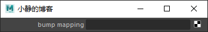

```py
import maya.cmds as cmds

newNode = cmds.shadingNode( 'blinn', asShader=True )
newNodeAttr = newNode + '.normalCamera'
cmds.window( title='小静的博客' )
cmds.columnLayout()
cmds.attrNavigationControlGrp( l='bump mapping', at=newNodeAttr )
cmds.showWindow()
```

## button

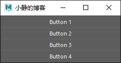

```py
import maya.cmds as cmds

cmds.window( title='小静的博客' )
cmds.columnLayout( adjustableColumn=True )
cmds.button( label='Button 1', command=defaultButtonPush )
cmds.button( label='Button 2' )
cmds.button( label='Button 3' )
cmds.button( label='Button 4' )
cmds.showWindow()

def defaultButtonPush(*args):
  print 'Button 1 was pushed.'
```

## canvas

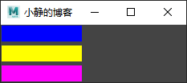

```py
import maya.cmds as cmds

cmds.window( title='小静的博客' )
cmds.columnLayout( rowSpacing=5 )
cmds.canvas( rgbValue=(0, 0, 1), width=100, height=20 )
cmds.canvas( hsvValue=(60, 1, 1), width=100, height=20 )
cmds.canvas( rgbValue=(1, 0, 1), width=100, height=20 )
cmds.showWindow()
```

## channelBox

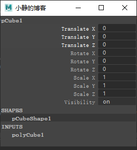

```py
import maya.cmds as cmds

cmds.window(t='小静的博客')
cmds.formLayout( 'form' )
cmds.channelBox( 'dave' )
cmds.formLayout( 'form', e=True, af=(('dave', 'top', 0), ('dave', 'left', 0), ('dave', 'right', 0), ('dave', 'bottom', 0)) )
cmds.showWindow()
```

## checkBox

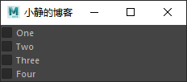

```py
import maya.cmds as cmds

window =cmds.window(t='小静的博客')
cmds.columnLayout( adjustableColumn=True )
cmds.checkBox( label='One' )
cmds.checkBox( label='Two' )
cmds.checkBox( label='Three' )
cmds.checkBox( label='Four' )
cmds.showWindow( window )
```

## checkBoxGrp

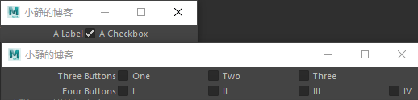

```py
import maya.cmds as cmds

exampleWindow = cmds.window(t='小静的博客')
cmds.columnLayout()
cmds.checkBoxGrp( numberOfCheckBoxes=3, label='Three Buttons', labelArray3=['One', 'Two', 'Three'] )
cmds.checkBoxGrp( numberOfCheckBoxes=4, label='Four Buttons', labelArray4=['I', 'II', 'III', 'IV'] )
cmds.showWindow( exampleWindow )

exampleWindow = cmds.window(t='小静的博客')
cmds.rowLayout()
cmds.checkBoxGrp(columnWidth2=[100, 165], numberOfCheckBoxes=1, label='A Label', label1='A Checkbox', v1=True)
cmds.showWindow(exampleWindow)
```

## cmdScrollFieldExecuter

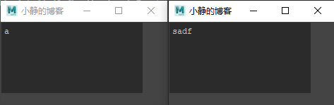

```py
import maya.cmds as cmds

cmds.window(t='小静的博客')
cmds.columnLayout()
cmds.cmdScrollFieldExecuter(width=200, height=100)
cmds.showWindow()

cmds.window(t='小静的博客')
cmds.columnLayout()
cmds.cmdScrollFieldExecuter(width=200, height=100, sourceType="python")
cmds.showWindow()
```

## cmdScrollFieldReporter

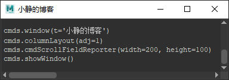

```py
import maya.cmds as cmds

cmds.window(t='小静的博客')
cmds.columnLayout(adj=1)
cmds.cmdScrollFieldReporter(width=200, height=100)
cmds.showWindow()
```

## cmdShell

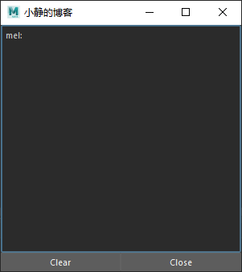

```py

import maya.cmds as cmds

if cmds.window( 'ExampleWindow', exists=True):
    cmds.deleteUI( 'ExampleWindow', window=True)

cmds.window( 'ExampleWindow', widthHeight=(300, 300),t='小静的博客' )
form = cmds.formLayout()
cmdShell = cmds.cmdShell()
clearButton = cmds.button(label='Clear', command=('cmds.cmdShell(\"' + cmdShell + '\", edit=True, clear=True)' ))
closeButton = cmds.button(label='Close', command=('cmds.deleteUI( "ExampleWindow", window=True )' ) )

cmds.formLayout( form, edit=True,
    attachForm=((cmdShell, 'top', 0), (cmdShell, 'left', 0), (cmdShell, 'right', 0), (clearButton, 'left', 0),
                                (clearButton, 'bottom', 0), (closeButton, 'bottom', 0), (closeButton, 'right', 0)),
    attachControl=(cmdShell, 'bottom', 0, clearButton),
    attachNone=((clearButton, 'top'), (closeButton, 'top')),
    attachPosition=((clearButton, 'right', 0, 50), (closeButton, 'left', 0, 50)))

cmds.showWindow( 'ExampleWindow' )
```

## colorIndexSliderGrp


```py
import maya.cmds as cmds

cmds.window(t='小静的博客' )
cmds.columnLayout()
cmds.colorIndexSliderGrp( label='Select Color', min=0, max=20, value=10 )
cmds.showWindow()
```

## colorInputWidgetGrp

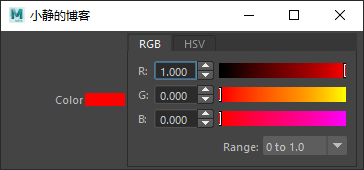

```py
import maya.cmds as cmds

cmds.window(t='小静的博客' )
cmds.columnLayout()
cmds.colorInputWidgetGrp( label='Color', rgb=(1, 0, 0) )
cmds.showWindow()
```

## colorSliderButtonGrp

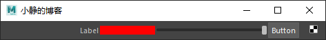

```py
import maya.cmds as cmds

cmds.window(t='小静的博客' )
cmds.columnLayout()
cmds.colorSliderButtonGrp( label='Label', buttonLabel='Button', rgb=(1, 0, 0), symbolButtonDisplay=True, columnWidth=(5, 30), image='navButtonUnconnected.png' )
cmds.showWindow()
```

## colorSliderGrp

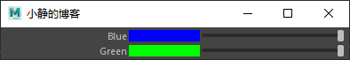

```py
import maya.cmds as cmds

cmds.window(t='小静的博客' )
cmds.columnLayout()
cmds.colorSliderGrp( label='Blue', rgb=(0, 0, 1) )
cmds.colorSliderGrp( label='Green', hsv=(120, 1, 1) )
cmds.showWindow()
```

## commandLine

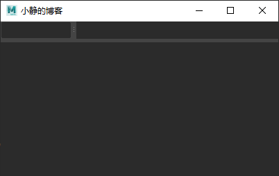

```py
import maya.cmds as cmds

window =cmds.window(t='小静的博客' )
form = cmds.formLayout()
field = cmds.scrollField()

cmdLine = cmds.commandLine()
cmds.commandLine( cmdLine, edit=True, height=25)
cmds.commandLine( cmdLine, edit=True, sourceType="python")
cmds.formLayout( form, edit=True, attachForm=[(cmdLine, 'top', 0), (cmdLine, 'left', 0), (cmdLine, 'right', 0), (field, 'left', 0), (field, 'bottom', 0), (field, 'right', 0)], attachNone=(cmdLine, 'bottom'), attachControl=(field, 'top', 5, cmdLine) )

cmds.setFocus( cmdLine )
cmds.showWindow( window )
```

## componentBox

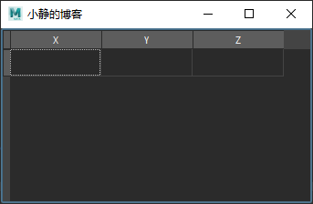

```py
import maya.cmds as cmds

window =cmds.window(t='小静的博客' )
cmds.formLayout( 'form' )
cmds.componentBox( 'cbox' )
cmds.formLayout( 'form', e=True, af=(('cbox', 'top', 0), ('cbox', 'left', 0), ('cbox', 'right', 0), ('cbox', 'bottom', 0)) )
cmds.showWindow()
```

## control

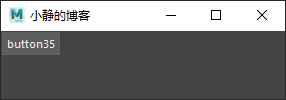

```py
import maya.cmds as cmds

window = cmds.window(title='小静的博客')
column = cmds.columnLayout()
button = cmds.button()
cmds.showWindow( window )

cmds.control( button, query=True, width=True )
cmds.control( button, query=True, height=True )
cmds.control( button, edit=True, visible=False )
cmds.control( button, query=True, visible=True )
```

## falloffCurve

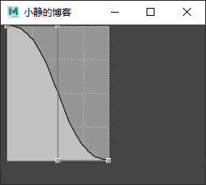

```py
import maya.cmds as cmds

cmds.window( title='小静的博客' )
cmds.optionVar(stringValueAppend=['falloffCurveOptionVar', '0,1'])
cmds.optionVar(stringValueAppend=['falloffCurveOptionVar', '0.5,1'])
cmds.optionVar(stringValueAppend=['falloffCurveOptionVar', '0.5,0'])
cmds.optionVar(stringValueAppend=['falloffCurveOptionVar', '1,0'])
cmds.columnLayout()
cmds.falloffCurve( 'fCurve', h=200)
cmds.falloffCurve( 'fCurve', e=True, optionVar='falloffCurveOptionVar' )
cmds.showWindow()

cmds.falloffCurve( 'fCurve', q=True, asString=True )
```

## falloffCurveAttr

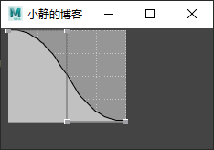

```py
import maya.cmds as cmds
cmds.window( title='小静的博客' )
objName = cmds.createNode('vectorExtrude')
cmds.columnLayout()
cmds.falloffCurveAttr()
cmds.showWindow()
```

## floatField

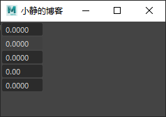

```py
import maya.cmds as cmds
window = cmds.window( title='小静的博客' )
cmds.columnLayout()
cmds.floatField()
cmds.floatField( editable=False )
cmds.floatField( minValue=-10, maxValue=10, value=0 )
cmds.floatField( minValue=0, maxValue=1, precision=2 )
cmds.floatField( minValue=-1, maxValue=1, precision=4, step=.01 )
cmds.showWindow( window )
```

## floatFieldGrp


```py
import maya.cmds as cmds
window = cmds.window( title='小静的博客' )
cmds.columnLayout()
cmds.floatFieldGrp( numberOfFields=3, label='Scale', extraLabel='cm', value1=0.3, value2=0.5, value3=0.1 )
cmds.showWindow( window )
```

## floatScrollBar

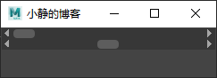

```py
import maya.cmds as cmds
cmds.window( title='小静的博客' )
cmds.columnLayout( adjustableColumn=True )
cmds.floatScrollBar()
cmds.floatScrollBar( min=-100, max=100, value=0, step=1, largeStep=10 )
cmds.showWindow()
```

## floatSlider


```py
import maya.cmds as cmds
cmds.window( title='小静的博客' )
cmds.columnLayout( adjustableColumn=True )
cmds.floatSlider()
cmds.floatSlider( min=-100, max=100, value=0, step=1 )
cmds.showWindow()
```

## floatSlider2

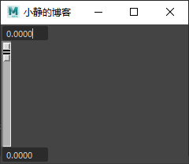

```py
import maya.cmds as cmds
cmds.window( title='小静的博客' )
cmds.columnLayout()
ff1    = cmds.floatField()
slider = cmds.floatSlider2()
ff2    = cmds.floatField()
cmds.floatSlider2( slider, edit=True, positionControl1=ff1, positionControl2=ff2 )
cmds.floatSlider2( slider, edit=True, polarity=1, max=360 )
cmds.floatSlider2(slider, edit=True, cc1='setAttr makeNurbSphere1.endSweep', cc2='setAttr makeNurbSphere1.startSweep' )
cmds.showWindow()
```

## floatSliderButtonGrp

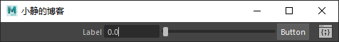

```py
import maya.cmds as cmds
window = cmds.window( title='小静的博客' )
cmds.columnLayout()
cmds.floatSliderButtonGrp( label='Label', field=True, buttonLabel='Button', symbolButtonDisplay=True, columnWidth=(5, 23), image='cmdWndIcon.xpm' )
cmds.showWindow( window )
```

## floatSliderGrp

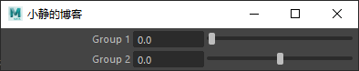

```py
import maya.cmds as cmds
window = cmds.window( title='小静的博客' )
cmds.columnLayout()
cmds.floatSliderGrp( label='Group 1', field=True )
cmds.floatSliderGrp( label='Group 2', field=True, minValue=-10.0, maxValue=10.0, fieldMinValue=-100.0, fieldMaxValue=100.0, value=0 )
cmds.showWindow( window )
```

## gradientControl

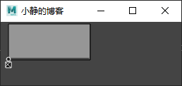

```py
import maya.cmds as cmds
window = cmds.window( title='小静的博客' )
objName = cmds.createNode('polySplitRing')
cmds.columnLayout()
cmds.gradientControl( at='%s.profileCurve' % objName )
cmds.showWindow()
```

## gradientControlNoAttr

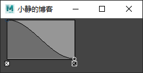

```py
import maya.cmds as cmds
window = cmds.window( title='小静的博客' )
cmds.optionVar(stringValueAppend=['falloffCurveOptionVar', '0,1,2'])
cmds.optionVar(stringValueAppend=['falloffCurveOptionVar', '1,0,2'])
cmds.columnLayout()
cmds.gradientControlNoAttr( 'falloffCurve', h=90)
cmds.gradientControlNoAttr( 'falloffCurve', e=True, optionVar='falloffCurveOptionVar' )
cmds.showWindow()
```

## helpLine

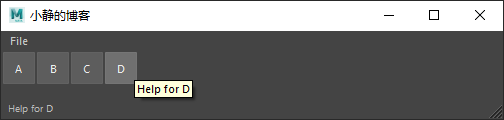

```py
import maya.cmds as cmds
window = cmds.window(title='小静的博客', menuBar=True )
cmds.menu( label='File' )
cmds.menuItem( label='New', annotation='Help for New' )
cmds.menuItem( label='Open', annotation='Help for Open' )
cmds.menuItem( label='Close', annotation='Help for Close' )

form = cmds.formLayout()
column = cmds.rowLayout(numberOfColumns=4,
                        columnWidth4=(32, 32, 32, 32),
                        columnAttach4=('both', 'both', 'both', 'both'))
cmds.button( label='A', height=32, annotation='Help for A' )
cmds.button( label='B', height=32, annotation='Help for B' )
cmds.button( label='C', height=32, annotation='Help for C' )
cmds.button( label='D', height=32, annotation='Help for D' )
cmds.setParent( '..' )

frame = cmds.frameLayout( labelVisible=False )
cmds.helpLine()
cmds.formLayout( form, edit=True,
                 attachForm=((column, 'top', 0), (column, 'left', 0),
                             (column, 'right', 0), (frame, 'left', 0),
                             (frame, 'bottom', 0), (frame, 'right', 0)),
                 attachNone=((column, 'bottom'), (frame, 'top')) )
cmds.showWindow( window )
```

## hudButton

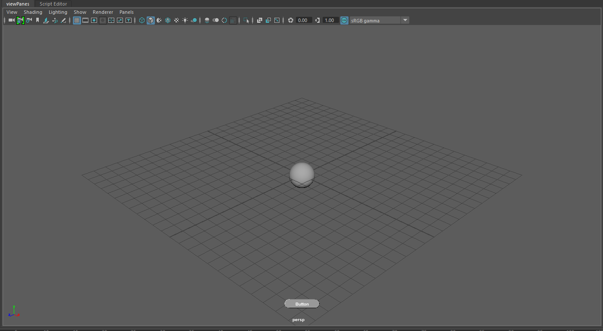

```py
import maya.cmds as cmds
gHelloCount = 0
def HUDButtonHello(*args):
    global gHelloCount
    print 'Hello!( %i )' % gHelloCount
    gHelloCount += 1
cmds.hudButton('HUDHelloButton', s=7, b=5, vis=1, l='Button', bw=80, bsh='roundRectangle', rc=HUDButtonHello )
```

## hudSliderButton

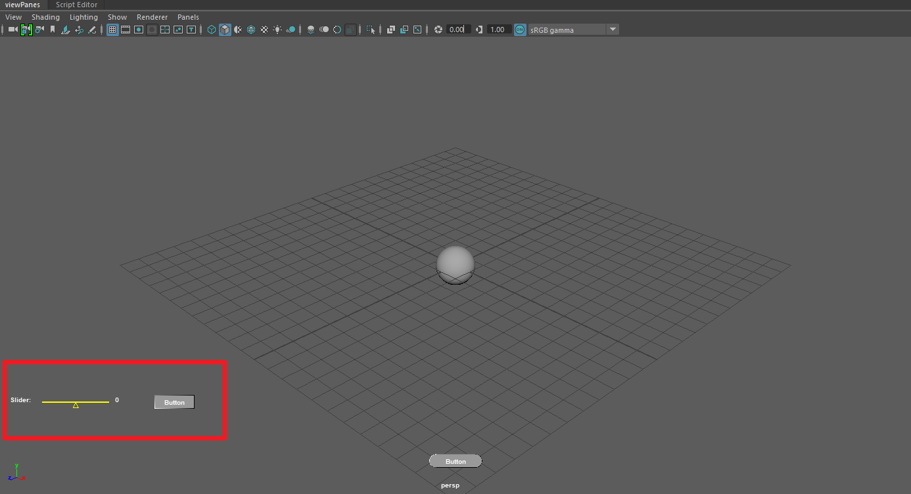

```py
import maya.cmds as cmds
def translateXSliderButton( HUD ):
    cmds.undoInfo( swf=True )
    selList = cmds.ls( sl=True )
    for object in selList:
        if cmds.objectType( object, isType='transform' ):
            cmds.setAttr( object+".tx", cmds.hudSliderButton( HUD, query=True, v=True ) )
cmds.hudSliderButton( 'HUDTranslateXSliderButton', s=5, b=5, vis=True, sl='Slider:', value=0, type='int', min=-10, max=10, slw=50, vw=50, sln=100, si=1, bl='Button', bw=60, bsh='rectangle', brc=lambda : translateXSliderButton( 'HUDTranslateXSliderButton' ))
```

## iconTextButton

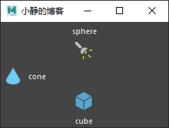

```py
import maya.cmds as cmds
window = cmds.window(title='小静的博客')
cmds.columnLayout( adjustableColumn=True )
cmds.iconTextButton( style='textOnly', image1='sphere.png', label='sphere' )
cmds.iconTextButton( style='iconOnly', image1='spotlight.png', label='spotlight' )
cmds.iconTextButton( style='iconAndTextHorizontal', image1='cone.png', label='cone' )
cmds.iconTextButton( style='iconAndTextVertical', image1='cube.png', label='cube' )
cmds.showWindow( window )
```

## iconTextCheckBox

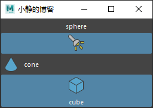

```py
import maya.cmds as cmds

window =cmds.window(title='小静的博客')
cmds.columnLayout( adjustableColumn=True )
cmds.iconTextCheckBox( style='textOnly', image1='sphere.png', label='sphere' )
cmds.iconTextCheckBox( style='iconOnly', image1='spotlight.png', label='spotlight' )
cmds.iconTextCheckBox( style='iconAndTextHorizontal', image1='cone.png', label='cone' )
cmds.iconTextCheckBox( style='iconAndTextVertical', image1='cube.png', label='cube' )
cmds.showWindow( window )
```

## iconTextRadioButton

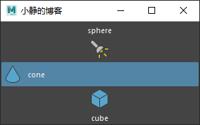

```py
import maya.cmds as cmds

cmds.window(title='小静的博客', tlc=(100, 400) )
cmds.columnLayout( adj=True )
cmds.iconTextRadioCollection( 'itRadCollection' )
cmds.iconTextRadioButton( st='textOnly', i1='sphere.png', l='sphere' )
cmds.iconTextRadioButton( st='iconOnly', i1='spotlight.png', l='spotlight' )
cmds.iconTextRadioButton( st='iconAndTextHorizontal', i1='cone.png', l='cone' )
cmds.iconTextRadioButton( st='iconAndTextVertical', i1='cube.png', l='cube' )
cmds.showWindow()
```

## iconTextRadioCollection

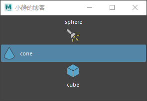

```py
import maya.cmds as cmds

cmds.window(title='小静的博客', tlc=(100, 400) )
cmds.columnLayout( adj=True )
cmds.iconTextRadioCollection( 'itRadCollection' )
cmds.iconTextRadioButton( st='textOnly', i1='sphere.png', l='sphere' )
cmds.iconTextRadioButton( st='iconOnly', i1='spotlight.png', l='spotlight' )
cmds.iconTextRadioButton( st='iconAndTextHorizontal', i1='cone.png', l='cone' )
cmds.iconTextRadioButton( st='iconAndTextVertical', i1='cube.png', l='cube' )
cmds.showWindow()
```

## iconTextScrollList

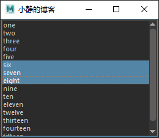

```py
import maya.cmds as cmds
cmds.window(title='小静的博客', tlc=(100, 400) )
cmds.paneLayout()
cmds.iconTextScrollList(allowMultiSelection=True, append=('one', 'two', 'three', 'four', 'five', 'six', 'seven', 'eight', 'nine', 'ten', 'eleven', 'twelve', 'thirteen', 'fourteen', 'fifteen'), selectItem='six' )
cmds.showWindow()
```

## iconTextStaticLabel

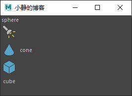

```py
import maya.cmds as cmds

cmds.window(title='小静的博客', tlc=(100, 400) )
cmds.columnLayout()
cmds.iconTextStaticLabel( st='textOnly', i1='sphere.png', l='sphere' )
cmds.iconTextStaticLabel( st='iconOnly', i1='spotlight.png', l='spotlight' )
cmds.iconTextStaticLabel( st='iconAndTextHorizontal', i1='cone.png', l='cone' )
cmds.iconTextStaticLabel( st='iconAndTextVertical', i1='cube.png', l='cube' )
cmds.showWindow()
```

## image

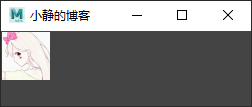

```py
import maya.cmds as cmds
window = cmds.window(title='小静的博客')
cmds.paneLayout()
cmds.image( image='C:/Users/Administrator/Desktop/Icon.ico' )
cmds.showWindow( window )
```

## intField

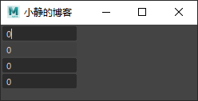

```py
import maya.cmds as cmds

cmds.window(title='小静的博客')
cmds.columnLayout()
cmds.intField()
cmds.intField( editable=False )
cmds.intField( minValue=-10, maxValue=10, value=0 )
cmds.intField( minValue=-1000, maxValue=1000, step=10 )
cmds.showWindow()
```

## intFieldGrp

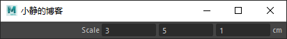

```py
import maya.cmds as cmds
window = cmds.window(title='小静的博客')
cmds.columnLayout()
cmds.intFieldGrp( numberOfFields=3, label='Scale', extraLabel='cm', value1=3, value2=5, value3=1 )
cmds.showWindow( window )
```

## intScrollBar

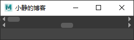

```py
import maya.cmds as cmds

cmds.window(title='小静的博客')
cmds.columnLayout( adjustableColumn=True )
cmds.intScrollBar()
cmds.intScrollBar( min=-100, max=100, value=0, step=1, largeStep=10 )
cmds.showWindow()
```

## intSlider

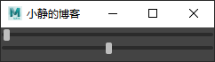

```py
import maya.cmds as cmds

cmds.window(title='小静的博客')
cmds.columnLayout( adjustableColumn=True )
cmds.intSlider()
cmds.intSlider( min=-100, max=100, value=0, step=1 )
cmds.showWindow()
```

## intSliderGrp


```py
import maya.cmds as cmds

cmds.window(title='小静的博客')
cmds.columnLayout()
cmds.intSliderGrp( field=True, label='Group 1' )
cmds.intSliderGrp( field=True, label='Group 2', minValue=-10, maxValue=10, fieldMinValue=-100, fieldMaxValue=100, value=0 )
cmds.showWindow( )
```

## layerButton


```py
import maya.cmds as cmds

cmds.window(title='小静的博客')
cmds.columnLayout()
b = cmds.layerButton(name='defaultLayer', cl=(1.0, 0.0, 0.0), s=True)
cmds.showWindow( )

width = cmds.layerButton(b ,q=True, labelWidth=True )
```

## messageLine

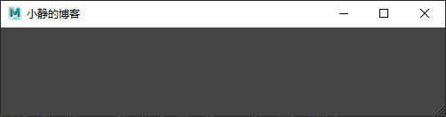

> 此命令创建一条消息行，其中显示工具反馈。

```py
import maya.cmds as cmds
window=cmds.window(title='小静的博客')
form = cmds.formLayout()
frame = cmds.frameLayout(labelVisible=False)
cmds.messageLine()
cmds.formLayout( form, edit=True, attachNone=(frame, 'top'), attachForm=[(frame, 'left', 0), (frame, 'bottom', 0), (frame, 'right', 0)] )
cmds.showWindow( window )
```

## nameField

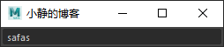

> 创建一个可编辑字段，该字段可链接到Maya对象的名称。该字段将始终显示链接对象的名称。

```py
import maya.cmds as cmds
window=cmds.window(title='小静的博客')
cmds.columnLayout( adjustableColumn=True )
sphereName = cmds.sphere()
field = cmds.nameField(object=sphereName[0])
cmds.showWindow( window )
objectName = cmds.nameField(field, query=True, object=True)
cmds.rename( objectName, 'NewName' )
```

## nodeTreeLister

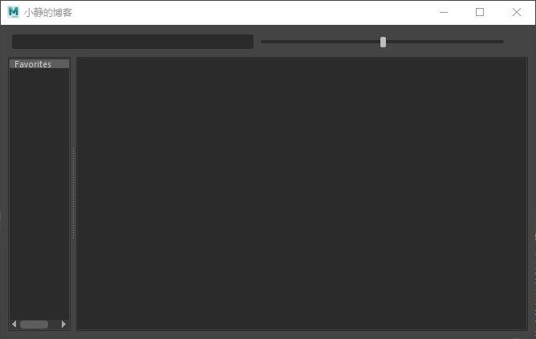

```py
import maya.cmds as cmds

cmds.window(title='小静的博客')
cmds.formLayout('theForm')
cmds.nodeTreeLister('theTreeLister')
cmds.formLayout('theForm', e=True,
                af=(('theTreeLister', 'top', 0),
                    ('theTreeLister', 'left', 0),
                    ('theTreeLister', 'bottom', 0),
                    ('theTreeLister', 'right', 0)))
cmds.showWindow()
```

## palettePort

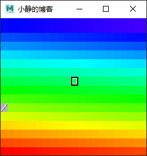

```py
import maya.cmds as cmds

cmds.window(title='小静的博客')
cmds.frameLayout(labelVisible=0)
cmds.palettePort( 'palette', dim=(20, 15) )
cmds.palettePort( 'palette', edit=True, scc=30 )
cmds.palettePort( 'palette', query=True, rgb=True )
cmds.palettePort( 'palette', edit=True, transparent=100, rgb=(100, 0.0, 0.0, 1.0) )
cmds.palettePort( 'palette', edit=True, redraw=True )
cmds.palettePort( 'palette', query=True, transparent=True )
cmds.showWindow()
```

## picture

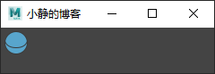

```py
import maya.cmds as cmds

window=cmds.window(title='小静的博客')
cmds.columnLayout()
cmds.picture( image='sphere.png' )
cmds.showWindow( window )
```

## progressBar

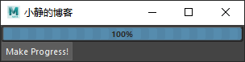

```py
import maya.cmds as cmds

window=cmds.window(title='小静的博客')
cmds.columnLayout()
progressControl = cmds.progressBar(maxValue=10, width=300)
cmds.button( label='Make Progress!', command='cmds.progressBar(progressControl, edit=True, step=1)' )
cmds.showWindow( window )
```

## radioButton

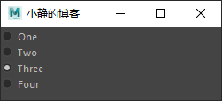

```py
import maya.cmds as cmds

window=cmds.window(title='小静的博客')
cmds.columnLayout( adjustableColumn=True )
cmds.radioCollection()
cmds.radioButton( label='One' )
cmds.radioButton( label='Two' )
cmds.radioButton( label='Three' )
cmds.radioButton( label='Four' )
cmds.showWindow( window )
```

## radioButtonGrp

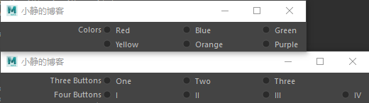

```py
import maya.cmds as cmds

window = cmds.window(title='小静的博客')
cmds.columnLayout()
cmds.radioButtonGrp( label='Three Buttons', labelArray3=['One', 'Two', 'Three'], numberOfRadioButtons=3 )
cmds.radioButtonGrp( label='Four Buttons', labelArray4=['I', 'II', 'III', 'IV'], numberOfRadioButtons=4 )
cmds.showWindow( window )

window = cmds.window(title='小静的博客')
cmds.columnLayout()
group1 = cmds.radioButtonGrp( numberOfRadioButtons=3, label='Colors', labelArray3=['Red', 'Blue', 'Green'] )
cmds.radioButtonGrp( numberOfRadioButtons=3, shareCollection=group1, label='', labelArray3=['Yellow', 'Orange', 'Purple'] )
cmds.showWindow( window )
```

## radioCollection

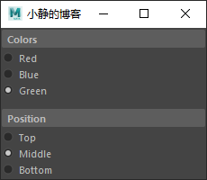

```py
import maya.cmds as cmds

cmds.window(title='小静的博客')
cmds.columnLayout( adjustableColumn=True, rowSpacing=10 )
cmds.frameLayout( label='Colors' )
cmds.columnLayout()
collection1 = cmds.radioCollection()
rb1 = cmds.radioButton( label='Red' )
rb2 = cmds.radioButton( label='Blue' )
rb3 = cmds.radioButton( label='Green' )
cmds.setParent( '..' )
cmds.setParent( '..' )

cmds.frameLayout( label='Position' )
cmds.columnLayout()
collection2 = cmds.radioCollection()
rb4 = cmds.radioButton( label='Top' )
rb5 = cmds.radioButton( label='Middle' )
rb6 = cmds.radioButton( label='Bottom' )
cmds.setParent( '..' )
cmds.setParent( '..' )

cmds.radioCollection( collection1, edit=True, select=rb2 )
cmds.radioCollection( collection2, edit=True, select=rb6 )
cmds.showWindow()
```

## rangeControl

> 此命令创建一个用于显示和修改当前播放范围的控件。 注意：只能存在一个主范围控件。 用户创建的任何附加rangeControl都将从属于主范围控件小部件。

```py
import maya.cmds as cmds
window=cmds.window(title='小静的博客')
cmds.frameLayout( lv=False )
cmds.playbackOptions( minTime=0, maxTime=30 )
cmds.rangeControl( 'myRangeSlider', minRange=0, maxRange=60 )
cmds.showWindow(window)
```

## scriptTable

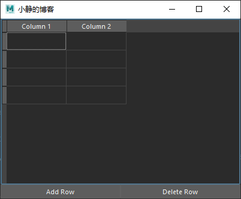

```py
import maya.cmds as cmds

def edit_cell(row, column, value):
    return 1

window = cmds.window(title='小静的博客',widthHeight=(400, 300))
form = cmds.formLayout()
table = cmds.scriptTable(rows=4, columns=2, label=[(1,"Column 1"), (2,"Column 2")], cellChangedCmd=edit_cell)

addButton = cmds.button(label="Add Row",command="cmds.scriptTable(table, edit=True,insertRow=1)")
deleteButton = cmds.button(label="Delete Row",command="cmds.scriptTable(table, edit=True,deleteRow=1)")

cmds.formLayout(form, edit=True, attachForm=[(table, 'top', 0), (table, 'left', 0), (table, 'right', 0), (addButton, 'left', 0), (addButton, 'bottom', 0), (deleteButton, 'bottom', 0), (deleteButton, 'right', 0)], attachControl=(table, 'bottom', 0, addButton), attachNone=[(addButton, 'top'),(deleteButton, 'top')],  attachPosition=[(addButton, 'right', 0, 50), (deleteButton, 'left', 0, 50)] )

cmds.showWindow( window )
```

## scrollField

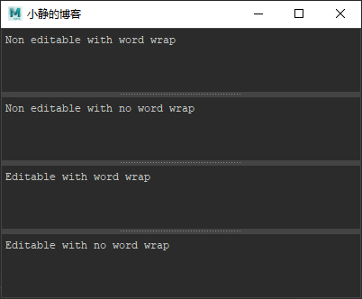

```py
cmds.paneLayout( configuration='horizontal4' )
cmds.scrollField( editable=False, wordWrap=True, text='Non editable with word wrap' )
cmds.scrollField( editable=False, wordWrap=False, text='Non editable with no word wrap' )
cmds.scrollField( editable=True, wordWrap=True, text='Editable with word wrap' )
cmds.scrollField( editable=True, wordWrap=False, text='Editable with no word wrap' )
```

## separator

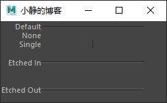

```py
cmds.rowColumnLayout( numberOfColumns=2, columnAlign=(1, 'right'), columnAttach=(2, 'both', 0), columnWidth=(2, 150) )

cmds.text( label='Default' )
cmds.separator()
cmds.text( label='None' )
cmds.separator( style='none' )
cmds.text( label='Single' )
cmds.separator( style='single' )
cmds.text( label='Etched In' )
cmds.separator( height=40, style='in' )
cmds.text( label='Etched Out' )
cmds.separator( height=40, style='out' )
cmds.setParent( '..' )
```

## shelfButton


```py
import maya.cmds as cmds
window = cmds.window(title='小静的博客',widthHeight=(400, 300))
tabs = cmds.tabLayout()
shelf = cmds.shelfLayout()
cmds.shelfButton( annotation='Print "Hello".', image1='commandButton.png', command='print "Hello\\n"' )
cmds.shelfButton( annotation='Create a sphere.', image1='sphere.png', command='cmds.sphere()' )
cmds.shelfButton(annotation='Show the Attribute Editor.', image1='menuIconWindow.png', command='import maya.mel; maya.mel.eval("openAEWindow")' )
cmds.shelfButton(annotation='Create a cone.', image1='cone.png', command='cmds.cone()', imageOverlayLabel='4th')
cmds.shelfButton(annotation="Undo last operation.",
    image1="undo.png", command="undo", imageOverlayLabel="undo",
    overlayLabelColor=(1, .25, .25))
cmds.shelfButton(annotation="Redo last operation.",
    image1="redo.png", command="redo", imageOverlayLabel="redo",
    overlayLabelColor=(1, 1, .25), overlayLabelBackColor=(.15, .9, .1, .4))
cmds.tabLayout( tabs, edit=True, tabLabel=(shelf, 'Example Shelf') )
cmds.showWindow( window )
```

## soundControl

```py
import maya.cmds as cmds
cmds.sound( file='ohNo.aiff', name='ohNo' )
cmds.window()
cmds.frameLayout( lv=False )
cmds.soundControl( 'soundScrubber', width=600, height=45, sound='ohNo', displaySound=True, waveform='both' )
cmds.showWindow()
pressCmd = "soundControl -e -beginScrub soundScrubber"
releaseCmd = "soundControl -e -endScrub soundScrubber"
cmds.soundControl( 'soundScrubber', e=True, pc=cmds.soundControl('soundScrubber',e=True,beginScrub=True, rc=cmds.sound('soundScrubber',e=True,endScrub=True)))
```

## swatchDisplayPort


```py
import maya.cmds as cmds
cmds.window(title='小静的博客')
cmds.columnLayout('r')
myShader = cmds.shadingNode('anisotropic', asShader=True)
cmds.swatchDisplayPort('slPP', wh=(256, 256), sn=myShader)
cmds.showWindow()
```

## switchTable


```py
import maya.cmds as cmds
cmds.window(title='小静的博客')
cmds.formLayout('theForm')
cmds.switchTable('theSwitch')
cmds.formLayout('theForm', e=True,
                af=(('theSwitch', 'top', 0),
                    ('theSwitch', 'left', 0),
                    ('theSwitch', 'bottom', 0),
                    ('theSwitch', 'right', 0)))
cmds.showWindow()
```

## symbolButton


```py
import maya.cmds as cmds
cmds.window(title='小静的博客')
cmds.columnLayout()
cmds.symbolButton( image='circle.png' )
cmds.symbolButton( image='sphere.png' )
cmds.symbolButton( image='cube.png' )
cmds.showWindow()
```

## symbolCheckBox


```py
import maya.cmds as cmds

cmds.window(title='小静的博客')
cmds.columnLayout()
cmds.symbolCheckBox( image='circle.png' )
cmds.symbolCheckBox( image='sphere.png' )
cmds.symbolCheckBox( image='cube.png' )
cmds.showWindow()
```

## text

```py
import maya.cmds as cmds

cmds.window( width=150 )
cmds.columnLayout( adjustableColumn=True )
cmds.text( label='Default' )
cmds.text( label='Left', align='left' )
cmds.text( label='Centre', align='center' )
cmds.text( label='Right', align='right' )
cmds.showWindow()
```

## textField


```py
import maya.cmds as cmds

cmds.window(title='小静的博客')
cmds.rowColumnLayout( numberOfColumns=2, columnAttach=(1, 'right', 0), columnWidth=[(1, 100), (2, 250)] )
cmds.text( label='Name' )
name = cmds.textField()
cmds.text( label='Address' )
address = cmds.textField()
cmds.text( label='Phone Number' )
phoneNumber = cmds.textField()
cmds.text( label='Email' )
email = cmds.textField()

cmds.textField( name, edit=True, enterCommand=('cmds.setFocus(\"' + address + '\")') )
cmds.textField( address, edit=True, enterCommand=('cmds.setFocus(\"' + phoneNumber + '\")') )
cmds.textField( phoneNumber, edit=True, enterCommand=('cmds.setFocus(\"' + email + '\")') )
cmds.textField( email, edit=True, enterCommand=('cmds.setFocus(\"' + name + '\")') )
cmds.showWindow()
```

## textFieldButtonGrp


```py
import maya.cmds as cmds

cmds.window(title='小静的博客')
cmds.columnLayout()
cmds.textFieldButtonGrp( label='Label', text='Text', buttonLabel='Button' )
cmds.showWindow()
```

## textFieldGrp


```py
import maya.cmds as cmds

cmds.window(title='小静的博客')
cmds.columnLayout()
cmds.textFieldGrp( label='Group 1', text='Editable' )
cmds.textFieldGrp( label='Group 2', text='Non-editable', editable=False )
cmds.showWindow()
```

## textScrollList


```py
import maya.cmds as cmds

cmds.window(title='小静的博客')
cmds.paneLayout()
cmds.textScrollList( numberOfRows=8, allowMultiSelection=True,
            append=['one', 'two', 'three', 'four', 'five', 'six', 'seven', 'eight', 'nine', 'ten',
                    'eleven', 'twelve', 'thirteen', 'fourteen', 'fifteen'],
            selectItem='six', showIndexedItem=4 )
cmds.showWindow()

cmds.window(title='小静的博客')
cmds.paneLayout()
cmds.textScrollList( "myControlObj", allowMultiSelection=True,
            append=[ "Only two things are infinite, the universe and human stupidity, and I'm not sure about the former.",
                     "Each problem that I solved became a rule, which served afterwards to solve other problems."],
            uniqueTag=["Albert Einstein","Rene Descartes"])
cmds.showWindow()
cmds.textScrollList( "myControlObj", edit=True, selectUniqueTagItem=["Albert Einstein"])
cmds.textScrollList( "myControlObj", query=True, selectUniqueTagItem=True)
cmds.textScrollList( "myControlObj", edit=True, append=["Your theory is crazy, but it's not crazy enough to be true."],
                                                uniqueTag=["Niels Bohr"] )
cmds.textScrollList( "myControlObj", edit=True, selectUniqueTagItem=["Rene Descartes", "Niels Bohr"])
cmds.textScrollList( "myControlObj", query=True, selectUniqueTagItem=True)
```

## fileDialog2


```py
import maya.cmds as cmds

basicFilter = "*.ma"
cmds.fileDialog2(fileFilter=basicFilter, dialogStyle=2,cap='小静的博客',okc='确定',cc='取消')
```

## confirmDialog


```py
import maya.cmds as cmds

cmds.confirmDialog( title='Confirm', message='Are you sure?', button=['Yes','No'], defaultButton='Yes', cancelButton='No', dismissString='No' )
```

## colorEditor


```py
import maya.cmds as cmds

cmds.colorEditor()
if cmds.colorEditor(query=True, result=True):
    values = cmds.colorEditor(query=True, rgb=True)
    print 'RGB = ' + str(values)
    values = cmds.colorEditor(query=True, hsv=True)
    print 'HSV = ' + str(values)
    alpha = cmds.colorEditor(query=True, alpha=True)
    print 'Alpha = ' + str(alpha)
else:
    print 'Editor was dismissed'
```
