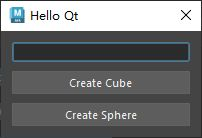

# 概述
- 创建一个简单的对话窗口，用于创建指定名称的立方体和球体
- [Open: Pasted image 20250805114123.png](attachments/18cf8da00bcd257e44e2ad0297bcb3fa_MD5.jpeg)

# 代码
```python
from PySide2 import QtWidgets
import pymel.core as pc


# 创建窗口类继承自QDialog
class HelloQtWindow(QtWidgets.QDialog):
    # 构造函数
    def __init__(self, parent=None):
        super().__init__(parent)  # 调用父类构造函数
        self.setWindowTitle("Hello Qt")  # 设置窗口抬头
        # 创建控件
        self.name_line_edit = QtWidgets.QLineEdit()  # 单行输入框
        self.cube_btn = QtWidgets.QPushButton("Create Cube")  # 按钮
        self.sphere_btn = QtWidgets.QPushButton("Create Sphere")
        # 创建布局
        layout = QtWidgets.QVBoxLayout()
        # 将控件添加到布局
        layout.addWidget(self.name_line_edit)
        layout.addWidget(self.cube_btn)
        layout.addWidget(self.sphere_btn)
        # 设置布局
        self.setLayout(layout)
        # 连接信号与槽函数
        self.cube_btn.clicked.connect(self.create_cube)
        self.sphere_btn.clicked.connect(self.create_sphere)

    # 从单行输入框获取名称
    def get_name(self):
        return self.name_line_edit.text()

    # 创建立方体函数
    def create_cube(self):
        pc.polyCube(name=self.get_name())

    # 创建球体函数
    def create_sphere(self):
        pc.polySphere(name=self.get_name())


if __name__ == "__main__":
    window = HelloQtWindow()
    window.show()

```
## 使用
```python
import sys
from importlib import reload

script_path = r"G:\Code\QtForMaya"

if script_path not in sys.path:
    sys.path.insert(0, script_path)

import Hello_QT
reload(Hello_QT)

window = Hello_QT.HelloQtWindow()
window.show()
```