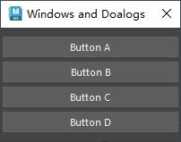
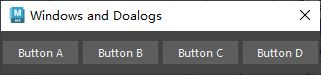
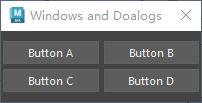
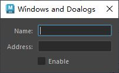
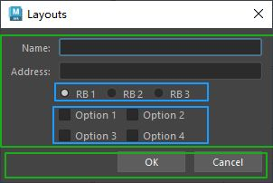

# 横向和纵向布局
- QVBoxLayout, QHBoxLayout
- [Open: Pasted image 20250805155104.png](attachments/9bbf65b04c1dd2aea5b113739e47fb55_MD5.jpeg)
[Open: Pasted image 20250805155130.png](attachments/835ea4c5fadbe5076df6732d1c04f6ad_MD5.jpeg)

```python 
from PySide2 import QtWidgets, QtCore
import pymel.core as pc


# 获取maya主窗口 PySide 实例
def get_maya_main_window():
    """通过 QApplication 获取 Maya 主窗口的 PySide 实例"""
    app = QtWidgets.QApplication.instance()  # 用于获取当前运行的 maya QApplication 实例
    # 如果当前没有运行的 QApplication 实例，返回None
    if not app:
        return None
    # app.topLevelWidgets() 返回当前 QApplication 管理的所有顶层窗口（没有父窗口）列表
    for widget in app.topLevelWidgets():
        # 如果窗口的 Qt 对象名称为"MayaWindow"，返回这个窗口实例
        if widget.objectName() == "MayaWindow":
            return widget
    return None


# 自定义窗口类
class MainToolWindow(QtWidgets.QDialog):
    # 构造函数,以maya主窗口为父项
    def __init__(self, parent=get_maya_main_window()):
        super().__init__(parent)

        self.setWindowTitle("Windows and Doalogs")  # 设置窗口抬头
        # self.setMinimumSize(200, 150)  # 设置窗口最小大小
        self.setMinimumWidth(200)  # 设置窗口最小宽度
        # 创建按钮
        self.btn_a = QtWidgets.QPushButton("Button A")
        self.btn_b = QtWidgets.QPushButton("Button B")
        self.btn_c = QtWidgets.QPushButton("Button C")
        self.btn_d = QtWidgets.QPushButton("Button D")
        # 创建布局，父项为实例本身:QVBoxLayout,QHBoxLayout
        main_layout = QtWidgets.QVBoxLayout(self)
        # 为布局添加部件
        main_layout.setContentsMargins(2, 10, 2, 10)  # 设置布局与窗口之间的边界距离LTRB
        main_layout.setSpacing(5)  # 设置按钮间隔距离 5 像素
        main_layout.addWidget(self.btn_a)
        main_layout.addWidget(self.btn_b)
        main_layout.addWidget(self.btn_c)
        main_layout.addWidget(self.btn_d)
        main_layout.addStretch()  # 为布局底部添加拉伸,使两个按钮置顶


if __name__ == "__main__":
    win = MainToolWindow()
    win.show()
```
# 网格布局
- QGridLayout
- [Open: Pasted image 20250805155452.png](attachments/a0ee636b30dc3d0459cce4e92dff2dc0_MD5.jpeg)

```python
from PySide2 import QtWidgets, QtCore
import pymel.core as pc


# 获取maya主窗口 PySide 实例
def get_maya_main_window():
    """通过 QApplication 获取 Maya 主窗口的 PySide 实例"""
    app = QtWidgets.QApplication.instance()  # 用于获取当前运行的 maya QApplication 实例
    # 如果当前没有运行的 QApplication 实例，返回None
    if not app:
        return None
    # app.topLevelWidgets() 返回当前 QApplication 管理的所有顶层窗口（没有父窗口）列表
    for widget in app.topLevelWidgets():
        # 如果窗口的 Qt 对象名称为"MayaWindow"，返回这个窗口实例
        if widget.objectName() == "MayaWindow":
            return widget
    return None


# 自定义窗口类
class MainToolWindow(QtWidgets.QDialog):
    # 构造函数,以maya主窗口为父项
    def __init__(self, parent=get_maya_main_window()):
        super().__init__(parent)

        self.setWindowTitle("Windows and Doalogs")  # 设置窗口抬头
        # self.setMinimumSize(200, 150)  # 设置窗口最小大小
        self.setMinimumWidth(200)  # 设置窗口最小宽度
        # 创建按钮
        self.btn_a = QtWidgets.QPushButton("Button A")
        self.btn_b = QtWidgets.QPushButton("Button B")
        self.btn_c = QtWidgets.QPushButton("Button C")
        self.btn_d = QtWidgets.QPushButton("Button D")
        # 创建布局，父项为实例本身:QGridLayout
        main_layout = QtWidgets.QGridLayout(self)
        # 为布局添加部件
        main_layout.setContentsMargins(2, 10, 2, 10)  # 设置布局与窗口之间的边界距离LTRB
        main_layout.setSpacing(5)  # 设置按钮间隔距离 5 像素
        main_layout.addWidget(self.btn_a, 0, 0)  # 网格布局0行0列
        main_layout.addWidget(self.btn_b, 0, 1)  # 网格布局0行1列
        main_layout.addWidget(self.btn_c, 1, 0)  # 网格布局1行0列
        main_layout.addWidget(self.btn_d, 1, 1)  # 网格布局1行1列


if __name__ == "__main__":
    win = MainToolWindow()
    win.show()

```
# 表单布局
- QFormLayout
- [Open: Pasted image 20250805160209.png](attachments/5615e10ca24c7bec98e379a0d9a36710_MD5.jpeg)

```python
from PySide2 import QtWidgets, QtCore
import pymel.core as pc


# 获取maya主窗口 PySide 实例
def get_maya_main_window():
    """通过 QApplication 获取 Maya 主窗口的 PySide 实例"""
    app = QtWidgets.QApplication.instance()  # 用于获取当前运行的 maya QApplication 实例
    # 如果当前没有运行的 QApplication 实例，返回None
    if not app:
        return None
    # app.topLevelWidgets() 返回当前 QApplication 管理的所有顶层窗口（没有父窗口）列表
    for widget in app.topLevelWidgets():
        # 如果窗口的 Qt 对象名称为"MayaWindow"，返回这个窗口实例
        if widget.objectName() == "MayaWindow":
            return widget
    return None


# 自定义窗口类
class MainToolWindow(QtWidgets.QDialog):
    # 构造函数,以maya主窗口为父项
    def __init__(self, parent=get_maya_main_window()):
        super().__init__(parent)

        self.setWindowTitle("Windows and Doalogs")  # 设置窗口抬头
        # self.setMinimumSize(200, 150)  # 设置窗口最小大小
        self.setMinimumWidth(200)  # 设置窗口最小宽度
        # 创建按钮
        self.wdg_a = QtWidgets.QLineEdit()
        self.wdg_b = QtWidgets.QLineEdit()
        self.wdg_c = QtWidgets.QCheckBox("Enable")

        # 创建表单布局QFormLayout，父项为实例本身
        main_layout = QtWidgets.QFormLayout(self)
        # 为布局添加部件,表单布局QFormLayout要使用addRow添加键值对
        main_layout.addRow("Name: ", self.wdg_a)  #
        main_layout.addRow("Address: ", self.wdg_b)  #
        main_layout.addRow("", self.wdg_c)  #


if __name__ == "__main__":
    win = MainToolWindow()
    win.show()

```
# 布局嵌套
- 布局之间的嵌套

[Open: Pasted image 20250805165048.png](attachments/89f1ef5f1c05a403d2c823b193da9b0c_MD5.jpeg)

```python
from PySide2 import QtWidgets


# 获取maya主窗口 PySide 实例
def get_maya_main_window():
    """通过 QApplication 获取 Maya 主窗口的 PySide 实例"""
    app = QtWidgets.QApplication.instance()  # 用于获取当前运行的 maya QApplication 实例
    # 如果当前没有运行的 QApplication 实例，返回None
    if not app:
        return None
    # app.topLevelWidgets() 返回当前 QApplication 管理的所有顶层窗口（没有父窗口）列表
    for widget in app.topLevelWidgets():
        # 如果窗口的 Qt 对象名称为"MayaWindow"，返回这个窗口实例
        if widget.objectName() == "MayaWindow":
            return widget
    return None


# 自定义窗口类
class MainToolWindow(QtWidgets.QDialog):
    # 构造函数,以maya主窗口为父项
    def __init__(self, parent=get_maya_main_window()):
        super().__init__(parent)

        self.setWindowTitle("Layouts")  # 设置窗口抬头
        self.setMinimumWidth(300)  # 设置窗口最小宽度
        # 创建部件
        self.name_line = QtWidgets.QLineEdit()
        self.address_line = QtWidgets.QLineEdit()

        self.rb_1 = QtWidgets.QRadioButton("RB 1")
        self.rb_2 = QtWidgets.QRadioButton("RB 2")
        self.rb_3 = QtWidgets.QRadioButton("RB 3")
        self.rb_1.setChecked(True)

        self.cb_1 = QtWidgets.QCheckBox("Option 1")
        self.cb_2 = QtWidgets.QCheckBox("Option 2")
        self.cb_3 = QtWidgets.QCheckBox("Option 3")
        self.cb_4 = QtWidgets.QCheckBox("Option 4")

        self.ok_btn = QtWidgets.QPushButton("OK")
        self.cancel_btn = QtWidgets.QPushButton("Cancel")

        # 创建横向布局储存 RadioButton
        rb_layout = QtWidgets.QHBoxLayout()
        rb_layout.setContentsMargins(0, 0, 0, 0)
        rb_layout.addWidget(self.rb_1)
        rb_layout.addWidget(self.rb_2)
        rb_layout.addWidget(self.rb_3)

        # 创建网格布局储存 CheckBox
        cb_layout = QtWidgets.QGridLayout()
        cb_layout.setContentsMargins(0, 0, 0, 0)
        cb_layout.addWidget(self.cb_1, 0, 0)
        cb_layout.addWidget(self.cb_2, 0, 1)
        cb_layout.addWidget(self.cb_3, 1, 0)
        cb_layout.addWidget(self.cb_4, 1, 1)
        # 创建横向布局储存 PushButton
        btn_layout = QtWidgets.QHBoxLayout()
        btn_layout.setContentsMargins(0, 0, 0, 0)
        btn_layout.addStretch()
        btn_layout.addWidget(self.ok_btn)
        btn_layout.addWidget(self.cancel_btn)

        # 创建表单布局，储存 rb_layout 和 cb_layout
        form_layout = QtWidgets.QFormLayout()
        form_layout.setSpacing(6)
        form_layout.addRow("Name: ", self.name_line)
        form_layout.addRow("Address: ", self.address_line)
        form_layout.addRow("", rb_layout)  # 表单布局嵌套横向布局
        form_layout.addRow("", cb_layout)  # 表单布局嵌套横向布局

        # 创建总布局储存form_layout和btn_layout
        main_layout = QtWidgets.QVBoxLayout(self)
        main_layout.addLayout(form_layout)
        main_layout.addLayout(btn_layout)


if __name__ == "__main__":
    try:
        win.close()
        win.deleteLater()
    except Exception:
        pass
    win = MainToolWindow()
    win.show()

```