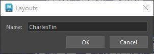

# 案例1：信号与槽
- 为上一个layout案例添加信号和槽函数
## 代码
```python
from PySide2 import QtWidgets, QtCore


# 获取maya主窗口 PySide 实例
def get_maya_main_window():
    """通过 QApplication 获取 Maya 主窗口的 PySide 实例"""
    app = QtWidgets.QApplication.instance()  # 用于获取当前运行的 maya QApplication 实例
    # 如果当前没有运行的 QApplication 实例，返回None
    if not app:
        return None
    # app.topLevelWidgets() 返回当前 QApplication 管理的所有顶层窗口（没有父窗口）列表
    for widget in app.topLevelWidgets():
        # 如果窗口的 Qt 对象名称为"MayaWindow"，返回这个窗口实例
        if widget.objectName() == "MayaWindow":
            return widget
    return None


# 自定义窗口类
class MainToolWindow(QtWidgets.QDialog):
    # 构造函数,以maya主窗口为父项
    def __init__(self, parent=get_maya_main_window()):
        super().__init__(parent)
        # 设置属性
        self.setWindowTitle("Layouts")
        self.setMinimumWidth(300)
        # 创建部件
        self.create_widgets()
        # 创建布局
        self.create_layout()
        # 创建连接
        self.create_connections()

    def create_widgets(self):
        self.name_line = QtWidgets.QLineEdit()
        self.address_line = QtWidgets.QLineEdit()

        self.rb_1 = QtWidgets.QRadioButton("RB 1")
        self.rb_2 = QtWidgets.QRadioButton("RB 2")
        self.rb_3 = QtWidgets.QRadioButton("RB 3")
        self.rb_1.setChecked(True)

        self.cb_1 = QtWidgets.QCheckBox("Option 1")
        self.cb_2 = QtWidgets.QCheckBox("Option 2")
        self.cb_3 = QtWidgets.QCheckBox("Option 3")
        self.cb_4 = QtWidgets.QCheckBox("Option 4")

        self.ok_btn = QtWidgets.QPushButton("OK")
        self.cancel_btn = QtWidgets.QPushButton("Cancel")

    def create_layout(self):
        # 创建横向布局储存 RadioButton
        rb_layout = QtWidgets.QHBoxLayout()
        rb_layout.setContentsMargins(0, 0, 0, 0)
        rb_layout.addWidget(self.rb_1)
        rb_layout.addWidget(self.rb_2)
        rb_layout.addWidget(self.rb_3)

        # 创建网格布局储存 CheckBox
        cb_layout = QtWidgets.QGridLayout()
        cb_layout.setContentsMargins(0, 0, 0, 0)
        cb_layout.addWidget(self.cb_1, 0, 0)
        cb_layout.addWidget(self.cb_2, 0, 1)
        cb_layout.addWidget(self.cb_3, 1, 0)
        cb_layout.addWidget(self.cb_4, 1, 1)
        # 创建横向布局储存 PushButton
        btn_layout = QtWidgets.QHBoxLayout()
        btn_layout.setContentsMargins(0, 0, 0, 0)
        btn_layout.addStretch()
        btn_layout.addWidget(self.ok_btn)
        btn_layout.addWidget(self.cancel_btn)

        # 创建表单布局，储存 rb_layout 和 cb_layout
        form_layout = QtWidgets.QFormLayout()
        form_layout.setSpacing(6)
        form_layout.addRow("Name: ", self.name_line)
        form_layout.addRow("Address: ", self.address_line)
        form_layout.addRow("", rb_layout)  # 表单布局嵌套横向布局
        form_layout.addRow("", cb_layout)  # 表单布局嵌套横向布局

        # 创建总布局储存form_layout和btn_layout
        main_layout = QtWidgets.QVBoxLayout(self)
        main_layout.addLayout(form_layout)
        main_layout.addLayout(btn_layout)

    def create_connections(self):
        # 点击cancel按钮关闭窗口
        self.cancel_btn.clicked.connect(self.close)
        # 输入框文本发生改变，打印文本，会传递一个str给槽函数
        self.name_line.textChanged.connect(self.print_name)
        # 复选框勾选发生变化时打印选择结果，信号传递一个bool值给槽函数
        self.cb_1.toggled.connect(self.print_check_box)
        self.cb_2.toggled.connect(self.print_check_box)
        self.cb_3.toggled.connect(self.print_check_box)
        self.cb_4.toggled.connect(self.print_check_box)

    @QtCore.Slot(str)
    def print_name(self, name):
        """打印姓名槽函数，接收信号的str参数"""
        print(name)

    @QtCore.Slot(bool)
    def print_check_box(self, checked):
        """打印复选框选择结果，接收信号的bool参数"""
        # sender() 是一个从 QObject 继承的方法，用于返回触发当前槽函数的信号发送者（即发出信号的对象）
        cb = self.sender()
        if cb == self.cb_1:
            cb_name = "Option 1"
        elif cb == self.cb_2:
            cb_name = "Option 2"
        elif cb == self.cb_3:
            cb_name = "Option 3"
        elif cb == self.cb_4:
            cb_name = "Option 4"
        else:
            return
        if checked:
            print(f"{cb_name} is checked")
        else:
            print(f"{cb_name} is not checked")


if __name__ == "__main__":
    try:
        win.close()
        win.deleteLater()
    except Exception:
        pass
    win = MainToolWindow()
    win.show()

```
# 案例2：自定义信号
## 概述
- 自定义信号，通过继承QtWidgets.QLineEdit类，为自定义LineEdit类添加新的信号
[Open: Pasted image 20250805202013.png](attachments/f66a31f221ada89898e9529a8547f256_MD5.jpeg)

- 文本框输入文本，
	- 按下回车键，打印：return key pressed:Charles，
	- 按下小键盘回车键，打印：Enter key pressed:CharlesTin
## 代码
```python
from PySide2 import QtWidgets, QtCore


# 获取maya主窗口 PySide 实例
def get_maya_main_window():
    """通过 QApplication 获取 Maya 主窗口的 PySide 实例"""
    app = QtWidgets.QApplication.instance()  # 用于获取当前运行的 maya QApplication 实例
    # 如果当前没有运行的 QApplication 实例，返回None
    if not app:
        return None
    # app.topLevelWidgets() 返回当前 QApplication 管理的所有顶层窗口（没有父窗口）列表
    for widget in app.topLevelWidgets():
        # 如果窗口的 Qt 对象名称为"MayaWindow"，返回这个窗口实例
        if widget.objectName() == "MayaWindow":
            return widget
    return None


class CustomLineEdit(QtWidgets.QLineEdit):
    """创建QLineEdit子类，为子类增加新的Signal信号"""

    # 创建信号，传递类型为str
    enter_pressed = QtCore.Signal(str)
    return_pressed = QtCore.Signal(str)

    # 重写keyPressEvent函数, 该函数是Qt控件处理键盘按键事件的方法，参数 e 是一个 QKeyEvent 对象，包含按下的键的信息。
    def keyPressEvent(self, e):
        # 调用父类函数
        super().keyPressEvent(e)
        # 如果输入的是小键盘回车键，enter_pressed信号发射,发射内容为输入框文本
        if e.key() == QtCore.Qt.Key_Enter:
            self.enter_pressed.emit(self.text())
        # 如果输入的是回车键，return_pressed发射，,发射内容为输入框文本
        elif e.key() == QtCore.Qt.Key_Return:
            self.return_pressed.emit(self.text())


# 自定义窗口类
class MainToolWindow(QtWidgets.QDialog):
    # 构造函数,以maya主窗口为父项
    def __init__(self, parent=get_maya_main_window()):
        super().__init__(parent)
        # 设置属性
        self.setWindowTitle("Layouts")
        self.setMinimumWidth(300)
        # 创建部件
        self.create_widgets()
        # 创建布局
        self.create_layout()
        # 创建连接
        self.create_connections()

    def create_widgets(self):
        """创建部件"""
        self.name_line = CustomLineEdit()  # 调用自定义LineEdit，包含自定义信号

        self.ok_btn = QtWidgets.QPushButton("OK")
        self.cancel_btn = QtWidgets.QPushButton("Cancel")

    def create_layout(self):
        """创建布局"""
        # 创建表单布局，储存 rb_layout 和 cb_layout
        form_layout = QtWidgets.QFormLayout()
        form_layout.setSpacing(6)
        form_layout.addRow("Name: ", self.name_line)
        # 创建横向布局储存 PushButton
        btn_layout = QtWidgets.QHBoxLayout()
        btn_layout.setContentsMargins(0, 0, 0, 0)
        btn_layout.addStretch()
        btn_layout.addWidget(self.ok_btn)
        btn_layout.addWidget(self.cancel_btn)

        # 创建总布局储存form_layout和btn_layout
        main_layout = QtWidgets.QVBoxLayout(self)
        main_layout.addLayout(form_layout)
        main_layout.addLayout(btn_layout)

    def create_connections(self):
        """创建连接"""
        self.name_line.enter_pressed.connect(self.on_enter_pressed)
        self.name_line.return_pressed.connect(self.on_return_pressed)

    # 槽函数
    @QtCore.Slot(str)
    def on_enter_pressed(self, text):
        print(f"Enter key pressed:{text}")

    @QtCore.Slot(str)
    def on_return_pressed(self, text):
        print(f"return key pressed:{text}")


if __name__ == "__main__":
    try:
        win.close()
        win.deleteLater()
    except Exception:
        pass
    win = MainToolWindow()
    win.show()

```