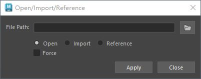

# 概述
[Open: Pasted image 20250805211433.png](attachments/4a1de80bf91d46498ed59ea83d420e8b_MD5.jpeg)

# 代码
```python
# -*- encoding: utf-8 -*-
"""
@File    :   maya_io_tool.py
@Time    :   2025/08/06 12:10:04
@Author  :   Charles Tian
@Version :   1.0
@Contact :   tianchao0533@gmail.com
@Desc    :   当前文件作用
"""

from PySide2 import QtCore, QtWidgets, QtGui
import maya.cmds as mc


class MayaIoDialog(QtWidgets.QDialog):
    """导入打开工具UI类"""

    # 用于保存窗口实例，实现窗口单例化
    _ui_instance = None

    # 定义文件过滤器，";;"分割
    FILE_FILTERS = (
        "Maya (*.ma *.mb);;Maya ASCII (*.ma);;Maya Binary (*.mb);; All Files (*.*)"
    )
    selected_filter = "Maya (*.ma *.mb)"

    def __init__(self, parent=None):
        """构造函数"""
        # 如果没有传入父窗口，则maya主窗口为父窗口
        if parent is None:
            parent = MayaIoDialog.maya_main_window()
        super().__init__(parent)

        self.setWindowTitle("Open/Import/Reference")
        self.setMinimumSize(400, 100)
        self.create_widgets()
        self.create_layouts()
        self.create_connections()

    @staticmethod
    def maya_main_window():
        """获取maya主界面的pyside实例"""
        app = QtWidgets.QApplication.instance()
        if app:
            for widget in app.topLevelWidgets():
                if widget.objectName() == "MayaWindow":
                    return widget
        return None

    def create_widgets(self):
        """创建部件"""
        self.file_path_line = QtWidgets.QLineEdit()
        self.select_file_bnt = QtWidgets.QPushButton()
        # fileOpen.png是maya内置图标
        self.select_file_bnt.setIcon(QtGui.QIcon(":fileOpen.png"))

        self.open_rb = QtWidgets.QRadioButton("Open")
        self.import_rb = QtWidgets.QRadioButton("Import")
        self.reference_rb = QtWidgets.QRadioButton("Reference")
        self.open_rb.setChecked(True)

        self.force_cb = QtWidgets.QCheckBox("Force")

        self.apply_btn = QtWidgets.QPushButton("Apply")
        self.close_btn = QtWidgets.QPushButton("Close")

    def create_layouts(self):
        """创建布局"""
        file_path_layout = QtWidgets.QHBoxLayout()
        file_path_layout.addWidget(self.file_path_line)
        file_path_layout.addWidget(self.select_file_bnt)

        rb_layout = QtWidgets.QHBoxLayout()
        rb_layout.addWidget(self.open_rb)
        rb_layout.addWidget(self.import_rb)
        rb_layout.addWidget(self.reference_rb)

        form_layout = QtWidgets.QFormLayout()
        form_layout.addRow("File Path: ", file_path_layout)
        form_layout.addRow("", rb_layout)
        form_layout.addRow("", self.force_cb)

        btn_layout = QtWidgets.QHBoxLayout()
        btn_layout.addStretch()
        btn_layout.addWidget(self.apply_btn)
        btn_layout.addWidget(self.close_btn)

        main_layout = QtWidgets.QVBoxLayout(self)
        main_layout.addLayout(form_layout)
        main_layout.addLayout(btn_layout)

    def create_connections(self):
        """创建连接"""
        self.select_file_bnt.clicked.connect(self.show_file_select_dialog)
        # 选择open_rb才会显示force_cb
        self.open_rb.toggled.connect(self.set_force_cb_visible)
        self.apply_btn.clicked.connect(self.load_file)
        self.close_btn.clicked.connect(self.close)

    # 槽函数
    @QtCore.Slot()
    def show_file_select_dialog(self):
        """显示文件选择对话"""
        # 获取之前的文件路径，如果没有则使用\Documents\maya
        file_path = self.file_path_line.text()
        if not file_path:
            file_path = mc.internalVar(userAppDir=True)
        """通过选择文件获取文件路径
        参数：
            parent：父窗口，
            caption：对话框的标题，
            directory：默认的目录路径，
            filter：文件过滤器，
            selectedFilter：默认选中的过滤器
            options：对话框行为，默认为0
        返回值：
            filename: 用户选择的文件路径（字符串）
            selectedFilter: 用户选择的过滤器（字符串）
        """
        file_path, self.selected_filter = QtWidgets.QFileDialog.getOpenFileName(
            self, "Select File", file_path, self.FILE_FILTERS, self.selected_filter
        )
        # 如果路径获取成功，问板框中显示路径文本
        if file_path:
            self.file_path_line.setText(file_path)

    @QtCore.Slot(bool)
    def set_force_cb_visible(self, checked):
        """设置force复选框显示"""
        self.force_cb.setVisible(checked)

    @QtCore.Slot()
    def load_file(self):
        """载入文件"""
        file_path = self.file_path_line.text()
        # 确保file_path存在且合法,并判断复选框选择操作
        if file_path and QtCore.QFileInfo(file_path).exists():
            if self.open_rb.isChecked():
                self.open_file(file_path)
            elif self.import_rb.isChecked():
                self.import_file(file_path)
            elif self.reference_rb.isChecked():
                self.reference_file(file_path)

    def open_file(self, file_path):
        """打开文件"""
        force = self.force_cb.isChecked()  # 是否勾选了force选项
        # 如果没有勾选force选项，且当前场景有未保存的修改，弹出询问对话框
        if not force and mc.file(query=True, modified=True):
            result = QtWidgets.QMessageBox.question(
                self, "Modified", "Current scene has unsaved changes,Continue?"
            )
            # 如果用户在询问对话框中选择了Yes，则force为True，否则直接返回
            # PySide6:QtWidgets.QMessageBox.standardButton.Yes
            if result == QtWidgets.QMessageBox.Yes:
                force = True
            else:
                return
        # 打开场景
        mc.file(file_path, open=True, ignoreVersion=True, force=force)

    def import_file(self, file_path):
        """代入文件"""
        # 因为import是一个python的关键字，所以这里的标志用"i"
        mc.file(file_path, i=True, ignoreVersion=True)

    def reference_file(self, file_path):
        """引用文件"""
        mc.file(file_path, reference=True, ignoreVersion=True)

    @classmethod
    def show_singleton_dialog(cls):
        """显示单例窗口"""
        # 如果窗口单例为空，则创建窗口单例
        if not cls._ui_instance:
            cls._ui_instance = cls()
        # 如果窗口单例被隐藏，则显示
        if cls._ui_instance.isHidden():
            cls._ui_instance.show()
        # 其他情况，抬升窗口并激活
        else:
            cls._ui_instance.raise_()
            cls._ui_instance.activateWindow()


if __name__ == "__main__":
    MayaIoDialog.show_singleton_dialog()

```