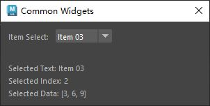

# 概述
`QComboBox` 是 PySide6（Qt for Python）中的一个控件，属于 `PySide6.QtWidgets` 模块。它是一个组合框控件，允许用户从下拉列表中选择一个选项，或者在可编辑模式下直接输入内容。`QComboBox` 常用于表单、设置界面或需要用户从预定义选项中选择的场景。以下是对 `QComboBox` 的详细介绍：

### 1. **功能概述**
- **用途**：`QComboBox` 提供了一个下拉菜单，显示多个选项供用户选择，适合需要节省空间但提供多个选项的界面。
- **特点**：
  - 支持下拉列表显示多个选项。
  - 可设置为可编辑（editable），允许用户输入自定义值。
  - 支持文本、图标和自定义数据。
  - 提供信号以响应用户选择或输入变化。
  - 支持动态添加、移除选项。
  - 可通过键盘（上下箭头）或鼠标（点击、滚轮）操作。

### 2. **主要方法**
以下是 `QComboBox` 的常用方法：
- **`addItem(text, userData=None)`**：添加一个选项，`text` 为显示文本，`userData` 为关联的自定义数据。
- **`addItems(texts)`**：添加多个选项（字符串列表）。
- **`insertItem(index, text, userData=None)`**：在指定索引插入选项。
- **`removeItem(index)`**：移除指定索引的选项。
- **`clear()`**：清除所有选项。
- **`count()`**：返回选项总数。
- **`currentIndex()`**：返回当前选中选项的索引（从 0 开始，若无选中返回 -1）。
- **`setCurrentIndex(index)`**：设置当前选中的选项索引。
- **`currentText()`**：返回当前选中的选项文本（或用户输入的文本）。
- **`setCurrentText(text)`**：设置当前显示的文本。
- **`itemText(index)`**：返回指定索引的选项文本。
- **`setItemText(index, text)`**：设置指定索引的选项文本。
- **`itemData(index, role=Qt.UserRole)`**：返回指定索引的自定义数据。
- **`setItemData(index, value, role=Qt.UserRole)`**：设置指定索引的自定义数据。
- **`setEditable(bool)`**：设置是否可编辑（允许用户输入自定义值）。
- **`setMaxVisibleItems(count)`**：设置下拉列表中可见的最大选项数。
- **`setMaxCount(count)`**：设置最大选项数。
- **`setIconSize(size)`**：设置选项图标的大小（`QSize`）。
- **`setItemIcon(index, icon)`**：为指定选项设置图标（`QIcon`）。
- **`setFrame(bool)`**：设置是否显示边框。

### 3. **信号**
`QComboBox` 提供以下常用信号：
- **`currentIndexChanged(int)`**：当当前选中的索引变化时触发，传递新索引。
- **`currentTextChanged(str)`**：当当前显示的文本变化时触发，传递新文本。
- **`activated(int)`**：当用户选择一个选项时触发（无论是否改变），传递索引。
- **`editTextChanged(str)`**：当可编辑模式下用户输入的文本变化时触发。
- **`highlighted(int)`**：当下拉列表中的选项被高亮（鼠标悬停或键盘导航）时触发。

### 4. **使用示例**
以下是一个 PySide6 示例，展示如何使用 `QComboBox` 创建一个下拉菜单，支持选择和可编辑模式，并显示当前选择：

```python
import sys
from PySide6.QtWidgets import (QApplication, QMainWindow, QComboBox, 
                              QVBoxLayout, QWidget, QLabel)
from PySide6.QtCore import Qt

class MainWindow(QMainWindow):
    def __init__(self):
        super().__init__()
        self.setWindowTitle("QComboBox 示例")
        
        # 创建主布局
        main_widget = QWidget()
        self.setCentralWidget(main_widget)
        layout = QVBoxLayout(main_widget)
        
        # 创建 QComboBox
        self.combo_box = QComboBox()
        self.combo_box.addItems(["选项 1", "选项 2", "选项 3"])  # 添加选项
        self.combo_box.setEditable(True)  # 启用可编辑模式
        self.combo_box.setMaxVisibleItems(5)  # 设置最大可见选项数
        
        # 创建标签显示当前选择
        self.label = QLabel("当前选择: 无")
        
        # 连接信号
        self.combo_box.currentTextChanged.connect(self.on_text_changed)
        self.combo_box.currentIndexChanged.connect(self.on_index_changed)
        
        # 添加控件到布局
        layout.addWidget(self.combo_box)
        layout.addWidget(self.label)
        
    def on_text_changed(self, text):
        self.label.setText(f"当前选择: {text}")
        
    def on_index_changed(self, index):
        print(f"当前索引: {index}")

if __name__ == "__main__":
    app = QApplication(sys.argv)
    window = MainWindow()
    window.show()
    sys.exit(app.exec())
```

### 5. **代码说明**
- **创建 QComboBox**：`self.combo_box = QComboBox()` 初始化组合框。
- **添加选项**：通过 `addItems` 添加三个选项。
- **可编辑模式**：`setEditable(True)` 允许用户输入自定义值。
- **信号处理**：`currentTextChanged` 信号更新标签显示当前文本，`currentIndexChanged` 信号打印当前索引。
- **布局**：使用 `QVBoxLayout` 组织 `QComboBox` 和标签。

### 6. **应用场景**
- **选项选择**：如选择语言、主题、文件类型等。
- **表单输入**：提供预定义选项，同时允许用户输入自定义值（如城市选择）。
- **导航控件**：与 `QStackedWidget` 结合，通过选择切换页面。
- **动态配置**：动态加载选项（如从数据库读取）。
- **搜索建议**：在可编辑模式下结合 `QCompleter` 实现自动补全。

### 7. **注意事项**
- **可编辑模式**：`setEditable(True)` 允许用户输入任意文本，需验证输入值有效性。
- **选项限制**：通过 `setMaxCount` 限制最大选项数，防止列表过长。
- **自定义数据**：使用 `setItemData` 存储额外信息（如 ID、对象），通过 `itemData` 访问。
- **性能**：大量选项可能影响下拉列表的加载速度，建议优化数据加载。
- **键盘导航**：支持上下箭头、Tab 键和首字母快速定位选项。
- **样式定制**：通过 `setStyleSheet` 自定义下拉框、选项或箭头外观。

### 8. **与 QSpinBox/QDoubleSpinBox 的区别**
- **`QComboBox`**：适合从预定义选项中选择或输入离散值，强调选择而非数值调整。
- **`QSpinBox`/`QDoubleSpinBox`**：适合输入连续数值，支持范围和步长调整。

### 9. **高级功能**
- **图标支持**：通过 `setItemIcon` 为选项添加图标，增强视觉效果。
- **自动补全**：结合 `QCompleter` 在可编辑模式下提供输入建议。
- **动态选项**：通过 `addItem`、`removeItem` 或 `clear` 动态管理选项。
- **自定义模型**：使用 `setModel` 结合 `QStringListModel` 或自定义模型实现复杂数据管理。
- **事件处理**：可重写 `keyPressEvent` 或 `wheelEvent` 实现自定义交互。

如果需要更复杂的示例（如添加图标、实现自动补全、与 `QStackedWidget` 联动等），请告诉我！
# 案例
- 主要介绍下拉框控件的使用，下拉框选择发生改变时可以通过：
	- `combo_box.currentTextChanged`
	- `combo_box.currentIndexChanged`
	- `combo_box.currentData`
- 信号传递信息到槽函数
- [Open: Pasted image 20250806163619.png](attachments/9badfd0f1483e55205bdc4cebef6d2dd_MD5.jpeg)

# 代码
```python
from PySide2 import QtCore, QtWidgets, QtGui
import maya.cmds as mc


class ToolDialog(QtWidgets.QDialog):
    """工具UI类"""

    # 用于保存窗口实例，实现窗口单例化
    _ui_instance = None

    def __init__(self, parent=None):
        """构造函数"""
        # 如果没有传入父窗口，则maya主窗口为父窗口
        if parent is None:
            parent = ToolDialog.maya_main_window()
        super().__init__(parent)

        self.setWindowTitle("Common Widgets")
        self.setMinimumSize(300, 120)
        self.create_widgets()
        self.create_layouts()
        self.create_connections()
        # 更新下拉框的数据给窗口下部的标签
        self.update_text(self.combo_box.currentText())
        self.update_index(self.combo_box.currentIndex())

    @staticmethod
    def maya_main_window():
        """获取maya主界面的pyside实例"""
        app = QtWidgets.QApplication.instance()
        if app:
            for widget in app.topLevelWidgets():
                if widget.objectName == "MayaWindow":
                    return widget
        return None

    def create_widgets(self):
        """创建部件"""
        # 创建下拉框控件
        self.combo_box = QtWidgets.QComboBox()
        # 为下拉框控件添加选项，可附加数据传递到槽函数
        self.combo_box.addItem("Item 01", 22)
        self.combo_box.addItem("Item 02", "CharlesTian")
        self.combo_box.addItem("Item 03", [3, 6, 9])
        self.combo_box.addItem("Item 04", self)
        # 创建标签用于显示下拉框数据
        self.text_label = QtWidgets.QLabel()
        self.index_label = QtWidgets.QLabel()
        self.data_label = QtWidgets.QLabel()

    def create_layouts(self):
        """创建布局"""
        combo_box_layout = QtWidgets.QHBoxLayout()
        combo_box_layout.setContentsMargins(0, 0, 0, 0)
        combo_box_layout.addWidget(QtWidgets.QLabel("Item Select: "))
        combo_box_layout.addWidget(self.combo_box)
        combo_box_layout.addStretch()

        main_layout = QtWidgets.QVBoxLayout(self)
        main_layout.addLayout(combo_box_layout)
        main_layout.addStretch()
        main_layout.addWidget(self.text_label)
        main_layout.addWidget(self.index_label)
        main_layout.addWidget(self.data_label)

    def create_connections(self):
        """创建连接"""
        self.combo_box.currentTextChanged.connect(self.update_text)
        self.combo_box.currentIndexChanged.connect(self.update_index)

    # 槽函数
    @QtCore.Slot(str)
    def update_text(self, text):
        self.text_label.setText(f"Selected Text: {text}")
        data = self.combo_box.currentData()
        self.data_label.setText(f"Selected Data: {data}")

    @QtCore.Slot(int)
    def update_index(self, index):
        self.index_label.setText(f"Selected Index: {index}")

    # 创建单例窗口
    @classmethod
    def show_singleton_dialog(cls):
        """显示单例窗口"""
        # 如果窗口单例为空，则创建窗口单例
        if not cls._ui_instance:
            cls._ui_instance = ToolDialog()
        # 如果窗口单例被隐藏，则显示
        if cls._ui_instance.isHidden():
            cls._ui_instance.show()
        # 其他情况，抬升窗口并激活
        else:
            cls._ui_instance.raise_()
            cls._ui_instance.activateWindow()


if __name__ == "__main__":
    ToolDialog.show_singleton_dialog()

```