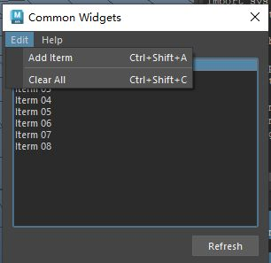

# 概述
`QMenuBar` 是 PySide6（Qt for Python）中的一个控件，属于 `PySide6.QtWidgets` 模块。它是一个菜单栏控件，通常用于在窗口顶部提供下拉菜单，允许用户通过菜单项触发操作。`QMenuBar` 常用于应用程序主窗口（如 `QMainWindow`），为用户提供直观的命令访问方式。以下是对 `QMenuBar` 的详细介绍：

### 1. **功能概述**
- **用途**：`QMenuBar` 用于创建和管理应用程序的菜单栏，包含多个下拉菜单（如“文件”、“编辑”、“帮助”），每个菜单包含菜单项（`QAction`）以执行操作。
- **特点**：
  - 支持嵌套子菜单。
  - 可添加分隔符、快捷键、图标等。
  - 提供信号以响应用户交互。
  - 自动适配平台风格（如 Windows、macOS）。
  - 与 `QMainWindow` 集成紧密，通过 `setMenuBar` 设置。

### 2. **主要方法**
以下是 `QMenuBar` 的常用方法：
- **`addMenu(title)`**：添加一个新菜单，返回 `QMenu` 对象，`title` 为菜单名称。
- **`addMenu(QMenu)`**：添加一个现有的 `QMenu` 对象。
- **`addAction(action)`**：直接添加一个动作（`QAction`）到菜单栏（不创建子菜单）。
- **`addSeparator()`**：添加分隔符到菜单栏。
- **`clear()`**：移除所有菜单和动作。
- **`activeAction()`**：返回当前激活的动作（`QAction`）。
- **`setCornerWidget(widget, corner=Qt.TopRightCorner)`**：在菜单栏的指定角落添加控件（如按钮）。
- **`actionAt(point)`**：返回指定位置的动作（`QPoint`）。
- **`menuAction()`**：返回菜单栏关联的 `QAction`（用于动态操作）。

### 3. **相关类：QMenu 和 QAction**
- 导入
	- PySide2：`from PySide2.QtWidgets import QAction`
	- PySide6：`from PySide6.QtGui import QAction`
- **`QMenu`**：
  - **功能**：表示下拉菜单，包含多个 `QAction`。
  - **常用方法**：
    - `addAction(text)`：添加菜单项，返回 `QAction`。
    - `addMenu(title)`：添加子菜单，返回 `QMenu`。
    - `addSeparator()`：添加分隔符。
    - `popup(pos)`：在指定位置弹出菜单（用于上下文菜单）。
  - **信号**：`triggered(QAction)`（菜单项被触发时）、`hovered(QAction)`（菜单项被高亮时）。
- **`QAction`**：
  - **功能**：表示菜单项或工具栏按钮的动作，包含文本、图标、快捷键等。
  - **常用方法**：
    - `setText(text)`：设置动作文本。
    - `setShortcut(QKeySequence)`：设置快捷键（如 `Ctrl+S`）。
    - `setIcon(QIcon)`：设置图标。
    - `setCheckable(bool)`：设置为可选中（复选框样式）。
    - `setChecked(bool)`：设置选中状态。
    - `setEnabled(bool)`：启用/禁用动作。
  - **信号**：`triggered(bool)`（动作被触发时）。

### 4. **信号**
`QMenuBar` 提供以下常用信号：
- **`triggered(QAction)`**：当菜单项被触发时，传递被触发的动作。
- **`hovered(QAction)`**：当鼠标悬停在菜单项上时，传递高亮的动作。

### 5. **使用示例**
以下是一个 PySide6 示例，展示如何使用 `QMenuBar` 在主窗口中创建菜单栏，包含“文件”和“编辑”菜单，支持动作触发：

```python
import sys
from PySide6.QtWidgets import (QApplication, QMainWindow, QMenuBar, QLabel)
from PySide6.QtGui import QAction  # Import QAction from QtGui
from PySide6.QtCore import Qt

class MainWindow(QMainWindow):
    def __init__(self):
        super().__init__()
        self.setWindowTitle("QMenuBar 示例")
        
        # 创建菜单栏
        menu_bar = QMenuBar()
        self.setMenuBar(menu_bar)
        
        # 创建“文件”菜单
        file_menu = menu_bar.addMenu("文件")
        
        # 添加动作到“文件”菜单
        new_action = QAction("新建", self)
        new_action.setShortcut("Ctrl+N")
        new_action.triggered.connect(self.on_new)
        
        open_action = QAction("打开", self)
        open_action.setShortcut("Ctrl+O")
        open_action.triggered.connect(self.on_open)
        
        exit_action = QAction("退出", self)
        exit_action.setShortcut("Ctrl+Q")
        exit_action.triggered.connect(self.close)
        
        file_menu.addAction(new_action)
        file_menu.addAction(open_action)
        file_menu.addSeparator()
        file_menu.addAction(exit_action)
        
        # 创建“编辑”菜单
        edit_menu = menu_bar.addMenu("编辑")
        
        # 添加子菜单
        format_menu = edit_menu.addMenu("格式")
        bold_action = QAction("加粗", self)
        bold_action.setCheckable(True)
        bold_action.triggered.connect(self.on_bold)
        format_menu.addAction(bold_action)
        
        # 创建中心标签显示动作
        self.label = QLabel("未触发任何动作", self)
        self.setCentralWidget(self.label)
        
    def on_new(self):
        self.label.setText("触发了 新建 动作")
        
    def on_open(self):
        self.label.setText("触发了 打开 动作")
        
    def on_bold(self, checked):
        self.label.setText(f"加粗: {'开启' if checked else '关闭'}")

if __name__ == "__main__":
    app = QApplication(sys.argv)
    window = MainWindow()
    window.show()
    sys.exit(app.exec())
```

### 6. **代码说明**
- **创建 QMenuBar**：`menu_bar = QMenuBar()` 初始化菜单栏，并通过 `setMenuBar` 设置为主窗口的菜单栏。
- **添加菜单**：`addMenu("文件")` 创建“文件”菜单，返回 `QMenu` 对象。
- **添加动作**：通过 `QAction` 创建菜单项，设置文本、快捷键，并连接 `triggered` 信号。
- **子菜单**：在“编辑”菜单中通过 `addMenu("格式")` 创建子菜单。
- **分隔符**：`addSeparator()` 在“文件”菜单中添加分隔线。
- **信号处理**：动作触发时更新中心标签显示信息。

### 7. **应用场景**
- **应用程序主菜单**：如文本编辑器的“文件”、“编辑”、“查看”菜单。
- **上下文菜单**：通过 `QMenu` 的 `popup` 方法实现右键菜单。
- **工具栏集成**：`QAction` 可同时用于菜单和工具栏（`QToolBar`）。
- **设置快捷键**：为常用操作（如保存、复制）分配快捷键。
- **动态菜单**：动态添加/移除菜单项（如最近打开的文件列表）。

### 8. **注意事项**
- **与 QMainWindow 集成**：`QMenuBar` 通常通过 `QMainWindow.setMenuBar` 设置，自动适应窗口顶部。
- **平台差异**：在 macOS 上，菜单栏可能显示在屏幕顶部（系统菜单栏），需测试跨平台行为。
- **动作复用**：`QAction` 可在多个菜单或工具栏中复用，统一管理操作逻辑。
- **样式定制**：通过 `setStyleSheet` 自定义菜单栏或菜单项外观。
- **性能**：大量菜单项可能影响响应速度，建议优化动态加载。
- **快捷键**：确保快捷键不冲突，遵循平台惯例（如 `Ctrl+S` 保存）。

### 9. **与 QToolBar 的区别**
- **`QMenuBar`**：位于窗口顶部，提供下拉菜单，适合组织大量操作。
- **`QToolBar`**：提供快捷按钮，通常位于菜单栏下方，适合常用操作。

### 10. **高级功能**
- **动态菜单**：通过 `addAction` 或 `removeAction` 动态管理菜单项。
- **图标支持**：通过 `QAction.setIcon` 为菜单项添加图标。
- **上下文菜单**：使用 `QMenu.popup` 在右键点击时显示菜单。
- **复选菜单项**：通过 `QAction.setCheckable(True)` 实现开关式菜单项。
- **自定义控件**：通过 `setCornerWidget` 在菜单栏添加按钮或其他控件。

如果需要更复杂的示例（如动态菜单、上下文菜单、结合工具栏等），请告诉我！
# 案例
- 为UI添加菜单栏，并制定菜单项目并执行操作
[Open: Pasted image 20250807155627.png](attachments/287a267f9cc7e46b3805ed53fef0cf5e_MD5.jpeg)

# 代码
```python
from PySide2 import QtCore, QtWidgets, QtGui

"""
from PySide6.QtGui import QAction
"""


class ToolDialog(QtWidgets.QDialog):
    """工具UI类"""

    # 用于保存窗口实例，实现窗口单例化
    _ui_instance = None

    def __init__(self, parent=None):
        """构造函数"""
        # 如果没有传入父窗口，则maya主窗口为父窗口
        if parent is None:
            parent = ToolDialog.maya_main_window()
        super().__init__(parent)

        self.setWindowTitle("Common Widgets")
        self.setMinimumSize(300, 140)

        self.create_actions()  # 调用创建事件函数

        self.create_widgets()
        self.create_layouts()
        self.create_connections()

    def create_actions(self):
        """创建菜单栏的菜单项"""
        # 添加菜单项
        self.add_iterm_action = QtWidgets.QAction("Add Iterm")
        # 为菜单项添加快捷键
        self.add_iterm_action.setShortcut(QtGui.QKeySequence("Ctrl+Shift+A"))
        # 添加菜单项
        self.clear_action = QtWidgets.QAction("Clear All")
        # 为菜单项添加快捷键
        self.clear_action.setShortcut(QtGui.QKeySequence("Ctrl+Shift+C"))

        self.about_action = QtWidgets.QAction("About...")

    def create_widgets(self):
        """创建控件"""
        # 创建菜单栏
        self.menu_bar = QtWidgets.QMenuBar()
        # 为菜单栏添加菜单
        edit_menu = self.menu_bar.addMenu("Edit")  # 添加Edit菜单
        # 为菜单添加项目
        edit_menu.addAction(self.add_iterm_action)  # 为菜单添加菜单项
        edit_menu.addSeparator()  # 为菜单添加分割线
        edit_menu.addAction(self.clear_action)  # 为菜单添加菜单项
        # 为菜单栏添加菜单
        help_menu = self.menu_bar.addMenu("Help")  # 添加Help菜单
        # 为菜单添加项目
        help_menu.addAction(self.about_action)

        # 创建列表控件,并添加项
        self.list_widget = QtWidgets.QListWidget()
        self.list_widget.setSelectionMode(QtWidgets.QAbstractItemView.ExtendedSelection)
        self.list_widget.addItem("Iterm 01")
        self.list_widget.addItem("Iterm 02")
        self.list_widget.addItem("Iterm 03")
        self.list_widget.addItem("Iterm 04")
        self.list_widget.addItem("Iterm 05")
        self.list_widget.addItem("Iterm 06")
        self.list_widget.addItem("Iterm 07")
        self.list_widget.addItem("Iterm 08")
        self.list_widget.setCurrentRow(0)

        # 创建Refresh按钮控件
        self.refresh_btn = QtWidgets.QPushButton("Refresh")

    def create_layouts(self):
        """创建布局"""
        btn_layout = QtWidgets.QHBoxLayout()
        btn_layout.addStretch()
        btn_layout.addWidget(self.refresh_btn)

        main_layout = QtWidgets.QVBoxLayout(self)
        main_layout.setMenuBar(self.menu_bar)  # 主布局设置菜单栏
        main_layout.addWidget(self.list_widget)
        main_layout.addLayout(btn_layout)

    def create_connections(self):
        """创建连接
        点击菜单项目，出发槽函数
        """
        self.add_iterm_action.triggered.connect(self.add_item)
        self.clear_action.triggered.connect(self.list_widget.clear)

    @QtCore.Slot()
    def add_item(self):
        """添加列表控件的项，每次添加，项目名称自增1"""
        # zfill:用 0 填充左侧的数字字符串，以填充指定宽度2的字段
        item_num = f"{self.list_widget.count() + 1}".zfill(2)
        self.list_widget.addItem(f"Item {item_num}")

    def keyPressEvent(self, event):
        """重写keyPressEvent函数，在使用该工具时避免误操作maya
        比如按下键盘“s”键导致剋帧
        """
        pass

    @staticmethod
    def maya_main_window():
        """获取maya主界面的pyside实例"""
        app = QtWidgets.QApplication.instance()
        if app:
            for widget in app.topLevelWidgets():
                if widget.objectName() == "MayaWindow":
                    return widget
        return None

    # 创建单例窗口
    @classmethod
    def show_singleton_dialog(cls):
        """显示单例窗口"""
        # 如果窗口单例为空，则创建窗口单例
        if not cls._ui_instance:
            cls._ui_instance = cls()
        # 如果窗口单例被隐藏，则显示
        if cls._ui_instance.isHidden():
            cls._ui_instance.show()
        # 其他情况，抬升窗口并激活
        else:
            cls._ui_instance.raise_()
            cls._ui_instance.activateWindow()


if __name__ == "__main__":
    ToolDialog.show_singleton_dialog()

```