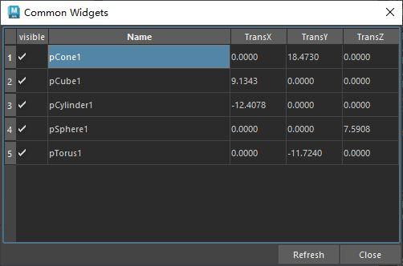

# 概述
QTableWidget 是 PySide（Qt for Python）库中的一个控件，用于创建和操作表格（Table）。它是 PySide.QtWidgets 模块中的一个类，适合用于显示和管理二维数据，类似于电子表格。以下是对 QTableWidget 的详细介绍：

### 1. **概述**
QTableWidget 是一个基于单元格的表格控件，继承自 QTableView。它提供了一个用户友好的界面，允许开发者轻松创建表格，设置行和列，填充数据，并支持用户交互（如选择、编辑单元格等）。与 QTableView 相比，QTableWidget 更简单易用，适合快速开发简单的表格应用，而 QTableView 更适合需要复杂数据模型的场景。

### 2. **主要特性**
- **网格结构**：支持任意行和列的表格，单元格可以包含文本、数字、图标或其他控件（如按钮、复选框等）。
- **内置编辑功能**：用户可以直接编辑单元格内容（如果启用了编辑）。
- **选择和排序**：支持单元格、行或列的选择，并内置了排序功能。
- **自定义性**：支持自定义单元格的外观、行为和内容（如设置字体、颜色、对齐方式等）。
- **信号和槽**：提供丰富的信号（如单元格点击、双击、内容更改等），便于响应用户操作。
- **表头**：支持水平和垂直表头，可自定义标题内容和样式。

### 3. **基本用法**
以下是一个简单的 PySide6 程序示例，展示如何创建和使用 QTableWidget：

```python
from PySide6.QtWidgets import QApplication, QTableWidget, QTableWidgetItem, QMainWindow
import sys

class MainWindow(QMainWindow):
    def __init__(self):
        super().__init__()
        self.setWindowTitle("QTableWidget 示例")

        # 创建 QTableWidget，设置 4 行 3 列
        table = QTableWidget()
        table.setRowCount(4)
        table.setColumnCount(3)

        # 设置表头
        table.setHorizontalHeaderLabels(["姓名", "年龄", "职业"])

        # 填充数据
        table.setItem(0, 0, QTableWidgetItem("Alice"))
        table.setItem(0, 1, QTableWidgetItem("25"))
        table.setItem(0, 2, QTableWidgetItem("工程师"))
        table.setItem(1, 0, QTableWidgetItem("Bob"))
        table.setItem(1, 1, QTableWidgetItem("30"))
        table.setItem(1, 2, QTableWidgetItem("设计师"))

        # 连接信号到槽
        table.itemClicked.connect(self.on_item_clicked)

        # 设置主窗口的中心控件
        self.setCentralWidget(table)

    def on_item_clicked(self, item):
        print(f"点击了单元格：{item.text()}")

if __name__ == "__main__":
    app = QApplication(sys.argv)
    window = MainWindow()
    window.show()
    sys.exit(app.exec())
```

### 4. **常用方法**
以下是 QTableWidget 的一些常用方法：
- **设置行和列**：
  - `setRowCount(rows)`：设置表格的行数。
  - `setColumnCount(cols)`：设置表格的列数。
- **设置表头**：
  - `setHorizontalHeaderLabels(labels)`：设置水平表头标签。
  - `setVerticalHeaderLabels(labels)`：设置垂直表头标签。
- **操作单元格**：
  - `setItem(row, col, QTableWidgetItem)`：设置指定位置的单元格内容。
  - `item(row, col)`：获取指定位置的单元格对象。
  - `setCellWidget(row, col, widget)`：在单元格中放置一个控件（如按钮、复选框等）。
- **选择和编辑**：
  - `setEditTriggers(triggers)`：设置编辑触发方式（如双击编辑、按键编辑等）。
  - `setSelectionMode(mode)`：设置选择模式（单选、多选、整行选择等）。
- **样式和调整**：
  - `resizeColumnsToContents()`：自动调整列宽以适应内容。
  - `resizeRowsToContents()`：自动调整行高以适应内容。
  - `setStyleSheet(style)`：设置表格的 CSS 样式。

### 5. **信号**
QTableWidget 提供了多种信号，用于响应用户交互：
- `itemClicked(QTableWidgetItem)`：当单元格被点击时触发。
- `itemDoubleClicked(QTableWidgetItem)`：当单元格被双击时触发。
- `itemChanged(QTableWidgetItem)`：当单元格内容更改时触发。
- `cellActivated(row, col)`：当单元格被激活时触发。
- `currentCellChanged(currentRow, currentCol, previousRow, previousCol)`：当前选中的单元格发生变化时触发。

### 6. **高级功能**
- **自定义单元格**：通过 `setCellWidget()`，可以在单元格中嵌入其他控件（如 QComboBox、QPushButton 等）。
- **排序**：调用 `setSortingEnabled(True)` 启用表头点击排序功能。
- **合并单元格**：使用 `setSpan(row, col, rowSpan, colSpan)` 合并单元格。
- **拖拽支持**：支持拖放操作（需要额外配置）。
- **样式自定义**：通过 QStyle 或 CSS 样式表自定义表格外观。

### 7. **注意事项**
- **性能**：QTableWidget 适合中小型表格。如果数据量很大（如数千行），建议使用 QTableView 配合自定义数据模型（如 QAbstractTableModel），以提高性能。
- **内存管理**：每个单元格的 QTableWidgetItem 都会占用内存，需注意数据量较大的场景。
- **线程安全**：QTableWidget 是 GUI 控件，不能在非主线程中直接操作，需通过信号和槽机制更新。

### 8. **应用场景**
- 显示表格数据，如数据库查询结果。
- 创建交互式表单，允许用户编辑内容。
- 实现简单的电子表格功能。
- 展示带有控件（如按钮、复选框）的复杂表格。

### 9. **与 QTableView 的对比**
- **QTableWidget**：直接操作单元格，易于使用，适合简单场景。
- **QTableView**：基于 MVC（模型-视图-控制器）架构，适合复杂数据管理和动态更新。

### 10. **参考资源**
- 官方文档：PySide6 的 Qt 文档（https://doc.qt.io/qtforpython/）。
- 示例代码：Qt 提供的示例项目或 PySide6 的 GitHub 仓库。

# 案例

[Open: Pasted image 20250808114843.png](attachments/1bd47e3de2a90c7b3afff8049ebfbbd6_MD5.jpeg)

- 是一个场景内Mesh对象的显示表格，显示其：显示/隐藏， 名称， X轴位移，Y轴位移，Z轴位移
- 可通过修改该表格的项来修改maya对象的对应属性
- 表格中的每个项目都包含：
	- text（表格显示）。来自控件
	- attr_name（属性名称），attr_val（属性值）。来自数据（data）
## 代码
```python
from PySide2 import QtCore, QtWidgets, QtGui
import pymel.core as pm
from enum import IntEnum


class ToolDialog(QtWidgets.QDialog):
    """工具UI类"""

    _ui_instance = None

    # 使用枚举定义列索引，提高可读性和可维护性
    class TableColumn(IntEnum):
        VISIBILITY = 0
        NAME = 1
        TRANS_X = 2
        TRANS_Y = 3
        TRANS_Z = 4

    # 常量
    ATTR_ROLE = QtCore.Qt.UserRole  # 256
    VALUE_ROLE = QtCore.Qt.UserRole + 1  # 257

    def __init__(self, parent=None):
        if parent is None:
            parent = ToolDialog.maya_main_window()
        super().__init__(parent)

        self.setWindowTitle("Common Widgets")
        self.setMinimumSize(500, 300)

        self.create_widgets()
        self.create_layouts()
        self.create_connections()

    def create_widgets(self):
        """创建控件"""
        self.table_wgt = QtWidgets.QTableWidget()
        self.table_wgt.setColumnCount(len(self.TableColumn))  # 使用枚举长度设置列数

        # 使用枚举设置列宽和表头
        self.table_wgt.setColumnWidth(self.TableColumn.VISIBILITY, 40)
        self.table_wgt.setColumnWidth(self.TableColumn.TRANS_X, 70)
        self.table_wgt.setColumnWidth(self.TableColumn.TRANS_Y, 70)
        self.table_wgt.setColumnWidth(self.TableColumn.TRANS_Z, 70)

        header_labels = ["Visible", "Name", "TransX", "TransY", "TransZ"]
        self.table_wgt.setHorizontalHeaderLabels(header_labels)

        header_view = self.table_wgt.horizontalHeader()
        header_view.setSectionResizeMode(
            self.TableColumn.NAME, QtWidgets.QHeaderView.Stretch
        )

        self.refresh_btn = QtWidgets.QPushButton("Refresh")
        self.close_btn = QtWidgets.QPushButton("Close")

    def create_layouts(self):
        """创建布局"""
        btn_layout = QtWidgets.QHBoxLayout()
        btn_layout.setSpacing(2)
        btn_layout.addStretch()
        btn_layout.addWidget(self.refresh_btn)
        btn_layout.addWidget(self.close_btn)

        main_layout = QtWidgets.QVBoxLayout(self)
        main_layout.setContentsMargins(2, 2, 2, 2)
        main_layout.setSpacing(2)
        main_layout.addWidget(self.table_wgt)
        main_layout.addLayout(btn_layout)

    def create_connections(self):
        """创建连接"""
        self.table_wgt.cellChanged.connect(self.on_cell_changed)
        self.refresh_btn.clicked.connect(self.refresh_table)
        self.close_btn.clicked.connect(self.close)

    @QtCore.Slot()
    def refresh_table(self):
        """刷新表格，显示场景中所有Mesh的信息"""
        was_blocked = self.table_wgt.blockSignals(True)
        try:
            self.table_wgt.setRowCount(0)
            meshes = pm.ls(type="mesh")
            for i, mesh in enumerate(meshes):
                transform = mesh.getParent()
                if not transform:
                    continue

                transform_name = transform.getName()
                translation = transform.getTranslation()
                tx, ty, tz = translation
                visible = transform.visibility.get()

                self.table_wgt.insertRow(i)

                # 使用数据驱动的方式填充表格，减少代码重复
                column_data = [
                    {
                        "col": self.TableColumn.VISIBILITY,
                        "text": "",
                        "attr": "visibility",
                        "val": visible,
                        "is_bool": True,
                    },
                    {
                        "col": self.TableColumn.NAME,
                        "text": transform_name,
                        "attr": None,
                        "val": transform_name,
                        "is_bool": False,
                    },
                    {
                        "col": self.TableColumn.TRANS_X,
                        "text": f"{tx:.4f}",
                        "attr": "tx",
                        "val": tx,
                        "is_bool": False,
                    },
                    {
                        "col": self.TableColumn.TRANS_Y,
                        "text": f"{ty:.4f}",
                        "attr": "ty",
                        "val": ty,
                        "is_bool": False,
                    },
                    {
                        "col": self.TableColumn.TRANS_Z,
                        "text": f"{tz:.4f}",
                        "attr": "tz",
                        "val": tz,
                        "is_bool": False,
                    },
                ]

                for data in column_data:
                    self.insert_item(
                        row=i,
                        column=data["col"],
                        text=data["text"],
                        attr_name=data["attr"],
                        attr_value=data["val"],
                        is_bool=data["is_bool"],
                    )
        finally:
            self.table_wgt.blockSignals(was_blocked)

    @QtCore.Slot()
    def on_cell_changed(self, row, column):
        """槽函数，当表格项目被修改时触发"""
        was_blocked = self.table_wgt.blockSignals(True)
        try:
            item = self.table_wgt.item(row, column)
            if not item:
                return

            # 使用枚举判断列类型
            if column == self.TableColumn.NAME:
                self.rename_maya_node(item)
            else:
                is_bool = column == self.TableColumn.VISIBILITY
                full_attr_name = self.get_full_attr_name(row, column)
                if full_attr_name:
                    self.update_maya_attr(full_attr_name, item, is_bool)

        finally:
            self.table_wgt.blockSignals(was_blocked)
            print(f"Row: {row}, Column: {column} was changed.")

    def insert_item(self, row, column, text, attr_name, attr_value, is_bool):
        """为TableWidget插入项目"""
        item = QtWidgets.QTableWidgetItem(text)
        self.set_item_attr(item=item, attr=attr_name)
        self.set_item_val(item=item, val=attr_value)

        if is_bool:
            item.setFlags(QtCore.Qt.ItemIsUserCheckable | QtCore.Qt.ItemIsEnabled)
            self.set_item_checked(item=item, checked=attr_value)

        self.table_wgt.setItem(row, column, item)

    def rename_maya_node(self, item):
        """根据表格输入重命名Maya节点"""
        old_name = self.get_item_val(item)
        new_name = self.get_item_text(item)

        if not new_name or new_name == old_name:
            return

        try:
            # 增加节点存在性检查
            if not pm.objExists(old_name):
                raise RuntimeError(f"节点 '{old_name}' 已不存在于场景中。")

            old_name_obj = pm.PyNode(old_name)
            actual_new_name = pm.rename(old_name_obj, new_name).name()

            # 如果Maya自动重命名（例如添加了数字后缀），则更新UI
            if actual_new_name != new_name:
                self.set_item_text(item, actual_new_name)

            self.set_item_val(item, actual_new_name)
        except Exception as e:
            QtWidgets.QMessageBox.warning(self, "错误", f"重命名失败: {str(e)}")
            self.set_item_text(item, old_name)  # 失败后恢复旧名称

    def update_maya_attr(self, full_attr_name, item, is_bool):
        """更新Maya节点属性"""
        try:
            if not pm.objExists(full_attr_name):
                raise RuntimeError(f"属性 '{full_attr_name}' 已不存在。")

            maya_attr = pm.PyNode(full_attr_name)

            if is_bool:
                value = self.is_item_checked(item)
                self.set_item_text(item, "")
            else:
                text = self.get_item_text(item)
                try:
                    value = float(text)
                except (ValueError, TypeError):
                    self.revert_original_value(item, is_bool=False)
                    return

            maya_attr.set(value)
            self.set_item_val(item, value)  # 成功后更新存储的原始值

        except Exception as e:
            QtWidgets.QMessageBox.warning(self, "属性设置错误", str(e))
            self.revert_original_value(item, is_bool)
            print(e)

    # --- 辅助函数 (无需修改) ---
    def set_item_text(self, item, text):
        item.setText(text)

    def get_item_text(self, item):
        return item.text()

    def set_item_checked(self, item, checked):
        item.setCheckState(QtCore.Qt.Checked if checked else QtCore.Qt.Unchecked)

    def is_item_checked(self, item):
        return item.checkState() == QtCore.Qt.Checked

    def set_item_attr(self, item, attr):
        item.setData(self.ATTR_ROLE, attr)

    def get_item_attr(self, item):
        return item.data(self.ATTR_ROLE)

    def set_item_val(self, item, val):
        item.setData(self.VALUE_ROLE, val)

    def get_item_val(self, item):
        return item.data(self.VALUE_ROLE)

    def get_full_attr_name(self, row, column):
        """获取完整的节点.属性名称"""
        try:
            # name_item 在 TableColumn.NAME 列
            name_item = self.table_wgt.item(row, self.TableColumn.NAME)
            attr_item = self.table_wgt.item(row, column)
            if not name_item or not attr_item:
                return None

            node_name = self.get_item_val(name_item)
            attr_name = self.get_item_attr(attr_item)
            return f"{node_name}.{attr_name}" if node_name and attr_name else None
        except Exception:
            return None

    def revert_original_value(self, item, is_bool):
        """将单元格的值还原为其存储的原始值"""
        original_val = self.get_item_val(item=item)
        if is_bool:
            self.set_item_checked(item, original_val)
        else:
            self.set_item_text(item, f"{original_val:.4f}")

    # --- 重写父类函数 ---
    def keyPressEvent(self, event: QtGui.QKeyEvent):
        """重写keyPressEvent，允许Maya处理快捷键"""
        super().keyPressEvent(event)
        event.ignore()  # 关键改动：忽略事件，传递给父控件

    def showEvent(self, event):
        """重写窗口开启时执行的函数"""
        self.refresh_table()
        super().showEvent(event)

    # --- 静态和类方法 (无需修改) ---
    @staticmethod
    def maya_main_window():
        app = QtWidgets.QApplication.instance()
        if app:
            for widget in app.topLevelWidgets():
                if widget.objectName() == "MayaWindow":
                    return widget
        return None

    @classmethod
    def show_singleton_dialog(cls):
        if not cls._ui_instance:
            cls._ui_instance = cls()

        if cls._ui_instance.isHidden():
            cls._ui_instance.show()
        else:
            cls._ui_instance.raise_()
            cls._ui_instance.activateWindow()


if __name__ == "__main__":
    # 在Maya Script Editor中运行时，为了防止旧实例残留，可以先尝试关闭
    try:
        if ToolDialog._ui_instance:
            ToolDialog._ui_instance.close()
            ToolDialog._ui_instance.deleteLater()
    except Exception:
        pass

    ToolDialog.show_singleton_dialog()


```