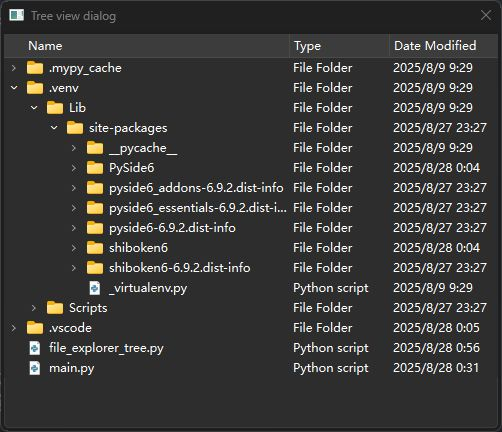
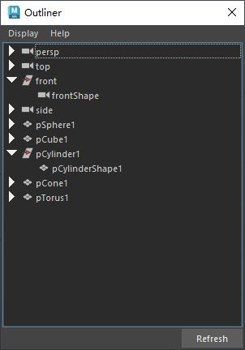

# 概述

QTreeWidget 是 PySide（Qt for Python）中用于显示树形结构数据的控件，继承自 QTreeView，适合展示具有层级关系的数据，例如文件系统、目录结构或组织架构。它提供了一个易于使用的界面来创建、操作和管理树形结构的条目（QTreeWidgetItem）。

### 主要特点
1. **树形结构**：支持多层级节点（父节点和子节点），每个节点可以包含多个列。
2. **内置功能**：支持排序、拖放、选择、展开/折叠等功能，开箱即用。
3. **灵活性**：可以通过 QTreeWidgetItem 自定义节点内容，支持图标、文本、复选框等。
4. **信号与槽**：提供丰富的信号（如 itemClicked、itemDoubleClicked 等）来响应用户交互。

### 基本用法
以下是一个简单的 PySide6 中使用 QTreeWidget 的示例代码，展示如何创建树形结构并添加节点：

```python
import sys
from PySide6.QtWidgets import QApplication, QTreeWidget, QTreeWidgetItem, QMainWindow


class MainWindow(QMainWindow):
    def __init__(self):
        super().__init__()
        self.setWindowTitle("QTreeWidget 示例")

        # 创建 QTreeWidget
        tree = QTreeWidget()
        tree.setHeaderLabels(["名称", "类型"])  # 设置表头
        tree.setColumnCount(2)  # 设置列数

        # 创建根节点
        parent = QTreeWidgetItem(tree)
        parent.setText(0, "根节点")
        parent.setText(1, "文件夹")

        # 创建子节点
        child1 = QTreeWidgetItem(parent)
        child1.setText(0, "子节点1")
        child1.setText(1, "文件")
		# 也可以将父控件和文本同时传入构造函数
        child2 = QTreeWidgetItem(parent, ["子节点2", "文件"])

        # 将 QTreeWidget 设置为中心部件
        self.setCentralWidget(tree)

        # 连接信号
        tree.itemClicked.connect(self.on_item_clicked)

    def on_item_clicked(self, item, column):
        print(f"点击了: {item.text(0)} 在列 {column}")


if __name__ == "__main__":
    app = QApplication(sys.argv)
    window = MainWindow()
    window.show()
    sys.exit(app.exec())

```

### 核心组件
1. **QTreeWidgetItem**：
   - 表示树中的一个节点，可以是根节点或子节点。
   - 方法：
     - `setText(column, text)`：设置指定列的文本。
     - `addChild(child)`：添加子节点。
     - `setIcon(column, icon)`：为指定列设置图标。
     - `setCheckState(column, state)`：设置复选框状态（需启用）。
   - 支持自定义数据（如通过 `setData` 设置用户数据）。

2. **QTreeWidget 方法**：
   - `setHeaderLabels(labels)`：设置表头标签。
   - `addTopLevelItem(item)`：添加顶级节点。
   - `clear()`：清除所有节点。
   - `setColumnCount(count)`：设置列数。
   - `setSortingEnabled(True)`：启用排序功能。

3. **信号**：
   - `itemClicked(item, column)`：节点被点击时触发。
   - `itemDoubleClicked(item, column)`：节点被双击时触发。
   - `itemExpanded(item)`：节点展开时触发。
   - `itemCollapsed(item)`：节点折叠时触发。

### 高级功能
- **拖放支持**：通过设置 `setDragEnabled(True)` 和 `setAcceptDrops(True)` 启用拖放。
- **多选**：设置 `setSelectionMode(QAbstractItemView.MultiSelection)` 启用多选。
- **自定义排序**：通过 `sortItems(column, order)` 按指定列排序。
- **复选框**：为节点启用复选框，使用 `item.setCheckState(0, Qt.Checked)`。

### 注意事项
1. **性能**：QTreeWidget 适合中小型数据集。对于大数据集，建议使用 QTreeView 配合模型（如 QStandardItemModel）以提高性能。
2. **样式**：可以通过 Qt 样式表（QSS）自定义外观，例如背景色、字体等。
3. **线程安全**：避免在非主线程中直接操作 QTreeWidget，确保所有 UI 操作在主线程中进行。

### 总结
QTreeWidget 是一个功能强大且易用的控件，适合快速构建树形结构的界面。它提供了丰富的功能和灵活的定制选项，适合文件管理器、层级数据展示等场景。如果需要更复杂的模型-视图结构，QTreeView 是更好的选择。
# 案例
## 案例1
- 文件选择树
- [Open: Pasted image 20250828005906.png](attachments/e3916a7013fc8116ee02b82f75a0a048_MD5.jpeg)

```python
import sys
from pathlib import Path
from PySide6 import QtCore, QtWidgets, QtGui


class TreeViewDialog(QtWidgets.QDialog):
    WINDOW_TITLE = "Tree view dialog"

    def __init__(self, parent=None):
        super().__init__(parent)

        self.setWindowTitle(TreeViewDialog.WINDOW_TITLE)
        self.setMinimumSize(500, 400)

        self.create_widgets()
        self.create_layout()
        self.create_connections()

    def create_widgets(self):
        # 获取跟路径：此文件所在的路径
        root_path = Path(__file__).resolve().parent.as_posix()
        # 设置树视图模型，用于表示文件系统的层次结构（如目录和文件）
        self.model = QtWidgets.QFileSystemModel()  # 创建模型
        self.model.setRootPath(root_path)  # 设置模型根路径
        self.model.setNameFilters(["*.py"])  # 设置文件过滤，高亮显示py文件
        self.model.setNameFilterDisables(False)  # 隐藏过滤文件
        # 设置树视图控件
        self.tree_view = QtWidgets.QTreeView()  # 创建树视图控件
        self.tree_view.setModel(self.model)  # 设置模型
        self.tree_view.setRootIndex(self.model.index(root_path))  # 设置根索引
        self.tree_view.hideColumn(1)  # 隐藏size列
        self.tree_view.setColumnWidth(0, 250)  # 设置name列宽度为250

    def create_layout(self):
        main_layout = QtWidgets.QVBoxLayout(self)
        main_layout.setContentsMargins(2, 2, 2, 2)
        main_layout.addWidget(self.tree_view)

    def create_connections(self):
        # 视图没对象双击信号连接槽函数，传递树视图对象索引
        self.tree_view.doubleClicked.connect(self.on_double_clicked)

    def on_double_clicked(self, index):
        """双击槽函数"""
        path = self.model.filePath(index)  # 获取双击的树视图对象路径
        # 如果对象是文件夹路径
        if self.model.isDir(index):
            print(f"Directory selected: {path}")
        # 如果对象是文件路径
        else:
            print(f"File selected: {path}")


if __name__ == "__main__":
    app = QtWidgets.QApplication(sys.argv)
    window = TreeViewDialog()
    window.show()
    # app.exec_() 返回一个整数退出码，表示事件循环的退出状态。
    # sys.exit() 将此退出码传递给操作系统，确保程序以正确的状态终止
    sys.exit(app.exec_())

```
## 案例2
[Open: Pasted image 20250808183305.png](attachments/5c6583b30227a917732f34517b9263d0_MD5.jpeg)

- 一个简化版的大纲视图：outliner
## 代码
```python
from functools import partial
from PySide2 import QtCore, QtWidgets, QtGui
from shiboken2 import wrapInstance
import maya.OpenMayaUI as omui
import pymel.core as pm

# 可以停靠在 Maya 主窗口的指定区域
from maya.app.general.mayaMixin import MayaQWidgetDockableMixin as mixin


class OutlinerWidget(mixin, QtWidgets.QWidget):  # 同时继承 mixin 和 PySide
    """工具UI类"""

    OBJECT_NAME = "CustomOutlinerWidget"  # 建议使用更独特的名称

    def __init__(self, parent=None):
        super(OutlinerWidget, self).__init__(parent=parent)

        self.setObjectName(self.OBJECT_NAME)
        self.setWindowTitle("Custom Outliner")
        self.setMinimumSize(300, 400)

        self.script_job_num = -1
        self.geometry = None
        self.node_map = {}  # 用于优化选择性能的字典

        self.create_icons()  # 建议先创建图标资源
        self.create_actions()  # 创建菜单栏命令
        self.create_widgets()
        self.create_layouts()
        self.create_connections()

        # 设置上下文菜单
        self.setContextMenuPolicy(QtCore.Qt.CustomContextMenu)
        self.customContextMenuRequested.connect(self.show_context_menu)

        self.refresh_tree_widget()

    def create_actions(self):  # 方法名从 create_action 改为 create_actions
        """创建菜单栏菜单项"""
        self.shape_node_visible_action = QtWidgets.QAction("Shapes", self)
        self.shape_node_visible_action.setCheckable(True)
        self.shape_node_visible_action.setChecked(True)
        self.shape_node_visible_action.setShortcut(QtGui.QKeySequence("Ctrl+Shift+H"))
        self.about_action = QtWidgets.QAction("About", self)

    def create_widgets(self):
        """创建控件"""
        self.menu_bar = QtWidgets.QMenuBar()
        display_menu = self.menu_bar.addMenu("Display")
        display_menu.addAction(self.shape_node_visible_action)
        help_menu = self.menu_bar.addMenu("Help")
        help_menu.addAction(self.about_action)
        # 创建树控件
        self.tree_widget = QtWidgets.QTreeWidget()
        # 树形控件可以多选
        self.tree_widget.setSelectionMode(QtWidgets.QTreeWidget.ExtendedSelection)
        # header = self.tree_widget.headerItem() # 获取表头
        # header.setText(0, "Outliner") # 设置表头文本
        self.tree_widget.setHeaderHidden(True)  # 设置表头隐藏就

        self.refresh_btn = QtWidgets.QPushButton("Refresh")

    def create_layouts(self):
        """创建布局"""
        btn_layout = QtWidgets.QHBoxLayout()
        btn_layout.addStretch()
        btn_layout.addWidget(self.refresh_btn)

        main_layout = QtWidgets.QVBoxLayout(self)
        main_layout.setContentsMargins(2, 2, 2, 2)
        main_layout.setSpacing(2)
        main_layout.setMenuBar(self.menu_bar)
        main_layout.addWidget(self.tree_widget)
        main_layout.addLayout(btn_layout)

    def create_connections(self):
        """创建连接"""
        self.shape_node_visible_action.toggled.connect(self.set_shape_visible)
        self.about_action.triggered.connect(self.show_about)

        # 在选择变化时，只更新Maya选择，不触发反向更新，避免信号循环
        self.tree_widget.itemSelectionChanged.connect(self.select_maya_node)

        self.tree_widget.itemCollapsed.connect(self.update_icon)
        self.tree_widget.itemExpanded.connect(self.update_icon)
        self.refresh_btn.clicked.connect(self.refresh_tree_widget)

    @QtCore.Slot()
    def refresh_tree_widget(self):
        """刷新树控件，显示场景中所有Dag节点"""
        # 在更新前临时断开选择信号，防止刷新过程中触发不必要的操作
        self.tree_widget.itemSelectionChanged.disconnect(self.select_maya_node)

        self.tree_widget.clear()
        self.node_map.clear()  # 清空映射字典

        # 获取场景shape节点名称列表
        self.shape_node_names = [node.name() for node in pm.ls(shapes=True)]

        top_level_nodes = pm.ls(assemblies=True)
        for node in top_level_nodes:
            self.create_item(text=node.name(), parent=self.tree_widget)

        # 重新连接信号
        self.tree_widget.itemSelectionChanged.connect(self.select_maya_node)
        # 刷新后，立即同步一次当前Maya的选择到UI
        self.update_selection()

    @QtCore.Slot()
    def select_maya_node(self):
        """通过选择树形控件节点选择maya节点"""
        items = self.tree_widget.selectedItems()
        names = [item.text(0) for item in items]
        pm.select(names, replace=True)

    @QtCore.Slot()
    def update_icon(self, item):
        """【优化】更健壮地更新节点图标"""
        node_name = item.text(0)
        try:
            if not pm.objExists(node_name):
                return

            node_type = pm.nodeType(node_name)

            # 如果是Shape节点，直接根据类型设置图标
            if node_name in self.shape_node_names:
                if node_type == "mesh":
                    item.setIcon(0, self.mesh_icon)
                elif node_type == "camera":
                    item.setIcon(0, self.camera_icon)
                else:
                    item.setIcon(0, self.default_icon)
                return

            # 如果是Transform节点，根据其Shape决定图标（未展开时）
            # 展开时，固定为 transform 图标
            if item.isExpanded():
                item.setIcon(0, self.transform_icon)
            else:
                shapes = pm.listRelatives(node_name, shapes=True)
                if shapes:
                    shape_type = pm.nodeType(shapes[0])
                    if shape_type == "mesh":
                        item.setIcon(0, self.mesh_icon)
                    elif shape_type == "camera":
                        item.setIcon(0, self.camera_icon)
                    else:
                        item.setIcon(0, self.default_icon)
                else:  # 没有Shape的节点（如组）
                    item.setIcon(0, self.transform_icon)

        except Exception as e:
            print(f"Could not update icon for {node_name}: {e}")
            item.setIcon(0, self.default_icon)

    @QtCore.Slot()
    def set_shape_visible(self, visible):
        """遍历整个树形控件，找到shape节点，切换其显示隐藏"""
        # 创建树形控件迭代器
        iterator_tree = QtWidgets.QTreeWidgetItemIterator(self.tree_widget)
        # 遍历树形控件
        while iterator_tree.value():
            item = iterator_tree.value()
            is_shape = item.data(0, QtCore.Qt.UserRole)  # 通过数据判断是否是shape节点

            if is_shape:
                # 对传入参数取反，勾选表示显示，不勾表示隐藏
                item.setHidden(not visible)

            iterator_tree += 1

    @QtCore.Slot()
    def show_about(self):
        """显示帮助信息"""
        QtWidgets.QMessageBox.about(self, "About Outliner", "Add About Text Here")

    @QtCore.Slot()
    def show_context_menu(self, point):
        """创建右键菜单，实现菜单栏功能"""
        # 创建菜单
        context_menu = QtWidgets.QMenu()
        context_menu.addAction(self.shape_node_visible_action)
        context_menu.addSeparator()
        context_menu.addAction(self.about_action)
        # 执行菜单，point是一个二维向量，是菜单出现的位置
        # mapToGlobal将控件坐标转换为屏幕坐标，确保菜单在正确位置弹出。
        context_menu.exec_(self.mapToGlobal(point))

    def create_item(self, text, parent=None):
        """创建树形控件节点"""
        try:
            # 检查节点是否还存在
            if not pm.objExists(text):
                return None
        except RuntimeError:
            return None

        item = QtWidgets.QTreeWidgetItem(parent, [text])
        self.node_map[text] = item  # 添加到字典中

        is_shape = text in self.shape_node_names
        item.setData(0, QtCore.Qt.UserRole, is_shape)
        # 默认隐藏 Shape 节点如果选项是关闭的
        if is_shape and not self.shape_node_visible_action.isChecked():
            item.setHidden(True)

        self.add_children(item)
        self.update_icon(item)

        return item

    def add_children(self, item):
        """添加子节点"""
        children = pm.listRelatives(item.text(0), children=True, type="transform")
        if children:
            for child in children:
                self.create_item(text=child.name(), parent=item)
        # 添加shape节点
        shapes = pm.listRelatives(item.text(0), children=True, shapes=True)
        if shapes:
            for shape in shapes:
                self.create_item(text=shape.name(), parent=item)

    def create_icons(self):
        """创建图标变量"""
        self.transform_icon = QtGui.QIcon(":transform.svg")
        self.mesh_icon = QtGui.QIcon(":mesh.svg")
        self.camera_icon = QtGui.QIcon(":Camera.png")
        # 可以为其他类型添加更多图标
        self.default_icon = QtGui.QIcon(":out_unknown.png")  # 添加一个默认图标

    @QtCore.Slot()
    def update_selection(self):
        """【优化】根据maya内的选择更新控件选择"""
        # 在更新UI选择前，先断开信号，防止触发 select_maya_node 导致循环
        self.tree_widget.itemSelectionChanged.disconnect(self.select_maya_node)

        # 先清除UI中的所有选择
        self.tree_widget.clearSelection()

        sel_obj_names = pm.selected(type="transform")  # 只处理变换节点
        for node in sel_obj_names:
            node_name = node.name()
            if node_name in self.node_map:
                item = self.node_map[node_name]
                item.setSelected(True)
                # 确保选中的item是可见的
                parent = item.parent()
                while parent:
                    parent.setExpanded(True)
                    parent = parent.parent()

        # 处理完后，重新连接信号
        self.tree_widget.itemSelectionChanged.connect(self.select_maya_node)

    def set_script_job_enabled(self, enabled):
        """创建和移除maya中的scriptJob"""
        if enabled and self.script_job_num < 0:
            # 创建scriptJob用于检测maya场景中的选择，一旦改变就调用update_selection函数
            self.script_job_num = pm.scriptJob(
                event=["SelectionChanged", partial(self.update_selection)],
                protected=True,
            )
        # 移除scriptJob
        elif not enabled and self.script_job_num >= 0:
            pm.scriptJob(kill=self.script_job_num, force=True)
            self.script_job_num = -1

    def showEvent(self, event):
        """重写 showEvent，在界面开启时执行"""
        super(OutlinerWidget, self).showEvent(event)  # 调用父类方法
        self.set_script_job_enabled(True)
        if self.geometry:
            self.restoreGeometry(self.geometry)

    def closeEvent(self, event):
        """重写 closeEvent，在界面关闭时执行"""
        super(OutlinerWidget, self).closeEvent(event)  # 调用父类方法
        self.set_script_job_enabled(False)
        self.geometry = self.saveGeometry()

    @classmethod
    def get_workspace_ctrl_name(cls):
        """获取插件的maya工作区控制名称"""
        return f"{cls.OBJECT_NAME}WorkspaceControl"

    @classmethod
    def get_workspace_ui_script(cls):
        """【优化】获取更健壮的启动脚本"""
        # 动态获取模块和类名，更具通用性
        return f"from {cls.__module__} import {cls.__name__}\nui = {cls.__name__}()"


if __name__ == "__main__":
    # 使用 dockable=True 时，show() 方法会自动处理 WorkspaceControl
    # 它会检查是否存在，如果存在会先删除或恢复
    # 因此，手动的删除逻辑可以简化或移除，交给 mixin 处理

    # 查找旧的UI实例并关闭
    try:
        old_instance = omui.MQtUtil.findControl(OutlinerWidget.OBJECT_NAME)
        if old_instance:
            widget = wrapInstance(int(old_instance), QtWidgets.QWidget)
            widget.close()
    except Exception:
        pass

    outliner = OutlinerWidget()
    # show() 方法会利用 mixin 的能力自动创建和管理 Workspace Control
    outliner.show(dockable=True, uiScript=OutlinerWidget.get_workspace_ui_script())

```