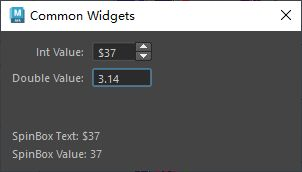

# 概述
`QSpinBox` 和 `QDoubleSpinBox` 是 PySide6（Qt for Python）中的控件，属于 `PySide6.QtWidgets` 模块。它们是用于输入和调整数值的控件，分别用于整数和浮点数，常用于需要用户输入特定范围数字的场景，如表单、设置面板等。以下是对 `QSpinBox` 和 `QDoubleSpinBox` 的详细介绍：

### 1. **QSpinBox**
#### **功能概述**
- **用途**：`QSpinBox` 是一个允许用户输入或调整整数值的控件，带有向上/向下箭头按钮，支持鼠标点击、键盘输入或滚轮调整。
- **特点**：
  - 仅处理整数值。
  - 支持设置最小值、最大值和步长。
  - 提供前缀/后缀（如货币符号、单位）。
  - 支持键盘输入验证，确保输入有效整数。
  - 可通过信号监控值变化。

#### **主要方法**
- **`setMinimum(value)`**：设置最小值。
- **`setMaximum(value)`**：设置最大值。
- **`setRange(min, max)`**：同时设置最小值和最大值。
- **`setValue(value)`**：设置当前值。
- **`value()`**：返回当前值。
- **`setSingleStep(value)`**：设置每次点击箭头或键盘上下键的步长。
- **`setPrefix(text)`**：设置显示在数值前的前缀（如 "$"）。
- **`setSuffix(text)`**：设置显示在数值后的后缀（如 "px"）。
- **`setDisplayIntegerBase(base)`**：设置显示的整数进制（默认 10）。
- **`cleanText()`**：返回不含前缀/后缀的纯文本值。
- **`setWrapping(bool)`**：启用循环（到达最大值后回到最小值，反之亦然）。
- **`setReadOnly(bool)`**：设置是否只读（仅允许通过箭头调整）。

#### **信号**
- **`valueChanged(int)`**：当值变化时触发，传递新值。
- **`textChanged(str)`**：当显示的文本变化时触发，传递文本内容。

### 2. **QDoubleSpinBox**
#### **功能概述**
- **用途**：`QDoubleSpinBox` 是 `QSpinBox` 的浮点数版本，用于输入和调整浮点数值，支持小数点精度设置。
- **特点**：
  - 处理浮点数，支持设置小数位数。
  - 其他功能与 `QSpinBox` 类似（如范围、步长、前缀/后缀）。
  - 提供更高的灵活性，适合需要精确数值输入的场景。

#### **主要方法**
- 与 `QSpinBox` 类似的方法（如 `setMinimum`、`setMaximum`、`setValue` 等）。
- **`setDecimals(decimals)`**：设置显示的小数位数（默认 2）。
- **`decimals()`**：返回当前小数位数。
- **`setSingleStep(value)`**：设置步长（浮点数）。
- **`value()`**：返回当前浮点数值。
- **`cleanText()`**：返回不含前缀/后缀的纯文本值。

#### **信号**
- **`valueChanged(float)`**：当值变化时触发，传递新的浮点数值。
- **`textChanged(str)`**：当显示的文本变化时触发，传递文本内容。

### 3. **主要区别**
- **`QSpinBox`**：处理整数值，适合离散数值输入（如数量、索引）。
- **`QDoubleSpinBox`**：处理浮点数值，适合连续数值输入（如价格、百分比）。
- **小数精度**：`QDoubleSpinBox` 独有的 `setDecimals` 方法控制小数位数。
- **步长**：`QSpinBox` 的步长是整数，`QDoubleSpinBox` 支持浮点步长。

### 4. **使用示例**
以下是一个 PySide6 示例，展示如何使用 `QSpinBox` 和 `QDoubleSpinBox` 创建一个简单的界面，监控数值变化并显示：

```python
import sys
from PySide6.QtWidgets import (QApplication, QMainWindow, QSpinBox, 
                              QDoubleSpinBox, QVBoxLayout, QWidget, QLabel)
from PySide6.QtCore import Qt

class MainWindow(QMainWindow):
    def __init__(self):
        super().__init__()
        self.setWindowTitle("QSpinBox 和 QDoubleSpinBox 示例")
        
        # 创建主布局
        main_widget = QWidget()
        self.setCentralWidget(main_widget)
        layout = QVBoxLayout(main_widget)
        
        # 创建 QSpinBox
        self.spin_box = QSpinBox()
        self.spin_box.setRange(0, 100)  # 设置范围
        self.spin_box.setSingleStep(1)  # 设置步长
        self.spin_box.setPrefix("数量: ")  # 设置前缀
        self.spin_box.setSuffix(" 件")     # 设置后缀
        
        # 创建 QDoubleSpinBox
        self.double_spin_box = QDoubleSpinBox()
        self.double_spin_box.setRange(0.0, 100.0)  # 设置范围
        self.double_spin_box.setSingleStep(0.5)    # 设置步长
        self.double_spin_box.setDecimals(2)        # 设置小数位数
        self.double_spin_box.setPrefix("价格: $")   # 设置前缀
        
        # 创建标签显示值
        self.label = QLabel("当前值: 未选择")
        
        # 连接信号
        self.spin_box.valueChanged.connect(self.on_value_changed)
        self.double_spin_box.valueChanged.connect(self.on_value_changed)
        
        # 添加控件到布局
        layout.addWidget(self.spin_box)
        layout.addWidget(self.double_spin_box)
        layout.addWidget(self.label)
        
    def on_value_changed(self):
        spin_value = self.spin_box.value()
        double_spin_value = self.double_spin_box.value()
        self.label.setText(f"当前值: 数量 = {spin_value}, 价格 = {double_spin_value}")

if __name__ == "__main__":
    app = QApplication(sys.argv)
    window = MainWindow()
    window.show()
    sys.exit(app.exec())
```

### 5. **代码说明**
- **创建 QSpinBox**：初始化整数输入框，设置范围 (0-100)、步长 (1)、前缀和后缀。
- **创建 QDoubleSpinBox**：初始化浮点输入框，设置范围 (0.0-100.0)、步长 (0.5)、小数位数 (2) 和前缀。
- **信号处理**：`valueChanged` 信号分别监控 `QSpinBox` 和 `QDoubleSpinBox` 的值变化，更新标签显示。
- **布局**：使用 `QVBoxLayout` 组织控件。

### 6. **应用场景**
- **`QSpinBox`**：
  - 输入整数数量（如商品数量、年龄）。
  - 选择数组索引或分页编号。
  - 设置离散选项（如字体大小）。
- **`QDoubleSpinBox`**：
  - 输入价格、百分比或测量值（如温度、距离）。
  - 调整浮点参数（如缩放比例、透明度）。
  - 科学计算或金融应用中的精确数值输入。

### 7. **注意事项**
- **范围限制**：确保设置合理的 `setRange` 值，避免用户输入无效数据。
- **步长设置**：步长应根据应用场景选择，`QDoubleSpinBox` 的小步长可能导致精度问题。
- **输入验证**：两控件内置输入验证，拒绝无效输入（如字母）。
- **只读模式**：`setReadOnly(True)` 可禁用键盘输入，仅允许通过箭头调整。
- **样式定制**：通过 `setStyleSheet` 自定义外观，如调整箭头按钮或文本框样式。
- **性能**：两控件轻量，适合高频使用，但大量实例需注意界面复杂性。

### 8. **与 QSlider 的区别**
- **`QSpinBox`/`QDoubleSpinBox`**：适合精确数值输入，提供文本框和箭头，支持键盘输入。
- **`QSlider`**：适合快速调整范围内的值，视觉化更直观，但精度较低。

### 9. **高级功能**
- **前缀/后缀**：通过 `setPrefix` 和 `setSuffix` 添加单位或符号，增强可读性。
- **循环模式**：`setWrapping(True)` 允许值在最小/最大值间循环。
- **自定义验证**：通过重写 `validate` 或 `fixup` 方法实现自定义输入规则。
- **键盘快捷键**：支持上下箭头键、PageUp/PageDown 调整值。
- **事件处理**：可重写 `keyPressEvent` 或 `wheelEvent` 实现自定义交互。

如果需要更复杂的示例（如自定义验证、结合其他控件、动态范围调整等），请告诉我！
# 案例
- 数字输入框
- [Open: Pasted image 20250806175109.png](attachments/13afde99ef3559faa504308962e07d23_MD5.jpeg)

# 代码
```python
from PySide2 import QtCore, QtWidgets


class ToolDialog(QtWidgets.QDialog):
    """工具UI类"""

    # 用于保存窗口实例，实现窗口单例化
    _ui_instance = None

    def __init__(self, parent=None):
        """构造函数"""
        # 如果没有传入父窗口，则maya主窗口为父窗口
        if parent is None:
            parent = ToolDialog.maya_main_window()
        super().__init__(parent)

        self.setWindowTitle("Common Widgets")
        self.setMinimumSize(300, 140)

        self.create_widgets()
        self.create_layouts()
        self.create_connections()

        self.on_text_changed(self.spin_box.text())
        self.on_value_changed(self.spin_box.value())

    def create_widgets(self):
        """创建控件"""
        # 创建数字输入框控件
        self.spin_box = QtWidgets.QSpinBox()
        self.spin_box.setFixedWidth(60)  # 修改宽度为60，适配maya
        self.spin_box.setMaximum(-1000)  # 设置最小值
        self.spin_box.setMaximum(1000)  # 设置最大值
        self.spin_box.setSingleStep(10)  # 设置步进大小，上下键可步进
        self.spin_box.setPrefix("$")  # 设置数字前缀，可以分别传递 text：$99和 value:99
        self.spin_box.setValue(37)

        self.double_spin_box = QtWidgets.QDoubleSpinBox()
        self.double_spin_box.setFixedWidth(60)  # 修改宽度为60，适配maya
        """移除输入框右侧的上下箭头按钮，
        在Pyside6中为:QtWidgets.QAbstractSpinBox.ButtonSymbols.NoButtons"""
        self.double_spin_box.setButtonSymbols(QtWidgets.QAbstractSpinBox.NoButtons)
        self.double_spin_box.setValue(3.14)

        # 创建标签用于显示下拉框数据
        self.sb_text_label = QtWidgets.QLabel()
        self.sb_value_label = QtWidgets.QLabel()

    def create_layouts(self):
        """创建布局"""
        form_layout = QtWidgets.QFormLayout()
        form_layout.addRow("Int Value: ", self.spin_box)
        form_layout.addRow("Double Value: ", self.double_spin_box)

        main_layout = QtWidgets.QVBoxLayout(self)
        main_layout.addLayout(form_layout)
        main_layout.addStretch()
        main_layout.addWidget(self.sb_text_label)
        main_layout.addWidget(self.sb_value_label)

    def create_connections(self):
        """创建连接"""
        # editingFinished信号在输入结束后回车键或输入框失去焦点时执行发射
        self.spin_box.editingFinished.connect(self.on_editing_finished)
        # textChanged是PySide6中才有的信号，这里使用valueChanged代替（既可以传递int也可以传递str）
        self.spin_box.valueChanged.connect(self.on_text_changed)
        self.spin_box.valueChanged.connect(self.on_value_changed)

    # 槽函数
    @QtCore.Slot()
    def on_editing_finished(self):
        value = self.spin_box.value()
        print(f"SpinBox editing finished: {value}")

    @QtCore.Slot()
    def on_text_changed(self, text):
        self.sb_text_label.setText(f"SpinBox Text: {text}")

    @QtCore.Slot()
    def on_value_changed(self, value):
        self.sb_value_label.setText(f"SpinBox Value: {value}")

    @staticmethod
    def maya_main_window():
        """获取maya主界面的pyside实例"""
        app = QtWidgets.QApplication.instance()
        if app:
            for widget in app.topLevelWidgets():
                if widget.objectName() == "MayaWindow":
                    return widget
        return None

    # 创建单例窗口
    @classmethod
    def show_singleton_dialog(cls):
        """显示单例窗口"""
        # 如果窗口单例为空，则创建窗口单例
        if not cls._ui_instance:
            cls._ui_instance = cls()
        # 如果窗口单例被隐藏，则显示
        if cls._ui_instance.isHidden():
            cls._ui_instance.show()
        # 其他情况，抬升窗口并激活
        else:
            cls._ui_instance.raise_()
            cls._ui_instance.activateWindow()


if __name__ == "__main__":
    ToolDialog.show_singleton_dialog()

```