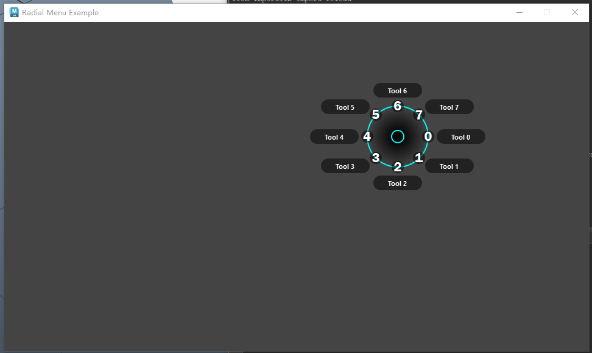

[Open: 2.22-环形弹出菜单-1762311121014.png](attachments/c9802107eb11890bf939a0296f9d0325_MD5.jpg)

```python
import math
import sys
from functools import partial

from PySide2 import QtCore, QtGui, QtWidgets
from shiboken2 import wrapInstance
import maya.OpenMayaUI as omui

IMAGE_DIR_PATH = r"D:\CT_Tools_mod\icons"  # 图标路径


class RadialMenu(QtWidgets.QWidget):
    """弹出式环形菜单类"""

    # 常量
    WINDOW_WIDTH = 320  # 菜单宽
    WINDOW_HEIGHT = 200  # 菜单高

    OUTER_CIRCLE_RADIUS = 50  # 外圈半径
    OUTER_CIRCLE_DIAMETER = 2 * OUTER_CIRCLE_RADIUS  # 外圈直径

    INNER_CIRCLE_RADIUS = 10  # 内圈半径
    INNER_CIRCLE_DIAMETER = 2 * INNER_CIRCLE_RADIUS  # 内圈直径

    ICON_WIDTH = 24  # 图标宽度
    TEXT_WIDTH = 80  # 标签宽度
    TEXT_HEIGHT = 24  # 标签高度
    TEXT_RADIUS = 0.5 * TEXT_HEIGHT  # 标签半径（胶囊形标签）

    NUM_ZONES = 8  # 标签数量
    ZONE_SPAN_ANGLE = 360 / NUM_ZONES  # 每个标签弧度

    def __init__(self, hotkey, parent=None):
        super(RadialMenu, self).__init__(parent)
        self.setFixedSize(self.WINDOW_WIDTH, self.WINDOW_HEIGHT)
        # 设置窗口为无框窗口（没有最大化，最小化和关闭按钮）
        self.setWindowFlags(QtCore.Qt.FramelessWindowHint)
        # 设置窗口透明化
        self.setAttribute(QtCore.Qt.WA_TranslucentBackground, True)
        # 设置鼠标追踪,mouseMoveEvent不按住左键也可追踪
        self.setMouseTracking(True)
        # 菜单弹出快捷键
        self.hotkey = hotkey
        # 创建菜单功能列表，长度为 self.NUM_ZONES 的列表，里面每个元素都是 None。后面将用元组填充
        self.tools = [None] * self.NUM_ZONES
        # 菜单中间位置
        self.center_point = QtCore.QPoint(0.5 * self.width(), 0.5 * self.height())
        # 矩形区域：外圈矩形和内圈矩形
        self.outer_circle_rect = QtCore.QRect(
            self.center_point.x() - self.OUTER_CIRCLE_RADIUS,
            self.center_point.y() - self.OUTER_CIRCLE_RADIUS,
            self.OUTER_CIRCLE_DIAMETER,
            self.OUTER_CIRCLE_DIAMETER,
        )
        self.inner_circle_rect = QtCore.QRect(
            self.center_point.x() - self.INNER_CIRCLE_RADIUS,
            self.center_point.y() - self.INNER_CIRCLE_RADIUS,
            self.INNER_CIRCLE_DIAMETER,
            self.INNER_CIRCLE_DIAMETER,
        )
        # 选择索引和高亮索引
        self.selected_section = -1
        self.active_zone = -1
        # 高亮矩形
        self.highlight_bounds = QtCore.QRect(
            self.center_point.x() - (0.5 * self.height()),
            0,
            self.height(),
            self.height(),
        )
        # 高亮开始角度
        self.highlight_start_angle = 0
        # 按下快捷键个鼠标是否正在移动
        self.hotkey_down = False
        self.mouse_moved = False

    def set_tool(self, index, label, icon_path, func):
        """填充功能索引标签图标和函数为一个元组添加到到tools列表"""
        if index < 0 or index >= self.NUM_ZONES:
            return

        image = QtGui.QImage(icon_path)
        self.tools[index] = (label, image, func)

    def distance_from_center(self, x, y):
        """
        计算给出点到菜单中心的距离.使用了三角函数计算给定点(x, y)到中心点(self.center_point.x(), self.center_point.y())的距离
        """
        return math.hypot(x - self.center_point.x(), y - self.center_point.y())

    def point_from_center(self, zone, distance):
        """
        使用三角函数给定的区域和距离计算从菜单中心开始的点
        """
        degrees = zone * self.ZONE_SPAN_ANGLE
        radians = math.radians(degrees)

        x1 = self.center_point.x() + (distance * math.cos(radians))
        y1 = self.center_point.y() + (distance * math.sin(radians))

        return x1, y1

    def icon_point(self, zone):
        """
        根据给出的区域索引计算图标位置
        :param zone: int, 区域索引
        :return: tuple(x, y), 图标位置
        """
        x, y = self.point_from_center(zone, self.OUTER_CIRCLE_RADIUS)
        x -= 0.5 * self.ICON_WIDTH
        y -= 0.5 * self.ICON_WIDTH

        return x, y

    def label_point(self, zone):
        """
        根据给出的区域索引计算标签位置
        :param zone: int, 区域索引
        :return: tuple(x, y), 标签位置
        """
        distance = self.OUTER_CIRCLE_RADIUS + self.TEXT_RADIUS
        x, y = self.point_from_center(zone, distance)

        if zone in [0, 1, 7]:
            x += 2
        elif zone in [2, 6]:
            x -= 0.5 * self.TEXT_WIDTH
        elif zone in [3, 4, 5]:
            x -= 2 + self.TEXT_WIDTH

        if zone in [0, 4]:
            y -= 0.5 * self.TEXT_HEIGHT
        elif zone in [1, 3]:
            y -= 0.3 * self.TEXT_HEIGHT
        elif zone in [5, 7]:
            y -= 0.7 * self.TEXT_HEIGHT
        elif zone == 2:
            y += 2
        elif zone == 6:
            y -= 2 + self.TEXT_HEIGHT

        return x, y

    def update_active_zone(self, pos):
        """更新活动区"""
        if self.distance_from_center(pos.x(), pos.y()) <= self.INNER_CIRCLE_RADIUS:
            self.clear_active_zone()
            return

        point = pos - self.center_point
        degrees = math.degrees(math.atan2(point.y(), point.x())) % 360

        start_angle_offset = -0.5 * self.ZONE_SPAN_ANGLE
        degrees = (degrees + start_angle_offset) % 360

        temp_section = math.floor(degrees / self.ZONE_SPAN_ANGLE)

        if self.selected_section != temp_section:
            self.selected_section = temp_section

            self.highlight_start_angle = (
                self.selected_section * self.ZONE_SPAN_ANGLE
            ) - start_angle_offset
            self.active_zone = (self.selected_section + 1) % 8

            self.update()

    def clear_active_zone(self):
        """清除活动区"""
        self.active_zone = -1
        self.selected_section = -1

        self.update()

    def activate_selection(self):
        """活动区选择"""
        if self.active_zone >= 0 and self.tools[self.active_zone]:
            self.tools[self.active_zone][2]()

        self.hide()

    def show(self):
        """显示函数：使菜单在鼠标位置显示"""
        pop_up_pos = QtGui.QCursor.pos() - self.center_point
        self.move(pop_up_pos)

        super(RadialMenu, self).show()

    def showEvent(self, show_event):
        """显示事件：使用弹出式聚焦模式"""
        self.setFocus(QtCore.Qt.PopupFocusReason)

        self.mouse_moved = False
        self.hotkey_down = True

    def keyPressEvent(self, key_event):
        """按键事件"""
        key = key_event.key()

        if key == self.hotkey and not key_event.isAutoRepeat():
            self.hide()
        elif key == QtCore.Qt.Key_Escape:
            self.hide()

    def keyReleaseEvent(self, key_event):
        """
        重写按键释放事件

        如果按下快捷键（self.hotkey）并且不是自动重复按键（isAutoRepeat=False），
        则除快捷键的down状态（self.hotkey_down=False）。
        如果鼠标在移动（self.mouse_moved=True），
        则除活动区（self.activate_selection()）。
        """
        if key_event.key() == self.hotkey and not key_event.isAutoRepeat():
            self.hotkey_down = False

            if self.mouse_moved:
                self.activate_selection()

    def mousePressEvent(self, mouse_event):
        if self.mouse_moved or not self.hotkey_down:
            self.activate_selection()

    def mouseReleaseEvent(self, mouse_event):
        if self.mouse_moved:
            self.activate_selection()

    def mouseMoveEvent(self, mouse_event):
        self.update_active_zone(mouse_event.pos())

        if (
            mouse_event.pos() - self.center_point
        ).manhattanLength() > self.INNER_CIRCLE_RADIUS:
            self.mouse_moved = True

    def leaveEvent(self, leave_event):
        self.clear_active_zone()

    def paintEvent(self, paint_event):
        """
        绘制事件，绘制了：
        1. 可点击区域
        2. 外环
        3. 活动区高亮
        4. 内环
        5. 图标和文本
        """
        painter = QtGui.QPainter(self)
        painter.setRenderHints(QtGui.QPainter.Antialiasing)

        # Clickable area
        painter.setPen(QtCore.Qt.transparent)
        painter.setBrush(QtGui.QColor(0, 0, 0, 1))
        painter.drawRect(self.rect())

        # Outer Circle
        radial_grad = QtGui.QRadialGradient(self.center_point, 50)
        radial_grad.setColorAt(0.1, QtGui.QColor(0, 0, 0, 255))
        radial_grad.setColorAt(1, QtGui.QColor(0, 0, 0, 1))
        painter.setBrush(radial_grad)

        circle_pen = QtGui.QPen(QtCore.Qt.cyan, 2)
        painter.setPen(circle_pen)
        painter.drawEllipse(self.outer_circle_rect)

        # Zone Highlight
        if self.active_zone >= 0:
            radial_grad2 = QtGui.QRadialGradient(self.center_point, 80)
            radial_grad2.setColorAt(0, QtGui.QColor(255, 255, 255, 255))
            radial_grad2.setColorAt(0.9, QtGui.QColor(0, 0, 0, 1))
            painter.setBrush(radial_grad2)

            painter.setPen(QtCore.Qt.transparent)

            painter.drawPie(
                self.highlight_bounds,
                -self.highlight_start_angle * 16,
                -self.ZONE_SPAN_ANGLE * 16,
            )

        # Inner Circle
        painter.setBrush(QtCore.Qt.black)
        painter.setPen(circle_pen)
        painter.drawEllipse(self.inner_circle_rect)

        # Icon and Text
        font = painter.font()
        font.setBold(True)
        painter.setFont(font)

        for i in range(self.NUM_ZONES):
            if self.tools[i]:
                icon_x, icon_y = self.icon_point(i)
                painter.drawImage(icon_x, icon_y, self.tools[i][1])

                if i == self.active_zone:
                    painter.setBrush(QtGui.QColor(255, 255, 0, 127))
                else:
                    painter.setBrush(QtGui.QColor(0, 0, 0, 127))

                label_x, label_y = self.label_point(i)

                painter.setPen(QtCore.Qt.transparent)
                painter.drawRoundedRect(
                    label_x,
                    label_y,
                    self.TEXT_WIDTH,
                    self.TEXT_HEIGHT,
                    self.TEXT_RADIUS,
                    self.TEXT_RADIUS,
                )

                painter.setPen(QtCore.Qt.white)
                painter.drawText(
                    label_x,
                    label_y,
                    self.TEXT_WIDTH,
                    self.TEXT_HEIGHT,
                    QtCore.Qt.AlignCenter,
                    self.tools[i][0],
                )

    def focusOutEvent(self, focus_event):
        self.hide()


class MainWindow(QtWidgets.QMainWindow):
    """主菜单类"""

    _ui_instance = None

    def __init__(self, parent=None):
        if not parent:
            parent = self.get_maya_main_window()
        super().__init__(parent)
        self.setWindowTitle("Radial Menu Example")
        self.setFixedSize(960, 540)
        # 利用样式表设置一个背景图片
        self.setStyleSheet(
            "QWidget {{background-image: url({0}/maya_bg.png) }}".format(IMAGE_DIR_PATH)
        )
        # 创建环形菜单
        self.radial_menu = []  # 菜单列表
        radial_menu = RadialMenu(QtCore.Qt.Key_0)  # 创建菜单，快捷键为数字键 "0"
        for i in range(RadialMenu.NUM_ZONES):
            radial_menu.set_tool(
                i,
                f"Tool {i}",
                f"{IMAGE_DIR_PATH}/tool_icon_{i}.png",
                partial(self.activate_tool, i),
            )
        self.radial_menu.append(radial_menu)  # 列表添加元素

    def keyPressEvent(self, event: QtGui.QKeyEvent) -> None:
        """重写按键事件"""
        key = event.key()  # 获取按下的键，返回一个整数枚举值
        # 只处理真正的按键按下，忽略长按重复事件(长按时会产生几十次重复事件，避免菜单反复显示/隐藏。)。
        if not event.isAutoRepeat():
            # 遍历环形餐单中的菜单，如果快捷键吻合，显示菜单
            for menu in self.radial_menu:
                if key == menu.hotkey:
                    menu.show()

    def closeEvent(self, event):
        """重写关闭事件"""
        # 清理弹出菜单
        for menu in self.radial_menu:
            menu.deleteLater()
        # 置空界面实例
        MainWindow._ui_instance = None
        # 调用父类关闭时间
        super().closeEvent(event)

    def activate_tool(self, index):
        """工具调用函数"""
        print(f"Activate tool for index: {index}")

    @staticmethod
    def get_maya_main_window():
        """返回 Maya 主窗口的 PySide 实例"""
        ptr = omui.MQtUtil.mainWindow()
        if ptr is not None:
            return wrapInstance(int(ptr), QtWidgets.QMainWindow)
        return None

    @classmethod
    def show_ui(cls):
        """单例显示 UI"""
        # 如果没有单例或者实例不显示，则创建并显示实例
        if cls._ui_instance is None or not cls._ui_instance.isVisible():
            cls._ui_instance = MainWindow()
            cls._ui_instance.show()
        # 其他情况实例抬起并激活
        else:
            cls._ui_instance.raise_()
            cls._ui_instance.activateWindow()


# 执行代码
def run():
    MainWindow.show_ui()

```