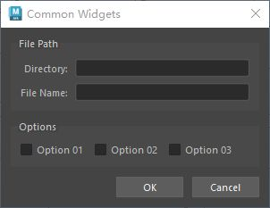
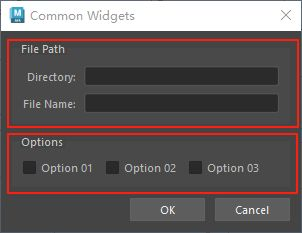

# 概述
`QGroupBox` 是 PySide6（Qt for Python）中的一个控件，属于 `PySide6.QtWidgets` 模块。它是一个可视化的容器控件，用于将一组相关的控件（如按钮、文本框等）分组显示，通常带有标题和边框，以提高界面的组织性和可读性。以下是对 `QGroupBox` 的详细介绍：

### 1. **功能概述**
- **用途**：`QGroupBox` 用于组织一组控件，形成一个逻辑和视觉上的分组，常用于表单、设置界面或复杂窗口中，以清晰区分不同功能区域。
- **特点**：
  - 提供标题和边框，用于标识分组内容。
  - 支持可选的复选框（checkable），可启用/禁用整个分组。
  - 可以包含任何 `QWidget` 派生控件。
  - 支持自定义布局（如 `QVBoxLayout`、`QHBoxLayout`）来组织内部控件。
  - 提供信号来响应复选框状态变化。

### 2. **主要方法**
以下是 `QGroupBox` 的常用方法：
- **`setTitle(title)`**：设置分组框的标题文本。
- **`title()`**：返回分组框的标题文本。
- **`setCheckable(bool)`**：设置分组框是否带有复选框（默认不带）。
- **`setChecked(bool)`**：设置复选框的选中状态（需启用 `setCheckable(True)`）。
- **`isChecked()`**：返回复选框是否被选中。
- **`setAlignment(Qt.Alignment)`**：设置标题的对齐方式（如 `Qt.AlignLeft`、`Qt.AlignCenter`）。
- **`setFlat(bool)`**：设置是否使用扁平样式（无边框，仅显示标题）。
- **`setLayout(QLayout)`**：为分组框设置布局，用于组织内部控件。

### 3. **信号**
`QGroupBox` 提供以下常用信号：
- **`toggled(bool)`**：当复选框状态变化时触发（需启用 `setCheckable(True)`），传递选中状态。
- **`clicked(bool)`**：当复选框被点击时触发，传递选中状态。

### 4. **使用示例**
以下是一个 PySide6 示例，展示如何使用 `QGroupBox` 组织一组单选按钮，并通过复选框控制分组的启用/禁用状态：

```python
import sys
from PySide6.QtWidgets import (QApplication, QMainWindow, QGroupBox, 
                              QRadioButton, QVBoxLayout, QWidget, QLabel)
from PySide6.QtCore import Qt

class MainWindow(QMainWindow):
    def __init__(self):
        super().__init__()
        self.setWindowTitle("QGroupBox 示例")
        
        # 创建主布局
        main_widget = QWidget()
        self.setCentralWidget(main_widget)
        layout = QVBoxLayout(main_widget)
        
        # 创建 QGroupBox
        group_box = QGroupBox("选项分组")
        group_box.setCheckable(True)  # 启用复选框
        group_box.setChecked(True)    # 默认选中
        
        # 创建分组内的布局和控件
        group_layout = QVBoxLayout(group_box)
        radio1 = QRadioButton("选项 1")
        radio2 = QRadioButton("选项 2")
        radio3 = QRadioButton("选项 3")
        group_layout.addWidget(radio1)
        group_layout.addWidget(radio2)
        group_layout.addWidget(radio3)
        
        # 创建标签显示分组状态
        self.label = QLabel("分组状态: 启用")
        
        # 连接信号
        group_box.toggled.connect(self.on_group_toggled)
        
        # 添加控件到主布局
        layout.addWidget(group_box)
        layout.addWidget(self.label)
        
    def on_group_toggled(self, checked):
        self.label.setText(f"分组状态: {'启用' if checked else '禁用'}")

if __name__ == "__main__":
    app = QApplication(sys.argv)
    window = MainWindow()
    window.show()
    sys.exit(app.exec())
```

### 5. **代码说明**
- **创建 QGroupBox**：`group_box = QGroupBox("选项分组")` 初始化分组框并设置标题。
- **启用复选框**：`setCheckable(True)` 添加复选框，`setChecked(True)` 设置默认选中。
- **内部布局**：使用 `QVBoxLayout` 组织分组框内的单选按钮。
- **信号处理**：`toggled` 信号在复选框状态变化时触发，更新标签显示分组启用/禁用状态。
- **布局**：主窗口使用 `QVBoxLayout` 组织 `QGroupBox` 和标签。

### 6. **应用场景**
- **表单分组**：在设置窗口中将相关选项分组，如“显示设置”、“音频设置”。
- **控件管理**：通过复选框控制一组控件的启用/禁用状态。
- **界面组织**：在复杂界面中清晰划分功能区域，提高用户体验。
- **向导界面**：与 `QStackedWidget` 或 `QTabWidget` 结合，组织多步骤配置。

### 7. **注意事项**
- **布局设置**：`QGroupBox` 本身不提供布局，需通过 `setLayout` 设置 `QVBoxLayout`、`QHBoxLayout` 等来组织内部控件。
- **复选框功能**：当 `setCheckable(True)` 时，复选框未选中会导致整个分组框内的控件禁用。
- **扁平样式**：`setFlat(True)` 可移除边框，仅保留标题，适合特定视觉风格。
- **性能**：`QGroupBox` 是轻量级控件，适合嵌套使用，但过多嵌套可能影响界面复杂性。
- **样式定制**：可通过 `setStyleSheet` 自定义标题、边框或背景样式。

### 8. **与 QButtonGroup 的区别**
- **`QGroupBox`**：可视化容器，带有标题和边框，用于界面分组，支持布局管理。
- **`QButtonGroup`**：逻辑容器，仅管理按钮状态（如互斥），不影响界面布局。

### 9. **高级功能**
- **动态控件**：通过 `setLayout` 和动态添加控件，支持运行时调整分组内容。
- **样式定制**：使用 CSS（如 `QGroupBox { border: 1px solid gray; }`）或 `QStyle` 自定义外观。
- **嵌套分组**：可嵌套多个 `QGroupBox`，实现复杂的分层界面。
- **复选框逻辑**：通过 `toggled` 信号实现动态控制，如启用/禁用子控件或触发其他逻辑。

如果需要更复杂的示例（如嵌套 `QGroupBox`、结合 `QButtonGroup` 或自定义样式），请告诉我！
# 案例
- QGroupBox (分组框)，用于组织布局
 
# 代码
```python
from PySide2 import QtCore, QtWidgets


class ToolDialog(QtWidgets.QDialog):
    """工具UI类"""

    # 用于保存窗口实例，实现窗口单例化
    _ui_instance = None

    def __init__(self, parent=None):
        """构造函数"""
        # 如果没有传入父窗口，则maya主窗口为父窗口
        if parent is None:
            parent = ToolDialog.maya_main_window()
        super().__init__(parent)

        self.setWindowTitle("Common Widgets")
        self.setMinimumSize(300, 140)

        self.create_widgets()
        self.create_layouts()
        self.create_connections()

    def create_widgets(self):
        """创建控件"""
        self.dir_line = QtWidgets.QLineEdit()
        self.file_line = QtWidgets.QLineEdit()

        self.cb_01 = QtWidgets.QCheckBox("Option 01")
        self.cb_02 = QtWidgets.QCheckBox("Option 02")
        self.cb_03 = QtWidgets.QCheckBox("Option 03")

        self.ok_btn = QtWidgets.QPushButton("OK")
        self.cancel_btn = QtWidgets.QPushButton("Cancel")

    def create_layouts(self):
        """创建布局"""
        path_layout = QtWidgets.QFormLayout()
        path_layout.addRow("Directory: ", self.dir_line)
        path_layout.addRow("File Name: ", self.file_line)
        # 创建GroupBox，将path_layout放入GroupBox，标签为"File Path"
        path_grp = QtWidgets.QGroupBox("File Path")
        path_grp.setLayout(path_layout)

        option_layout = QtWidgets.QHBoxLayout()
        option_layout.addWidget(self.cb_01)
        option_layout.addWidget(self.cb_02)
        option_layout.addWidget(self.cb_03)
        option_layout.addStretch()
        # 创建GroupBox，将option_layout放入GroupBox，标签为"Options"
        option_grp = QtWidgets.QGroupBox("Options")
        option_grp.setLayout(option_layout)

        btn_layout = QtWidgets.QHBoxLayout()
        btn_layout.addStretch()
        btn_layout.addWidget(self.ok_btn)
        btn_layout.addWidget(self.cancel_btn)

        main_layout = QtWidgets.QVBoxLayout(self)
        # 添加GroupBox到layout要用addWidget
        main_layout.addWidget(path_grp)
        main_layout.addWidget(option_grp)
        main_layout.addStretch()
        main_layout.addLayout(btn_layout)

    def create_connections(self):
        """创建连接"""
        pass

    @staticmethod
    def maya_main_window():
        """获取maya主界面的pyside实例"""
        app = QtWidgets.QApplication.instance()
        if app:
            for widget in app.topLevelWidgets():
                if widget.objectName == "MayaWindow":
                    return widget
        return None

    # 创建单例窗口
    @classmethod
    def show_singleton_dialog(cls):
        """显示单例窗口"""
        # 如果窗口单例为空，则创建窗口单例
        if not cls._ui_instance:
            cls._ui_instance = ToolDialog()
        # 如果窗口单例被隐藏，则显示
        if cls._ui_instance.isHidden():
            cls._ui_instance.show()
        # 其他情况，抬升窗口并激活
        else:
            cls._ui_instance.raise_()
            cls._ui_instance.activateWindow()


if __name__ == "__main__":
    ToolDialog.show_singleton_dialog()

```