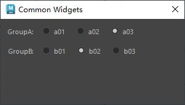

# 概述
`QButtonGroup` 是 PySide6（Qt for Python）中的一个类，属于 `PySide6.QtWidgets` 模块。它不是一个可视控件，而是一个用于管理一组按钮（如 `QPushButton`、`QRadioButton`、`QCheckBox`）的逻辑容器，通常用于组织互斥的单选按钮或管理一组按钮的状态。以下是对 `QButtonGroup` 的详细介绍：

### 1. **功能概述**
- **用途**：`QButtonGroup` 用于将多个按钮组织在一起，方便管理它们的选中状态，特别适合处理单选按钮（`QRadioButton`）的互斥行为，也可用于管理其他按钮的逻辑分组。
- **特点**：
  - 提供互斥功能，确保组内只有一个按钮被选中（常用于 `QRadioButton`）。
  - 支持为按钮分配唯一 ID，便于识别。
  - 提供信号来监控按钮的点击或选中状态变化。
  - 不影响按钮的布局，仅提供逻辑管理。
  - 可以包含任何继承自 `QAbstractButton` 的控件（如 `QPushButton`、`QRadioButton`、`QCheckBox`）。

### 2. **主要方法**
以下是 `QButtonGroup` 的常用方法：
- **`addButton(QAbstractButton, id=-1)`**：将按钮添加到组中，可指定一个整数 ID（若未指定，ID 为 -1）。
- **`removeButton(QAbstractButton)`**：从组中移除指定按钮。
- **`buttons()`**：返回组内所有按钮的列表。
- **`button(id)`**：根据 ID 返回对应的按钮。
- **`checkedButton()`**：返回当前选中的按钮（仅适用于互斥模式）。
- **`checkedId()`**：返回当前选中按钮的 ID（仅适用于互斥模式）。
- **`setId(QAbstractButton, id)`**：为指定按钮设置 ID。
- **`id(QAbstractButton)`**：返回指定按钮的 ID。
- **`setExclusive(bool)`**：设置是否启用互斥模式（默认开启，适用于 `QRadioButton`）。
- **`exclusive()`**：返回是否为互斥模式。

### 3. **信号**
`QButtonGroup` 提供以下常用信号：
- **`buttonClicked(QAbstractButton)`**：当组内按钮被点击时触发，传递被点击的按钮。
- **`buttonClicked(int)`**：当组内按钮被点击时触发，传递按钮的 ID。
- **`buttonPressed(QAbstractButton)`**：当按钮被按下时触发。
- **`buttonReleased(QAbstractButton)`**：当按钮被释放时触发。
- **`idClicked(int)`**：当按钮被点击时触发，传递按钮的 ID。
- **`buttonToggled(QAbstractButton, bool)`**：当按钮的选中状态变化时触发，传递按钮和状态。
- **`idToggled(int, bool)`**：当按钮选中状态变化时触发，传递按钮 ID 和状态。

### 4. **使用示例**
以下是一个 PySide6 示例，展示如何使用 `QButtonGroup` 管理一组单选按钮（`QRadioButton`），并响应选中状态的变化：

```python
import sys
from PySide6.QtWidgets import (QApplication, QMainWindow, QButtonGroup, 
                              QRadioButton, QVBoxLayout, QWidget, QLabel)
from PySide6.QtCore import Qt

class MainWindow(QMainWindow):
    def __init__(self):
        super().__init__()
        self.setWindowTitle("QButtonGroup 示例")
        
        # 创建主布局
        main_widget = QWidget()
        self.setCentralWidget(main_widget)
        layout = QVBoxLayout(main_widget)
        
        # 创建标签显示选中状态
        self.label = QLabel("未选择任何选项")
        
        # 创建 QButtonGroup
        self.button_group = QButtonGroup()
        self.button_group.setExclusive(True)  # 启用互斥模式
        
        # 创建单选按钮
        radio1 = QRadioButton("选项 1")
        radio2 = QRadioButton("选项 2")
        radio3 = QRadioButton("选项 3")
        
        # 将按钮添加到 QButtonGroup 并设置 ID
        self.button_group.addButton(radio1, 1)
        self.button_group.addButton(radio2, 2)
        self.button_group.addButton(radio3, 3)
        
        # 连接信号
        self.button_group.buttonClicked.connect(self.on_button_clicked)
        
        # 添加控件到布局
        layout.addWidget(radio1)
        layout.addWidget(radio2)
        layout.addWidget(radio3)
        layout.addWidget(self.label)
        
    def on_button_clicked(self, button):
        button_id = self.button_group.id(button)
        self.label.setText(f"选中选项: {button.text()} (ID: {button_id})")

if __name__ == "__main__":
    app = QApplication(sys.argv)
    window = MainWindow()
    window.show()
    sys.exit(app.exec())
```

### 5. **代码说明**
- **创建 QButtonGroup**：`self.button_group = QButtonGroup()` 初始化按钮组。
- **添加按钮**：通过 `addButton` 将三个 `QRadioButton` 添加到组中，并为每个按钮指定唯一 ID。
- **互斥模式**：`setExclusive(True)` 确保组内只有一个按钮可被选中。
- **信号处理**：`buttonClicked` 信号在按钮被点击时触发，更新标签显示选中的按钮文本和 ID。
- **布局**：使用 `QVBoxLayout` 组织单选按钮和标签，`QButtonGroup` 本身不影响布局。

### 6. **应用场景**
- **单选按钮管理**：组织一组 `QRadioButton`，确保互斥选择（如选择性别、模式）。
- **按钮状态监控**：统一处理一组按钮的点击或状态变化（如工具栏按钮）。
- **表单选项**：在设置界面中管理多个选项的选中状态。
- **动态按钮组**：动态添加或移除按钮，适合配置灵活的界面。

### 7. **注意事项**
- **互斥模式**：`setExclusive(True)` 仅对 `QRadioButton` 有效，`QCheckBox` 和 `QPushButton` 不受影响。若需要多选，设置为 `False`。
- **按钮 ID**：建议为每个按钮设置唯一 ID，便于通过 `idClicked` 或 `idToggled` 信号识别。
- **布局分离**：`QButtonGroup` 不负责按钮的显示位置，需通过布局（如 `QVBoxLayout`、`QHBoxLayout`）管理。
- **信号选择**：根据需求选择 `buttonClicked`（按钮对象）或 `idClicked`（按钮 ID）信号，ID 信号更适合动态按钮管理。
- **性能**：`QButtonGroup` 是轻量级类，管理大量按钮时不会显著影响性能。

### 8. **与 QButtonBox 的区别**
- **`QButtonGroup`**：逻辑容器，仅管理按钮状态，不提供可视化界面，适合灵活布局。
- **`QDialogButtonBox`**：专为对话框设计的按钮容器，提供预定义按钮（如“确定”、“取消”）和标准布局。

### 9. **高级功能**
- **动态管理**：通过 `addButton` 和 `removeButton` 动态调整按钮组。
- **非互斥模式**：设置 `setExclusive(False)`，允许管理多选按钮（如 `QCheckBox`）。
- **自定义信号处理**：通过按钮 ID 和 `idClicked` 信号实现复杂逻辑。
- **跨类型按钮**：可混合管理 `QRadioButton`、`QCheckBox` 和 `QPushButton`，但需注意互斥逻辑。

如果需要更复杂的示例（如结合 `QCheckBox`、动态添加按钮、与 `QStackedWidget` 联动等），请告诉我！
# 案例
- QButtonGroup，可包含单选按钮，复选框和按钮，使两个group之间的控件互不影响。
- 如果六个单选按钮共享一个父控件，他们之间的选择是互斥的，将他们分为两个group，只有group内的单选按钮互斥
- [Open: Pasted image 20250806200156.png](attachments/c549da3eab80d31084af7a3a923504d0_MD5.jpeg)


# 代码
```python
from PySide2 import QtCore, QtWidgets


class ToolDialog(QtWidgets.QDialog):
    """工具UI类"""

    # 用于保存窗口实例，实现窗口单例化
    _ui_instance = None

    def __init__(self, parent=None):
        """构造函数"""
        # 如果没有传入父窗口，则maya主窗口为父窗口
        if parent is None:
            parent = ToolDialog.maya_main_window()
        super().__init__(parent)

        self.setWindowTitle("Common Widgets")
        self.setMinimumSize(300, 140)

        self.create_widgets()
        self.create_layouts()
        self.create_connections()

    def create_widgets(self):
        """创建控件"""
        self.rb_a01 = QtWidgets.QRadioButton("a01")
        self.rb_a02 = QtWidgets.QRadioButton("a02")
        self.rb_a03 = QtWidgets.QRadioButton("a03")
        # 创建QButtonGroup，并添加控件
        self.rb_a_grp = QtWidgets.QButtonGroup()
        self.rb_a_grp.addButton(self.rb_a01)
        self.rb_a_grp.addButton(self.rb_a02)
        self.rb_a_grp.addButton(self.rb_a03)

        self.rb_b01 = QtWidgets.QRadioButton("b01")
        self.rb_b02 = QtWidgets.QRadioButton("b02")
        self.rb_b03 = QtWidgets.QRadioButton("b03")
        # 创建QButtonGroup，并添加控件
        self.rb_b_grp = QtWidgets.QButtonGroup()
        self.rb_b_grp.addButton(self.rb_b01)
        self.rb_b_grp.addButton(self.rb_b02)
        self.rb_b_grp.addButton(self.rb_b03)

        self.rb_a01.setChecked(True)
        self.rb_b01.setChecked(True)

    def create_layouts(self):
        """创建布局"""

        grp_a_layout = QtWidgets.QHBoxLayout()
        grp_a_layout.addWidget(self.rb_a01)
        grp_a_layout.addWidget(self.rb_a02)
        grp_a_layout.addWidget(self.rb_a03)
        grp_a_layout.addStretch()

        grp_b_layout = QtWidgets.QHBoxLayout()
        grp_b_layout.addWidget(self.rb_b01)
        grp_b_layout.addWidget(self.rb_b02)
        grp_b_layout.addWidget(self.rb_b03)
        grp_b_layout.addStretch()

        main_layout = QtWidgets.QFormLayout(self)
        main_layout.setSpacing(14)
        main_layout.addRow("GroupA:", grp_a_layout)
        main_layout.addRow("GroupB:", grp_b_layout)

    def create_connections(self):
        """创建连接"""
        # QButtonGroup被点击发射按钮实例给槽函数，打印哪个按钮被点击了
        self.rb_a_grp.buttonClicked.connect(self.on_button_clicked)
        # QButtonGroup被切换发射按钮实例和布尔值给槽函数，打印哪两个按钮被切换了
        self.rb_b_grp.buttonToggled.connect(self.on_button_toggled)

    # 槽函数
    @QtCore.Slot()
    def on_button_clicked(self, btn):
        """当按钮点击时打印那个按钮点击了"""
        print(f"Button Clicked: {btn.text()}")

    @QtCore.Slot()
    def on_button_toggled(self, btn, checked):
        """当按钮切换时打印哪些按钮状态改变了"""
        print(f"{btn.text()} toggled: {checked}")

    @staticmethod
    def maya_main_window():
        """获取maya主界面的pyside实例"""
        app = QtWidgets.QApplication.instance()
        if app:
            for widget in app.topLevelWidgets():
                if widget.objectName() == "MayaWindow":
                    return widget
        return None

    # 创建单例窗口
    @classmethod
    def show_singleton_dialog(cls):
        """显示单例窗口"""
        # 如果窗口单例为空，则创建窗口单例
        if not cls._ui_instance:
            cls._ui_instance = cls()
        # 如果窗口单例被隐藏，则显示
        if cls._ui_instance.isHidden():
            cls._ui_instance.show()
        # 其他情况，抬升窗口并激活
        else:
            cls._ui_instance.raise_()
            cls._ui_instance.activateWindow()


if __name__ == "__main__":
    ToolDialog.show_singleton_dialog()

```