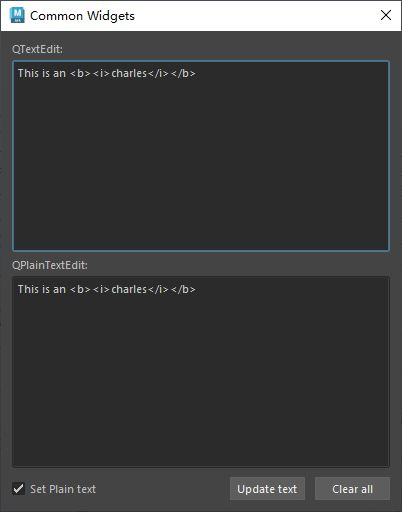

# 概述
`QTextEdit` 是 PySide6（Qt for Python）中的一个控件，属于 `PySide6.QtWidgets` 模块。它是一个功能强大的多行文本编辑器，支持富文本（HTML格式）、纯文本编辑以及多种用户交互功能。以下是对 `QTextEdit` 的详细介绍：

### 1. **功能概述**
- **用途**：`QTextEdit` 用于显示和编辑多行文本，支持纯文本和富文本格式，适用于需要用户输入或显示复杂格式文本的场景，如文本编辑器、聊天窗口、笔记应用等。
- **特点**：
  - 支持纯文本和富文本（HTML、Markdown等）。
  - 提供文本格式设置（如字体、颜色、对齐方式）。
  - 支持撤销/重做、复制/粘贴、拖放等功能。
  - 可嵌入图像、表格等富文本内容。
  - 支持文本光标操作和选择处理。
  - 提供丰富的信号，用于响应用户交互。

### 2. **主要方法**
以下是 `QTextEdit` 的常用方法：
- **`setText(text)`**：设置文本内容（纯文本）。
- **`toPlainText()`**：返回纯文本内容。
- **`setHtml(html)`**：设置富文本内容（HTML格式）。
- **`toHtml()`**：返回富文本内容的HTML代码。
-  `toMarkdown()`（Qt 5.14+）
- **`clear()`**：清空文本内容。
- **`setReadOnly(bool)`**：设置是否只读。
- **`setFontFamily(family)`**：设置文本字体。
- **`setFontPointSize(size)`**：设置字体大小。
- **`setTextColor(color)`**：设置当前文本颜色（`QColor`）。
- **`setAlignment(Qt.Alignment)`**：设置文本对齐方式（如 `Qt.AlignLeft`、`Qt.AlignCenter`）。
- **`append(text)`**：在文本末尾追加内容（自动换行）。
- **`insertPlainText(text)`**：在光标位置插入纯文本。
- **`insertHtml(html)`**：在光标位置插入富文本。
- **`selectAll()`**：选中所有文本。
- **`copy()`**、**`cut()`**、**`paste()`**：复制、剪切、粘贴操作。
- **`undo()`**、**`redo()`**：撤销和重做操作。
- **`setAcceptRichText(bool)`**：设置是否接受富文本粘贴。
- **`textCursor()`**：返回当前 `QTextCursor` 对象，用于高级文本操作。
- **`setTabStopDistance(distance)`**：设置制表符宽度（以像素为单位）。
- **`canPaste()`**：检查是否可以粘贴剪贴板内容。

### 3. **信号**
`QTextEdit` 提供以下常用信号：
- **`textChanged()`**：当文本内容发生变化时触发。
- **`cursorPositionChanged()`**：当光标位置变化时触发。
- **`selectionChanged()`**：当选中文本变化时触发。
- **`undoAvailable(bool)`**：当撤销操作可用性变化时触发。
- **`redoAvailable(bool)`**：当重做操作可用性变化时触发。
- **`copyAvailable(bool)`**：当有文本可复制时触发。

### 4. **使用示例**
以下是一个 PySide6 示例，展示如何使用 `QTextEdit` 创建一个简单的文本编辑器，支持富文本格式、字体设置和文本变化监控：

```python
import sys
from PySide6.QtWidgets import (QApplication, QMainWindow, QTextEdit, 
                              QVBoxLayout, QWidget, QPushButton, QFontComboBox, QSpinBox)
from PySide6.QtCore import Qt

class MainWindow(QMainWindow):
    def __init__(self):
        super().__init__()
        self.setWindowTitle("QTextEdit 示例")
        
        # 创建主布局
        main_widget = QWidget()
        self.setCentralWidget(main_widget)
        layout = QVBoxLayout(main_widget)
        
        # 创建 QTextEdit
        self.text_edit = QTextEdit()
        self.text_edit.setPlaceholderText("输入文本...")
        
        # 创建控件用于格式设置
        font_combo = QFontComboBox()
        font_size = QSpinBox()
        font_size.setRange(8, 72)
        font_size.setValue(12)
        bold_btn = QPushButton("加粗")
        color_btn = QPushButton("红色")
        
        # 连接格式设置信号
        font_combo.currentFontChanged.connect(self.change_font)
        font_size.valueChanged.connect(self.change_font_size)
        bold_btn.clicked.connect(self.toggle_bold)
        color_btn.clicked.connect(self.set_red_color)
        
        # 连接文本变化信号
        self.text_edit.textChanged.connect(self.on_text_changed)
        
        # 添加控件到布局
        layout.addWidget(font_combo)
        layout.addWidget(font_size)
        layout.addWidget(bold_btn)
        layout.addWidget(color_btn)
        layout.addWidget(self.text_edit)
        
    def change_font(self, font):
        self.text_edit.setFontFamily(font.family())
        
    def change_font_size(self, size):
        self.text_edit.setFontPointSize(size)
        
    def toggle_bold(self):
        weight = Qt.FontBold if not self.text_edit.fontWeight() == Qt.FontBold else Qt.FontNormal
        self.text_edit.setFontWeight(weight)
        
    def set_red_color(self):
        self.text_edit.setTextColor(Qt.red)
        
    def on_text_changed(self):
        print("文本已更改！")

if __name__ == "__main__":
    app = QApplication(sys.argv)
    window = MainWindow()
    window.show()
    sys.exit(app.exec())
```

### 5. **代码说明**
- **创建 QTextEdit**：`self.text_edit = QTextEdit()` 初始化文本编辑器。
- **设置格式**：通过 `QFontComboBox` 和 `QSpinBox` 更改字体和大小，按钮控制加粗和颜色。
- **信号处理**：`textChanged` 信号监控文本变化，打印提示。
- **布局**：使用 `QVBoxLayout` 组织控件，包含格式设置工具和文本编辑区域。
- **占位符**：`setPlaceholderText` 设置未输入文本时的提示。

### 6. **应用场景**
- **文本编辑器**：实现类似记事本的富文本编辑功能。
- **聊天窗口**：显示和编辑带有格式的消息（如加粗、颜色）。
- **日志显示**：以只读模式显示程序日志（`setReadOnly(True)`）。
- **表单输入**：收集用户输入的长文本或格式化内容。
- **HTML编辑**：支持用户编辑HTML内容（如网页内容编辑器）。

### 7. **高级功能**
- **富文本支持**：通过 `setHtml` 和 `insertHtml` 插入复杂内容，如图像（``）、表格等。
- **光标操作**：使用 `QTextCursor` 进行精确的文本插入、格式设置或选择操作。
- **撤销/重做**：内置支持，启用通过 `setUndoRedoEnabled(True)`（默认开启）。
- **拖放**：通过 `setAcceptDrops(True)` 支持拖放文本或文件。
- **自定义样式**：通过 `setStyleSheet` 或 `QTextCharFormat` 自定义文本样式。
- **Markdown支持**：可通过 `toMarkdown()`（Qt 5.14+）或自定义解析支持Markdown。

### 8. **注意事项**
- **性能**：处理大量富文本时，建议优化内容加载（如分块加载）。
- **富文本与纯文本**：`setHtml` 和 `toPlainText` 可能导致格式丢失，需注意使用场景。
- **只读模式**：`setReadOnly(True)` 可将 `QTextEdit` 用作显示控件，类似 `QTextBrowser`。
- **事件处理**：可重写 `keyPressEvent` 或 `mousePressEvent` 实现自定义交互。
- **与 QTextBrowser 的区别**：
  - **`QTextEdit`**：专注于编辑，支持用户输入和格式修改。
  - **`QTextBrowser`**：更适合显示富文本，支持超链接导航，但编辑功能较弱。

### 9. **与 QLineEdit 的区别**
- **`QTextEdit`**：多行文本编辑，支持富文本，适合复杂内容。
- **`QLineEdit`**：单行文本输入，仅支持纯文本，适合简单输入。

如果需要更复杂的文本操作（如语法高亮、自定义格式），可以结合 `QTextDocument` 或 `QSyntaxHighlighter`。

如需进一步示例（如插入图像、实现语法高亮、与 `QTabWidget` 结合等），请告诉我！
# 案例
- 多行文本编辑框，支持富文本
- QTextEdit（支持富文本，使用HTML风格） 和 QPlainTextEdit（不支持富文本）
- [Open: Pasted image 20250806210535.png](attachments/ca1548d4a626ea7293d68b26356a7236_MD5.jpeg)

- 工具上方文本框为QTextEdit（支持富文本，使用HTML风格）控件，下方文本框为QPlainTextEdit（不支持富文本）控件
-  点击 update text 按钮会将下方的文本更新到上方，如果勾选SetPlainText，则更新普通文本。如果不勾选则更新富文本。
- clear all 按钮未清空所有文本
# 代码
```python
from PySide2 import QtCore, QtWidgets


class ToolDialog(QtWidgets.QDialog):
    """工具UI类"""

    # 用于保存窗口实例，实现窗口单例化
    _ui_instance = None

    def __init__(self, parent=None):
        """构造函数"""
        # 如果没有传入父窗口，则maya主窗口为父窗口
        if parent is None:
            parent = ToolDialog.maya_main_window()
        super().__init__(parent)

        self.setWindowTitle("Common Widgets")
        self.setMinimumSize(400, 140)

        self.create_widgets()
        self.create_layouts()
        self.create_connections()

    def create_widgets(self):
        """创建控件"""
        self.text_edit = QtWidgets.QTextEdit()
        self.text_edit.setReadOnly(True)
        self.text_edit.setText("This is an <b><i>HTML message</i></b>")

        self.plain_text_edit = QtWidgets.QPlainTextEdit()
        self.plain_text_edit.setPlainText("This is an <b><i>HTML message</i></b>")

        self.plain_text_cb = QtWidgets.QCheckBox("Set Plain text")

        self.update_text_btn = QtWidgets.QPushButton("Update text")
        self.clear_text_btn = QtWidgets.QPushButton("Clear all")

    def create_layouts(self):
        """创建布局"""

        btn_layout = QtWidgets.QHBoxLayout()
        btn_layout.addWidget(self.plain_text_cb)
        btn_layout.addStretch()
        btn_layout.addWidget(self.update_text_btn)
        btn_layout.addWidget(self.clear_text_btn)

        main_layout = QtWidgets.QVBoxLayout(self)
        main_layout.addWidget(QtWidgets.QLabel("QTextEdit: "))
        main_layout.addWidget(self.text_edit)
        main_layout.addWidget(QtWidgets.QLabel("QPlainTextEdit: "))
        main_layout.addWidget(self.plain_text_edit)
        main_layout.addLayout(btn_layout)

    def create_connections(self):
        """创建连接"""
        self.update_text_btn.clicked.connect(self.update_text)
        self.clear_text_btn.clicked.connect(self.text_edit.clear)
        self.clear_text_btn.clicked.connect(self.plain_text_edit.clear)

    # 槽函数
    @QtCore.Slot()
    def update_text(self):
        """将plain_text_edit的文本更新到text_edit
        如果勾选plain_text_cb，则更新PlainText（普通文本）
        如果没有勾选plain_text_cb，则更新Text（富文本）
        """
        text = self.plain_text_edit.toPlainText()  # 获取普通文本

        if self.plain_text_cb.isChecked():
            self.text_edit.setPlainText(text)  # 设置普通文本
        else:
            self.text_edit.setText(text)  # 设置富文本

    def keyPressEvent(self, event):
        """重写keyPressEvent函数，在使用该工具时避免误操作maya
        比如按下键盘“s”键导致剋帧
        """
        pass

    @staticmethod
    def maya_main_window():
        """获取maya主界面的pyside实例"""
        app = QtWidgets.QApplication.instance()
        if app:
            for widget in app.topLevelWidgets():
                if widget.objectName == "MayaWindow":
                    return widget
        return None

    # 创建单例窗口
    @classmethod
    def show_singleton_dialog(cls):
        """显示单例窗口"""
        # 如果窗口单例为空，则创建窗口单例
        if not cls._ui_instance:
            cls._ui_instance = ToolDialog()
        # 如果窗口单例被隐藏，则显示
        if cls._ui_instance.isHidden():
            cls._ui_instance.show()
        # 其他情况，抬升窗口并激活
        else:
            cls._ui_instance.raise_()
            cls._ui_instance.activateWindow()


if __name__ == "__main__":
    ToolDialog.show_singleton_dialog()

```