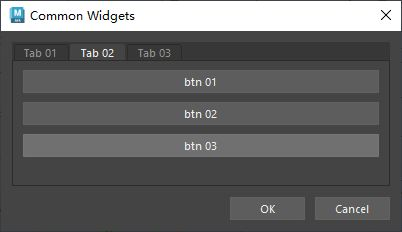

# 概述
`QTabWidget` 是 PySide6（Qt for Python）中的一个控件，属于 `PySide6.QtWidgets` 模块。它是一个选项卡式容器控件，用于在一个界面中组织多个页面，每个页面通过选项卡标签切换显示。以下是对 `QTabWidget` 的详细介绍：

### 1. **功能概述**
- **用途**：`QTabWidget` 提供了一个带有选项卡标签的界面，允许用户通过点击标签切换不同的子页面（通常是 `QWidget` 的子类）。常用于设置窗口、浏览器标签页等场景。
- **特点**：
  - 内置选项卡标签栏，简化页面切换操作。
  - 支持动态添加、移除选项卡。
  - 选项卡可设置文本、图标、提示信息等。
  - 支持选项卡拖动、关闭、位置调整等高级功能。
  - 提供信号用于响应用户交互（如选项卡切换、关闭）。

### 2. **主要方法**
以下是 `QTabWidget` 的常用方法：
- **`addTab(QWidget, label)`**：添加一个子控件（页面）并设置选项卡标签文本，返回选项卡索引。
- **`insertTab(index, QWidget, label)`**：在指定索引处插入选项卡。
- **`removeTab(index)`**：移除指定索引的选项卡（不删除页面控件）。
- **`setCurrentIndex(index)`**：设置当前显示的选项卡索引。
- **`setCurrentWidget(QWidget)`**：设置当前显示的页面控件。
- **`currentIndex()`**：返回当前选项卡的索引。
- **`currentWidget()`**：返回当前显示的页面控件。
- **`count()`**：返回选项卡总数。
- **`setTabText(index, text)`**：设置指定索引选项卡的标签文本。
- **`setTabIcon(index, QIcon)`**：设置指定索引选项卡的图标。
- **`setTabToolTip(index, text)`**：设置选项卡的鼠标悬停提示。
- **`setTabsClosable(bool)`**：启用或禁用选项卡关闭按钮。
- **`setMovable(bool)`**：启用或禁用选项卡拖动排序。
- **`setTabPosition(position)`**：设置选项卡位置（如 `QTabWidget.North`、`South`、`East`、`West`）。
- **`indexOf(QWidget)`**：返回指定页面的选项卡索引。
- **`widget(index)`**：返回指定索引的页面控件。

### 3. **信号**
`QTabWidget` 提供以下常用信号：
- **`currentChanged(int)`**：当当前选项卡索引变化时触发，传递新索引。
- **`tabCloseRequested(int)`**：当用户点击选项卡关闭按钮时触发，传递索引。
- **`tabBarClicked(int)`**：当选项卡被点击时触发，传递索引。
- **`tabBarDoubleClicked(int)`**：当选项卡被双击时触发，传递索引。

### 4. **使用示例**
以下是一个 PySide6 示例，展示如何使用 `QTabWidget` 创建一个包含两个选项卡的界面，支持切换和关闭选项卡：

```python
import sys
from PySide6.QtWidgets import (QApplication, QMainWindow, QTabWidget, 
                              QWidget, QVBoxLayout, QLabel)
from PySide6.QtCore import Qt

class MainWindow(QMainWindow):
    def __init__(self):
        super().__init__()
        self.setWindowTitle("QTabWidget 示例")
        
        # 创建 QTabWidget
        self.tab_widget = QTabWidget()
        self.setCentralWidget(self.tab_widget)
        
        # 创建页面1
        page1 = QWidget()
        page1_layout = QVBoxLayout(page1)
        page1_layout.addWidget(QLabel("这是页面 1 的内容"))
        
        # 创建页面2
        page2 = QWidget()
        page2_layout = QVBoxLayout(page2)
        page2_layout.addWidget(QLabel("这是页面 2 的内容"))
        
        # 添加选项卡
        self.tab_widget.addTab(page1, "页面 1")
        self.tab_widget.addTab(page2, "页面 2")
        
        # 启用关闭按钮和拖动
        self.tab_widget.setTabsClosable(True)
        self.tab_widget.setMovable(True)
        
        # 设置选项卡位置（可选）
        self.tab_widget.setTabPosition(QTabWidget.North)
        
        # 连接信号
        self.tab_widget.currentChanged.connect(self.on_tab_changed)
        self.tab_widget.tabCloseRequested.connect(self.on_tab_close)
        
    def on_tab_changed(self, index):
        print(f"当前选项卡索引: {index}, 标签: {self.tab_widget.tabText(index)}")
        
    def on_tab_close(self, index):
        print(f"关闭选项卡: {self.tab_widget.tabText(index)}")
        self.tab_widget.removeTab(index)

if __name__ == "__main__":
    app = QApplication(sys.argv)
    window = MainWindow()
    window.show()
    sys.exit(app.exec())
```

### 5. **代码说明**
- **创建 QTabWidget**：`self.tab_widget = QTabWidget()` 初始化选项卡控件。
- **添加选项卡**：通过 `addTab` 添加两个页面（`QWidget`），并设置标签文本。
- **启用功能**：`setTabsClosable(True)` 添加关闭按钮，`setMovable(True)` 允许拖动排序。
- **信号处理**：`currentChanged` 信号在切换选项卡时触发，`tabCloseRequested` 信号在点击关闭按钮时触发，移除对应选项卡。
- **布局**：每个页面使用 `QVBoxLayout` 组织内容。

### 6. **应用场景**
- **设置窗口**：如应用程序的偏好设置，分多个选项卡组织不同设置项。
- **浏览器界面**：模拟浏览器标签页，支持动态添加和关闭。
- **多文档界面**：显示多个文档，每个文档占用一个选项卡。
- **向导替代**：相比 `QStackedWidget`，`QTabWidget` 提供内置标签，适合简单分页。

### 7. **注意事项**
- **页面管理**：移除选项卡（`removeTab`）不会删除页面控件，需手动管理控件生命周期。
- **大小调整**：`QTabWidget` 会根据最大页面调整尺寸，确保所有页面适配。
- **性能**：选项卡较多时，建议优化页面内容加载（如延迟加载）。
- **自定义样式**：可通过 `setStyleSheet` 自定义选项卡外观，或使用 `QTabBar` 的方法进一步定制。
- **关闭按钮**：`setTabsClosable(True)` 仅为选项卡添加关闭按钮，需通过 `tabCloseRequested` 信号处理关闭逻辑。

### 8. **与 QStackedWidget 的区别**
- **`QTabWidget`**：自带选项卡标签栏，适合快速实现带标签的页面切换，操作直观但自定义性稍弱。
- **`QStackedWidget`**：无内置标签栏，需手动实现切换逻辑（如按钮、列表），但更灵活，适合复杂导航需求。

### 9. **高级功能**
- **图标支持**：通过 `setTabIcon` 为选项卡添加图标，提升视觉效果。
- **动态选项卡**：通过 `addTab` 和 `removeTab` 动态管理选项卡。
- **自定义标签**：可通过 `setTabBar` 使用自定义 `QTabBar` 实现复杂标签样式。
- **方向调整**：通过 `setTabPosition` 将选项卡放在顶部（默认）、底部、左侧或右侧。
- **键盘导航**：支持通过键盘（如左右箭头）切换选项卡。

如果需要更复杂的选项卡功能（如自定义标签渲染、动画效果），可以继承 `QTabBar` 或结合 `QStackedWidget` 和其他控件实现。

如需进一步示例（如动态添加选项卡、自定义样式、与 `QListWidget` 结合等），请告诉我！
# 案例1
- 选项卡控件，支持多个选项卡，每个选项卡可以添加控件
- [Open: Pasted image 20250807100044.png](attachments/c5723ba7a69db497ad69d964fb03a4cc_MD5.jpeg)

## 代码：
```python
from PySide2 import QtCore, QtWidgets


# 自定义控件类用于填充TabWidget
class CustomWidget01(QtWidgets.QWidget):
    def __init__(self, parent=None):
        super().__init__(parent)

        self.cb_01 = QtWidgets.QCheckBox("CB 01")
        self.cb_02 = QtWidgets.QCheckBox("CB 02")
        self.cb_03 = QtWidgets.QCheckBox("CB 03")

        main_layout = QtWidgets.QVBoxLayout(self)
        main_layout.addWidget(self.cb_01)
        main_layout.addWidget(self.cb_02)
        main_layout.addWidget(self.cb_03)
        main_layout.addStretch()


# 自定义控件类用于填充TabWidget
class CustomWidget02(QtWidgets.QWidget):
    def __init__(self, parent=None):
        super().__init__(parent)

        self.btn_01 = QtWidgets.QPushButton("btn 01")
        self.btn_02 = QtWidgets.QPushButton("btn 02")
        self.btn_03 = QtWidgets.QPushButton("btn 03")

        main_layout = QtWidgets.QVBoxLayout(self)
        main_layout.addWidget(self.btn_01)
        main_layout.addWidget(self.btn_02)
        main_layout.addWidget(self.btn_03)
        main_layout.addStretch()


class ToolDialog(QtWidgets.QDialog):
    """工具UI类"""

    # 用于保存窗口实例，实现窗口单例化
    _ui_instance = None

    def __init__(self, parent=None):
        """构造函数"""
        # 如果没有传入父窗口，则maya主窗口为父窗口
        if parent is None:
            parent = ToolDialog.maya_main_window()
        super().__init__(parent)

        self.setWindowTitle("Common Widgets")
        self.setMinimumSize(400, 200)

        self.create_widgets()
        self.create_layouts()
        self.create_connections()

    def create_widgets(self):
        """创建控件"""
        # 创建自定义控件实例
        self.custom_widget_01 = CustomWidget01()
        self.custom_widget_02 = CustomWidget02()
        # 创建TabWidget，并将QWidget添加到Tab
        self.tab_widget = QtWidgets.QTabWidget()
        self.tab_widget.addTab(self.custom_widget_01, "Tab 01")
        self.tab_widget.addTab(self.custom_widget_02, "Tab 02")
        self.tab_widget.addTab(QtWidgets.QPushButton("My Button"), "Tab 03")
        # OK and Cancel Button
        self.ok_btn = QtWidgets.QPushButton("OK")
        self.cancel_btn = QtWidgets.QPushButton("Cancel")

    def create_layouts(self):
        """创建布局"""

        btn_layout = QtWidgets.QHBoxLayout()
        btn_layout.addStretch()
        btn_layout.addWidget(self.ok_btn)
        btn_layout.addWidget(self.cancel_btn)

        main_layout = QtWidgets.QVBoxLayout(self)
        main_layout.addWidget(self.tab_widget)  # 添加 tab_widget
        main_layout.addLayout(btn_layout)

    def create_connections(self):
        """创建连接"""
        self.tab_widget.currentChanged.connect(self.on_current_index_changed)

    # 槽函数
    @QtCore.Slot(int)
    def on_current_index_changed(self, index):
        """当TabWidget控件切换Tab时调用,信号传入参数为Tab的索引"""
        print(f"Current Index: {index}")  # 打印当前选项卡索引

    def keyPressEvent(self, event):
        """重写keyPressEvent函数，在使用该工具时避免误操作maya
        比如按下键盘“s”键导致剋帧
        """
        pass

    @staticmethod
    def maya_main_window():
        """获取maya主界面的pyside实例"""
        app = QtWidgets.QApplication.instance()
        if app:
            for widget in app.topLevelWidgets():
                if widget.objectName == "MayaWindow":
                    return widget
        return None

    # 创建单例窗口
    @classmethod
    def show_singleton_dialog(cls):
        """显示单例窗口"""
        # 如果窗口单例为空，则创建窗口单例
        if not cls._ui_instance:
            cls._ui_instance = ToolDialog()
        # 如果窗口单例被隐藏，则显示
        if cls._ui_instance.isHidden():
            cls._ui_instance.show()
        # 其他情况，抬升窗口并激活
        else:
            cls._ui_instance.raise_()
            cls._ui_instance.activateWindow()


if __name__ == "__main__":
    ToolDialog.show_singleton_dialog()

```