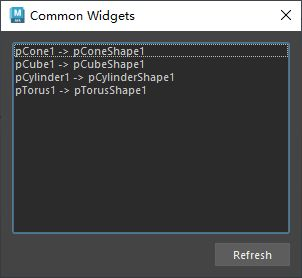

# 概述
`QListWidget` 是 PySide6（Qt for Python）中的一个控件，属于 `PySide6.QtWidgets` 模块。它是一个基于列表的控件，用于显示和管理一组项目（items），每个项目通常以文本形式展示，支持单选、多选、拖放、排序等功能。以下是对 `QListWidget` 的详细介绍：

### 1. **功能概述**
- **用途**：`QListWidget` 提供了一个简单易用的列表界面，适用于显示条目列表（如文件列表、选项列表等），用户可以通过点击、拖动等方式与列表交互。
- **特点**：
  - 支持添加、删除、编辑项目。
  - 支持单选、多选、图标显示。
  - 提供拖放、排序等高级功能。
  - 可以通过信号捕获用户交互（如点击、双击）。
  - 常用于导航菜单、选项选择或与 `QStackedWidget` 结合实现页面切换。

### 2. **主要方法**
以下是 `QListWidget` 的常用方法：
- **`addItem(item)`**：添加单个项目（可以是字符串或 `QListWidgetItem` 对象）。
- **`addItems(items)`**：添加多个项目（字符串列表）。
- **`insertItem(index, item)`**：在指定索引处插入项目。
- **`removeItemWidget(item)`**：移除项目的关联控件（但不删除项目本身）。
- **`clear()`**：清除所有项目。
- **`count()`**：返回列表中的项目数。
- **`currentItem()`**：返回当前选中的项目（`QListWidgetItem`）。
- **`currentRow()`**：返回当前选中项目的行号（索引）。
- **`setCurrentItem(item)`**：设置当前选中的项目。
- **`setCurrentRow(row)`**：设置当前选中的行号。
- **`selectedItems()`**：返回所有选中的项目列表。
- **`item(index)`**：返回指定索引处的 `QListWidgetItem`。
- **`takeItem(index)`**：移除并返回指定索引处的项目。
- **`setSelectionMode(mode)`**：设置选择模式（`SingleSelection`、`MultiSelection`、`ExtendedSelection` 等）。
- **`setSortingEnabled(bool)`**：启用或禁用自动排序。
- **`sortItems(order)`**：按指定顺序（`Qt.AscendingOrder` 或 `Qt.DescendingOrder`）排序项目。

### 3. **QListWidgetItem**
`QListWidget` 中的每个项目是 `QListWidgetItem` 类的实例，支持以下操作：
- **`setText(text)`**：设置项目的文本。
- **`setIcon(icon)`**：设置项目的图标（`QIcon`）。
- **`setToolTip(text)`**：设置鼠标悬停时的提示文本。
- **`setFlags(flags)`**：设置项目的标志（如是否可编辑、可选择，`Qt.ItemIsEditable`、`Qt.ItemIsSelectable` 等）。
- **`setData(role, value)`**：为项目设置自定义数据（如 `Qt.UserRole`）。
- **`text()`**：获取项目的文本。
- **`icon()`**：获取项目的图标。

### 4. **信号**
`QListWidget` 提供了丰富的信号，用于响应用户操作：
- **`itemClicked(QListWidgetItem)`**：当项目被单击时触发。
- **`itemDoubleClicked(QListWidgetItem)`**：当项目被双击时触发。
- **`currentItemChanged(QListWidgetItem, QListWidgetItem)`**：当前选中项目变化时触发，传递新旧项目。
- **`itemSelectionChanged()`**：当选择状态变化时触发。
- **`itemChanged(QListWidgetItem)`**：当项目内容（如文本）被编辑时触发。

### 5. **使用示例**
以下是一个简单的 PySide6 示例，展示如何使用 `QListWidget` 创建一个列表，并响应用户点击和双击事件：

```python
import sys
from PySide6.QtWidgets import QApplication, QMainWindow, QListWidget, QVBoxLayout, QWidget, QLabel
from PySide6.QtCore import Qt

class MainWindow(QMainWindow):
    def __init__(self):
        super().__init__()
        self.setWindowTitle("QListWidget 示例")
        
        # 创建主布局
        main_widget = QWidget()
        self.setCentralWidget(main_widget)
        layout = QVBoxLayout(main_widget)
        
        # 创建 QListWidget
        self.list_widget = QListWidget()
        self.list_widget.setSelectionMode(QListWidget.SingleSelection)  # 设置单选模式
        
        # 添加项目
        items = ["项目 1", "项目 2", "项目 3"]
        self.list_widget.addItems(items)
        
        # 设置项目可编辑
        for i in range(self.list_widget.count()):
            item = self.list_widget.item(i)
            item.setFlags(item.flags() | Qt.ItemIsEditable)
        
        # 创建标签用于显示点击信息
        self.label = QLabel("选择的项目: 无")
        
        # 连接信号
        self.list_widget.itemClicked.connect(self.on_item_clicked)
        self.list_widget.itemDoubleClicked.connect(self.on_item_double_clicked)
        
        # 添加控件到布局
        layout.addWidget(self.list_widget)
        layout.addWidget(self.label)
        
    def on_item_clicked(self, item):
        self.label.setText(f"选择的项目: {item.text()}")
        
    def on_item_double_clicked(self, item):
        self.label.setText(f"双击的项目: {item.text()}")

if __name__ == "__main__":
    app = QApplication(sys.argv)
    window = MainWindow()
    window.show()
    sys.exit(app.exec())
```

### 6. **代码说明**
- **创建 QListWidget**：`self.list_widget = QListWidget()` 初始化列表控件。
- **添加项目**：通过 `addItems` 添加字符串列表，每个字符串自动转换为 `QListWidgetItem`。
- **设置选择模式**：`setSelectionMode(QListWidget.SingleSelection)` 限制为单选。
- **项目编辑**：通过 `setFlags` 启用项目可编辑功能。
- **信号处理**：`itemClicked` 和 `itemDoubleClicked` 信号分别响应单击和双击，更新标签显示选中的项目。

### 7. **应用场景**
- **导航菜单**：与 `QStackedWidget` 结合，用于页面切换导航。
- **文件列表**：显示文件或目录列表，支持选择和操作。
- **选项选择**：展示一组选项，允许用户单选或多选。
- **动态列表**：支持用户添加、删除、编辑项目的动态界面。
- **拖放支持**：通过设置 `setDragEnabled(True)` 和 `setAcceptDrops(True)` 实现拖放功能。

### 8. **高级功能**
- **图标支持**：通过 `QListWidgetItem.setIcon` 为项目添加图标，增强视觉效果。
- **自定义数据**：使用 `setData` 和 `data` 方法存储额外信息（如 ID、元数据）。
- **拖放**：启用 `setDragDropMode`（如 `QListWidget.InternalMove`）实现项目拖动排序。
- **自定义外观**：通过 `QListWidgetItem.setFont`、`setForeground` 等自定义项目样式，或使用 `QStyledItemDelegate` 实现更复杂的渲染。

### 9. **注意事项**
- **性能**：当列表项较多时，建议优化数据加载（如延迟加载或分页）。
- **选择模式**：根据需求选择合适的 `SelectionMode`，如 `ExtendedSelection` 支持 Ctrl/Shift 多选。
- **可编辑性**：默认项目不可编辑，需通过 `Qt.ItemIsEditable` 启用。
- **与 QStackedWidget 结合**：常通过 `currentRowChanged` 信号与 `QStackedWidget.setCurrentIndex` 连接，实现页面切换。

### 10. **与 QTableWidget/QTreeWidget 的区别**
- **`QListWidget`**：适合简单的单列列表，易于使用，功能较轻量。
- **`QTableWidget`**：适合多列表格数据，支持复杂的数据展示。
- **`QTreeWidget`**：适合树形结构数据，支持层级关系。

如果需要更复杂的列表功能（如多列、复杂渲染），可以考虑 `QListView` 配合模型（如 `QStringListModel`）实现更灵活的定制。

如需进一步示例（如拖放、图标、与 `QStackedWidget` 结合等），请告诉我！
# 案例1
## 概述
- 列表控件
[Open: Pasted image 20250807111806.png](attachments/148c0364d6f5db254ff83cc38cc51766_MD5.jpeg)

- 该工具使用了QListWidget控件
- 遍历场景中所有的Mesh对象名称添加到列表项，并将transform名称添加到列表项数据（data）
- 点击列表项，将通过列表项data中的transform名称选择场景中的Mesh对象
## 代码
```python
from PySide2 import QtCore, QtWidgets
import maya.cmds as cmds


class ToolDialog(QtWidgets.QDialog):
    """工具UI类"""

    # 用于保存窗口实例，实现窗口单例化
    _ui_instance = None

    def __init__(self, parent=None):
        """构造函数"""
        # 如果没有传入父窗口，则maya主窗口为父窗口
        if parent is None:
            parent = ToolDialog.maya_main_window()
        super().__init__(parent)

        self.setWindowTitle("Common Widgets")
        self.setMinimumSize(300, 140)

        self.create_widgets()
        self.create_layouts()
        self.create_connections()
        # 刷新列表，获取场景中的mesh对象
        self.refresh_list()

    def create_widgets(self):
        """创建控件"""
        # 创建列表控件,并添加项
        self.list_widget = QtWidgets.QListWidget()

        # 创建按钮控件
        self.refresh_btn = QtWidgets.QPushButton("Refresh")

    def create_layouts(self):
        """创建布局"""

        btn_layout = QtWidgets.QHBoxLayout()
        btn_layout.addStretch()
        btn_layout.addWidget(self.refresh_btn)

        main_layout = QtWidgets.QVBoxLayout(self)
        main_layout.addWidget(self.list_widget)  # 添加列表控件
        main_layout.addLayout(btn_layout)

    def create_connections(self):
        """创建连接"""
        self.list_widget.currentItemChanged.connect(self.on_current_item_changed)
        self.refresh_btn.clicked.connect(self.refresh_list)

    def add_iterm(self, text, transform_name):
        """添加ListWidget项"""
        iterm = QtWidgets.QListWidgetItem(text)
        """设置添加项数据transform_name，用于选择添加项时选择场景中的transform对象
        * QtCore.Qt.UserRole 是一个 预定义的枚举值，通常用于为项（Item）设置或获取自定义数据。
        * PySide6中参数为 QtCore.Qt.ItemDataRole.UserRole
        """
        iterm.setData(QtCore.Qt.UserRole, transform_name)
        self.list_widget.addItem(iterm)

    # 槽函数
    @QtCore.Slot()
    def on_current_item_changed(self, iterm: QtWidgets.QListWidgetItem):
        """如果项存在，则获取项的数据（transform），并在场景中选择"""
        if iterm:
            transform_name = iterm.data(QtCore.Qt.UserRole)
            if transform_name:
                cmds.select(transform_name)

    @QtCore.Slot()
    def refresh_list(self):
        # 清空列表
        self.list_widget.clear()
        # 遍历maya场景获取所有Mesh和他的transform
        for mesh_name in cmds.ls(type="mesh"):
            transform_name = cmds.listRelatives(mesh_name, parent=True)[0]
            text = f"{transform_name} -> {mesh_name}"
            # 添加ListWidget项
            self.add_iterm(text, transform_name)

    def keyPressEvent(self, event):
        """重写keyPressEvent函数，在使用该工具时避免误操作maya
        比如按下键盘“s”键导致剋帧
        """
        pass

    @staticmethod
    def maya_main_window():
        """获取maya主界面的pyside实例"""
        app = QtWidgets.QApplication.instance()
        if app:
            for widget in app.topLevelWidgets():
                if widget.objectName == "MayaWindow":
                    return widget
        return None

    # 创建单例窗口
    @classmethod
    def show_singleton_dialog(cls):
        """显示单例窗口"""
        # 如果窗口单例为空，则创建窗口单例
        if not cls._ui_instance:
            cls._ui_instance = ToolDialog()
        # 如果窗口单例被隐藏，则显示
        if cls._ui_instance.isHidden():
            cls._ui_instance.show()
        # 其他情况，抬升窗口并激活
        else:
            cls._ui_instance.raise_()
            cls._ui_instance.activateWindow()


if __name__ == "__main__":
    ToolDialog.show_singleton_dialog()

```
# 列表组件多选
## 概述

在 **PySide2**（或 PySide6）中，`QtWidgets.QAbstractItemView` 是所有视图类（如 `QListView`, `QTableView`, `QTreeView`）的基类，提供了项目选择（selection）、编辑、滚动等通用机制。

你提到的这几个枚举值：
```python
self.list_widget.setSelectionMode(QtWidgets.QAbstractItemView.ContiguousSelection)

self.list_widget.setSelectionMode(QtWidgets.QAbstractItemView.ExtendedSelection)

self.list_widget.setSelectionMode(QtWidgets.QAbstractItemView.MultiSelection)
```

都是 `QAbstractItemView.SelectionMode` 的成员，用于控制视图中 **用户如何选择项目（item）**。

**推荐使用**：`QtWidgets.QAbstractItemView.ExtendedSelection` 符合大多数软件的使用习惯，例如maya。

---

## 概览：`QAbstractItemView.SelectionMode`

该枚举定义了用户在视图中可以选择多少项，以及选择方式。

- 常用值如下：

|枚举值|含义|
|---|---|
|`NoSelection`|不允许选择任何项目|
|`SingleSelection`|只允许选择一个项目|
|`MultiSelection`|可以不连续地选择多个项目|
|`ExtendedSelection`|可以通过 Shift/Control 选择多个项目（类似操作系统）|
|`ContiguousSelection`|只能选择一个连续的范围|

- 对比表

|模式|支持 Shift 连选|支持 Ctrl 多选|是否连续要求|用户体验|
|---|---|---|---|---|
|`ContiguousSelection`|✅ 是|❌ 否|✅ 必须连续|严格、限制性|
|`ExtendedSelection`|✅ 是|✅ 是|❌ 不要求|🟢 最灵活|
|`MultiSelection`|❌ 否|✅ 是|❌ 不要求|灵活但笨拙|
