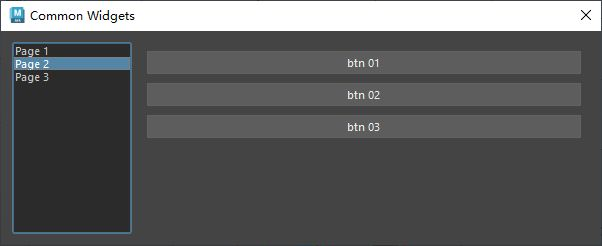

# 概述：堆栈控件
`QStackedWidget` 是 PySide（Qt for Python）中的一个容器类控件，属于 `PySide6.QtWidgets` 模块。它用于在同一区域内管理多个子控件（通常是 QWidget 的子类，如表单、页面等），每次只显示一个子控件，类似于选项卡切换的效果，但没有选项卡的标签栏。以下是对 `QStackedWidget` 的详细介绍：

### 1. **功能概述**
- **用途**：`QStackedWidget` 提供了一种堆叠布局方式，允许多个界面堆叠在一起，通过切换索引来显示不同的子控件。常用于实现多页面切换的界面，例如向导界面（Wizard）、设置面板等。
- **特点**：
  - 所有子控件共享相同的显示区域。
  - 仅当前索引对应的子控件可见，其他控件隐藏。
  - 支持动态添加、移除子控件。
  - 可以与按钮、列表或其他控件结合，通过信号和槽机制切换页面。

### 2. **主要方法**
以下是 `QStackedWidget` 的一些常用方法：
- **`addWidget(QWidget)`**：添加一个子控件到堆栈，返回该控件的索引。
- **`insertWidget(index, QWidget)`**：在指定索引处插入子控件。
- **`removeWidget(QWidget)`**：移除指定的子控件（但不删除）。
- **`setCurrentIndex(index)`**：设置当前显示的子控件的索引。
- **`setCurrentWidget(QWidget)`**：直接设置当前显示的子控件。
- **`currentWidget()`**：返回当前显示的子控件。
- **`currentIndex()`**：返回当前显示子控件的索引。
- **`count()`**：返回堆栈中子控件的总数。
- **`indexOf(QWidget)`**：返回指定子控件的索引。
- **`widget(index)`**：返回指定索引处的子控件。

### 3. **信号**
`QStackedWidget` 提供了以下常用信号，用于监控页面切换：
- **`currentChanged(int)`**：当当前显示的页面索引发生变化时触发，传递新索引。
- **`widgetRemoved(int)`**：当子控件被移除时触发，传递被移除控件的索引。

### 4. **使用示例**
以下是一个简单的 PySide6 示例，展示如何使用 `QStackedWidget` 创建一个包含两个页面的界面，并通过按钮切换页面：

```python
import sys
from PySide6.QtWidgets import (QApplication, QMainWindow, QStackedWidget, 
                              QPushButton, QVBoxLayout, QWidget, QLabel)

class MainWindow(QMainWindow):
    def __init__(self):
        super().__init__()
        self.setWindowTitle("QStackedWidget 示例")
        
        # 创建主布局
        main_widget = QWidget()
        self.setCentralWidget(main_widget)
        layout = QVBoxLayout(main_widget)
        
        # 创建 QStackedWidget
        self.stacked_widget = QStackedWidget()
        
        # 创建页面1
        page1 = QWidget()
        page1_layout = QVBoxLayout(page1)
        page1_layout.addWidget(QLabel("这是页面 1"))
        
        # 创建页面2
        page2 = QWidget()
        page2_layout = QVBoxLayout(page2)
        page2_layout.addWidget(QLabel("这是页面 2"))
        
        # 将页面添加到 QStackedWidget
        self.stacked_widget.addWidget(page1)
        self.stacked_widget.addWidget(page2)
        
        # 创建切换按钮
        btn_page1 = QPushButton("显示页面 1")
        btn_page2 = QPushButton("显示页面 2")
        
        # 连接按钮信号到切换函数
        btn_page1.clicked.connect(lambda: self.stacked_widget.setCurrentIndex(0))
        btn_page2.clicked.connect(lambda: self.stacked_widget.setCurrentIndex(1))
        
        # 添加控件到布局
        layout.addWidget(btn_page1)
        layout.addWidget(btn_page2)
        layout.addWidget(self.stacked_widget)
        
        # 连接 QStackedWidget 的信号
        self.stacked_widget.currentChanged.connect(self.on_page_changed)
        
    def on_page_changed(self, index):
        print(f"当前页面索引: {index}")

if __name__ == "__main__":
    app = QApplication(sys.argv)
    window = MainWindow()
    window.show()
    sys.exit(app.exec())
```

### 5. **代码说明**
- **创建 QStackedWidget**：`self.stacked_widget = QStackedWidget()` 初始化堆栈控件。
- **添加页面**：通过 `addWidget` 方法将两个 `QWidget`（页面）添加到堆栈。
- **切换页面**：通过按钮的 `clicked` 信号调用 `setCurrentIndex` 方法切换页面。
- **信号处理**：`currentChanged` 信号在页面切换时触发，打印当前页面索引。
- **布局**：使用 `QVBoxLayout` 组织按钮和 `QStackedWidget`，确保界面整洁。

### 6. **应用场景**
- **向导界面**：如安装程序或配置向导，逐步引导用户完成操作。
- **多页面表单**：如设置窗口，不同页面显示不同配置项。
- **选项卡式界面**：结合 `QListWidget` 或 `QComboBox` 实现类似选项卡的功能。
- **动态内容切换**：根据用户选择动态切换显示的内容。

### 7. **注意事项**
- **大小调整**：`QStackedWidget` 会根据其子控件中最大尺寸的控件调整自身大小，确保所有页面都能完整显示。
- **性能**：堆栈中的所有子控件都会加载到内存中，若页面复杂，需注意内存使用。
- **布局管理**：子控件通常需要自己的布局（如 `QVBoxLayout`）来组织内部内容。
- **动态管理**：可通过 `addWidget` 和 `removeWidget` 动态增删页面，但移除后需手动管理控件生命周期。

### 8. **与 QTabWidget 的区别**
- **`QStackedWidget`**：仅提供页面堆栈，需自行实现切换逻辑（如按钮、列表等），更灵活。
- **`QTabWidget`**：自带选项卡标签栏，适合快速实现选项卡界面，但自定义性稍弱。

如果需要更复杂的页面切换效果，可以结合 `QStackedWidget` 与其他控件（如 `QListWidget`、`QComboBox`）或使用动画（如 `QPropertyAnimation`）增强用户体验。

如需进一步示例或具体功能实现，请告诉我！
# 案例
- 连接列表控件和堆栈控件，使选择不同的列表项显示不同的堆栈组件
- [Open: Pasted image 20250807135842.png](attachments/e7b3a65120677e9f1131eaea1d4fb9c9_MD5.jpeg)

## 代码
```python
from PySide2 import QtCore, QtWidgets


# 自定义控件类用于填充StackedWidget
class CustomWidget01(QtWidgets.QWidget):
    def __init__(self, parent=None):
        super().__init__(parent)

        self.cb_01 = QtWidgets.QCheckBox("CB 01")
        self.cb_02 = QtWidgets.QCheckBox("CB 02")
        self.cb_03 = QtWidgets.QCheckBox("CB 03")

        main_layout = QtWidgets.QVBoxLayout(self)
        main_layout.addWidget(self.cb_01)
        main_layout.addWidget(self.cb_02)
        main_layout.addWidget(self.cb_03)
        main_layout.addStretch()


# 自定义控件类用于填充StackedWidget
class CustomWidget02(QtWidgets.QWidget):
    def __init__(self, parent=None):
        super().__init__(parent)

        self.btn_01 = QtWidgets.QPushButton("btn 01")
        self.btn_02 = QtWidgets.QPushButton("btn 02")
        self.btn_03 = QtWidgets.QPushButton("btn 03")

        main_layout = QtWidgets.QVBoxLayout(self)
        main_layout.addWidget(self.btn_01)
        main_layout.addWidget(self.btn_02)
        main_layout.addWidget(self.btn_03)
        main_layout.addStretch()


class ToolDialog(QtWidgets.QDialog):
    """工具UI类"""

    # 用于保存窗口实例，实现窗口单例化
    _ui_instance = None

    def __init__(self, parent=None):
        """构造函数"""
        # 如果没有传入父窗口，则maya主窗口为父窗口
        if parent is None:
            parent = ToolDialog.maya_main_window()
        super().__init__(parent)

        self.setWindowTitle("Common Widgets")
        self.setMinimumSize(600, 140)

        self.create_widgets()
        self.create_layouts()
        self.create_connections()

    def create_widgets(self):
        """创建控件"""
        # 创建列表控件,并添加项
        self.list_widget = QtWidgets.QListWidget()
        self.list_widget.setFixedWidth(120)
        self.list_widget.addItem("Page 1")
        self.list_widget.addItem("Page 2")
        self.list_widget.addItem("Page 3")
        self.list_widget.setCurrentRow(0)

        # 创建自定义控件实例
        self.custom_widget_01 = CustomWidget01()
        self.custom_widget_02 = CustomWidget02()

        # 创建堆栈控件,并添加自定义控件
        self.stack_widget = QtWidgets.QStackedWidget()
        self.stack_widget.addWidget(self.custom_widget_01)
        self.stack_widget.addWidget(self.custom_widget_02)
        self.stack_widget.addWidget(QtWidgets.QWidget())

    def create_layouts(self):
        """创建布局"""

        main_layout = QtWidgets.QHBoxLayout(self)
        main_layout.addWidget(self.list_widget)
        main_layout.addWidget(self.stack_widget)

    def create_connections(self):
        """创建连接：连接列表控件和堆栈控件
        列表控件切换行信号连接到堆栈控件设置索引函数
        """
        self.list_widget.currentRowChanged.connect(self.stack_widget.setCurrentIndex)

    def keyPressEvent(self, event):
        """重写keyPressEvent函数，在使用该工具时避免误操作maya
        比如按下键盘“s”键导致剋帧
        """
        pass

    @staticmethod
    def maya_main_window():
        """获取maya主界面的pyside实例"""
        app = QtWidgets.QApplication.instance()
        if app:
            for widget in app.topLevelWidgets():
                if widget.objectName() == "MayaWindow":
                    return widget
        return None

    # 创建单例窗口
    @classmethod
    def show_singleton_dialog(cls):
        """显示单例窗口"""
        # 如果窗口单例为空，则创建窗口单例
        if not cls._ui_instance:
            cls._ui_instance = cls()
        # 如果窗口单例被隐藏，则显示
        if cls._ui_instance.isHidden():
            cls._ui_instance.show()
        # 其他情况，抬升窗口并激活
        else:
            cls._ui_instance.raise_()
            cls._ui_instance.activateWindow()


if __name__ == "__main__":
    ToolDialog.show_singleton_dialog()

```