## 前言

这篇文章是写给初学者的PySide指南，同时也是学习过程中的一些总结，基本是面向maya用户。PySide2和PySide没有特别大的区别，所以后续我就统称为PySide。文章中我会在Maya中使用Pyside，但是对于不是Maya用户的的人，如果你读了这个文章，也希望对从未接触过 PySide 编程的人也有所帮助。

## 基本概念

### 什么是Pyside

**PySide**是跨平台的图形使用界面框架[Qt](https://link.zhihu.com/?target=https%3A//zh.wikipedia.org/wiki/Qt)的[Python](https://link.zhihu.com/?target=https%3A//zh.wikipedia.org/wiki/Python)版本。提供和[PyQt](https://link.zhihu.com/?target=https%3A//zh.wikipedia.org/wiki/PyQt)类似的功能，并兼容API。但与PyQt不同处为使用[LGPL](https://link.zhihu.com/?target=https%3A//zh.wikipedia.org/wiki/LGPL)许可。他是一个专门用于创建GUI的库，可以在Python中使用，也可以在不同的操作系统上使用（linux&windows）。此外大多数的DCC软件都使用它，比如Maya、houdini和Blender等。Pyside基于QT的C++框架。

### Pyside学起来简单

Pyside的写法相对简单，官方文档也有大量案例，善用谷歌与Chatgpt可以极大的提高学习效率。

### 使用Pyside的好处

- 可以在其他软件或平台上使用
- 可以创建模板便于重复使用
- 构建好看的图形界面优化用户体验

### Pyside与PyQt的区别

PySide和PyQt的主要区别是license的不同，还有一些PyQt有PySide没有的功能，但是如果没有特殊原因还是推荐使用PySide。license的区别，Pyside的商用限制比较宽松，PyQt的限制则比较严格。如果你想详细了解他们的区别可以在这里[区别](https://link.zhihu.com/?target=https%3A//www.pythonguis.com/faq/pyqt6-vs-pyside6/)详细了解。

## 第一个按钮

打开脚本编辑器，如果你看到的脚本编辑器与我不同，那是因为我是用了Charcoal Editor 2插件。这并不是重点

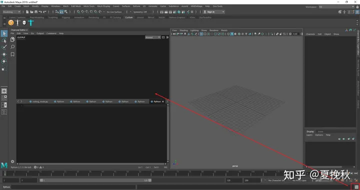

在没有这个插件的情况下 脚本编辑器的界面是这样的

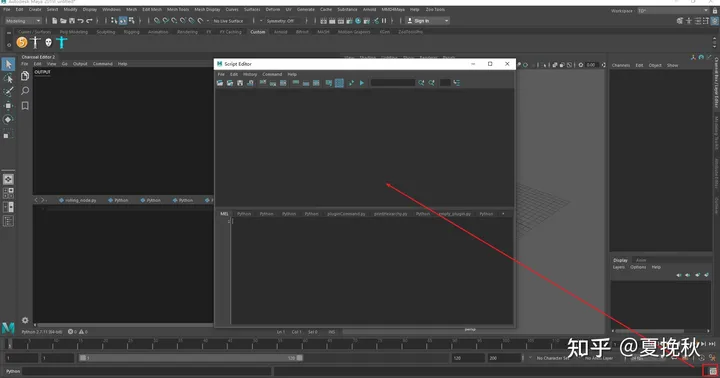

在脚本编辑器中输入**import PySide2**点击下面的按钮执行代码

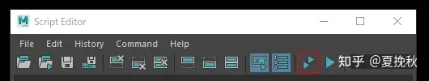

如果执行成功，上面的文本框中就会 **import PySide2**，如果你拼写有错就会得到一句报错


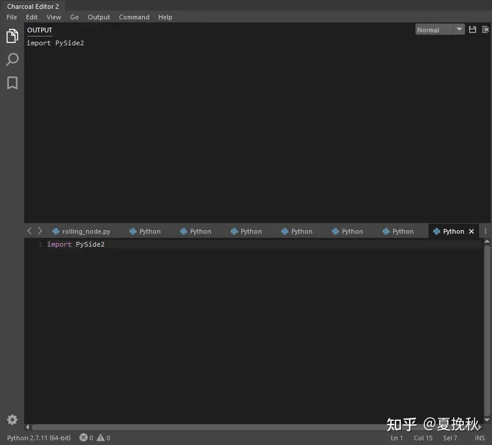

### 创建一个按钮

```python
from PySide2 import QtWidgets

button = QtWidgets.QPushButton("Hello Maya!")
button.show()
```

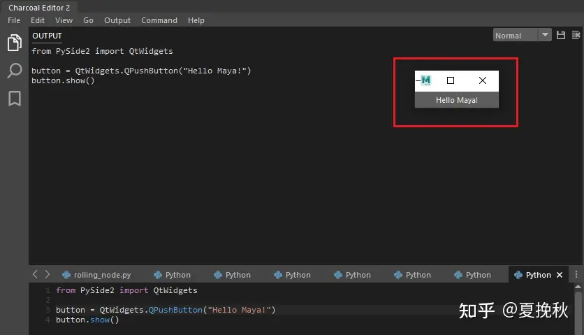

复制上面的代码粘贴到脚本编辑器中你就得到了一个按钮，但是当你再点击Maya主窗口时，你会发现按钮不见了，这是因为它被Maya的MayaWindow盖住。后面我们会讲到如何解决这个问题。

## 第一个界面

我再这里贴一段[Qt_for_Python_Tutorial_HelloWorld](https://link.zhihu.com/?target=https%3A//wiki.qt.io/Qt_for_Python_Tutorial_HelloWorld)的示例代码

```python
import sys
from PySide2.QtWidgets import QApplication, QLabel

app = QApplication(sys.argv)
#label = QLabel("Hello World!")
label = QLabel("<font color=red size=40>Hello World!</font>")
label.show()
app.exec_()
```

将他粘贴到脚本编辑器中运行会给我们一个报错： **A QApplication instance already exists.** 已经存在一个桌面应用程序。

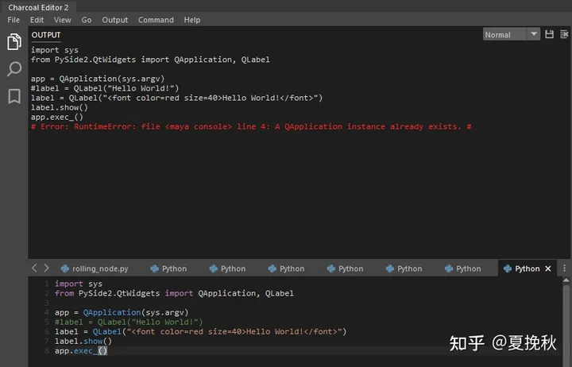

这段代码的意思是创建一个QApplication 作为 Qt 应用程序的主程序，但在Maya的情况下，Maya本身就是一个应用程序并且已经在运行，因此我们不能创建新的主应用程序**QApplication(sys.argv)。**所以需要修改代码为**QApplication.instance()** 才可以成功执行并得到下面的界面。

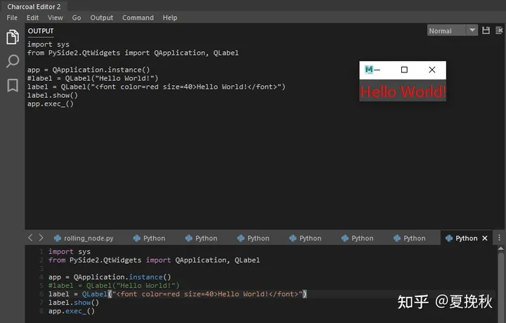

```python3
import sys
from PySide2.QtWidgets import QApplication, QLabel

app = QApplication.instance()
#label = QLabel("Hello World!")
label = QLabel("<font color=red size=40>Hello World!</font>")
label.show()
app.exec_()
```


或者可以删除导入QApplication的部分执行，直接显示小部件

```python
from PySide2.QtWidgets import QLabel
label = QLabel("<font color=red size=40>Hello World!</font>")
label.show()
```

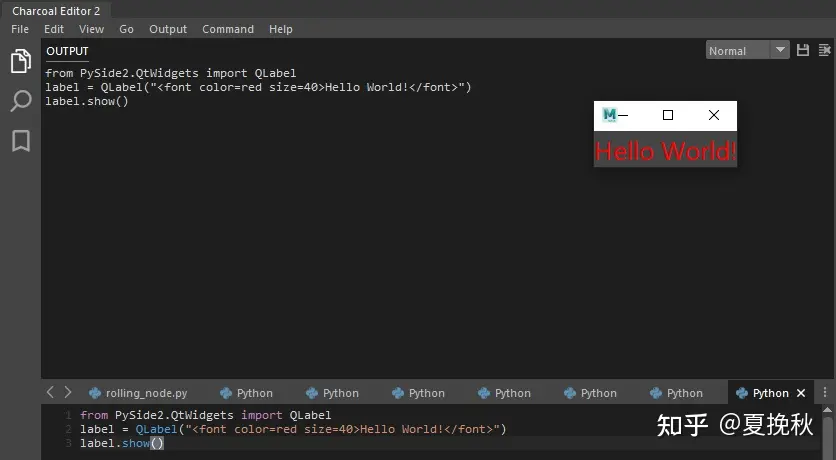

QLabel 是一个可以显示文本和图像的小部件。

### 什么是小部件（Widgets）

小部件是Pyside UI 的部件单元，使用Pyside创建图形界面的主要元素。在Pyside中通过组合与修改小部件来构建UI。

## 第一个窗口

在Maya中，脚本和插件通常是通过窗口来对用户进行更好的图形交互，如果只是依赖代码的话，对于美术制作人员或者不懂代码的人将会十分的不友好，所以开始创建我们的第一个窗口吧。

```python
from PySide2 import QtWidgets
from PySide2 import QtGui

widget = QtWidgets.QWidget()
widget.resize(300, 200)
widget.setWindowTitle("First Window")

widget.show()
```

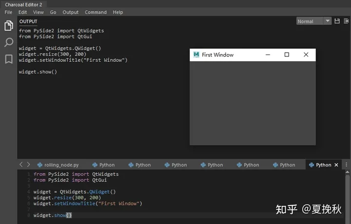

**from PySide2 import QtWidgets** 在这里做必要的导入。基本的 GUI 小部件可以在 QtWidgets中找到。

**widget = QtWidgets.QWidget()** QWidget 类是所有图形界面对象的基类。未嵌入父小部件的小部件称为窗口

**widget.resize(300, 200)** resize() 方法调整小部件的大小。我们将宽度更改为300px，将高度更改为 200px。

**widget.setWindowTitle("First Window")** 可以在此处设置窗口的标题。如果未设置标题，则标题将为windowFilePath，因此对于 Maya，它将`Maya-<version>`被命名为类似

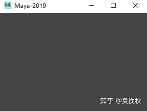

**widget.show()** show() 方法可以显示一个小部件及其子小部件。

## 创建一个带按钮的窗口

这次我们会接触到类这个概念，熟悉python或其他语言的人对这个概念并不陌生。因为Pyside基本都是用类来构建UI，所以之后的代码我们都会用类来构建。

```python
from PySide2 import QtWidgets
from PySide2 import QtGui

class Example(QtWidgets.QWidget):
    def __init__(self, parent=None):
        super(Example, self).__init__(parent)
        
        self.create_ui()
        
    def create_ui(self):
        # self.resize(400, 270)
        # self.move(500, 300)
        self.setGeometry(300, 300, 400, 200)
        # 设置标题
        self.setWindowTitle("Close Button")
        # 创建关闭按钮
        close_button = QtWidgets.QPushButton("close", self)
        # 移动按钮位置
        close_button.move(150,75)
        # 设置按钮大小最小值
        close_button.setMinimumSize(100,50)
        # 连接close方法
        close_button.clicked.connect(self.close)
        
        
if __name__ == "__main__":
    example = Example()
    example.show()                                               
```

**class Example(QtWidgets.QWidget):** 这个例子继承自一个叫QWidget的类，继承了一个叫QWidget的类并创建了一个新的类叫Example，继承说的就是这个意思。并且在一个类中定义**__init__和create_ui方法，**但是在我解释这个之前, 说明一下self 是类本身，即名为Example 的类。

**def **init**(self, parent=None, *args, **kwargs):** 它是在初始化时创建的，用于定义UI。总是最先调用的。

**def create_ui(self):** 主要包括了UI的实现代码。具体含义标注在代码中

### 信号与槽

Qt的功能定义了重要的信号和槽，基本上可以用来实现widget之间或者widget和你自己的Python代码之间的通信，这个时候有一个按钮有一个代码，当你按下close按钮时 窗口就会关闭

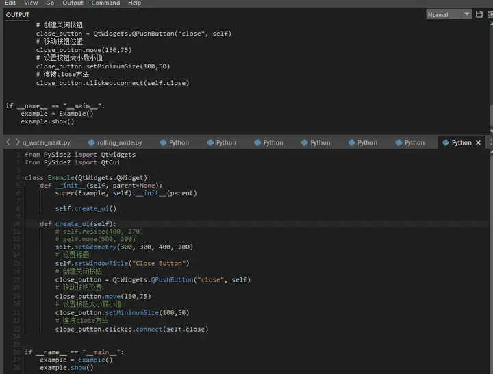

## 创建带菜单的界面

这里会介绍应用程序中使用的菜单、工具栏与状态栏

菜单是放置在菜单栏上的一组命令，工具栏上有应用程序中常用命令的按钮，状态栏则是显示状态信息的小部件。

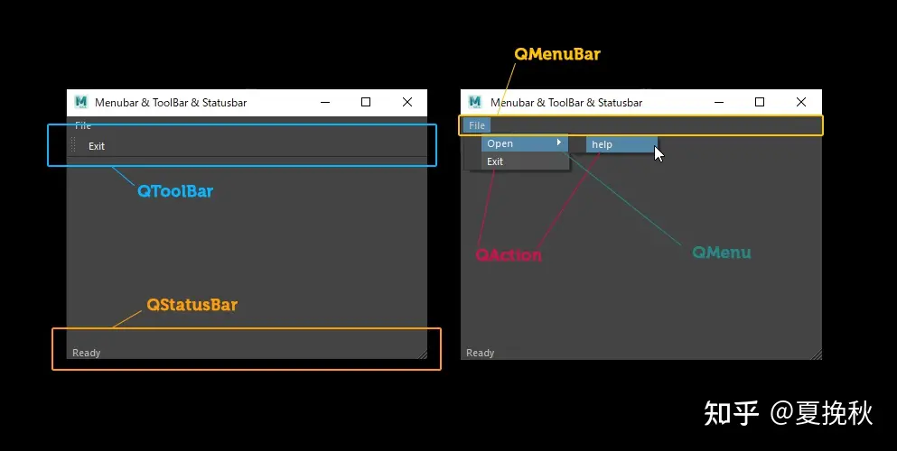

```python
from PySide2 import QtWidgets
from PySide2 import QtGui

class Example(QtWidgets.QMainWindow):
    def __init__(self, parent=None):
        super(Example, self).__init__(parent)
        
        self.create_ui()
        
    def create_ui(self):
        # self.resize(400, 270)
        # self.move(500, 300)
        self.setGeometry(300, 300, 400, 400)
        # 设置标题
        self.setWindowTitle("Menubar & ToolBar & Statusbar")
        # 创建一个菜单
        open_menu = QtWidgets.QMenu("Open")
        # 在这个菜单中添加名为help的action
        open_menu.addAction("help")
        
        # 创建关闭窗口功能的action
        exit_action = QtWidgets.QAction("Exit", self)
        # 为这个功能设置快捷键
        exit_action.setShortcut("Ctrl+G")
        # 连接close方法
        exit_action.triggered.connect(self.close)
        
        # 创建一个菜单栏
        menu_bar = self.menuBar()
        # 向菜单栏中添加菜单
        file_menu = menu_bar.addMenu("File")
        file_menu.addMenu(open_menu)
        # 在这个菜单中添加名为Exit的action
        file_menu.addAction(exit_action)
        
        # 创建一个工具栏
        self.tool_bar = self.addToolBar("Exit")
        # 在这个工具栏中添加名为Exit的action
        self.tool_bar.addAction(exit_action)
        
        # 在状态栏中显示一条消息
        self.statusBar().showMessage("Ready")
        
if __name__ == "__main__":
    example = Example()
    example.show()
```

上文中使用了[QWidget](https://link.zhihu.com/?target=https%3A//doc.qt.io/qt-5/qwidget.html)，为什么这次中使用了QMainWindow？

顾名思义，QMainWindow 提供了一个主窗口，可以轻松创建带有状态栏、工具栏和菜单栏的经典应用程序。在构建PySide UI 时，基本流程是准备一个 QMainWindow 并嵌入 QWidgets、QPushButtons 等小部件.。在那个 QMainWindow 中创建UI。

[QMenu](https://link.zhihu.com/?target=https%3A//doc.qt.io/qt-5/qmenu.html)由一系列操作项组成，可以使用 addAction()、addActions()、insertAction() 函数添加操作

可以通过创建[QAction](https://link.zhihu.com/?target=https%3A//doc.qt.io/qt-5/qaction.html)来跨多个菜单和工具栏使用它，而无需编写QPushButton或回调。在上面的示例中**triggered.connect**，该操作由此外触发，因为**Ctrl + G**设置了快捷方式，运行本例时可以用**Ctrl+G**关闭窗口

**self.menuBar()**为自己创建一个菜单栏，即 QMainWindow，返回[一个 QMenuBar](https://link.zhihu.com/?target=https%3A//doc.qt.io/qt-5/qmenubar.html)并向菜单栏添加菜单

**self.addToolBar()**为自己创建一个工具栏，即 QMainWindow，返回一个[QToolBar](https://link.zhihu.com/?target=https%3A//doc.qt.io/qt-5/qtoolbar.html)并向工具栏添加Action

**self.statusBar()**在第一次调用中创建一个状态栏并返回[QStatusBar](https://link.zhihu.com/?target=https%3A//doc.qt.io/qt-5/qstatusbar.html)即 QMainWindow 的状态栏showMessage() 在状态栏中显示一条消息

## 后记

第一篇入门文章中主要说了一些Pyside的概念与简单应用，在下一篇文章中会主要介绍 **信号与槽 布局** 等概念，帮助读者一步步创建出一个maya的脚本或插件的图形界面模板。讲出来是为了帮助自己更好的理解和沉淀，若有错误请及时指出。_(:з」∠)_
