## 前言

在上一篇文章中介绍了Pyside在Maya中的基本使用方式，但对于Pyside来说还有 **布局管理 信号与槽** 等重要概念没有介绍到，这篇文章会逐一介绍并带大家写一个相对复用性高的界面模板。

## 什么是布局管理

像PySide这样的GUI编程要做的就是布局管理，布局管理就是widget如何在窗口上排列，管理方式有两种，一种是绝对定位，一种是布局类。

绝对定位以像素为单位指定每个小部件的位置和大小。使用绝对定位时有几点需要了解

- 应用程序在不同平台上看起来可能不同
- 调整窗口大小并不会改变小部件的大小和位置
- 更改应用程序字体会破坏布局
- 使用不同分辨率的显示器（2k/4k）时，布局可能会折叠

先看一段代码：

```python
from PySide2 import QtWidgets
from PySide2 import QtGui

class Example(QtWidgets.QMainWindow):
    def __init__(self, parent=None):
        super(Example, self).__init__(parent)
        
        self.create_ui()
        
    def create_ui(self):
        self.setGeometry(500, 300, 400, 270)
        # 设置标题
        self.setWindowTitle("Absolute Layout")
        
        lable_1 = QtWidgets.QLabel("Maya Pyside2", self)
        lable_1.move(50, 40)
        
        lable_1 = QtWidgets.QLabel("Tutorials", self)
        lable_1.move(150, 90)
        
        
if __name__ == "__main__":
    example = Example()
    example.show()
```

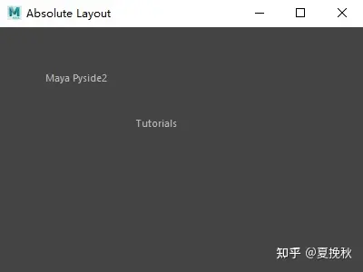

在本例中，我们调用了move()方法将widget 初始放置在左上角，x值从左到右递增。并且y值从上到下递增

### 盒子布局

对于一定数量的小部件，我们人为手动去一个个设置显然时费时费力，效果也不好。使用布局类进行布局管理更灵活，也更容易使用小部件。

对于盒子布局，基本的布局类有[QHBoxLayout](https://link.zhihu.com/?target=https%3A//doc.qt.io/qt-5/qhboxlayout.html)和[QVBoxLayout](https://link.zhihu.com/?target=https%3A//doc.qt.io/qt-5/qvboxlayout.html)这两类分别对widget进行横向和纵向的排列。他们都是[QBoxLayout](https://link.zhihu.com/?target=https%3A//doc.qt.io/qt-5/qboxlayout.html)的子类，后面会称他们为 **水平布局** 和 **垂直布局**。

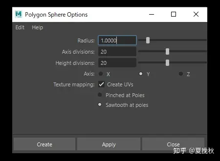

例如，要使用上面 Maya 选项屏幕上的三个常用按钮创建一个窗口。创建这样的布局需要有一个QHBoxLayout和一个QVBoxLayout，十分简单。

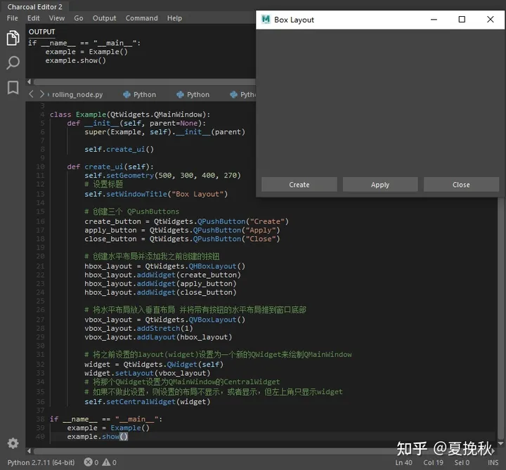

```python
from PySide2 import QtWidgets
from PySide2 import QtGui

class Example(QtWidgets.QMainWindow):
    def __init__(self, parent=None):
        super(Example, self).__init__(parent)
        
        self.create_ui()
        
    def create_ui(self):
        self.setGeometry(500, 300, 400, 270)
        # 设置标题
        self.setWindowTitle("Box Layout")
       
        # 创建三个 QPushButtons
        create_button = QtWidgets.QPushButton("Create")
        apply_button = QtWidgets.QPushButton("Apply")
        close_button = QtWidgets.QPushButton("Close")
        
        # 创建水平布局并添加我之前创建的按钮
        hbox_layout = QtWidgets.QHBoxLayout()
        hbox_layout.addWidget(create_button)
        hbox_layout.addWidget(apply_button)
        hbox_layout.addWidget(close_button)
        
        # 将水平布局放入垂直布局 并将带有按钮的水平布局推到窗口底部
        vbox_layout = QtWidgets.QVBoxLayout()
        vbox_layout.addStretch(1)
        vbox_layout.addLayout(hbox_layout)
        
        # 将之前设置的layout(widget)设置为一个新的QWidget来绘制QMainWindow
        widget = QtWidgets.QWidget(self)
        widget.setLayout(vbox_layout)
        # 将那个QWidget设置为QMainWindow的CentralWidget
        # 如果不做此设置，则设置的布局不显示，或者显示，但左上角只显示widget
        self.setCentralWidget(widget)
        
if __name__ == "__main__":
    example = Example()
    example.show()
```

### 网格布局

网格布局将空间划分为行和列，可以使用[QGridLayout](https://link.zhihu.com/?target=https%3A//doc.qt.io/qt-5/qgridlayout.html)布局创建网格布局，下如中Maya的变换属性就是如此

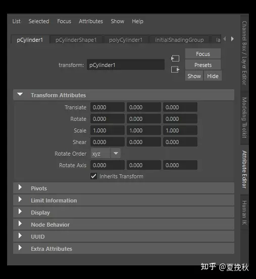

```python
from PySide2 import QtWidgets
from PySide2 import QtGui

class Example(QtWidgets.QMainWindow):
    def __init__(self, parent=None):
        super(Example, self).__init__(parent)
        
        self.create_ui()
        
    def create_ui(self):
        self.setGeometry(500, 300, 400, 270)
        # 设置标题
        self.setWindowTitle("Grid Layout")

        # 创建 QLabel 和 QGridLayout
        translate_label = QtWidgets.QLabel("Translate")
        rotate_label = QtWidgets.QLabel("Rotate")
        scale_label = QtWidgets.QLabel("Scale")
        
        grid_layout = QtWidgets.QGridLayout()
        
        # 0行目
        grid_layout.addWidget(translate_label, 0, 0)
        grid_layout.addWidget(QtWidgets.QLineEdit("0.1"), 0, 1)
        grid_layout.addWidget(QtWidgets.QLineEdit("0.2"), 0, 2)
        grid_layout.addWidget(QtWidgets.QLineEdit("0.3"), 0, 3)
        
        # 1行目
        grid_layout.addWidget(rotate_label, 1, 0)
        grid_layout.addWidget(QtWidgets.QLineEdit("1.1"), 1, 1)
        grid_layout.addWidget(QtWidgets.QLineEdit("1.2"), 1, 2)
        grid_layout.addWidget(QtWidgets.QLineEdit("1.3"), 1, 3)
        
        # 2行目
        grid_layout.addWidget(scale_label, 2, 0)
        grid_layout.addWidget(QtWidgets.QLineEdit("2.1"), 2, 1)
        grid_layout.addWidget(QtWidgets.QLineEdit("2.2"), 2, 2)
        grid_layout.addWidget(QtWidgets.QLineEdit("2.3"), 2, 3)
        
        # 将之前设置的layout(widget)设置为一个新的QWidget来绘制QMainWindow
        widget = QtWidgets.QWidget(self)
        widget.setLayout(grid_layout)
        # 将那个QWidget设置为QMainWindow的CentralWidget
        # 如果不做此设置，则设置的布局不显示，或者显示，但左上角只显示widget
        self.setCentralWidget(widget)
        
if __name__ == "__main__":
    example = Example()
    example.show()
```

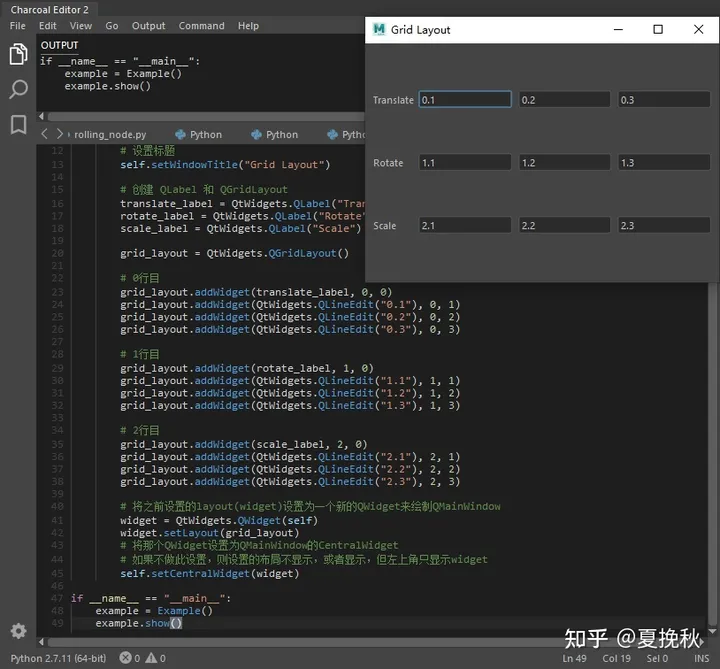

在QGridLayout的情况下[可以使用addWidget() 方法](https://link.zhihu.com/?target=https%3A//doc.qt.io/qt-5/qgridlayout.html%23addWidget-1)添加小部件，但与 QBoxLayout 布局类不同，必须将行数和列数指定为参数，当然一个个的创建显然有些麻烦。我们可以利用for循环简化代码。

```python
from PySide2 import QtWidgets
from PySide2 import QtGui

class Example(QtWidgets.QMainWindow):
    def __init__(self, parent=None):
        super(Example, self).__init__(parent)
        
        self.create_ui()
        
    def create_ui(self):
        self.setGeometry(500, 300, 400, 270)
        # 设置标题
        self.setWindowTitle("Grid Layout")

        # 创建 QLabel 和 QGridLayout
        labels_text = ["Translate", "Rotate", "Scale"]
        labels = [QtWidgets.QLabel(text) for text in labels_text]
        
        grid_layout = QtWidgets.QGridLayout()
        
        for count, label in enumerate(labels):
            grid_layout.addWidget(labels[count], count, 0)
            for column in range(1, 4):
                grid_layout.addWidget(QtWidgets.QLineEdit("%s.%s" % (count, column)), count, column)
        
        # 将之前设置的layout(widget)设置为一个新的QWidget来绘制QMainWindow
        widget = QtWidgets.QWidget(self)
        widget.setLayout(grid_layout)
        # 将那个QWidget设置为QMainWindow的CentralWidget
        # 如果不做此设置，则设置的布局不显示，或者显示，但左上角只显示widget
        self.setCentralWidget(widget)
        
if __name__ == "__main__":
    example = Example()
    example.show()
```

上面的代码会拉伸，如果你不想使用拉伸，你可以通过设置 **QLayout.SetMinAndMaxSize** 或 **QLayout.SetFixedSize** 和 **setSizeConstraint** 来停止拉伸

grid_layout.setSizeConstraint(QtWidgets.QLayout.SetFixedSize)

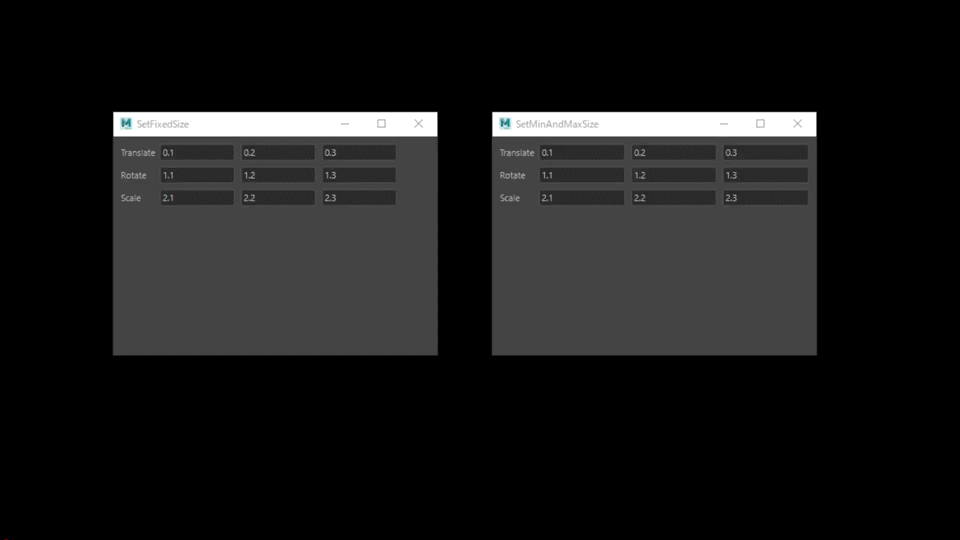

## 信号与槽 Signals & Slots

### 什么是信号

信号是小部件在发生某事时发出的通知。

某事可以是按钮按下、输入框文本更改、鼠标光标进入或离开窗口等等。

信号由用户操作触发，但不是一个硬性规定。

信号还可以发送数据，这些数据不仅可以告诉您发生了什么，还可以提供有关所发生情况的上下文。您可以并且还可以创建自己的自定义信号（我们将在下文中介绍）

### 什么是槽

Slot是Qt用来作为信号接收者的名字。在Python中，你可以把你的应用程序中的任何函数或方法当作一个槽。如果你连接一个槽，槽发送数据，接收函数也可以接收那个数据.PySide 中的许多小部件都有内置插槽，允许您直接连接 PySide 小部件。

```python
from PySide2 import QtWidgets
from PySide2 import QtGui

class Example(QtWidgets.QMainWindow):
    def __init__(self, parent=None):
        super(Example, self).__init__(parent)
        
        self.create_ui()
        
    def create_ui(self):
        self.setGeometry(500, 300, 400, 270)
        # 设置标题
        self.setWindowTitle("Signals & Slots")
 
        button = QtWidgets.QPushButton("Press Me!")
        button.setCheckable(True)
        button.clicked.connect(self.slot_clicked)
 
        self.setCentralWidget(button)
        
    def slot_clicked(self):
        print("Clicked!")
        
if __name__ == "__main__":
    example = Example()
    example.show()
```

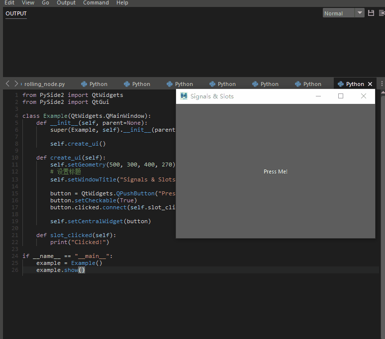

在这段代码中，QMainWindow 将 QPushButton 设置为中央小部件，我们接收信号，将此按钮连接到自定义 Python 方法 **def slot_clicked(self):** 单击该按钮，您应该会在 ScriptEditor 中看到文本“Clicked!”

### 接受数据

在开头提到信号发送数据以提供有关所发生事件的上下文，**clicked()** 方法也不例外，按钮的选中（或切换）状态由 Bool 提供。**void QAbstractButton::clicked(bool checked = false)**。在普通按钮中，这总是 False 所以我忽略了第一个插槽中的这个数据，但是你可以使用 **setCheckable** 使按钮可检查并查看效果。

查看按钮状态，正常情况下，**# button.clicked.connect(self.slotClicked)**可以运行**，**但是在Maya 2019中这是不可能的，需要使用lamdba函数来获取状态**button.clicked.connect(lambda: self.slot_toggled(button.isChecked()))**

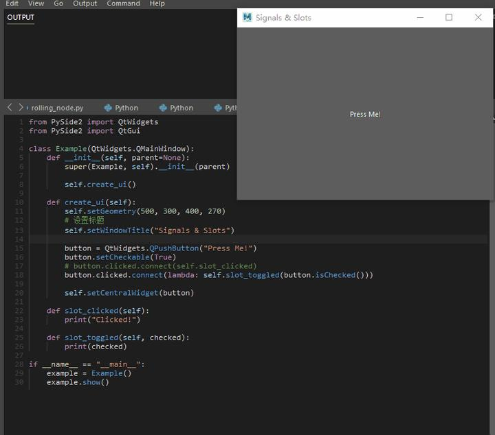

### 将数据储存在变量中

如果你想将小部件的当前状态或者处理的结果反映给其他小部件，将它存储在一个Python变量中会很方便。将它存储在一个变量中允许您像对待任何其他 Python 变量一样处理该值而无需访问原本的小部件，可以将它存储为一个单独的变量。

我将按钮的选中值存储在一个名为 **self.isChecked** 的变量中。可以顺利地将信息传输到另一个窗口。运行后，按下 QPushButton 应该改变一侧 UI 的 QLabel。如果小部件不提供发送其当前状态的信号的方法，则需要直接在事件代码中从小部件获取值。

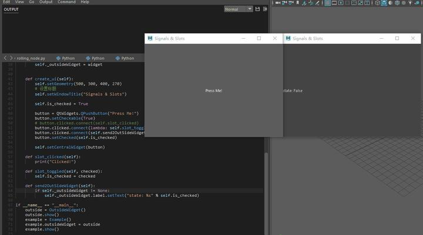

```python
from PySide2 import QtWidgets
from PySide2 import QtGui

class OutsideWidget(QtWidgets.QMainWindow):
    def __init__(self, parent=None):
        super(OutsideWidget, self).__init__(parent)
        
        self.create_ui()
 
    def create_ui(self):
        self.setGeometry(900, 300, 400, 270)
        self.setWindowTitle("Signals & Slots")
 
        self.label = QtWidgets.QLabel("States?")
        self.setCentralWidget(self.label)


class Example(QtWidgets.QMainWindow):
    def __init__(self, parent=None):
        super(Example, self).__init__(parent)
        
        self._outsideWidget = None
        
        self.create_ui()
        
    
    @property
    def outsideWidget(self):
        pass
 
    @outsideWidget.getter
    def outsideWidget(self):
        return self._outsideWidget
 
    @outsideWidget.setter
    def outsideWidget(self, widget):
        self._outsideWidget = widget    
    
        
    def create_ui(self):
        self.setGeometry(500, 300, 400, 270)
        # 设置标题
        self.setWindowTitle("Signals & Slots")
        
        self.is_checked = True
 
        button = QtWidgets.QPushButton("Press Me!")
        button.setCheckable(True)
        # button.clicked.connect(self.slot_clicked)
        button.clicked.connect(lambda: self.slot_toggled(button.isChecked()))
        button.clicked.connect(self.send2OutSideWidget)
        button.setChecked(self.is_checked)
 
        self.setCentralWidget(button)
        
    def slot_clicked(self):
        print("Clicked!")
        
    def slot_toggled(self, checked):
        self.is_checked = checked
        
    def send2OutSideWidget(self):
        if self._outsideWidget != None:
            self._outsideWidget.label.setText("state: %s" % self.is_checked)
        
if __name__ == "__main__":
    outside = OutsideWidget()
    outside.show()
    example = Example()
    example.outsideWidget = outside
    example.show()
    
```

### 界面变化

除了QPushButton之外还有很多类型的信号，比如QSlider经常使用valueChanged，但是如果使用这个信号，就可以通过移动滑块来改变窗口的大小。

```python
from PySide2 import QtWidgets
from PySide2 import QtCore
from PySide2 import QtGui

class Example(QtWidgets.QMainWindow):
    def __init__(self, parent=None):
        super(Example, self).__init__(parent)
        
        self._outsideWidget = None
        
        self.create_ui()
        
        
    def create_ui(self):
        self.setWindowTitle("change WindowSize")
 
        self.animation = QtCore.QPropertyAnimation(self, b"geometry")
        self.animation.setDuration(450)
        self.animation.setEasingCurve(QtCore.QEasingCurve.InOutQuint)
 
        slide = QtWidgets.QSlider(QtCore.Qt.Horizontal, self)
        slide.setMinimum(200)
        slide.setMaximum(600)
        slide.valueChanged.connect(self.change_window_size(slide))
 
    def change_window_size(self, slide):
        def _change_window_size():
            x = self.geometry().x()
            y = self.geometry().y()
            width = slide.value()
            height = self.geometry().height()
            self.animation.setEndValue(QtCore.QRect(x, y, width, height))
            self.animation.start()
 
        return _change_window_size
        
if __name__ == "__main__":
    example = Example()
    example.show()
    
```

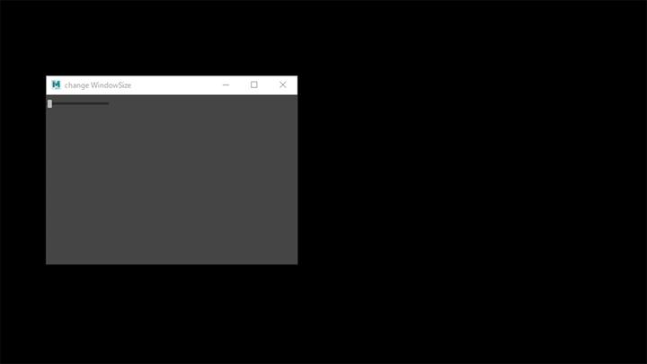

### 自定义信号与槽

[QtCore.Signal](https://link.zhihu.com/?target=https%3A//doc.qt.io/qtforpython-5/PySide2/QtCore/Signal.html)可以使用 QtCore.Signal() 类定义信号，并可以将对应于 C++ 的 Python 类型或 C++ 类型作为参数传递

[QtCore.Slot](https://link.zhihu.com/?target=https%3A//doc.qt.io/qtforpython-5/PySide2/QtCore/Slot.html)可以使用 QtCore.Signal() 类定义信号，并可以将对应于 C++ 的 Python 类型或 C++ 类型作为参数传递

使用 QtCore.Slot() 装饰器分配和重载插槽，要定义签名，只需传递 QtCore.Signal() 类之类的类型

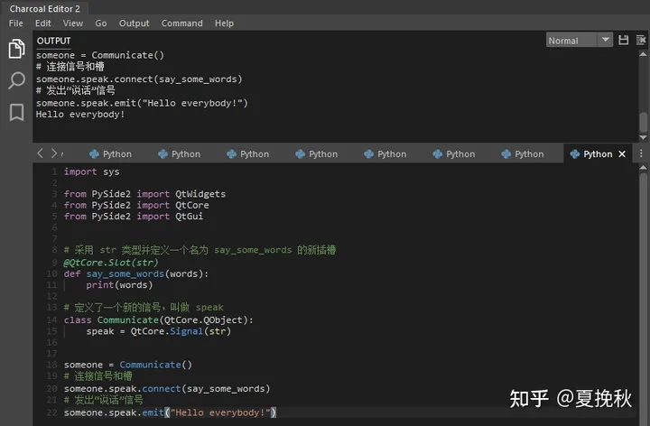

```python
import sys

from PySide2 import QtWidgets
from PySide2 import QtCore
from PySide2 import QtGui


# 采用 str 类型并定义一个名为 say_some_words 的新插槽
@QtCore.Slot(str)
def say_some_words(words):
    print(words)
 
# 定义了一个新的信号，叫做 speak
class Communicate(QtCore.QObject):
    speak = QtCore.Signal(str)
 
 
someone = Communicate()
# 连接信号和槽
someone.speak.connect(say_some_words)
# 发出“说话”信号
someone.speak.emit("Hello everybody!")
```

扩展代码使其可以处理 int 和 str 两种类型

```python
@QtCore.Slot(int)
@QtCore.Slot(str)
def say_something(stuff):
    print(stuff)
 
 
class Communicate(QtCore.QObject):
    speak_number = QtCore.Signal(int)
    speak_word = QtCore.Signal(str)
 
 
someone = Communicate()
someone.speak_number.connect(say_something)
someone.speak_word.connect(say_something)
someone.speak_number.emit(10)
someone.speak_word.emit("Hello everybody!")
```

## 图形界面模板

在了解了这么多知识后，可以开始为maya创建自己的界面模板了。下图对这个界面结构有一个清晰的划分

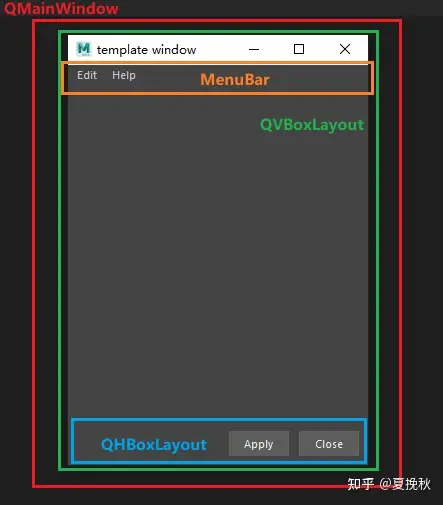

```python
from PySide2 import QtWidgets
from PySide2 import QtCore
from PySide2 import QtGui
from shiboken2 import wrapInstance

import maya.OpenMayaUI as omui

def maya_main_window():
    '''
    Returns:返回Maya主窗口作为Python对象
    '''
    main_window_ptr = omui.MQtUtil_mainWindow()
    return wrapInstance(long(main_window_ptr), QtWidgets.QWidget)

class TemplateWindow(QtWidgets.QMainWindow):

    def __init__(self, parent=maya_main_window()):
        super(TemplateWindow, self).__init__(parent)

        # 设置标题
        self.setWindowTitle("template window")
        # 设置宽高    
        self.setMinimumSize(300, 400)

        self.create_actions()
        self.create_menus()
        self.create_widgets()
        self.create_layouts()
        self.create_connections()

    # 创建action
    def create_actions(self):
        self.show_settings_action = QtWidgets.QAction("setting...", self)
        self.show_settings_action.triggered.connect(self.show_settings_dialog)

        self.show_about_action = QtWidgets.QAction("about", self)
        self.show_about_action.triggered.connect(self.show_about_dialog)
    
    # 创建菜单
    def create_menus(self):
        edit_menu = QtWidgets.QMenu("Edit")
        edit_menu.addAction(self.show_settings_action)
        
        help_menu = QtWidgets.QMenu("Help")
        help_menu.addAction(self.show_about_action)
        
        menu_bar = self.menuBar()
        menu_bar.addMenu(edit_menu)
        menu_bar.addMenu(help_menu)

    # 创建小部件
    def create_widgets(self):
        self.close_button = QtWidgets.QPushButton("Close")
        self.close_button.setMinimumSize(60, 25)
        self.apply_button = QtWidgets.QPushButton("Apply")
        self.apply_button.setMinimumSize(60, 25)
    
    # 创建布局
    def create_layouts(self):
        main_widget = QtWidgets.QWidget()
        
        hbox_layout = QtWidgets.QHBoxLayout()
        hbox_layout.addStretch()
        hbox_layout.addWidget(self.apply_button)
        hbox_layout.addWidget(self.close_button)

        vbox_layout = QtWidgets.QVBoxLayout()
        vbox_layout.addStretch()
        vbox_layout.addLayout(hbox_layout)
        
        main_widget.setLayout(vbox_layout)
        self.setCentralWidget(main_widget)
    
    # 信号与槽链接
    def create_connections(self):
        self.close_button.clicked.connect(self.close)
        
    def show_settings_dialog(self):
        print("TODO: show_settings_dialog")
        
    def show_about_dialog(self):
        print("TODO: show_about_dialog")

if __name__ == "__main__":

    try:
        window.close()  # 关闭窗口
        window.deleteLater()  # 删除窗口
    except:
        pass
    window = TemplateWindow() # 创建实例
    window.show() # 显示窗口
```

代码的注释比较清晰了，我在这里主要解释下面的代码。在之前的文章中，我们创建窗口之后，如果点击maya的主窗口，新创建的窗口就会被maya盖住。为了解决这个问题，通过maya OpenMayaUI来获取Maya的主窗口并将它作为我们新创建窗口的父级，如此窗口就不会被盖住了。

```python
import maya.OpenMayaUI as omui

def maya_main_window():
    '''
    Returns:返回Maya主窗口作为Python对象
    '''
    main_window_ptr = omui.MQtUtil_mainWindow()
    return wrapInstance(long(main_window_ptr), QtWidgets.QWidget)

class TemplateWindow(QtWidgets.QMainWindow):
    # 将Maya主窗口作为父级
    def __init__(self, parent=maya_main_window()):
        super(TemplateWindow, self).__init__(parent)
```

## 后记

入门篇的两篇文章算是写完了，可以暂时休息一下。后面大概会更初级篇 与 中级篇 大概..._(:з」∠)_
