# plusMinusAverage 加减平均值节点:

属性：

sum:求和，Subtract:相减，Average：平均

此节点只是属性链接，并非全局，打组之后仍能移动组，不同于约束

# multiplyDivide：乘除节点

属性：Multiply：相乘，Divide：相除，Power：幂

- clamp:钳制节点

该节点设置最大值和最小值用来限制属性

# blendColors：混合颜色节点

属性：blender：混合值，当设置为0时输出值为color2，当设置为1时输出值为color1

# blendTwoAttr：融合两种属性

属性：Attributes Blender :属性混合

该节点用法类似blendColors，但是只能混合两个属性值，Attributes Blender值可以大于1或者小于0

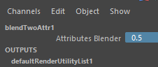

# choice：选择节点

属性：Selector：选择器

该节点，通过选择器值的修改，输出节点值会匹配值到对应输入节点值，选择器值0对应输入0

# condition：条件节点

通过比较运算第一项和第二项的布尔输出结果，来执行操作

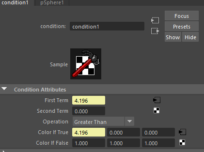

截图案例中，通过比较运算球1的Z轴位移是否大于零，来判断盒子1的Z轴位移是否跟随球1

# setRange：设置范围节点

Set Range 是一个实用程序节点，允许您获取一个范围内的值（OldMin，OldMax），并将它们映射到另一个范围(Min,Max)。通过调整Value值来控制Min，Max之间的值

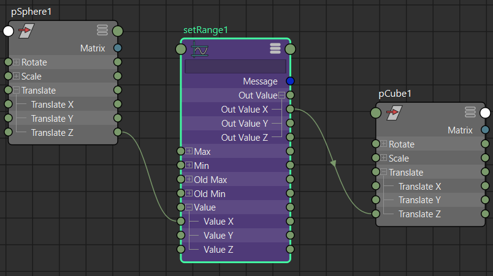

# reverse:反向节点

当输入节点值为1的时候输出节点值为0，反之亦然，常用于IKFK切换时链接约束节点

# angleBetween夹角节点

求出两个物体对于世界中心（0，0，0）之间的夹角

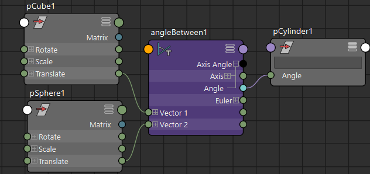

求出两个物体对于第三个物体之间的夹角

先求出两个物体对于第三个物体的世界坐标之差，利用这两个差值求出他们之间的夹角

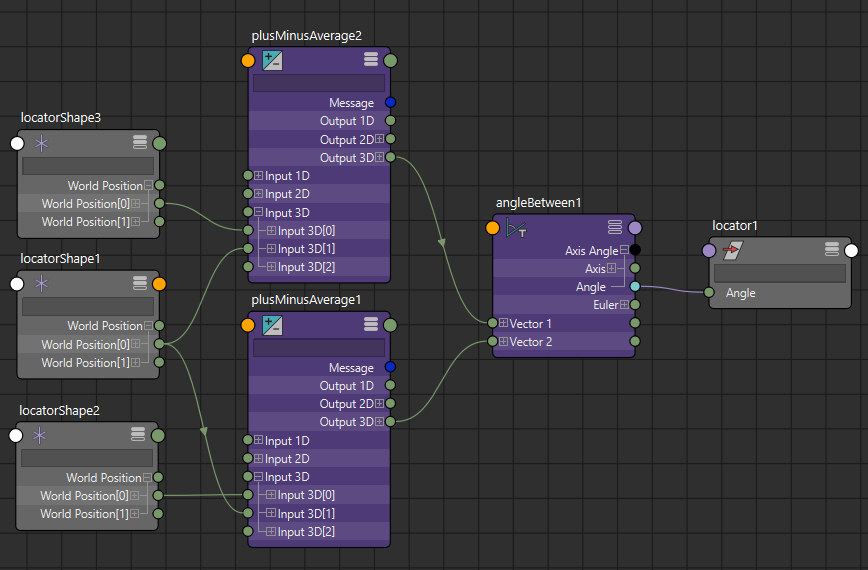

节点原理：

三维向量夹角的计算公式如下：

- 假设两个三维向量分别为：$a=(x_1,y_1,z_1)，b=(x_2,y_2,z_2)$,两个向量的夹角为$θ$.

-  向量的模（norm或module）是指向量 $\vec {AB}$的长度，记作$|AB|$, 空间向量$(x,y,z)$，模长是：$|AB| = \sqrt{x^2+y^2+z^2}$

- 向量a的模：$|a|=√(x1^2+y1^2+z1^2)$。

- 向量b的模：$|b|=√(x2^2+y2^2+z2^2)$。

- 从几何角度看，点积是两个向量的长度与它们夹角余弦的积, $a·b=|a|·|b|·cosθ$.

- 两个向量的点乘：a$·b=(x1x2+y1y2+z1z2)=|a|·|b|·cosθ$。

- 则有：$$cosθ=(x1x2+y1y2+z1z2)/[√(x1^2+y1^2+z1^2)*√(x2^2+y2^2+z2^2)]$$。

上述公式均是以空间三维坐标给出的，如果令坐标中的z=0，则得到平面向量的计算公式。两个向量夹角θ的取值范围是：[0,π]。当夹角为锐角时，cosθ>0；当夹角为钝角时,cosθ<0。

#  distanceBetween :间距节点

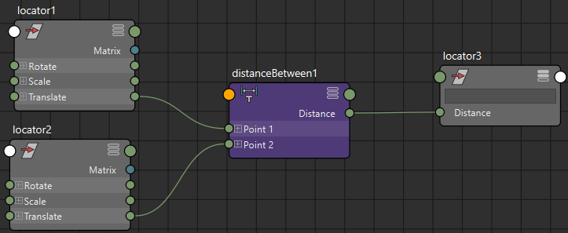

节点原理：

设A(x1,y1,z1),B(x2,y2,z2),则A,B之间的距离（模）为

|AB|=√[(x1−x2)^2+(y1−y2)^2+(z1−z2)^2]

#  vectorProduct 向量积节点

- 包含点积，叉积，向量矩阵积，点矩阵积，向量归一化

#  pairBlend 配对混合节点

将一对对象的属性进行混合插值，输出给另一个对象

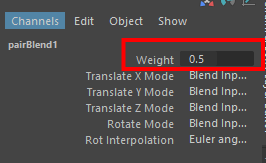
# HoldMatrix 保持矩阵

保持矩阵节点实际上对其矩阵输入不执行任何作;它基本上是 Matrix 数据类型的节点等效项。如果你有一个完全静态的矩阵，你想把它保存在你的设置中，以便通过管道连接到另一个节点，这是最便宜的方法。
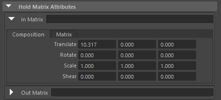
#  composeMatrix：组合矩阵节点

将一个物体的位移，旋转，缩放，斜切，旋转顺序转化成一个矩阵节点

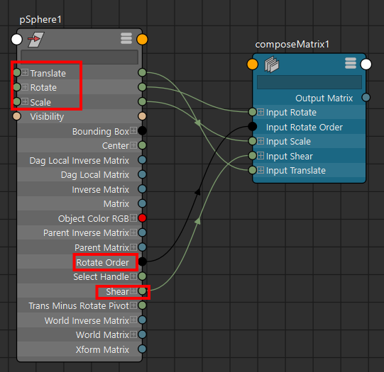

节点属性：

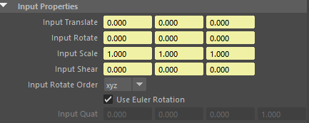

#  decomposeMatrix分解矩阵节点

用于将物体的矩阵分解成平移，旋转，缩放，斜切，四元数等若干属性

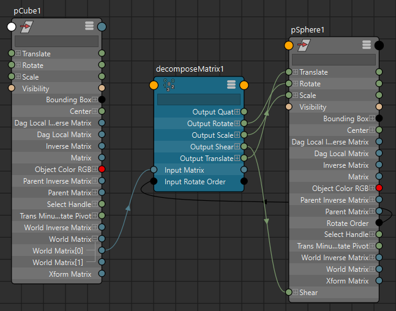

节点属性

#  inverseMatrix：逆矩阵节点

效果相当于给矩阵*-1，移动，旋转，缩放，斜切全都反向。

#  multMatrix：多重矩阵，相乘矩阵

下图案例中，将方块世界矩阵和球体父对象逆矩阵相乘，然后分解矩阵输出给球。造成的效果是球完全跟随盒子位移，旋转，缩放，而球的父对象（组group）变换效果被父对象逆矩阵抵消掉，无法控制球体.

注意：矩阵相乘的输入矩阵顺序不能互换，否则结果完全不同，本案例是使用方块世界矩阵乘以球体父对象逆矩阵，不能反过来。

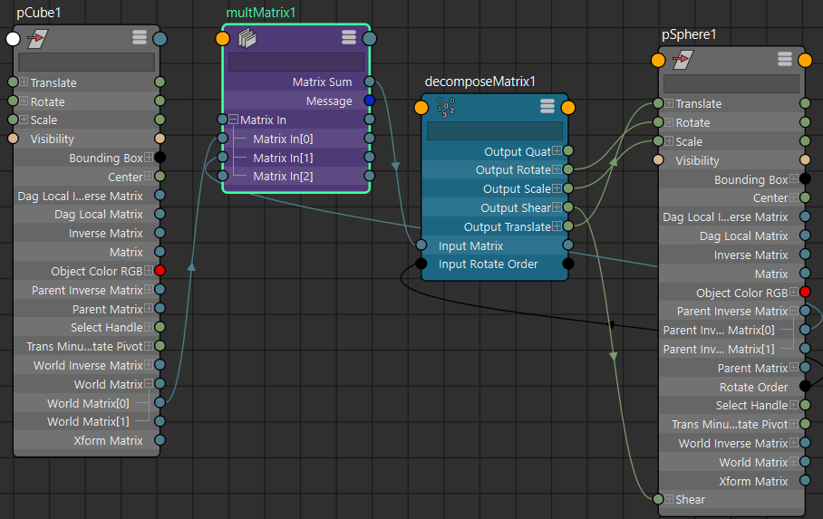

- 案例：矩阵实现父子约束效果0

利用节点属性Offset Parent Matrix，来实现父子约束，

composeMatrix_OffSet组合矩阵节点用来提取pSphere1的世界逆矩阵数值作为约束偏移，先使用decomposeMatrix分解pSphere1的世界逆矩阵，再通过composeMatrix组合成矩阵作为约束偏移

pickMatrix节点可选择约束移动，旋转，缩放，斜切。

# pickMatrix节点属性

- 案例：矩阵实现父子约束效果1

multMatrix节点，输入0：偏移矩阵。输入1：约束物体的世界矩阵。输入2：被约束物体的父对象逆矩阵。

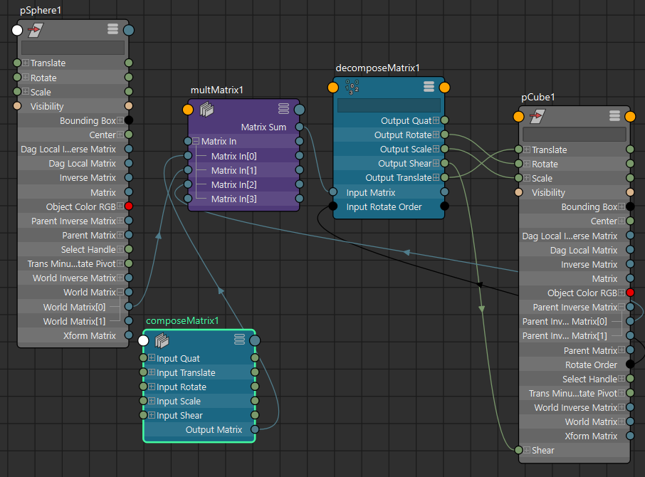

composeMatrix1节点作为偏移矩阵，此处Z轴位移偏移3个单位

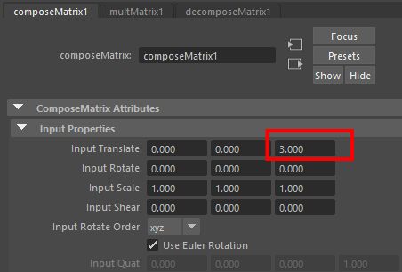