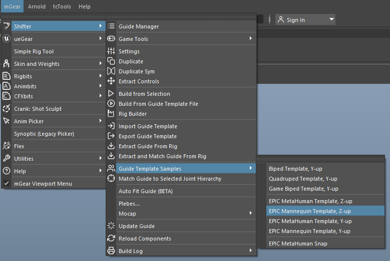
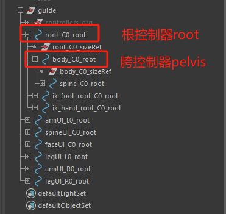
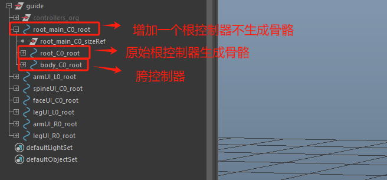
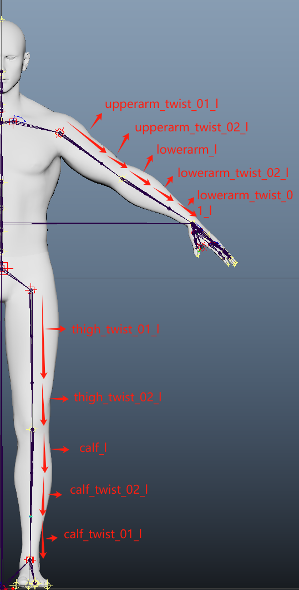
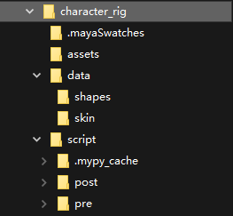
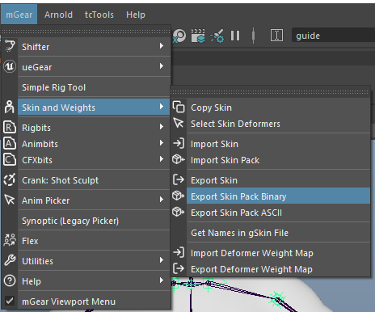
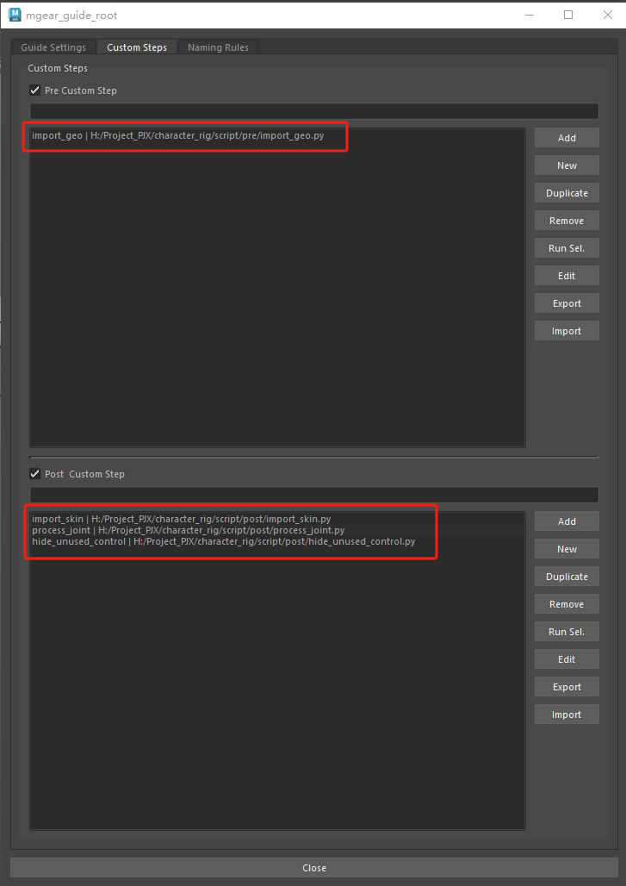

# 概述
- 使用mGear绑定框架来绑定角色用于UE引擎，优点主要有：
	- Python语言编写且开源，可以调用其中的API进行自动化处理
	- IKFK和IK控制器空间切换算法更优异，速度更快，不容易出错。
	- 与UE引擎联系更紧密，可直接使用UE骨骼模板

# 步骤

## 设置模板
### 载入模板
- 载入Epic Mannequin Template
- 
### 修改模板
- 原始模板层级为：

- 为了使根骨骼可以被自由控制，用于调整根骨骼动画，我们将其修改为：
- 
- 这样一来我们生成的根骨骼控制器可以自由移动，但是生成的骨骼中根骨骼和胯骨骼没有形成父子关系，我们在后续的post脚本中链接父子关系
## 设置蒙皮
- 蒙皮我们使用ngSkinTools2来修改蒙皮
- 蒙皮权重分配如下：
- 
- 这套权重分配策略是基于mGear和Unreal动画后处理结合得出的结果。
## 数据化资产
- 构建角色绑定资产路径
- 
- 其中：
	- assets文件夹放置角色模型资产
	- data文件夹放置模板、变形（shapes）和蒙皮（skin）数据
	- script文件夹放置生成控制器前置（pre）和后置（post）脚本
### 放置资产
- 将模型资产（未蒙皮）放置到assets文件夹
- 将guide template导出放置到data文件夹
- 
- 将蒙皮资产导出到skin文件夹
- 
- 编写前置和后置脚本放入script文件夹的pre和post文件夹
- 其中前置脚本为import_geo.py，该脚本用于生成绑定前导入模型
```python
import mgear.shifter.custom_step as cstp
import os
import pymel.core as pm


class CustomShifterStep(cstp.customShifterMainStep):
    """Custom Step description"""

    def setup(self):
        """
        Setting the name property makes the custom step accessible
        in later steps.

        i.e: Running  self.custom_step("import_go")  from steps ran after
             this one, will grant this step.
        """
        self.name = "import_go"

    def run(self):
        """Run method.

            i.e:  self.mgear_run.global_ctl
                gets the global_ctl from shifter rig build base

            i.e:  self.component("control_C0").ctl
                gets the ctl from shifter component called control_C0

            i.e:  self.custom_step("otherCustomStepName").ctlMesh
                gets the ctlMesh from a previous custom step called
                "otherCustomStepName"

        Returns:
            None: None
        """
        self.import_geometry()
        try:
            pm.select("guide")
        except Exception as exc:
            print(exc)
        return

    def import_geometry(self):
        """Import geometry from a file"""
        main_path = "\\".join(
            os.path.abspath(os.path.dirname(__file__)).split("\\")[:-2]
        )
        pm.importFile(os.path.join(main_path, "assets", "SM_Human_male_001.fbx"))

```
- 后置脚本为import_skin.py，process_joint.py和hide_unused_control.py
- import_skin.py，该脚本用于生成绑定后导入蒙皮信息
```python
import os
import mgear.shifter.custom_step as cstp
from mgear.core import skin


class CustomShifterStep(cstp.customShifterMainStep):
    """Custom Step description"""

    def setup(self):
        """
        Setting the name property makes the custom step accessible
        in later steps.

        i.e: Running  self.custom_step("import_skin")  from steps ran after
             this one, will grant this step.
        """
        self.name = "import_skin"

    def run(self):
        """Run method.

            i.e:  self.mgear_run.global_ctl
                gets the global_ctl from shifter rig build base

            i.e:  self.component("control_C0").ctl
                gets the ctl from shifter component called control_C0

            i.e:  self.custom_step("otherCustomStepName").ctlMesh
                gets the ctlMesh from a previous custom step called
                "otherCustomStepName"

        Returns:
            None: None
        """
        self.import_skin_data()
        return

    def import_skin_data(self):
        main_path = "\\".join(
            os.path.abspath(os.path.dirname(__file__)).split("\\")[:-2]
        )
        skin.importSkinPack(
            os.path.join(main_path, "data", "skin", "Skin_Human_Male_001.gSkinPack")
        )

```
- process_joint.py，该脚本用于生成绑定后连接root和Pelvis骨骼，将骨骼放入世界层级，并给骨骼添加名称空间，用于后续的动画导入。
```python
import mgear.shifter.custom_step as cstp
import pymel.core as pm


class CustomShifterStep(cstp.customShifterMainStep):
    """Custom Step description"""

    def setup(self):
        """
        Setting the name property makes the custom step accessible
        in later steps.

        i.e: Running  self.custom_step("add_jnt_namespace")  from steps ran after
             this one, will grant this step.
        """
        self.name = "process_joint"

    def run(self):
        """Run method.

            i.e:  self.mgear_run.global_ctl
                gets the global_ctl from shifter rig build base

            i.e:  self.component("control_C0").ctl
                gets the ctl from shifter component called control_C0

            i.e:  self.custom_step("otherCustomStepName").ctlMesh
                gets the ctlMesh from a previous custom step called
                "otherCustomStepName"

        Returns:
            None: None
        """
        # 将root骨骼层级放置在pelvis之上作为根骨骼
        pm.parent("pelvis", "root")
        # 将根骨骼放入世界层级
        pm.parent("root", world=1)
        # 给骨骼添加命名空间
        ns = "skin"

        if pm.namespace(exists=ns):
            print(f"Namespace {ns} already exists")
        else:
            pm.namespace(add=ns)

        joints = pm.ls("root", dag=True, type="joint")
        for jnt in joints:
            pm.rename(jnt, f"{ns}:{jnt}")
        return

```
- hide_unused_control.py，该脚本用于隐藏不会使用的IK骨骼控制器
```python
import mgear.shifter.custom_step as cstp
import pymel.core as pm


class CustomShifterStep(cstp.customShifterMainStep):
    """Custom Step description"""

    def setup(self):
        """
        Setting the name property makes the custom step accessible
        in later steps.

        i.e: Running  self.custom_step("add_jnt_namespace")  from steps ran after
             this one, will grant this step.
        """
        self.name = "add_jnt_namespace"

    def run(self):
        """Run method.

            i.e:  self.mgear_run.global_ctl
                gets the global_ctl from shifter rig build base

            i.e:  self.component("control_C0").ctl
                gets the ctl from shifter component called control_C0

            i.e:  self.custom_step("otherCustomStepName").ctlMesh
                gets the ctlMesh from a previous custom step called
                "otherCustomStepName"

        Returns:
            None: None
        """
        # 清除选择
        pm.select(clear=True)
        # 创建显示层
        pm.createDisplayLayer(name="IK_Controlls", number=1, nr=1)

        # 编辑显示层成员
        pm.editDisplayLayerMembers(
            "IK_Controlls", "ik_hand_root_C0_ctl", "ik_foot_root_C0_ctl", noRecurse=1
        )

        # 隐藏显示层中的对象
        layer = pm.PyNode("IK_Controlls")
        layer.visibility.set(False)
        return

```
- 最终修改guide template设置，将脚本放入。并导出模板
