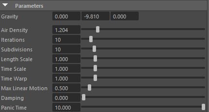

以下是根据你提供的 **Carbon Simulation** 节点属性截图（Carbon for Maya 3.0+ 版本）的逐项介绍。这些参数位于全局解算器（Carbon Simulation node）中，控制整个场景的物理模拟行为，而不是单个布料的材质属性。

这些值是典型的**电影级 / Hero布料**起始设置（Maya单位通常设为米，1 unit = 1m）。

### 上半部分（主要物理与精度参数）

- **Gravity**：000 -9.810 000  
  → **重力加速度向量**
  默认地球重力：X=0, Y=-9.81, Z=0（单位：m/s²）  
  这是最常见的设置。如果你模拟月球、零重力或外星环境，就改这个向量。  
  当前值：标准地球重力，向下（Maya的Y轴向下）。

- **Air Density**：1.204  
  → **空气密度**（单位：kg/m³）  
  标准海平面空气密度 ≈ 1.204 kg/m³（室温15°C左右）。  
  增大 → 空气阻力更大，布料飘动更“厚重”、更慢落下（如在稠密大气或水中模拟）。  
  减小 → 更接近真空，布料下落更快、摆动更持久。  
  常用于风吹旗帜、裙摆飘逸时微调空气阻力。

- **Iterations**：10  
  → **每子步迭代次数**  
  控制求解器每一次细分（Subdivision）内迭代多少次来收敛约束。  
  值越高 → 模拟更准确、更稳定（自碰撞、褶皱更真实），但计算成本线性上升。  
  值越低 → 更快，但容易出现“爆炸”、穿模、抖动。  
  推荐范围：8–20（电影级常12–16），10 是平衡起点。

- **Subdivisions**：10  
  → **每帧细分次数**（内部模拟频率 = Maya FPS × Subdivisions）  
  例如Maya 24fps × 10 = 内部240Hz模拟。  
  值越高 → 时间步更小，碰撞更精准、布料更柔软/稳定（尤其是高速运动或快速碰撞）。  
  值越低 → 更快，但布料容易僵硬、穿模。  
  常见范围：5–30，10–15 是大多数Hero布料的甜点。

### 下半部分（尺度与时间操控参数）

- **Length Scale**：1.000  
  → **长度尺度比率**（场景单位缩放因子）  
  告诉Carbon你的Maya场景1单位 = 多少真实米。  
  - 1.0 → 1 Maya unit = 1 米（最推荐，物理最真实，重力9.81直接生效）  
  - 0.01 → 1 Maya unit = 1 cm（适合微观布料或玩具级模型，重力会自动反向缩放为981）  
  - 100 → 1 Maya unit = 100 米（巨型场景用）  
  改这个值会**自动反向缩放**所有长度相关参数（如重力、密度、厚度、摩擦等），避免手动调一堆数字。
- 如果你的Maya Linear Units（Working Units > Linear）设置为 Centimeter（厘米），那么在 Carbon Simulation 节点的 Length Scale 就应该设置为 0.01。

- **Time Scale**：1.000  
  → **时间尺度比率**  
  类似Length Scale，但影响时间相关参数（如重力加速度、粘性阻尼、塑性等）。  
  - 1.0 → 正常时间  
  - >1 → 时间变慢（慢动作效果，布料摆动更悠长）  
  - <1 → 时间加速（快进模拟，布料反应更快）  
  常用于艺术指导：让飘逸更梦幻（1.2–2.0）或加速预览（0.5）。

- **Time Warp**：1.000  
  → **时间扭曲**（非线性时间缩放）  
  通常保持1.0。  
  >1 → 后期时间变快（类似快进）  
  <1 → 后期时间变慢  
  与Time Scale不同，这个更像“后处理”时间弯曲，常用于特殊镜头效果。

- **Max Linear Motion**：0.500  
  → **最大线性运动 ，会限制对象的最大移动距离
物体最大的位移，可以避免高速运动的物体突然运动到很远的距离
最大线性运动 * 细分（Subdivisions） = 位移的距离
- Damping：0.000
	- 全局阻尼
- **Panic Time**：10.000  
  → **恐慌时间**（Panic Time）  
  当模拟不稳定（能量激增、即将爆炸）时，Carbon会自动“刹车”/减速模拟，持续这么多秒。  
  10秒是默认，够用；如果经常panic，可增大到15–30秒，让它有更多时间自我恢复。

### 快速调参建议（基于你的截图设置）

| 场景类型           | 推荐调整建议                              |
|--------------------|-------------------------------------------|
| 普通角色长大衣     | 保持当前（Gravity -9.81, Iter 10–12, Subd 10–15） |
| 高速运动/快速翻转  | Subdivisions ↑ 到15–25, Iterations ↑ 到12–18 |
| 极飘逸/旗帜/长裙   | Air Density ↓ 到0.8–1.0, Max Linear Damping ↓ 到0.1–0.3 |
| Maya单位是cm       | Length Scale 改成0.01（重力自动变-981）   |
| 想拍慢动作         | Time Scale 1.5–3.0                        |
| 模拟老爆炸         | 先↑ Subdivisions & Iterations，再检查碰撞厚度/自碰撞 |

最强组合拳：先把 **Length Scale** 确认成场景实际单位（通常1m），然后主要调 **Subdivisions + Iterations** 来平衡质量与速度，最后微调 **Air Density + Damping** 得到艺术感。

官方最详细解释视频就是 Numerion 的 **Carbon Tutorial - Maya - Carbon Simulation**（YouTube上搜得到，约30分钟），强烈推荐看一遍，尤其是Iterations vs Subdivisions那段。

有具体场景想优化（比如John Wick大衣、婚纱、旗帜），可以告诉我当前Maya FPS、布料厚度、碰撞体情况，我再给你更针对性的数值建议～