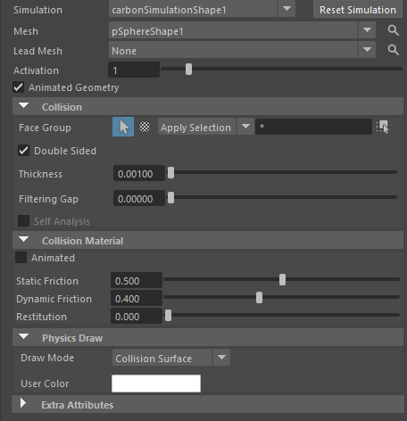

这些参数主要控制**碰撞检测的精度、厚度、摩擦、反弹**等行为。Carbon 的碰撞系统非常稳健，支持布料-布料、布料-刚体、布料-角色皮肤等多对多交互。

### 上半部分（几何与激活）

- **Simulation**：carbonSimulationShape1  
  → 当前关联的全局模拟器节点（通常只有一个）。所有 Collider 必须连接到一个 Simulation 节点。

- **Mesh**：pSphereShape1  
  → 输入的碰撞网格（polygon mesh）。这里是球体（pSphere），可以是任意变形网格（如角色身体 mesh）。

- **Lead**：（下拉菜单）  
  → 选择“Lead Simulation”或其他（通常默认）。用于多模拟器场景，指定哪个模拟器主导这个 Collider。

- **Activation**：1（滑块 0–1）  
  → 激活强度（0 = 完全禁用碰撞，1 = 完全启用）。  
  常用于渐变激活（如衣服慢慢“落地”或“接触”身体）。值在 0–1 间渐变可避免突然穿模。

- **Animated Collision Geometry**（勾选）  
  → 是否允许碰撞体动画变形（Animated）。  
  - 勾选 → 支持角色骨骼驱动的变形身体（如走路、弯腰时的皮肤变形），Carbon 会处理高速/变形碰撞。  
  - 不勾选 → 假设静态或刚性运动，计算更快，但变形时容易穿模。  
  大多数角色身体/动画道具都要**勾选**这个。

### Collision 折叠区（核心碰撞参数）

- **Face Group**：（选择器 + Apply Selection）  
  → 指定哪些面参与碰撞（Face Group）。  也可采用纹理：所有顶点的Alpha值大于0，才会碰撞。
  - 默认全选（空 = 所有面）。  
  - 可用于优化：只让身体某些部位（如手臂、腿）碰撞，忽略背部/内部面，减少计算量。  
  - 点击“Apply Selection”应用当前组件选择。

- **Double Sided**（勾选）  
  → 是否双面碰撞。  
  - 勾选 → 碰撞体正反两面都有效（适合薄墙、布料层、单面网格角色）。  
  - 不勾选 → 只正面有效（适合厚实身体，防止布料从背面穿入）。  
  角色身体通常**勾选**，地板/道具视情况。

- **Thickness**：0.00100  
  → 碰撞体“厚度” / “脂肪层”（单位：Maya 单位，通常 cm 时为 0.001 = 0.001 cm = 0.01 mm）。  
  - Carbon 使用“有厚度”的碰撞检测（非零厚度点云），防止高速穿模。  
  - 推荐值：0.5–5 mm（即 0.05–0.5 cm，如果 Length Scale=0.01）。  
  - 太小（如 <0.1 mm）→ 容易穿模，尤其是快速运动。  
  - 太大（如 >1 cm）→ 布料“浮”在身体外，看起来不贴合。  
  - 技巧：与布料的 Thickness 匹配（布料厚度 ≈ 0.1–0.3 cm 时，Collider 设 0.2–0.5 cm）。

- **Filtering Gap**：0.000000  
  → 碰撞过滤间隙（用于弱化碰撞）。  
  - 默认 0 → 正常全强度碰撞。  
  - >0 → 在这个间隙内减弱碰撞力（防止抖动或过度排斥）。  
  - 常用于布料紧贴身体时微调，避免“粘”或“弹”。
  - 检测碰撞之间的距离阈值，处理碰撞之间的穿插，当碰撞之间的距离小于阈值时检测穿插，数值为0时不检测

- **Self Analysis**
  → 是否启用自碰撞分析（针对这个 Collider 自身的自交）。通常不勾选，除非 Collider 是多层布料或复杂物体。

### Collision Material 折叠区（摩擦与反弹材质）

- **Static Friction**：0.500  
  → **静摩擦系数**（0–1）。  
  - 值越高 → 布料越不容易滑动（如丝绸 vs 粗布，静摩擦高 → 贴身不滑）。  
  - 典型：0.3–0.8（皮肤/布料 ≈0.5–0.6，橡胶 ≈0.8）。
  - 数值要大于动摩擦

- **Dynamic Friction**：0.400  
  → **动摩擦系数**（通常 ≤ Static Friction）。  
  - 值越高 → 滑动时阻力越大，布料运动更“粘滞”。  
  - 典型：0.2–0.5（比静摩擦略低）。  
  - 注意：Carbon 碰撞对中使用**两个物体中较小的摩擦值**（布料材质摩擦 vs Collider 摩擦，取 min）。
  - 数值要小于等于静摩擦

- **Restitution**：0.000  
  → **恢复**（0–1）。  碰撞产生的能量对每个布料对象恢复的乘积调制。
  - 0 → 无反弹（最真实，布料落地不弹）。  
  - >0 → 有弹性反弹（如橡胶球落地弹起）。  
  - 布料模拟几乎总是设 **0**（或极小 0.01–0.05），避免不自然的弹跳。

### 下半部分（显示与额外）

- **Physics Draw**：Collision Surface（下拉）  
  → 视口显示模式。  
  - Collision Surface → 显示碰撞表面（绿色/蓝色厚度可视化，最实用）。  
  - 其他：None（不显示）、Wireframe 等。  
  强烈推荐开 Collision Surface，便于检查厚度是否合适、是否有穿模。

- **Draw Mode** / **User Color**：自定义颜色显示。

- **Extra Attributes**：折叠，通常为空或高级选项（如 velocity limits 等）。

### 快速调参建议（基于你的设置 + Maya cm 单位）

| 常见场景          | Thickness 推荐 | Static Friction | Dynamic Friction | Restitution | Double Sided | Animated Geometry |
|-------------------|----------------|-----------------|------------------|-------------|--------------|-------------------|
| 角色身体（皮肤）  | 0.2–0.5       | 0.4–0.6        | 0.3–0.5         | 0.0        | 勾选        | 勾选             |
| 地板/静态道具     | 0.1–0.3       | 0.3–0.5        | 0.2–0.4         | 0.0        | 视情况      | 不勾选（若静态） |
| 快速运动道具      | 0.5–1.0       | 0.5–0.7        | 0.4–0.6         | 0.01–0.1   | 勾选        | 勾选             |
| 穿模严重          | ↑ Thickness 到 0.5+，↑ Subdivisions（Simulation 节点） | - | - | - | - | 确认勾选 Animated |

**最实用技巧**：
1. 开 **Physics Draw > Collision Surface**，检查绿色/蓝色厚度层是否均匀覆盖网格、无间隙。
2. 布料贴身不自然 → 微调 Collider Thickness 略大于布料 Thickness 的 1–2 倍。
3. 高速穿模 → 增加 Simulation 的 Subdivisions（10–20+），或加大 Thickness。
4. 摩擦太滑/太粘 → 匹配布料 Material 的 Friction（取 min 值生效）。

官方文档（Carbon Collider 参考页）强调：Collider 是 kinematic，无限质量；厚度是防穿模关键；摩擦取 min。YouTube 上 Numerion 的 “Carbon Tutorial - Maya - Carbon Simulation” 和 “Live Simulation” 视频有 Collider 厚度/摩擦的演示，推荐看。

如果你的模拟有具体问题（如膝盖穿模、布料滑动太快），告诉我布料 Thickness、Simulation Subdivisions/Iterations、动画速度，我可以给你更精确的数值建议～