# General
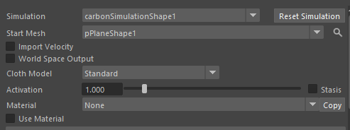
- Simulation：解算器
- StartMesh：要结算的Mesh
- ImportVelocity：导入矢量，打开后会从网格速度向量数组属性中读取布料的初始速度，如果有初始速度可以打开。
- WorldSpaceOutput：世界空间输出
- ClothModel：布料模型，定义布料的变形方式和位置
- 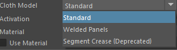
	- Standard（默认/标准模型）：三角面或四边面，支持各向异性（anisotropic stretch/bend/shear），角度、边缘、面积约束，Flat Angles（平坦角度）可选，更通用、更稳定。
	- Welded Panels（焊接面板模型）：仅支持三角面，Start Mesh：单一焊接网格（welded，缝合好的3D形状） Reference Mesh：未焊接的平铺面板。专为CLO/MD焊接导出优化。
	- Segment Crease (Deprecated)（段-褶皱，已弃用）
- Material：材质属性预设
	- 来创建预设
# Collision
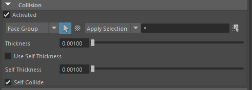
- **Face Group**（下拉 + Apply Selection + *） → **碰撞面组**（Collision Face Group）。指定**哪些面**参与碰撞检测（默认 * = 所有面）。
- Thickness：0.00100 → 布料厚度，用于布料与外部物体的碰撞
	推荐值（Maya cm 单位 + Length Scale 0.01）：
	
	- 薄布（如丝绸、衬衫）：0.05–0.15（0.5–1.5 mm）
	- 普通服装：0.1–0.3（1–3 mm）
	- 厚外套/牛仔：0.3–0.8
- Use Self Thickness（不勾选） → 是否使用独立的 Self Thickness（自碰撞专用厚度）。
	- Thickness和Self Thickness的区别：
		- Thickness用于布料与外部物体的碰撞，
		- Self Thickness 专用于布料与自身的碰撞（Self Collision），即同一块布料的不同部分互相碰撞。
- Self Collide（勾选） → 启用自碰撞（本布料 vs 本布料）。专用于布料与自身的碰撞（Self Collision），即同一块布料的不同部分互相碰撞。领子翻折、褶皱自交。
# Reference
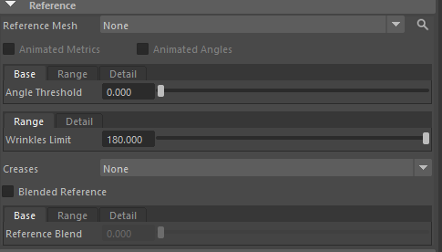
- 这些参数全部围绕 Reference Mesh（参考网格）工作。Reference Mesh 是 Carbon 布料模拟的核心概念之一：它定义了布料的“休息/自然状态”（rest pose）。
- 模拟时，Carbon 会尽量让当前 Start Mesh（模拟起始网格）接近 Reference 的这些“指标”（metrics），从而实现真实的拉伸、压缩、弯曲行为。如果没有指定 Reference Mesh，默认用 Start Mesh 作为参考（常见于简单场景）。
- Reference Mesh：None（下拉菜单） → 选择用于提取参考指标的网格形状（shape）。
- 这些是平坦角度（Flat Angle）相关的阈值，用于控制布料的弯曲倾向（尤其是避免过度平坦或过度皱褶）。
	- Angle Threshold：0.000（Base） → 角度阈值（Flat Angle Threshold，单位：度）。定义“什么角度算平坦”（flat）。值越小（如 0.000）→ 更严格要求平坦，值越大（如 5–10 度）→ 允许更大偏差，布料更容易产生自然褶皱。
	- Wrinkles Limit：180.000（Range Detail） → 皱褶/褶皱角度上限（Wrinkles Angular Limit，单位：度）。定义布料允许的最大弯曲角度（180° = 完全折叠/对折）。默认 180° → 允许任意深度的皱褶（最真实）。减小（如 90–120°）→ 限制褶皱深度，布料更“硬”、不易深折（用于僵硬布料如皮革）。
# Dencity（密度）
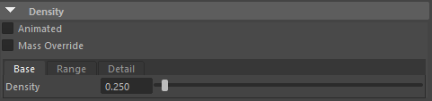
这些参数控制布料的密度（Density），直接影响布料的重量（Mass）和在重力/空气阻力下的行为。密度越高，布料越重，下落/摆动越慢、更“沉”；密度越低，布料越轻、更飘逸（如丝绸 vs 牛仔布）。
- **关键单位**（取决于你的 Length Scale 和 Cloth Model）：
	- 如果 Length Scale = 1.0（Maya 单位 = 米）：密度单位 **kg/m²**（每平方米克重，gsm 常见单位）。
	- 如果 Length Scale = 0.01（Maya 单位 = 厘米）：密度单位 **kg/cm²**（但实际生产中常转换为 g/m² 思考：0.250 kg/m² = 250 gsm，重棉布级别）。
	- 示例：丝绸 ≈ 0.035–0.08 kg/m²（35–80 gsm），牛仔 ≈ 0.3–0.5 kg/m²（300–500 gsm）。
- 计算方法：最终密度 = Base + Range × Detail（绘制通常 0–1）。
### 快速调参建议（基于你的 0.250 值 + Maya cm 单位）

|布料类型|推荐 Density Base（Length Scale=0.01 时，kg/cm² 但思考 g/m²）|Range|Detail 建议|Mass Override|
|---|---|---|---|---|
|丝绸/雪纺|0.03–0.08（30–80 g/m²）|0–0.2|Per-Vertex（轻区更飘）|不勾选|
|衬衫/棉布|0.10–0.20（100–200 g/m²）|0.1–0.3|Texture（不均匀织纹）|不勾选|
|西装/厚棉|0.20–0.35（200–350 g/m²）|0.2–0.5|Per-Vertex（褶皱区稍重）|不勾选|
|牛仔/帆布|0.30–0.50+（300–500+ g/m²）|0.3–0.6|Per-Vertex（磨损区轻）|不勾选|
|艺术飘逸效果|0.05–0.15|-0.1～0.3|负 Range（某些区超轻）|
# Stretch
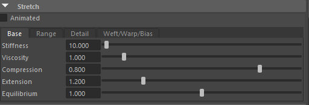

- **Stretch** 部分控制布料的**拉伸/压缩行为**（Stretch / Compression），即沿**边（edges）**方向的弹性（elasticity）和阻尼（damping）。这是布料物理中最核心的部分之一，直接决定布料是否“弹簧般”拉伸、压缩，还是保持刚性。
- Carbon 支持**各向异性**（anisotropic）布料：不同方向（**Weft** 纬向、**Warp** 经向、**Bias** 斜向）可以有独立的刚度/粘性/压缩/延伸等设置。这让它能模拟真实织物（如牛仔经向硬、纬向稍软、斜向最易变形）。
- 所有 Stretch 参数都采用 **Base + Range × Detail** 结构 + **Weft / Warp / Bias** 三个独立通道（tab 或下拉）。

- **Stiffness**：10.000（Base） → **拉伸刚度 / 伸展刚度**（Stretch Stiffness，单位：无量纲或内部力系数，通常越高越硬）。
    - 值越高 → 布料越抗拉伸/压缩（像硬帆布、皮革），变形小。
    - 值越低 → 布料越易拉伸（像橡胶、莱卡、弹性纤维）。
    - 典型范围：
        - 丝绸/雪纺：1–50（软、易变形）
        - 棉/衬衫：100–1000（中等）
        - 牛仔/厚外套：1000–10000+（很硬）
    - 你的 10.000 是较低值 → 适合柔软布料（如薄衬衫、飘逸裙）。如果布料太松垮/过度拉伸 → ↑ 到 100–1000+。
    - Weft/Warp/Bias：分别控制纬向（横向）、经向（纵向）、斜向（45°）的刚度。真实织物 Warp 通常最高（经纱紧），Weft 次之，Bias 最低（最易变形）。
- **Viscosity**：1.000（Base） → **拉伸粘性 / 阻尼**（Stretch Viscosity，无量纲）。
    - 值越高 → 拉伸/恢复时有更多“粘滞”感（像橡皮泥、慢回弹），摆动更快衰减。
    - 值越低 → 更弹性/弹簧般（快速回弹，振荡持久）。
    - 典型：0.1–5.0（大多数布料 0.5–2.0）。
    - 你的 1.000 是标准中性值 → 自然阻尼。如果布料抖动太久 → ↑ Viscosity 到 2–5；如果太“死” → ↓ 到 0.1–0.5。
    - 与 Simulation 节点的 Max Linear Damping 配合使用。
- **Compression**：0.800（Base） → **压缩比率**（Stretch Compression Ratio）。
    - 定义边（edge）允许**压缩**到的最小长度比例（相对于参考长度）。
    - 值 <1.0 → 允许压缩（0.8 = 只能压缩到参考长度的 80%）。
    - 值 =1.0 → 不允许压缩（硬抗压，像绳子）。
    - 值 >1.0 → 不常见（会允许“负压缩”，很少用）。
    - 必须 >0 且 ≤ Extension。
    - 真实布料：棉/丝绸 ≈0.7–0.95（可稍压缩），皮革/硬布 ≈0.95–1.0（几乎不压缩）。
    - 你的 0.800 → 允许中等压缩，适合大多数织物。如果想更“蓬松/有体积感” → ↓ 到 0.6–0.8；想更硬 → ↑ 到 0.95–1.0。
- **Extension**：1.200（Base） → **延伸比率**（Stretch Extension Ratio）。
    - 定义边允许**拉伸**到的最大长度比例（相对于参考长度）。
    - 值 >1.0 → 允许拉伸（1.2 = 可拉到参考长度的 120%）。
    - 值 =1.0 → 不允许拉伸（完全刚性）。
    - 值 <1.0 → 不常见（不允许延伸）。
    - 必须 ≥ Compression。
    - 真实布料：弹性布 ≈1.2–2.0+（可拉伸），普通棉 ≈1.05–1.15（微拉伸），硬布 ≈1.0–1.05（几乎不拉）。
    - 你的 1.200 → 允许 20% 延伸，适合中等弹性布。如果太松 → ↓ 到 1.05–1.1；想弹性衣 → ↑ 到 1.5+。
- **Equilibrium**：1.000（Base） → **平衡长度比率**（Stretch Equilibrium Ratio）。
    - 定义边的**休息/平衡长度**相对于参考长度的比例。
    - 1.0 → 平衡长度 = 参考长度（标准，大多数情况）。
    - > 1.0 → 布料“想”变长（预拉伸，如紧身衣有张力）。
        
    - <1.0 → 布料“想”变短（预压缩，如褶皱布想收缩）。
    - 高级用法：结合 Reference Mesh 实现“内置张力”或“自然收缩”效果。
    - 你的 1.000 → 标准平衡，无预应力。最安全。

### Weft / Warp / Bias 通道说明

- **Weft**（纬向）：横向纱线，通常稍软。
- **Warp**（经向）：纵向纱线，通常最硬（织机方向）。
- **Bias**（斜向）：45° 方向，通常最易变形（织物斜拉最松）。
- 在 **Standard** Cloth Model 下，这些通道独立生效。
- **Welded Panels** 也支持，但可能基于面板方向自动映射。
- 如果网格是 quad（四边面），Weft/Warp 更清晰；三角面时 Carbon 内部推断。

### 快速调参建议（基于你的值）

| 布料类型   | Stiffness (Base) | Viscosity | Compression | Extension | Equilibrium | Weft/Warp/Bias 提示         |
| ------ | ---------------- | --------- | ----------- | --------- | ----------- | ------------------------- |
| 丝绸/雪纺  | 5–50             | 0.5–1.5   | 0.7–0.9     | 1.1–1.3   | 1.0         | Bias 最低（最松）               |
| 普通棉/衬衫 | 100–1000         | 1.0–2.0   | 0.8–0.95    | 1.05–1.15 | 1.0         | Warp 最高，Weft 中等           |
| 弹性布/莱卡 | 10–100           | 0.5–1.0   | 0.6–0.8     | 1.3–2.0+  | 1.0–1.1     | Extension 高，Compression 低 |
| 牛仔/厚外套 | 2000–10000+      | 1.5–5.0   | 0.95–1.0    | 1.0–1.05  | 1.0         | Warp 极高，Bias 也较高          |
| 你的当前设置 | 10.000（软）        | 1.000     | 0.800       | 1.200     | 1.000       | 适合柔软飘逸布；若太松 → ↑ Stiffness |
# Bend
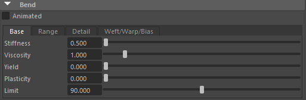
- Bend 部分控制布料的弯曲行为（Bending / Crease / Angular Deformation），即沿着边（edges）的角度变化（crease angle）。它决定布料的柔软度（柔软布易弯曲/褶皱）、硬度（硬布不易弯曲）、塑性（是否永久变形）等。这是布料模拟的第二大核心（Stretch 管长度，Bend 管角度）。 
所有 Bend 参数采用 **Base + Range × Detail** 结构 + **Weft / Warp / Bias** 三个独立通道（tab 或下拉）。

- **Stiffness**：0.500（Base） → **弯曲刚度**（Bend Stiffness，单位：内部质量*长度²/时间²/度，或无量纲系数）。
    - 值越高 → 布料越抗弯曲（硬挺，如皮革、厚帆布），褶皱少、平坦倾向强。
    - 值越低 → 布料越柔软易弯（飘逸，如丝绸、薄棉），褶皱多、自然下垂。
    - 典型范围：
        - 丝绸/雪纺：0.01–0.5（很软）
        - 棉/衬衫：0.5–5.0（中等）
        - 牛仔/皮革：5.0–50+（很硬）
    - 你的 0.500 是较低值 → 适合柔软布料（如棉T恤、飘逸裙）。如果布料太软/褶皱过多 → ↑ 到 1.0–10+。
    - Weft/Warp/Bias：分别控制纬向、经向、斜向的弯曲刚度。真实织物 Warp 通常最高（最抗弯），Bias 最低（最易褶）。
- **Viscosity**：1.000（Base） → **弯曲粘性 / 阻尼**（Bend Viscosity，无量纲）。
    - 值越高 → 弯曲/恢复时更“粘滞”（像慢回弹胶体），褶皱形成/消失慢，摆动快速衰减。
    - 值越低 → 更弹性/弹簧般（快速回弹，褶皱振荡持久）。
    - 典型：0.5–5.0（大多数布料 1.0–4.0）。
    - 你的 1.000 是标准中性值 → 自然阻尼。如果褶皱抖动太久 → ↑ 到 2–5；如果太“死板” → ↓ 到 0.5–1.0。
    - 与 Simulation 节点的 Max Linear Damping 配合，控制整体能量衰减。
- **Yield**：0.000（Base） → **弯曲屈服角度**（Bend Yield Angle，单位：度，0–180）。
    - 定义弯曲角度达到多少度后开始**塑性变形**（永久改变参考角度）。
    - 0.0 → 立即塑性（任何弯曲都可能永久）。
    - 值越大（如 10–30 度）→ 需要更大弯曲才进入塑性（像布料先弹性弯曲，超过阈值才“皱死”）。
    - 典型：0.0–30 度（大多数布料 0–10，硬布更高）。
    - 你的 0.000 → 无屈服阈值，直接进入塑性区（适合永久褶皱布料）。想“弹性为主” → ↑ 到 5–20 度。
- **Plasticity**：0.000（Base） → **弯曲塑性率**（Bend Plasticity，0–1）。
    - 值越高 → 塑性变形越强（弯曲后永久保留角度，像纸张/布料压痕）。
    - 0.0 → 无塑性（纯弹性，弯曲后总是恢复参考角度）。
    - 1.0 → 完全塑性（一旦超过 Yield，角度永久固定）。
    - 典型：0.0–0.5（真实布料有轻微塑性，如牛仔褶皱持久）。
    - 你的 0.000 → 无塑性（布料总是“想”回到平坦参考状态）。想永久褶皱（如旧衣服褶） → ↑ 到 0.2–0.8。
- **Limit**：90.000（Base） → **弯曲极限角度**（Bend Limit Angle，单位：度，围绕参考角度的对称硬限）。
    - 定义允许的最大弯曲偏差（参考角度 ± Limit 形成一个“锥形”限制区）。
    - 值越大（如 90–180）→ 允许更深的弯曲/折叠（180° = 完全对折）。
    - 值越小（如 10–30）→ 硬限更严，布料不易深折（像硬纸板）。
    - 0.0 → 完全刚性角度约束（Stiffness/Viscosity/Yiel/Plasticity 全部失效，边角度固定）。
    - 你的 90.000 → 允许 ±90° 弯曲（很宽松，适合大多数布料深褶皱）。想限制过度折叠 → ↓ 到 30–60 度。

### Weft / Warp / Bias 通道说明

- **Weft**（纬向）：横向弯曲，通常稍软。
- **Warp**（经向）：纵向弯曲，通常最硬。
- **Bias**（斜向）：45° 弯曲，通常最软（织物斜向最易弯/褶）。
- 在 **Standard** 或 **Welded Panels** Cloth Model 下独立生效。
- 最佳表现：用 **Carbon Remesher** 转为 Quad 网格（对齐 Warp/Weft），否则各向异性不准。

### 快速调参建议（基于你的值 + Maya cm 单位）

| 布料类型   | Stiffness (Base) | Viscosity | Yield (度) | Plasticity | Limit (度) | Weft/Warp/Bias 提示                     |
| ------ | ---------------- | --------- | --------- | ---------- | --------- | ------------------------------------- |
| 丝绸/雪纺  | 0.01–0.5         | 0.5–2.0   | 0–5       | 0.0–0.2    | 120–180   | Bias 最低（最易褶）                          |
| 普通棉/衬衫 | 0.5–5.0          | 1.0–3.0   | 0–10      | 0.1–0.4    | 90–150    | Warp 最高，Bias 最低                       |
| 硬牛仔/皮革 | 5.0–50+          | 2.0–5.0   | 5–30      | 0.3–0.8    | 30–90     | Warp/Bias 都较高                         |
| 你的当前设置 | 0.500（软）         | 1.000     | 0.000     | 0.000      | 90.000    | 适合柔软布；若太飘/褶太多 → ↑ Stiffness & ↓ Limit |
# Surface
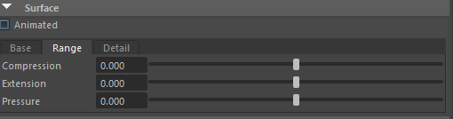**Surface** 部分控制布料的**表面面积约束**（Surface Area Constraints），即每个三角面（或四边面）的**面积变化**范围。它与 **Stretch**（边长度约束）互补：Stretch 管“结构形状”（边长），Surface 管“面积保持”（防止过度剪切/膨胀/收缩）。这让布料在保持体积感、避免“扁平化”或“过度蓬松”时更有控制力。

这些参数是**各向同性**的（无 Weft/Warp/Bias 分离），因为表面面积是整体的，不依赖纱线方向。

所有 Surface 参数采用 **Base + Range × Detail** 结构（Detail 来源：None / Per-Vertex / Texture 等）。

- **Compression**：0.000（Base） → **表面压缩比率**（Surface Compression Ratio）。
    - 定义每个面（triangle/quad）允许**压缩**到的最小面积比例（相对于参考面积，来自 Reference Mesh）。
    - 值 <1.0 → 允许面积压缩（0.8 = 只能压缩到参考面积的 80%）。
    - 值 =1.0 → 不允许压缩（严格保持面积，像不可压缩薄膜）。
    - 值 >1.0 → 不常见（允许“负压缩”）。
    - 必须 >0 且 ≤ Extension。
    - 真实布料：大多数织物允许轻微压缩（0.7–0.95），防止“buckling”（褶皱时面积塌陷）。
    - 你的 0.000 → 几乎不允许压缩（极端值，相当于禁用表面压缩约束）。如果设太低（接近0），布料容易“扁平”或在褶皱处过度塌陷；想保持体积/蓬松感 → ↑ 到 0.8–0.95（与 Stretch Compression 配合）。
    - 禁用表面约束技巧：设 Compression 很小（如 0.001），Extension 很大（如 1000），让 Carbon 忽略面积保持，主要靠 Stretch 约束。
- **Extension**：0.000（Base） → **表面延伸比率**（Surface Extension Ratio）。
    - 定义每个面允许**拉伸**到的最大面积比例（相对于参考面积）。
    - 值 >1.0 → 允许面积膨胀（1.2 = 可拉到参考面积的 120%）。
    - 值 =1.0 → 不允许延伸（严格保持面积）。
    - 值 <1.0 → 不常见（不允许膨胀）。
    - 必须 ≥ Compression。
    - 真实布料：普通织物微延伸（1.05–1.15），弹性布更高（1.2+）。
    - 你的 0.000 → 几乎不允许延伸（极端值，相当于禁用表面延伸约束）。如果布料在风吹/拉扯时面积过度膨胀 → ↑ 到 1.05–1.2；想严格保面积（如薄膜、不鼓包） → 设 1.0。
    - 与 Stretch Extension 类似，但 Surface Extension 防止“剪切膨胀”（shear-induced area increase）。
- **Pressure**：0.000（Base） → **表面压力**（Surface Pressure，单位：力/面积，如 N/m² 或 Pa）。
    - 施加在每个面上的**显式均匀力**（explicit force per unit area），方向沿面**法线**（向外或向内，取决于正负）。
    - 正值 → 向外推（像内部充气，布料鼓起/蓬松）。
    - 负值 → 向内吸（像真空吸紧布料）。
    - 0.0 → 无压力（默认，最常见）。
    - 典型用法：
        - 气球/充气服装：正 Pressure 0.1–10（视厚度/密度）。
        - 紧身衣/贴身布：负 Pressure -0.1～-5（让布贴合身体）。
        - 你的 0.000 → 无压力效果。
    - **警告**：这是**显式力**（explicit force），值太大容易导致模拟不稳定/爆炸（尤其高密度网格）。建议从小值开始调（0.01–1.0），结合 Stiffness/Viscosity 平衡。
    - 与 nCloth 的 Pressure 类似，但 Carbon 更精确（per-face force）。

### Base / Range / Detail 通用说明

- **Base**：全布统一基准值。
- **Range**：乘以 Detail 的系数（>0 增加，<0 减少）。
- **Detail**：来源（None = 无细节；Per-Vertex = 顶点绘画属性 "surfaceCompression" / "surfaceExtension" / "surfacePressure"；Texture = 纹理采样）。
    - 用途：局部控制（如某些区域更易压缩/膨胀，或局部充气）。

### 快速调参建议（基于你的 0.000 值 + Maya cm 单位）

|场景类型|Compression (Base)|Extension (Base)|Pressure (Base)|说明与技巧|
|---|---|---|---|---|
|普通织物（棉/丝绸）|0.8–0.95|1.05–1.15|0.0|轻微允许面积变化，保持自然体积|
|蓬松/有体积感服装|0.7–0.85|1.1–1.3|0.1–2.0（正）|允许压缩 + 轻微压力鼓起|
|紧身/贴身布料|0.9–1.0|1.0–1.05|-0.5～-2.0（负）|严格保面积 + 负压吸紧身体|
|气球/充气效果|0.9–1.0|1.2–2.0+|1.0–10+（正）|高 Extension + 正 Pressure|
|禁用 Surface 约束|0.001|1000|0.0|让 Stretch 主导，避免面积强制|
|你的当前设置|0.000（极低）|0.000（极低）|0.000|几乎无面积约束 → 布料易扁平/过度变形；建议从 0.8/1.1 开始调|
# Viscous Damping
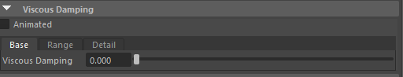
Viscous Damping 是 Carbon 中一个全局级的阻尼控制（viscous damping），位于 Carbon Cloth Material 节点中（而非 Simulation 节点的 Damping）。它不同于 Stretch/Bend 的 Viscosity（那些是局部约束的 viscous ratio），而是针对整个布料节点群（group of nodes）的相对速度施加的粘性阻尼，单位为 1/time²（或内部相对能量耗散系数）。
### 核心作用（官方文档描述）

- **Viscous Damping**（布料粘性阻尼）控制**节点群的整体凝聚力**（group cohesion）。
    - 它**不影响布料的总动能**（kinetic energy 不变，不会整体减速），但会**强制所有节点的速度趋向于布料的质心速度**（barycentric / center-of-mass velocity）。
    - 简单说：它让布料的**不同部分**（如袖子、裙摆、身体不同区域）**相对运动**更快地“同步”起来，避免内部“撕扯感”或不协调的局部高速运动。
    - 效果类似“内部胶水”：值越高，布料整体越“黏在一起”、行为更像一个刚性/半刚性物体（皮革、塑料感强）；值越低，布料更“松散”、允许更多内部相对滑动/波动（飘逸、柔软布）。
- **关键特性**：
    - 全局效果：影响整个布料的所有节点（而非局部 Stretch/Bend Viscosity 只管特定约束）。
    - 相对性：只耗散**相对速度**（relative velocities），不耗散整体平移/旋转动能（所以布料整体下落/飘动速度不变，但内部抖动/波纹快速衰减）。
    - 非常强大：高值时能让布料看起来更“厚实”、更少“jelly-like”振荡，尤其在多层/大面积布料中防“爆炸感”或不自然抖动。
- 范围建议（基于论坛/文档/教程经验）：
	- 0.0 → 无此阻尼（最飘逸、内部相对运动自由，但可能抖动持久或不协调）。
	- 0.1–1.0 → 轻微凝聚（大多数柔软布料，丝绸/棉 ≈0.1–0.5）。
	- 2.0–10 → 中等（常见推荐，平衡自然与稳定）。
	- 10–100+ → 高（让布料像皮革/塑料，内部极度同步，抖动几乎瞬间消失）。
### 快速调参建议（基于你的 0.000 值）

|布料类型 / 效果目标|推荐 Viscous Damping Base|说明|
|---|---|---|
|极飘逸/丝绸/雪纺|0.0–0.3|保持内部自由波动，自然飘动|
|普通棉/衬衫（平衡）|0.5–2.0|轻微凝聚，防不协调抖动|
|多层/复杂服装（防爆炸）|2.0–10|增强整体稳定性，常见生产值|
|硬布/皮革/塑料感|10–100+|高黏性，像刚性物体，抖动瞬间衰减|
|你的当前（0.000）|无阻尼|布料内部相对运动最自由，但高速动画/风吹易出现不自然振荡或穿模风险|
# Velocity Reduce
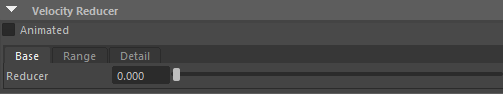
Velocity Reducer 是 Carbon 在 2.5.0 版本（2020 年 3 月）引入的一个实用工具，用于在每帧模拟结束时直接减少/衰减布料顶点的速度（vertex velocity）。它不像 Viscous Damping（全局相对速度凝聚）或 Stretch/Bend Viscosity（局部约束阻尼）那样物理化，而是强制性的速度衰减器，特别适合快速“刹车”、停止过度振荡、或艺术控制布料静止。
### 核心作用

- 每帧模拟计算完所有物理约束（碰撞、拉伸、弯曲等）后，**在帧尾**应用这个 reducer。
- 它**直接乘以当前顶点速度**：velocity_new = velocity_old × (1 - Reducer)。
- 值范围：**0.0 → 1.0**（0 = 无效果，1 = 完全移除速度 → 瞬间静止）。
- 效果：让布料的**动能快速耗散**，但**不影响位置**（只刹车速度），所以布料不会“卡住”在错误位置，而是逐渐/瞬间停下来。
- 常见用途：
    - 防止布料无限振荡/抖动（尤其是低 Stiffness + 低 Viscosity 时）。
    - 快速让布料“落地静止”（如动画结束时衣服不再晃）。
    - 艺术控制：让布料在特定帧“冻结”或减速，而不改物理参数。
    - 与 Simulation 节点的 **Max Linear Damping** 类似，但这个更针对单个 Cloth Material，更精细（可局部绘画）。
- 范围建议：
	- 0.0 → 无效果（最自然，依赖其他阻尼）。
	- 0.01–0.1 → 轻微衰减（布料摆动稍快静止，适合大多数服装）。
	- 0.2–0.5 → 中等（明显减速，防持久抖动）。
	- 0.8–1.0 → 强力/瞬间刹车（1.0 = 每帧清零速度，像“冻结”）。
### 快速调参建议（基于你的 0.000 值）

|场景 / 目标|推荐 Reducer Base|说明与技巧|
|---|---|---|
|自然飘逸（丝绸/雪纺）|0.0–0.1|几乎无减速，靠 Viscosity + Air Density 衰减|
|普通服装（棉/衬衫）|0.1–0.3|轻微刹车，摆动自然但不持久抖|
|多层/复杂 Hero 布料|0.2–0.5|防不协调振荡，快速趋稳|
|动画结束“冻结”效果|0.5–1.0（渐变）|用 Animated + Set Driven Key，在最后几帧 ramp 到 1.0|
|你的当前（0.000）|无减速|布料可能抖动持久；若有问题，先试 0.2–0.4|
# Force 
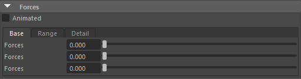
**Forces** 部分允许你**直接向布料的每个顶点（vertex）施加自定义力**（custom forces），单位为 **Newton**（牛顿，力单位）。这是 Carbon 中最“显式”的外部力控制方式之一，类似于 Maya 的 Field（如风场、涡流），但更精细（可 per-vertex 控制）。

**警告**（官方文档反复强调）：

- Continually applying forces produces infinite acceleration. → **持续施加非零力会导致无限加速**（因为力 = 加速度 × 质量，无其他抵消力时速度无限增长）。 所以这个参数**不适合**作为恒定力（如持续风），而更适合**瞬时/短暂/动画驱动**的力（如冲击、爆炸推力、自定义风脉冲、角色拉扯等）。 生产中常用于艺术效果、修复问题、或结合表达式/动画键帧使用。
**Base**（Forces Base） → **基础力向量**（Base Forces Vector，单位：Newton）。

- 你的截图显示三个滑块：**0.000**（X）、**0.000**（Y）、**0.000**（Z）。
- 这是一个**向量**（vector3）：X/Y/Z 三个分量。
- 全布统一施加这个力向量（e.g. [0, 10, 0] = 向上推 10N）。
- 默认 0 → 无额外力（最安全）。
- 注意：Maya 单位（cm + Length Scale 0.01）下，1 Newton 力在小网格上已很强；大网格需更大值。
- 生产中 Base 常设 0，用 Detail/Range 局部控制。
# CollisionMaterial
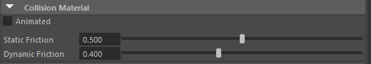
- 这个 Collision Material 部分定义了碰撞体（Collider）的摩擦材质属性（friction material），专门用于布料（Cloth）与这个 Collider（如角色身体、地板、道具）之间的滑动/粘附行为。它与布料的 Carbon Cloth Material 中的 Friction 参数共同作用，但在实际碰撞对（pair）中，Carbon 总是取两个物体中较小的摩擦值（min(Cloth Friction, Collider Friction)）作为最终摩擦系数。这符合真实物理：最低摩擦“赢”（如橡胶 vs 冰面，用冰的低摩擦）。
- 摩擦系数范围：0–1（常见），但可 >1 来模拟强抓握。
- **Static Friction**：0.500 → **静摩擦系数**（Static Friction Coefficient，范围：0.0+，可 >1.0）。
    - 定义物体**静止时**抵抗**开始滑动**所需的**最大切向力**（tangential force）。
    - 物理类比：想象一个静止的盒子在地板上，要推动它需要的力 = 静摩擦 × 法向力（重力/压力）。
    - 值越高 → 越难启动滑动（“粘”得更牢，如橡胶鞋底在粗糙地面 ≈0.6–1.0+）。
    - 值越低 → 更容易滑动（光滑表面，如丝绸在皮肤上 ≈0.2–0.4）。
    - 你的 0.500 是中等值 → 常见皮肤/布料交互（不滑也不太粘）。
    - 官方推荐：从低值开始（如 0.4 / 0.3）避免“粘死”（sticking），尤其在捏合区（pinching，如腋下、腰部），然后逐步 ↑ 到想要的效果。
    - 可设 >1.0 来模拟“抓握”表面（如胶带、魔术贴）。
- **Dynamic Friction**：0.400 → **动摩擦系数**（Dynamic / Kinetic Friction Coefficient，范围：0.0+，≤ Static Friction）。
    - 定义物体**已经滑动时**抵抗**继续滑动**的**摩擦力**。
    - 总是 ≤ Static Friction（真实物理：一旦运动，摩擦变小）。
    - 值越高 → 滑动时阻力越大，速度更快衰减（像粗糙表面）。
    - 值越低 → 滑动更顺滑，几乎不减速（像冰面）。
    - 你的 0.400 < 0.500 → 标准设置（启动难，但一旦动就稍滑）。
    - 典型：Dynamic 通常比 Static 低 10–30%（e.g. 0.5 static → 0.3–0.4 dynamic）。
    - 官方说明：在碰撞对中，取 min(Cloth Dynamic, Collider Dynamic) 作为实际动摩擦。
### 快速调参建议（基于你的设置 + Maya cm 单位）

| 场景类型         | Static Friction | Dynamic Friction | 说明与技巧                       |
| ------------ | --------------- | ---------------- | --------------------------- |
| 角色皮肤（自然贴合）   | 0.4–0.6         | 0.3–0.5          | 中等摩擦，布料稍滑但不飘离               |
| 光滑/丝绸在皮肤上    | 0.2–0.4         | 0.1–0.3          | 低摩擦，布料易滑动/飘逸                |
| 粗糙/牛仔在地板上    | 0.6–0.9         | 0.4–0.7          | 高摩擦，落地快静止                   |
| 捏合区防粘死（腋下/腰） | 0.3–0.5         | 0.2–0.4          | 先低值测试，避免布“卡”在身体             |
| 抓握/胶带效果      | 1.0+            | 0.8+             | 高值模拟强附着                     |
| 你的当前设置       | 0.500 / 0.400   | 中等偏滑             | 适合大多数角色服装；若太滑 → ↑ 到 0.6/0.5 |
# Aerodynamics
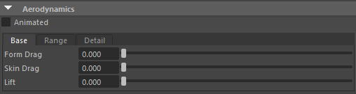
- Aerodynamics 部分控制布料与空气流动（风/流体）的交互，通过显式力（explicit forces）模拟空气动力学阻力（drag）和升力（lift）。这些系数结合 Air Density（Simulation 节点）和 Carbon Flow 节点（或 Maya 内置流场如 Uniform Field、Wind 等）一起工作。
- **重要前提**：
	- 这些参数**只有在场景中有风/流场**（Carbon Flow 或 Maya Field）时才生效。没有流场 = 仍旧是静止空气，只靠 Air Density 的基本阻力。
	- 力是**显式**的（explicit），值太大容易导致模拟不稳定/爆炸（尤其高速风或大网格）。从 **0.01–1.0** 小值开始调，结合 ↑ Subdivisions/Iterations 测试。
	- 支持 **Animated** + **Range × Detail**（Per-Vertex / Texture），允许局部/动画控制（如裙摆边缘风更大）
- **Form Drag**：0.000（Base） → **形状阻力系数**（Form Drag Coefficient，也叫 Pressure Drag / Profile Drag）。
    - 最重要参数！反映风对布料**正面投影面积**（cross-section）的冲击力，像汽车/旗帜的“迎风阻力”。
    - 值越高 → 布料对风的**正面阻力越大**（旗帜/裙摆被吹得更猛烈、更快响应风向变化）。
    - 典型范围：0.1–2.0（真实织物 0.2–1.0 常见；旗帜/帆布可到 1.5+）。
    - 你的 0.000 → 无形状阻力（风几乎不影响布料正面）。
    - 官方推荐：从 0.2 开始调，直到布料对风响应满意（太大 → 爆炸；太小 → 布料不动）。
    - 物理类比：像挡风板/伞被风吹翻，主要靠这个。
- **Skin Drag**：0.000（Base） → **表面摩擦阻力系数**（Skin Friction Drag / Viscous Drag）。
    - 反映空气与布料**表面摩擦**产生的切向阻力（tangential shear）。
    - 值越高 → 布料表面“粘”空气更多，运动时阻力越大、摆动更快衰减（像在稠密流体中拖拽感）。
    - 典型范围：0.1–1.0（常比 Form Drag 稍低或相等；水下模拟可双倍 Form Drag）。
    - 你的 0.000 → 无表面摩擦（风滑过布料无阻力）。
    - 官方/论坛提示：水下/稠密流体时 Skin Drag > Form Drag（e.g. Skin 2× Form）；空气中 Skin Drag 常 ≈ Form Drag 或稍低。
- **Lift Drag**：0.000（Base）（文档中常简称为 Lift） → **升力系数**（Lift Coefficient，也叫 Lift Drag 在某些上下文，但实际是 Lift force 生成的诱导阻力部分）。
    - 生成**垂直于风向的升力**（perpendicular to flow），让布料“飘起/抬升”（像机翼或帆被风抬高）。
    - 正值 → 向布料法线正方向抬升（向上飘）。
    - 值越高 → 升力越大（布料更容易被风“托起”、产生波浪/翻卷）。
    - 典型范围：0.1–1.0（旗帜/裙摆常 0.2–0.8；与 Form Drag 匹配）。
    - 你的 0.000 → 无升力（风只推不抬）。
    - 官方说明：常与 Form Drag 一起调（e.g. 水下模拟 Form = Lift，Skin = 2×）。
# Goal Skin
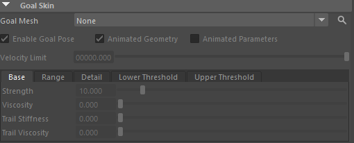
**Goal Skin**（也叫 Goal Pose / Goal Skinning）是 Carbon 中用于**让布料跟随动画目标姿势（Goal Mesh）**的核心机制。它像一个“软绑定”或“morph target”，让模拟布料尽量贴近 Goal Mesh 的动画变形，同时保留柔软物理行为。常用于：

- 角色衣服跟随身体动画（但有自然摆动）
- Physics LOD（低分辨率模拟 + 高分辨率 Goal Skin 跟随）
- 数字双人 / 英雄布料的贴身 + 二次动力学
- 修复初始穿模或让布料“追赶”快速动画
**Goal Mesh**：None（下拉菜单） → 选择用于**目标姿势**的网格形状（shape）。

- 通常是**动画变形**的身体/皮肤 mesh（skinned 或 animated）。
- Goal Mesh 必须与 Start Mesh **拓扑相同**（点/面数量、顺序一致）。
- **None** → 无 Goal Skin（纯自由模拟）。
- 选 mesh 后 → 启用 Goal Skin 跟随。

**Enable Pose**（勾选） → **启用 Goal Pose**（Enable Goal Pose）。

- 勾选 → 激活 Goal Skin 机制，让布料受 Goal Mesh 驱动。
- 不勾选 → 忽略 Goal Mesh（即使选了也无效）。
- 生产必勾选，除非纯自由布料。

**Animated Geometry**（勾选） → **动画几何体**（Animated Goal Geometry）。

- 勾选 → 每帧重新评估 Goal Mesh 的当前位置/变形，并更新目标位置（支持角色动画变形）。
- 不勾选 → 只在第一帧取 Goal Mesh 静态姿势（适合非动画目标）。
- 大多数角色服装/数字人场景**必须勾选**，否则布料不跟随动画。

**Animated Parameters**（不勾选） → **动画参数**（Animated Goal Skin Parameters）。

- 勾选 → 允许下面 Strength、Viscosity、Trail Stiffness 等参数每帧动态变化（表达式/纹理）。
- 不勾选 → 静态参数（推荐，除非有动态需求）。

**Velocity Limit**：100000.000（Lower Limit？截图显示 000000.000，可能为 0.000） → **速度限制**（Goal Skin Velocity Limit）。

- 限制模拟节点与动画节点间的**相对速度**（maximum relative velocity）。
- 值越高 → Goal 力可产生更大速度，帮助布料快速追赶快速动画。
- 官方：只影响 Goal 力，不影响 Trail 力；用于防高速动画导致的穿模/爆炸。

**Base / Range / Detail + Thresholds**（Lower / Upper Threshold，未显示值，但常见结构）

这些参数控制 Goal Skin 的**强度与阻尼**，分 **Strength**（主强度）和 **Trail**（拖尾/大偏差追赶）两组。

- **Strength**：10.000（Base） → **目标强度 / 主跟随力**（Goal Skin Strength）。
    - 值越高 → 布料越强力贴近 Goal Mesh（像硬绑定，贴身无摆动）。
    - 值越低 → 布料更自由（物理主导，跟随弱）。
    - 典型：5–50（中等 10–20 常见；高值用于紧身衣，低值用于飘逸外套）。
    - 你的 10.000 是中等起点 → 适合大多数跟随动画。
    - 与 **Lower/Upper Threshold** 配合：小偏差用 Strength 控制“最终贴合”。
- **Viscosity**：0.000（Base） → **目标粘性**（Goal Skin Viscosity）。
    - 注入动画**速度**到布料（viscous injection of animation velocities）。
    - 值越高 → 布料更快“继承” Goal 的运动速度（帮助追赶快速动画，如甩手/奔跑）。
    - 值低/0 → 无速度注入（只位置跟随，布料响应慢）。
    - 典型：10–100+（甚至极高值，如 solver frequency 的 10%）。
    - 官方：不同于 Stretch/Bend Viscosity（ratio），这个是**绝对粘性**，可很高值来应对高速动画。你的 0.000 → 无速度继承，布料可能“滞后”。
- **Trail Stiffness**：0.000（Base） → **拖尾刚度**（Goal Skin Trail Stiffness）。
    - 专为**大偏差**（large deviations）设计的额外刚度。
    - 值越高 → 当布料偏离 Goal 很大时，更强力“拉回/ snap”到 Goal（像弹簧追赶）。
    - 值 0 → 只靠 Strength（小偏差）。
    - 典型：0.01–1.0+（Physics LOD 中常用高值，让低 res 模拟快速 snap 到高 res Goal）。
    - 你的 0.000 → 无拖尾刚度（大偏差时跟随弱）。
    - 与 Strength 互补：Strength 管小振荡/最终贴合，Trail Stiffness 管大位移追赶。
- **Trail Viscosity**：0.000（Base） → **拖尾粘性**（Goal Skin Trail Viscosity）。
    - 拖尾部分的**viscous ratio**（像 Stretch/Bend Viscosity，1.0 = 临界阻尼）。
    - 值 <1.0 → 欠阻尼（振荡持久）。
    - 值 =1.0 → 临界阻尼（最快稳定无振荡）。
    - 值 >1.0 → 过阻尼（慢回弹）。
    - 典型：0.5–2.0（1.0 最稳）。
    - 你的 0.000 → 无拖尾阻尼（大偏差追赶时可能振荡）。
    - 与 Trail Stiffness 配合：高 Trail Stiffness + 合适 Trail Viscosity 让大偏差快速稳定。

**Lower / Upper Threshold**（未显示值，但存在） → **阈值范围**（Lower / Upper Threshold）。

- 定义“小偏差”（用 Strength）和“大偏差”（用 Trail）的分界。
- Lower Threshold：从小偏差切换到大偏差的阈值（单位：距离或比例）。
- Upper Threshold：大偏差的上限。
- 典型：Lower 很小（如 0.01–0.1），Upper 较大（如 1.0–10.0）。
- 帮助分层控制：小误差靠 Strength 精细贴合，大误差靠 Trail 快速拉回。

### 快速调参建议（基于你的设置）

| 场景类型                   | Enable Pose / Animated Geo | Velocity Limit | Strength | Viscosity | Trail Stiffness | Trail Viscosity | 说明                                      |
| ---------------------- | -------------------------- | -------------- | -------- | --------- | --------------- | --------------- | --------------------------------------- |
| 紧身跟随（数字人皮肤衣）           | 勾选 / 勾选                    | 50–200         | 20–50    | 50–200    | 0.5–2.0         | 1.0–2.0         | 高 Strength + Viscosity 让贴身无滞后           |
| 飘逸外套 / 物理 LOD          | 勾选 / 勾选                    | 20–100         | 5–15     | 10–50     | 0.1–1.0         | 0.8–1.5         | 中等 Strength + 高 Trail 让大摆动追赶            |
| 快速动画（如甩袖/奔跑）           | 勾选 / 勾选                    | 100+           | 10–30    | 100+      | 0.5–2.0         | 1.0             | 高 Viscosity 注入速度，高 Trail 防滞后            |
| 你的当前（Strength 10, 其余0） | 勾选 / 勾选（假设）                | 0              | 10       | 0         | 0               | 0               | 基本跟随，但快速动画易滞后/振荡；建议 ↑ Viscosity & Trail |