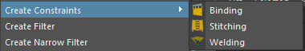
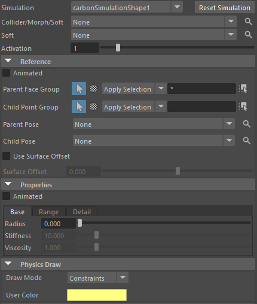
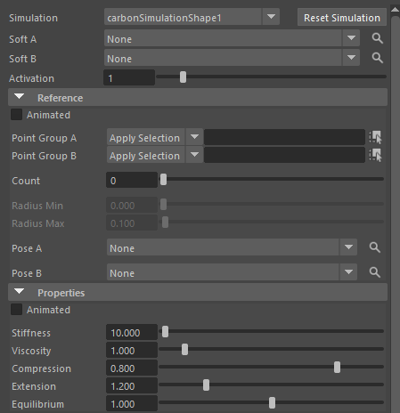

Carbon中的约束有三种：
- Binding（绑定），
- Stitching（缝合），
- Welding（焊接）
# Binding
- 刚体和柔体之间的约束

- Collider/Morph/Soft：输出约束对象
- Soft：接受约束对象
- ParentFaceGroup：约束输出的面组件
- ChildPointGroup：约束接受的点组件
- ParentPose：输出约束对象形状
- ChildPose：接收约束对象形状

- UseSurfaceOffset：使用表面偏移
- SurfaceOffset：表面偏移长度，约束的距离长度

- Radius：约束活动半径，被拉长的距离
- Stiffness：强度，约束被拉长的阻力，拉长后会弹回来
- Viscosity：粘性，约束被拉长后会平滑弹回，不会一直弹跳，类似阻尼
# Stitching
- 柔体和柔体之间的约束

- 前面的属性跟Binding类似不再赘述，无非是两个柔体之间的顶点约束，约束顶点数量要相同
- Stiffness：刚性
- Viscosity：粘性
- Compression：压缩，约束被拉伸的下限，数值要小于伸展
- Extention：伸展，约束被拉伸的上限，数值要大于压缩
- Equilibrium：平衡，约束的比例，可以理解为约束的长度，默认为1。
# Welding
- pass
