# 插件带单
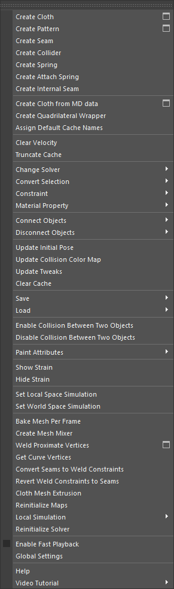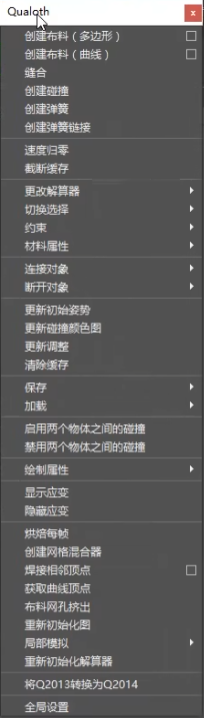
# 布料节点
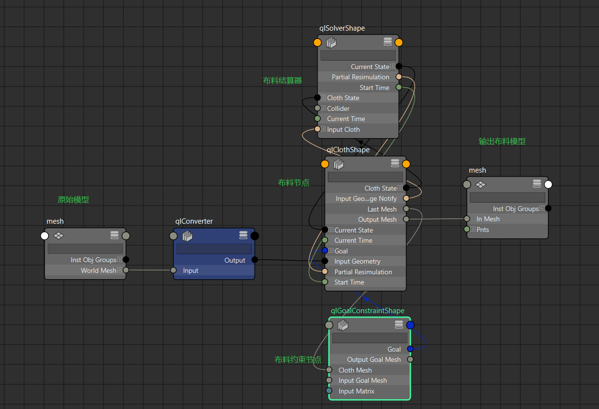
- 原始模型通过一个转换节点连接到布料节点，最终输出布料模型节点。
# 结算器属性
## 模拟属性
- 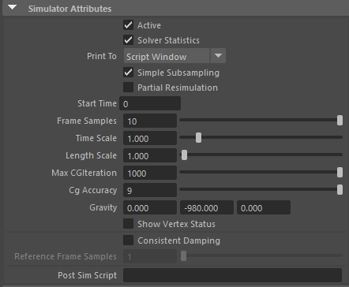
1. Active：激活或禁用整个模拟;
2. SolverStatistics：显示统计解算信息;
3. SimpleSubsampling：打开后,将进行简单的采样，结算速度快，质量较低。
4. PartialResimulation：打开后,可以选择要重置模拟的顶点,其它的顶点将跟着缓存运动
5. StartTime：开始模拟的帧数;
6. FrameSamples：模拟精度，与模拟速度成反比
7. TimeScale：MAYA的时间比例（数值越大,时间越长，速度越慢）
8. LengthScale：布料的长度比例（数值越大,布料物体越柔软，褶皱越多）
9. MaxCGIteration：动力学计算的最大迭代次数，物体的面数越多，就会产生越多的迭代数 。官方建议：默认数值1000即可，不必修改。
10. CG Accuracy：动态迭代的精度指数。数值越大迭代越精确，模拟速度会变慢。官方建议：对于非坚硬布料建议使用4-6，对于坚硬布料，建议使用7-9。不建议使用大于9 的数值。
11. Gravity：重力
12. ShowVertexStatus：显示顶点状态：
	1. 需要先取消隐藏布料定位器
	2. 绿点表示自碰撞顶点
	3. 蓝点表示碰撞的顶点
	4. 红点表示自相交顶点，这些顶点会被向后拉。
13. ConsistentDamping：一致阻尼，物体在创建（MaterialProperty）材料特征后，让物体产生一致的阻尼，而不是收到多个布料阻尼的影响
14. ReferenceFrameSample：参考帧采样，打开了一致阻尼的对象使用的模拟精度，数值要比帧采样数值要小。
15. PostSImScript：后模拟脚本，在求解器计算后的每一帧调用。
## MaterialProperty
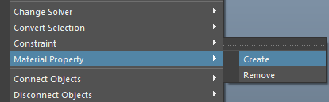
- MaterialProperty：材料特征，可以给布料物体创建一个材料特征，并且覆盖原物体的布料属性；一般不使用，因为这个节点难以找到，需要在节点编辑器中查找。
## 碰撞属性
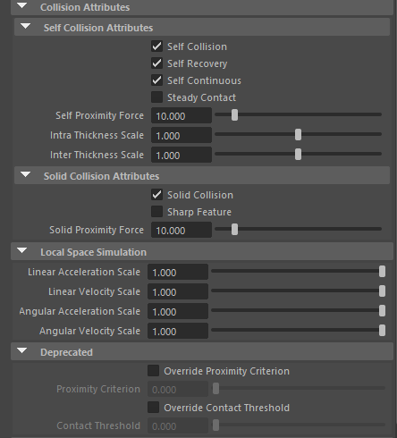
- 碰撞属性
1. SelfCollision：打开或关闭自碰撞;
2. SelfRecovery：自恢复，检测并处理自身交叉顶点;
3. SelfContinuous：自连续，检测并解决自身的连续碰撞;
4. SteadyContact：自排斥力，与其它布料物体的顶点排斥力;

- 固体碰撞属性
1. SolidCollision：固体碰撞，打开或关闭对固体的碰撞;
2. SharpFeature：尖锐特征，额外计算实体物体的尖锐特征,以便
更好的产生碰撞;
3. SolidProximityForce：固体排斥力，与其它固体物体的顶点排斥力;

- 局部空间模拟，跟空间转化有关 
1. LinearAccelerationScale：线性加速度比例，影响由参考变换的线性运动引起的空气阻力;
2. LinearVelocityScale：线性速度比例，影响由参考变换的线性加速度引起的线性惯性效姬
3. AngularAccelerationScale：角度加速度比例,在影响离心力，科里奥利力和由参考变换的角运动引起的空气阻力
4. AngulaVelocityScale：角度速度比例，影响由参考变换的角加速度引起的欧拉力

- 已弃用(已经放弃使用了)
1. 覆盖接近标准:激活或禁用覆盖接近标准;
2. 接近标准:接近标准的数值;
3. 覆盖接触阈值:激活或禁用覆盖接触阈值;
4. 接触阈值:接触阈值的数值;
# 空间转化

- 创建布料时,系统会默认使用世界空间模拟.
- 选中布料输出模型点击Set Local Space Simulation将其模拟转化为局部空间模拟.
- 在转化时如果有多个布料节点，需要将多个布料输出模型打组，然后选中其实中一个转化为局部空间模拟，这样组下的所有不了输出模型都会转化。
- 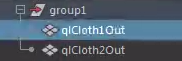
# 布料属性
## 属性1
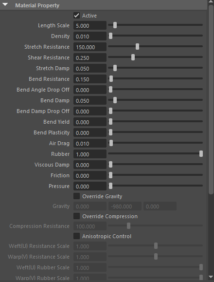
1. Active ：激活，打开模拟;
2. LengthScale：长度比例，布料的柔软度（数值越大，布料越柔软，褶皱越多）
3. Density：密度，布料的质量密度（数值越大,布料越重）;
4. StretchResistance：拉伸抗性，布料抵抗拉伸和压缩的强度
（数值越大,物体越难被拉伸和压缩,默认数值影响拉伸跟压缩）
5. ShearResistance：斜切抗性，布料抵抗斜切的强度
6. StretchDamp：拉伸阻尼，布料会被平滑的拉伸，平滑的反弹恢复，不会像弹魔一样弹来弹去
7. BendResistasnce：弯曲抗性，布料抵抗弯曲的强度，加大用来制作硬质布料。
8. BendAngleDropOff：弯曲角度衰减，布料在抗弯曲的基础上产生小弯曲的强度
9. BendDamp：弯曲阻尼，布料被弯曲后,会平滑的反弹回来,不会像弹簧一样弹来弹去
10. BendDampDropOff：弯曲阻尼衰减，布料在弯曲阻尼的基础上，弯曲小反弹的比例
11. BendYield：弯曲屈服，物体变形的屈服角度（例如,物体需要弯曲90度，而屈服数值为60，那么当物体弯曲超过60度的时候，就不能再恢复为原状了）
12. BendPlasticity：弯曲可塑性，物体产生屈服后的静止角度变化，与弯曲屈服配合使用。（数值为0时,物体的静止角度完全不变化,数值为1时,物体的静止角度等于当前弯曲角度，测试的时候，数值是一个不可逆的数值）
13. AirDrag：物体受场影响的强度，如果没有场，数值会沿每个三角角形的面法线方向拖动布料运动
14. Rubber：橡胶，布料静止形态的面积缩放（数值大于1,布料膨胀，数值小于1,布料收缩）
## 属性2
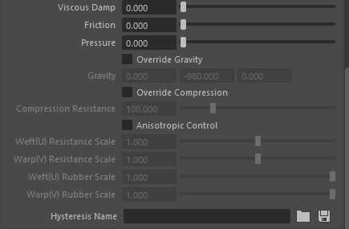
1. ViscousDamp：粘性阻尼，将布料的每个顶点的运动均匀地拖向所有方向，而不管每个顶点法线的方向。是一个强力阻尼。
2. Friction：摩擦力，布料物体之间的摩擦力，当两个物体都有摩擦力时，摩擦擦力的数值取两者的平均数
3. Pressure：压力，物体的顶点法线方向上的压力的大小（数值大于0,布料膨胀长,数值小于0,布料压缩）
4. OverrideGravity：覆盖重力，布料单独覆盖解算器的重力
5. Gravity：重力，重力方向
6. OverrideCompression：覆盖压缩，单独覆盖物体的压缩，不打开时，物体的压缩数值等于拉伸数值
7. CompressionResistance：压缩抗性，物体抵抗压缩的强度;
8. AnisotropicControl：各向异性控制，物体不同的受力方向;
9. 纬度(U)抗性比例：纬度上拉伸跟压缩阻力的比例因子;
10. 经度(V)抗性比例：经度上拉伸跟压缩阻力的比例因子;
11. 纬度(U)橡胶比例：纬度上橡胶的比例因子;
12. 经度(V)橡胶比例：经度上橡胶的比例因子;
13. HysteresisName：迟滞名称，保存布料的折痕(旧版本的效果比较明显);
## 属性3
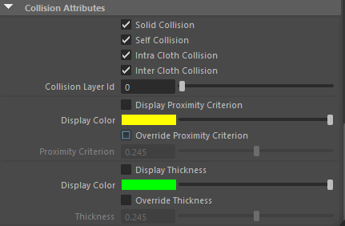
1. 固体碰撞：布料物体与被动物体之间的碰撞;
2. 自碰撞：物体自身碰撞;
3. 布料内碰撞：布料自身碰撞;
4. 布料间碰撞：布料与其它布料之间的碰撞;
5. 碰撞层ID：官方没有解释;
6. 显示接近标准：显示接近标准;
7. 显示颜色：接近标准的颜色;
8. 覆盖接近标准：显示覆盖接近标准;
9. 接近标准：覆盖接近标准的颜色;
10. 显示厚度：显示布料厚度;
11. 显示颜色：显示布料厚度的颜色;
12. 覆盖厚度：覆盖布料的厚度（如果数值没有打开,那么布料的厚度就由接近标准的数值来影响）
13. 厚度：布料的厚度;
## 属性4
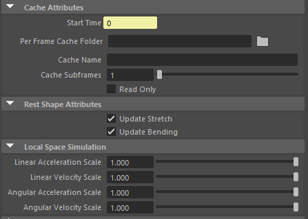
- 缓存属性
1. 开始时间：缓存的开始帧
2. 每帧缓存文件夹：选择要输出缓存的文件夹
3. 缓存名称：缓存的名称
4. 缓存子帧：一帧计算多少次
(数值越大,计算越精确,同时缓存文件越大)
5. 只读：读取缓存,不覆盖现有缓存

- 静止形状属性
1. 更新拉伸：布料物体在使用静止形状时,要不要更新与静止形状的物体的拉伸一致;
2. 更新弯曲：布料物体在使用静止形状时,要不要更新与静止形我的物体的弯曲一致;

- 局部空间模拟
1. 线性加速度比例：影响由参考变换的线性运动引起的空气助;
2. 线性速度比例：影响由参考变换的线性加速度引起的线性惯性效姬
3. 角度加速度比例：在影响离心力,科里奥利力和由参考变换的角运动引起的空气阻力
4. 角度速度比例：影响由参考变换的角加速度引起的欧拉力 