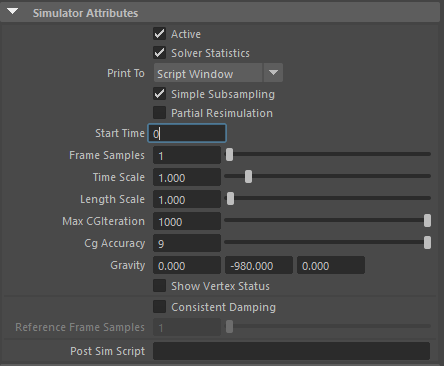
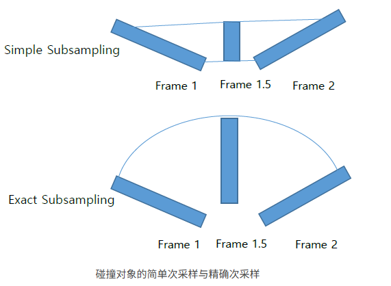
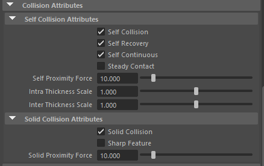
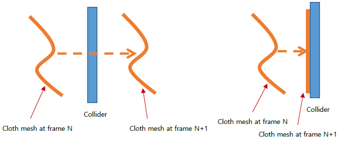
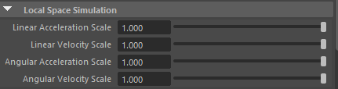
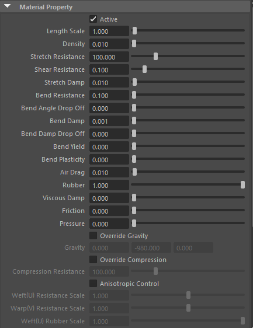
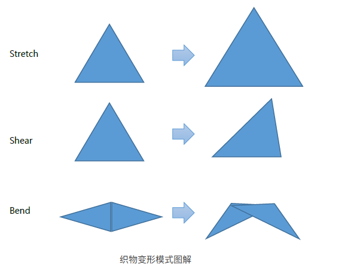
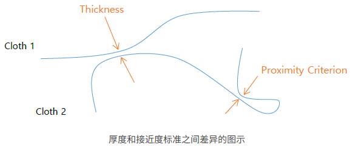
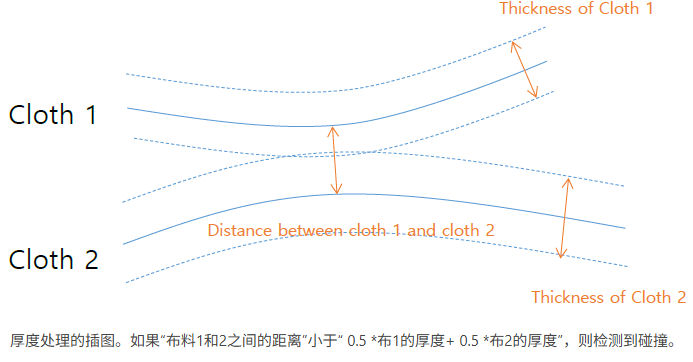

# 插件带单

# 布料节点

- 原始模型通过一个转换节点连接到布料节点，最终输出布料模型节点。
# 结算器属性
## 模拟属性
- 
1. **Active (激活)**：激活或停用此solver(求解器)。
2. **Solver Statistics (解算器统计)**：按如下方式打印solver(求解器)统计。
	- **qlSolverShape1**FRAME1**：**#CG：5 SOL：0.009 COL：0.013 DEP：0.003 TOT：0.025 ACCUM：0.025**  
		- **qlSolver Shape1** : solver(求解器)节点的名称。
		- **FRAME 1** : 当前帧
		- **#CG** : 动力学solver(求解器)的迭代次数
		- **SOL** : 用秒计算方程运动所花费的时间
		- **COL** : 自碰撞和实体碰撞处理所花费的时间
		- **DEP** : 用于计算输入依赖节点(如碰撞器、约束、弹簧、字段等)的时间。
		- **TOT** : 每帧的总计算时间=SOL+COL+DEP
		- **ACCUM** : 此solver(求解器)的累积计算时间
3. **Simple Subsampling (简单子采样)** : 确定子采样方法(simple vs. exact ,简单与精确)。如果启用“简单子采样”(simple sub sampling)，则在子步骤期间对输入节点(如碰撞对象)进行线性插值，否则将在每个子步骤精确求值。对于快速旋转的碰撞对象，使用“exact”子采样方法将以增加计算时间为代价产生更精确的结果(由于需要多次计算输入节点，因此**DEP**时间增加)。
	
4. **Partial Resimulation (部分重模拟)**：启用时，仅模拟选定的布料顶点，其他顶点受cache (缓存）结果约束。
5. **Start Time (开始时间)**：此solver(求解器)开始计算时的帧数。此开始时间属性由该solver(求解器)下的所有布料对象共享。
6. **Frame Samples (帧采样)**：计算帧的子步骤数。使用较大的数字会导致碰撞处理的准确性更高，但会增加计算时间。 1〜3适用于慢镜头，8〜20可用于快镜头
7. **Time Scale (时间比例)**：时间拉伸因子。该值缩放在玛雅中使用的时间单位。假设一帧对应于玛雅中的1/24秒，如果将“时间比例”设置为10.0，则solver(求解器)将一帧解释为1/240秒。通过控制此值，可以创建慢动作效果(bullet time effect)。
8. **Length Scale (长度比例)**：长度比例尺使此solver(求解器)下的布料对象看起来大于或小于几何图形表示的实际尺寸。请注意，每个布料对象都具有“长度比例”属性和“长度比例图”。布料顶点的最终有效长度比例如下计算。  
	- 有效长度比例 = 布料长度比例 X 布料长度比例贴图 X 解算器长度比例_
9. **MAX CG Iteration**：用于动力学计算的最大迭代次数。为了获得最佳结果，请solver(求解器)不要达到此极限。您可以在打印的solver(求解器)统计信息(#**CG**)中验证每一帧使用的迭代次数。
10. CG Accuracy：**CG精度**，动力学迭代的精度指标。当这个值变大时，会以增加迭代次数为代价获得更精确的结果。不硬布4~6为宜，硬布7~9为宜。不建议使用大于9的
11. **Gravity (重力)**：重力。请注意，每个布料对象都可以具有自己的重力。如果不是每个布料都覆盖它，则默认使用此值。
12. ShowVertexStatus：显示顶点状态：
	1. 需要先取消隐藏布料定位器
	2. 绿点表示自碰撞顶点
	3. 蓝点表示碰撞的顶点
	4. 红点表示自相交顶点，这些顶点会被向后拉。
13. ConsistentDamping：一致阻尼，物体在创建（MaterialProperty）材料特征后，让物体产生一致的阻尼，而不是收到多个布料阻尼的影响
14. ReferenceFrameSample：参考帧采样，打开了一致阻尼的对象使用的模拟精度，数值要比帧采样数值要小。
15. PostSImScript：后模拟脚本，在求解器计算后的每一帧调用。
## MaterialProperty

- MaterialProperty：材料特征，可以给布料物体创建一个材料特征，并且覆盖原物体的布料属性；一般不使用，因为这个节点难以找到，需要在节点编辑器中查找。
## 碰撞属性

- 碰撞属性
1. **Self Collision (自碰撞)**：激活自碰撞。每个布料都可以覆盖此标志。
2. **Self Recovery (自恢复)**：解决自碰撞时，检测并解决自交叉。
3. **Self Continuous (自连续)**：解决自碰撞时，检测并解决连续碰撞。
4. **Steady Contact (稳定接触)** : 核心作用是**提高布料在静止或缓慢运动状态下的物理稳定性，消除多层布料堆叠时的“抖动”现象。（当布料顶点容易粘到其他布料顶点时，请关闭此选项。 例如，如果裙子的布料顶点被衬衫的手臂拉起并且不容易脱落，则关闭此选项。 否则，此选项可提高自接触的稳定性。）
5. **Self Proximity Force (自邻近力)**：是布料自碰撞的一种**预警机制**。它是一种斥力。当布料的两个部分靠近到一定距离（还未真正接触）时，解算器会提前施加一个推力，试图防止它们相撞。较高的数值能强力防止面料在剧烈运动中互相穿插。
6. **Intra Thickness Scale (内部厚度缩放)** :这个参数专门处理**同一件布料**（同一个 Qualoth 物体）内部的碰撞距离。
7. **Inter Thickness Scale (间部厚度缩放)** : 这个参数处理的是**不同 Qualoth 物体**之间的碰撞距离。

- 固体碰撞属性
1. **Solid Collision (实体碰撞)**：激活布料到实体碰撞。每一块布都可以覆盖这面旗
2. **Sharp Feature (锐化特征)**：为处理实体的锐化特征执行额外的计算。禁用此选项后，将只解决布料顶点与实体多边形的碰撞；启用此选项后，将解决所有其他基本体对(布料多边形与实体顶点、布料边与实体边、布料顶点与实体顶点)之间的碰撞
3. **Solid Proximity Force (固体接近力)**: 布料与接触的固体物体之间的排斥力。

下图显示了连续碰撞检测与邻近检测的区别。实体碰撞处理默认使用连续碰撞检测，而用户可以选择是否使用它进行自碰撞处理。

接近检查与连续检查：连续碰撞检测不会错过薄壁(右)与仅接近检测(左)的对比，因为布料顶点的所有轨迹都是根据碰撞器进行检查的

- 已弃用(已经放弃使用了)
1. 覆盖接近标准:激活或禁用覆盖接近标准;
2. 接近标准:接近标准的数值;
3. 覆盖接触阈值:激活或禁用覆盖接触阈值;
4. 接触阈值:接触阈值的数值;
# 局部空间模拟

在线性/角速度突然变化或快速旋转的情况下，由于惯性效应过大或错误的碰撞处理，布料模拟可能不稳定或不理想。利用局部空间模拟，通过显式控制惯性效应，可以大大减少这种伪影。

- **用法**
1. 对于具有多个布料对象的solver(求解器)，首先检查solver(求解器)下每个布料对象的输出网格变换是否具有相同的变换矩阵。
2. 选择或创建将用作参考变换的变换节点(例如，使用“Constrain>Point on Poly”命令将对象约束到身体网格的面或顶点)
3. 将输出的布料网格设置为选定的引用变换节点的父对象，该节点在**步骤2**中设置为跟随身体网格运动
4. 选择解算器或解算器下的任何布料，然后单击“Qualoth>Set Local Space Simulation”。若要撤消此操作，请选择一个解算器并单击“Qualoth>Set World Space Simulation”(请注意，局部空间模拟是每个解算器执行的，而不是每个布料对象执行的，即使每个布料对象的惯性效果可以按不同的比例缩放，如下所述)

- 创建布料时,系统会默认使用世界空间模拟.
- 选中布料输出模型点击Set Local Space Simulation将其模拟转化为局部空间模拟.
- 在转化时如果有多个布料节点，需要将多个布料输出模型打组，然后选中其实中一个转化为局部空间模拟，这样组下的所有不了输出模型都会转化。
- 

1. **Linear Acceleration Scale (线性加速度标度)**-影响由参考变换的线性加速度引起的线性惯性效应
2. **Linear Velocity Scale (线性速度比例)**–影响由参考变换的线性运动引起的空气阻力
3. **Angular Acceleration Scale (角加速度标度)**–影响由参考变换的角加速度引起的欧拉力
4. **Angular Velocity Scale (角速度标度)**- 影响(1)离心力，(2)科里奥利力，和(3)由参考变换的角运动引起的空气阻力
# 布料属性
## 属性1

1. Active ：激活，打开模拟;
2. LengthScale：长度比例，布料的柔软度（数值越大，布料越柔软，褶皱越多）
3. Density：密度，布料的质量密度（千克/平方厘米）
4. StretchResistance：拉伸抗性，布料抵抗拉伸和压缩的强度
（数值越大,物体越难被拉伸和压缩,默认数值影响拉伸跟压缩）
5. ShearResistance：斜切抗性，布料抵抗斜切的强度
6. StretchDamp：拉伸阻尼，布料会被平滑的拉伸，平滑的反弹恢复，不会像弹魔一样弹来弹去
7. BendResistasnce：弯曲抗性，布料抵抗弯曲的强度，加大用来制作硬质布料。
8. BendAngleDropOff：弯曲角度衰减，布料在抗弯曲的基础上产生小弯曲的强度
9. BendDamp：弯曲阻尼，布料被弯曲后,会平滑的反弹回来,不会像弹簧一样弹来弹去
10. BendDampDropOff：弯曲阻尼衰减，布料在弯曲阻尼的基础上，弯曲小反弹的比例
11. BendYield：弯曲屈服，物体变形的屈服角度（例如,物体需要弯曲90度，而屈服数值为60，那么当物体弯曲超过60度的时候，就不能再恢复为原状了）。超过此限制角度后，静止角度开始改变并形成永久折痕。有效范围为0.0~180.0。只有当弯曲塑性大于0.0时，此值才有意义。
12. BendPlasticity：弯曲可塑性，物体产生屈服后的静止角度变化，与弯曲屈服配合使用。（数值为0时,物体的静止角度完全不变化,数值为1时,物体的静止角度等于当前弯曲角度，测试的时候，数值是一个不可逆的数值）
13. AirDrag：空气阻力，物体受场影响的强度，如果没有场，数值会沿每个三角角形的面法线方向拖动布料运动
14. Rubber：橡胶，布料静止形态的面积缩放（数值大于1,布料膨胀，数值小于1,布料收缩）

## 属性2

1. ViscousDamp：粘性阻尼，将布料的每个顶点的运动均匀地拖向所有方向，而不管每个顶点法线的方向。是一个强力阻尼。
2. Friction：摩擦力，控制布料对象或碰撞器之间的摩擦力。当两个具有不同摩擦值的物体(布料或碰撞器)接触时，这两个物体之间的有效摩擦成为其摩擦的平均值。
3. Pressure：压力，物体的顶点法线方向上的压力的大小（数值大于0,布料膨胀长,数值小于0,布料压缩）
4. OverrideGravity：覆盖重力，布料单独覆盖解算器的重力
5. Gravity：重力，重力方向
6. OverrideCompression：覆盖压缩，单独覆盖物体的压缩，不打开时，物体的压缩数值等于拉伸数值
7. CompressionResistance：压缩抗性，物体抵抗压缩的强度;
8. AnisotropicControl：各向异性控制，物体不同的受力方向;
9. 纬度(U)抗性比例：纬度上拉伸跟压缩阻力的比例因子;
10. 经度(V)抗性比例：经度上拉伸跟压缩阻力的比例因子;
11. 纬度(U)橡胶比例：纬度上橡胶的比例因子;
12. 经度(V)橡胶比例：经度上橡胶的比例因子;
13. HysteresisName：迟滞名称，保存布料的折痕(旧版本的效果比较明显);
## 属性3

1. **Solid Collision (实体碰撞)**：激活布料和碰撞器之间的碰撞处理
2. **Self Collision (自碰撞)**：激活自碰撞
3. **Intra Cloth Collision (布料内部碰撞)**：激活布料对象对自身的自碰撞。只有启用“自碰撞”时，才能访问此选项。
4. **Inter Cloth Collision (布料间碰撞)**：激活布料对象与其他布料对象的自碰撞。只有启用“自碰撞”时，才能访问此选项。
5. 碰撞层ID：官方没有解释;
6. **Proximity Criterion (邻近条件)**：指定布料内部碰撞的阈值。此值由附加到此布料的solver(求解器)自动确定，并且可以为每个布料对象手动覆盖。
7. **Display Proximity Criterion (显示接近度标准)**：可视化布料对象的接近度标准。
8. 显示颜色：接近标准的颜色;
9. 覆盖接近标准：显示覆盖接近标准;
10. 接近标准：覆盖接近标准的颜色;
11. **Thickness (厚度)**：指定此布料对象与附加到同一solver(求解器)的其他布料对象之间的布料间碰撞的阈值。如果不重写，则将此值指定为邻近条件的相同值。
12. **Display Thickness (显示厚度)**：可视化布料对象的厚度。
13. 显示颜色：显示布料厚度的颜色;
14. 覆盖厚度：覆盖布料的厚度（如果数值没有打开,那么布料的厚度就由接近标准的数值来影响）
15. 厚度：布料的厚度;

## 属性4

- 缓存属性
1. 开始时间：缓存的开始帧
2. 每帧缓存文件夹：选择要输出缓存的文件夹
3. 缓存名称：缓存的名称
4. 缓存子帧：一帧计算多少次
(数值越大,计算越精确,同时缓存文件越大)
5. 只读：读取缓存,不覆盖现有缓存

- 静止形状属性
1. 更新拉伸：布料物体在使用静止形状时,要不要更新与静止形状的物体的拉伸一致;
2. 更新弯曲：布料物体在使用静止形状时,要不要更新与静止形我的物体的弯曲一致;

- 局部空间模拟
1. 线性加速度比例：影响由参考变换的线性运动引起的空气助;
2. 线性速度比例：影响由参考变换的线性加速度引起的线性惯性效姬
3. 角度加速度比例：在影响离心力,科里奥利力和由参考变换的角运动引起的空气阻力
4. 角度速度比例：影响由参考变换的角加速度引起的欧拉力 
# 案例
## JohnWick的毛呢大衣
### Solver (解算器) 建议
- **Frame Samples :** 15。如果角色有 360 度转体甩动大衣的动作，可以提升到 **20-30**。
- **Self Collision Offset:** 建议设为 **0.05 - 0.1**，防止长衣摆多层重叠时发生粘连。
- **Self Collision (自碰撞):** * **Intra/Inter Thickness Scale:** 为 1.0。如果发现大衣下摆重叠时有明显的“穿透”或者“粘连”，可以微调此数值（例如 0.8 或 1.2）。
- 建议勾选 **Steady Contact**：这有助于大衣在静止或平稳走动时，多层布料堆叠更加稳定

### 推荐布料属性 (Cloth Attribute) 设置

|**属性名称**|**推荐值**|**目的与效果说明**|
|---|---|---|
|**Density**|**0.150 - 0.250**|默认的 0.07 太轻。增加密度能让大衣在走动时产生更好的惯性和下坠感。|
|**Stretch Resistance**|**1000.0 - 2000.0**|大衣面料几乎不拉伸。300 偏软，调高能防止衣服在肩膀处过度拉长变形。|
|**Shear Resistance**|**0.800 - 1.000**|剪切力决定面料的斜向形变。调高可以增加大衣的“挺括度”，减少软烂感。|
|**Bend Resistance**|**5.0 - 15.0**|**关键参数**。图中默认 3.0。数值越高，折痕越大越圆滑，能体现厚呢子料的质感。|
|**Bend Damp**|**0.100 - 0.200**|增加弯曲阻尼，防止面料在快速动作中出现类似弹簧的细微抖动。|
|**Air Drag**|**0.020 - 0.050**|略微提升空气阻力，模拟重型衣物在空气中缓慢、稳重的摆动感。|
|**Friction**|**0.300 - 0.500**|默认 0 会导致面料太滑。增加摩擦力能让腋下、腿部的摩擦更真实。|
|**Rubber**|**0.000**|**必须调低**。图中默认 1.0 会让布料带有弹性。对于西装大衣，建议降为 0。|
### 核心调优思路

-  **对抗“软绵绵”：** John Wick 的大衣视觉上非常冷峻挺拔。如果你的 **Bend Resistance** 设置过低，大衣看起来会像是一件丝绒睡袍。如果觉得摆动幅度太大，优先增加 **Density** 和 **Bend Resistance**。
- **抗拉伸：** 既然是长款大衣，下摆的重量很大，如果 **Stretch Resistance** 不够，大衣的领口会被下摆拖拽变形。
-  **阻尼的力量：** **Bend Damp** 是一把双刃剑。如果模拟结果看起来像是在水里运动，就降低它；如果褶皱一直在乱跳，就稍微加一点
- **如果你觉得大衣太“肉”：** 提高 **Shear Resistance** 和 **Bend Resistance**。
- **如果你觉得大衣像塑料片：** 降低 **Bend Resistance**，同时稍微增加 **Air Drag**（空气阻力）。
- **避免“爆炸”：** 长款大衣在两腿之间容易发生剧烈的自碰撞冲突。如果发生爆炸，先检查碰撞体（皮肤）是否太厚，再尝试减小解算器的 **Time Scale**。
