# 注意事项
- 请注意布料节点跟模型的尺寸有很大的的关系，请准备与事实相符尺寸的模型，比如旗帜高度为300cm，尺寸太小或太大会导致结算结果不符预期。
- 使用Qualoth结算布料时请将动画评估模式从Parallel并行多线程模式改为DG模式单线程
	- 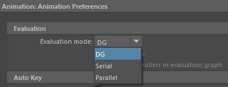
- 将时间设为播放每一帧
	- 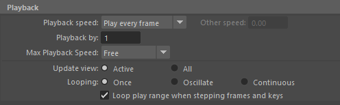
# 创建场景

- 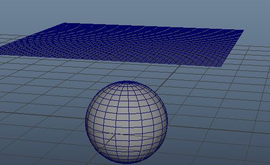
# 创建布料
- 选择平面点击CreateCloth命令
- 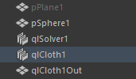
- 场景中会增加两个节点
	- qlSolver1：结算器节点
	- qlCloth1：布料节点
	- 场景中会隐藏之前的布料模型pPlane1，新增一个布料输出模型qlCloth1Out
- 我们将布料输出模型 qlCloth1Out 作为布料节点 qlCloth1 的子对象
- 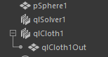
- 此时我们点击播放按钮，就能看到平面掉落，**重新结算需要选择布料节点或结算器节点点击清除缓存ClearCache**。
# 创建碰撞

- 先选择球体模型pSphere1，再选择结算器节点qlSolver1，选择CreateCollider，创建碰撞。
- 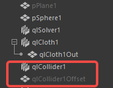
- 场景中回增加两个节点
	- qlCollider1：碰撞节点
	- qlCollider1Offset：碰撞体偏移模型
- 我们将qlCollider1Offset：碰撞体偏移模型作为qlCollider1：碰撞节点的子对象，便于管理
- 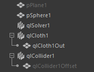
- qlCollider1 碰撞节点有三个属性
- 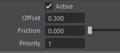
	- offset：偏移（厚度），直接影响qlCollider1Offset：碰撞体偏移模型
	- Friction：摩擦力
	- Priority：优先级
# 属性调优
- 选择结算器qlSolver1查看结算器属性qlSolverShape1，开启自碰撞
- 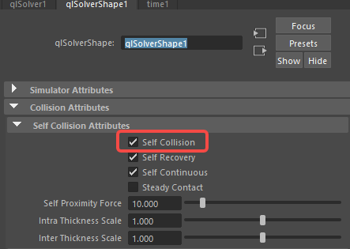
- 可防止布料自身的穿插
# 导出缓存
- 选择当前所结算的布料，创建点缓存
- 
- 或者利用Alembic到处abc格式的缓存
- 
- 记得导出时勾选UV选项
- 
# 导入引擎
- 将abc文件导入虚幻引擎，ImportType改为GeometryCache
- 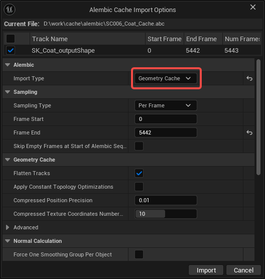
- 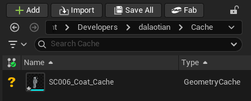
- 将缓存文件拖入场景中，然后创建一个过场动画，将场景中的缓存文件加入过场动画
- 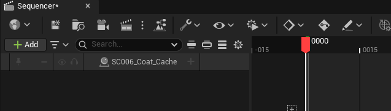
- 为过场动画中的缓存点击加号增加一个几何体缓存组件
- 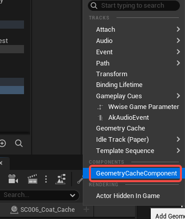
- 点击几何体缓存的加号添加缓存
- 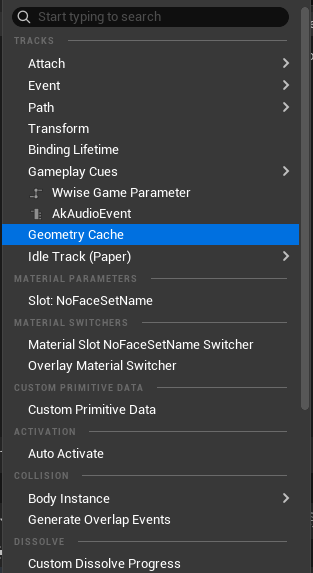
- 