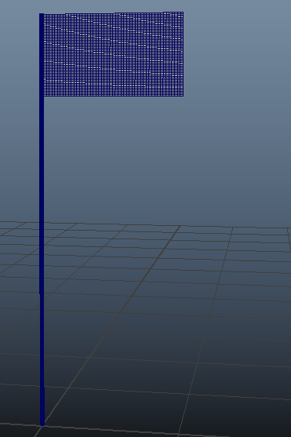
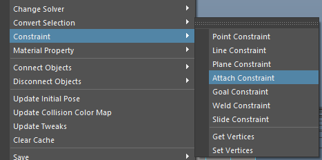
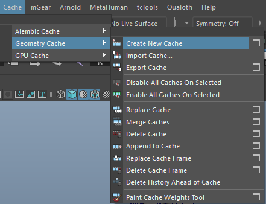
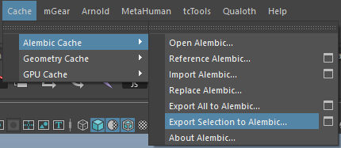
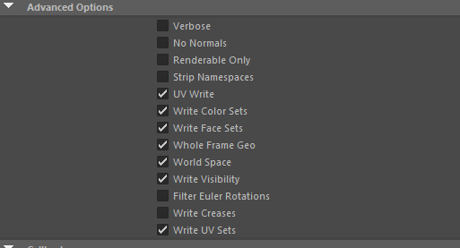

- 制作模型
- 
- 选择旗面创建布料
- 为了将旗面固定到杆子上，我们选择旗面的最里层一列点和旗杆，点击AttachConstraint创建约束。
- 
- 注意：在不同的maya版本和不同的插件版本中AttachConstraint会导致maya卡死CPU占用100%，这是因为maya的并行求解器和插件的冲突导致死循环，只需将Preferences → Settings → Animation →  Evaluation Mode 改成 DG（而不是默认的 Parallel）。改完后重启 Maya.DG 模式下整体求值会慢一点，但对 Qualoth 这种老插件来说反而更稳定。
- 然后为旗杆添加碰撞，就可以了。
- 选择当前所结算的布料，创建点缓存
- 
- 或者利用Alembic到处abc格式的缓存
- 
- 记得导出时勾选UV选项
- 