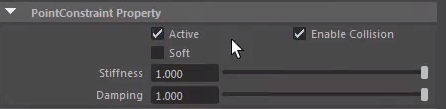
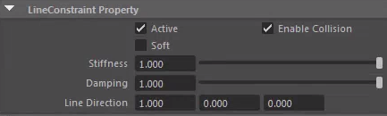
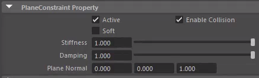
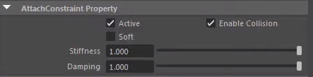
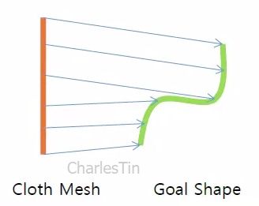
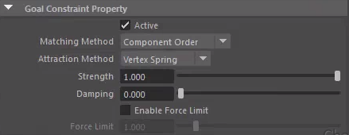
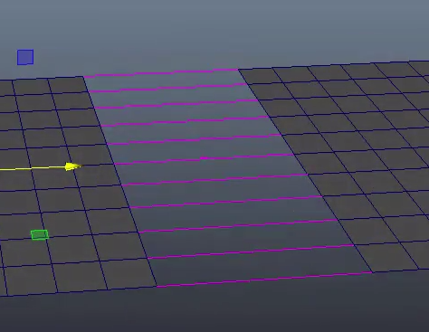
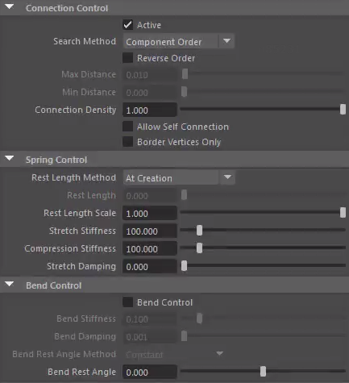

以下按你提供的 Qualoth 约束菜单顺序，逐一介绍每个约束的主要作用、典型使用场景和关键特点（基于 Qualoth 常见的实际生产用法，部分名称在不同版本或汉化中可能略有显示差异）：
# **约束**
## **Point Constraint**（点约束）  
   把布料的**一个或多个顶点**强制固定（或部分固定）在**世界空间的一个固定点**、或者固定到**另一个物体的一个特定点**上。  
   - 典型用途：扣子、挂钩、肩章、饰品固定点、披风/围巾的尖角固定  
   - 特点：最硬的约束之一，几乎没有弹性（除非你手动调低强度）  
   - 支持：可以画权重图（per-vertex），强度可以 < 1 做软固定

## **Line Constraint**（线/直线约束）  
   把布料上的**两个点**（或两组点）之间强制保持**直线距离**（或接近直线），常用来模拟硬质结构。  
   - 典型用途：衣服上的硬质腰带、皮带、盔甲边缘、刀鞘挂绳、抽绳被拉直的部分  
   - 特点：可以设置 Rest Length（休息长度），强度很高时接近刚体杆  
   - 常和 Spring Constraint 对比：Line 更强调“保持直线”，Spring 更强调“弹簧弹性”

## **Plane Constraint**（平面约束）  
   把布料的某些顶点限制在**某个平面的一侧**（或严格贴在平面上）。  
   - 典型用途：防止裙子/布料钻进地面、地板、桌子；模拟布料被墙/地板挡住的效果  
   - 特点：通常用于被动碰撞面（非碰撞体），比单纯的碰撞更可控  
   - 使用频率：中等偏低，但某些硬表面场景非常有用

## **Attach Constraint**（附着/粘附约束）  
   把布料的点**附着**到其他对象（被动物体）**的表面上，跟随表面的运动。  
   - 典型用途：衣服牢牢贴在身体某部位（领口、袖口、腰部固定区域）、布料粘在移动的道具上  
   - 和 Goal 的区别：Attach 更强调“贴合表面 + 跟随运动”，Goal 更偏向“朝目标形状拉” 
   - 支持权重图，常用于局部紧身区域

## **Goal Constraint**（目标约束）  
Qualoth 是 Maya 中非常受欢迎的第三方布料解算插件（由 FXGear 开发），它的 **Goal Constraint**（目标约束）是用来控制布料跟随某个“目标形状”（Goal Shape）进行运动的最核心工具之一。

它主要用于实现以下几种常见布料需求：

- 让布料跟随角色骨骼绑定的蒙皮网格（skinned mesh）运动
- 在动画中让布料保持一定的“跟随度”，但又保留一定的动态飘动感
- 制作“软绑定”效果（比直接蒙皮更柔软、自然的跟随）
- 通过关键帧或权重图来艺术指导（art-direct）布料的运动轨迹

### Goal Constraint 的创建方式
通常操作顺序如下：

1. 选择 **目标网格**（Goal Mesh，通常是已绑定好骨骼并蒙皮的角色身体/肢体网格）
2. 再加选 **Qualoth布料网格**（已经创建了 qlCloth 的那个 mesh）
3. 执行菜单：**Qualoth > Constraint > Goal Constraint**

创建后会生成两个主要节点：
- **qlGoalConstraint**（约束节点，控制整体属性）
- **qlGoalShape**（目标形状节点，通常挂在原目标网格下）

### Goal Constraint 的三种主要 Attraction Method（吸引方式）
Qualoth 的 Goal Constraint 提供了三种不同的实现机制（在 qlGoalConstraint 节点的 Attribute Editor 中可以切换 **Attraction Method**）：

| 类型              | 英文名            | 原理与特点                                                                 | 典型使用场景                          | 性能消耗 | 跟随紧实度 |
|-------------------|-------------------|----------------------------------------------------------------------------|---------------------------------------|----------|------------|
| Vertex Spring     | Vertex Spring     | 在布料每个顶点与对应目标顶点之间直接创建弹簧连接，最接近 nCloth 的 Attract to Matching Mesh | 需要非常强的跟随，但又希望有轻微弹性时 | 中等     | ★★★★☆     |
| Wind Control      | Wind Control      | 通过“虚拟风力”把布料吹向目标形状，模拟比较柔和的引导力                           | 想要布料有明显飘动、延迟感时           | 较低     | ★★☆☆☆     |
| Constraint        | Constraint        | 更强硬的约束方式（类似直接绑定，但仍保留部分布料特性）                           | 需要极高跟随精度（如紧身衣、手套等）   | 较低     | ★★★★★     |

- **Vertex Spring** 是最常用、最平衡的一种，很多高级艺术家都会从它开始调节。
- **Wind Control** 比较“艺术化”，飘逸感最强，但控制难度也最高。
- **Constraint** 接近“硬跟随”，适合不需要太多动态的部位。

### 最重要的几个属性（qlGoalConstraint 节点）
- **Goal Weight** / **Attraction Strength**：整体跟随强度（0~1 或更高），最核心的参数
- **Goal Map** / **Attraction Map**：权重图（paintable），可以画出不同区域不同的跟随强度
  - 白色（1）= 完全跟随
  - 黑色（0）= 完全自由动态
  - 常用于肩膀、腋下、腰部、袖口等需要过渡的区域
- **Damping** / **Goal Damp**：跟随时的阻尼，值越大越不容易产生振荡
- **Stiffness**（在 Vertex Spring 模式下特别重要）：弹簧刚度，值越大越硬
- **Blend with Skin Weight**：很多高级用法会结合原网格的皮肤权重来自动生成 Goal Map（可以大幅减少手动画权重的时间）

### 典型工作流程建议
1. 先用比较高的 **Goal Weight**（0.7~1.0）跑一次模拟，看整体跟随是否OK
2. 逐步降低整体权重 + 用 **Goal Map** 画出需要飘动的区域（袖子下摆、裙摆、披风等）
3. 根据需要切换 Attraction Method 测试效果
4. 如果布料出现过度抖动 → 提高 Damping / 降低 Stiffness
5. 想要更艺术化的控制 → 考虑对 qlGoalShape 加关键帧（keyframe），做出“延迟跟随”或“夸张跟随”效果

### 快速小结对比（Qualoth Goal vs nCloth 类似功能）

| 项目               | Qualoth Goal Constraint          | nCloth Attract to Matching Mesh / Input Attract |
|-------------------|----------------------------------|-------------------------------------------------|
| 模拟稳定性        | 普遍更好                         | 容易出现爆炸/过拉伸                             |
| 权重图绘制        | 支持，且更稳定                   | 支持，但有时不稳定                              |
| 性能              | 通常更快                         | 较慢（尤其高分辨率网格）                        |
| 艺术控制手段      | 更丰富（三种模式 + 高级混合）     | 相对单一                                        |
| 跟随紧实度调节    | 更细腻                           | 调节范围较小                                    |

Qualoth 的 Goal Constraint 是目前很多商业项目中用来做高质量数字服饰的首选工具之一，特别是需要兼顾“跟随精度”和“布料动感”的情况下。

如果有具体的场景（比如紧身上衣 vs 宽松长裙 vs 斗篷），可以告诉我，我可以给出更针对性的参数建议和权重画法～

## **Weld Constraint**（焊接/熔接约束）  
   把**两块布（或同一块布的不同区域）的顶点**强制焊接在一起，距离接近 0。  
   
   - 典型用途：缝合两片布料的边缘（代替 Create Seam）、制作封闭的口袋、袖子、裤腿等  
   - 特点：焊接后相当于变成一个连续的网格，自碰撞和撕裂行为会改变  
   - 注意：常用于后处理或补救，而不是一开始就大量使用

## **Slide Constraint**（滑动约束）  
   让布料的顶点可以**沿着某个表面滑动**，但不会离开表面（类似紧身衣沿着身体滑动的感觉）。  
   - 典型用途：紧身裤、紧身衣、丝袜、潜水服沿着身体的滑动；布料在斜面/曲面上的自然滑移  
   - 关键参数：Friction（摩擦力）、Slide Strength、Surface Offset  
   - 特点：比 Attach 更有滑动自由度，但又不会飞走

## **Get Vertices** / **Set Vertices**  
这两个不是真正的“约束类型”，而是**顶点选择与约束属性编辑工具**。 
- 选中约束节点，点击获取顶点： 
	- Get Vertices：读取当前选中的顶点有哪些约束、强度多少  
- 选中顶点，点击设置顶点
	- Set Vertices：批量给选中的顶点赋予/修改某种约束的强度或参数  
- 实际生产中非常常用，尤其是配合权重笔刷之前，先用 Set Vertices 粗调范围

# 快速分类总结（生产优先级参考）

| 优先级 | 约束名称          | 核心一句话用途                     | 权重图支持 | 生产中使用频率 |
|--------|-------------------|------------------------------------|------------|----------------|
| ★★★★★  | Goal Constraint   | 艺术形状控制 + 防止乱飘            | 是         | 最高           |
| ★★★★   | Attach Constraint | 局部牢牢贴合身体/道具              | 是         | 很高           |
| ★★★★   | Point Constraint  | 钉死特定点（扣子、挂钩）           | 部分       | 很高           |
| ★★★    | Slide Constraint  | 沿着表面滑动（紧身/丝袜感）        | 是         | 中等           |
| ★★★    | Weld Constraint   | 焊接两块布或封闭开口               | 否         | 中等           |
| ★★     | Line Constraint   | 强制保持直线（硬腰带、杆）         | 部分       | 中低           |
| ★☆     | Plane Constraint  | 限制不钻入平面（地板挡布）         | 部分       | 较低           |

如果你目前正在处理某种具体布料（例如有飘带、紧身区、需要焊接的袖子、容易钻地面的长裙等），可以告诉我具体情况，我可以推荐应该优先用哪些约束、怎么组合使用。