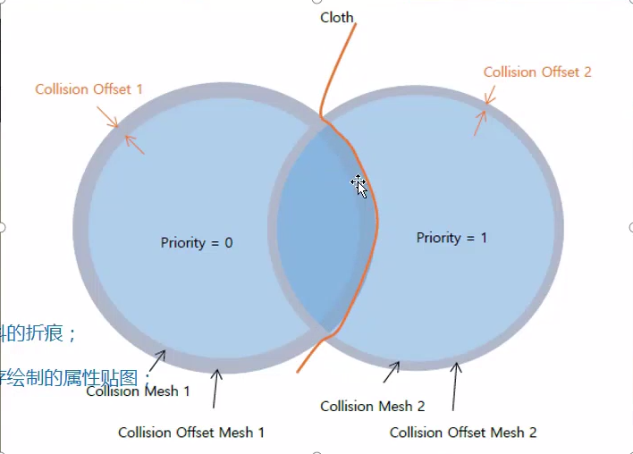
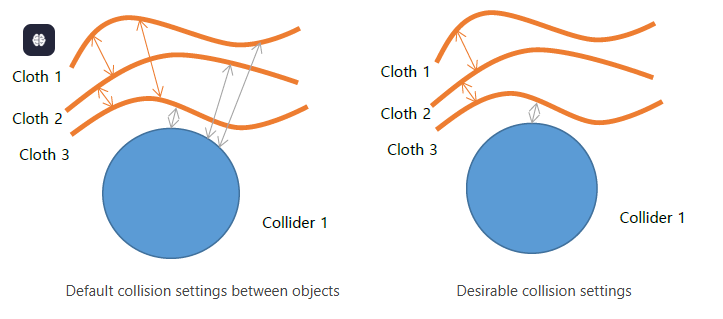
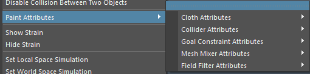
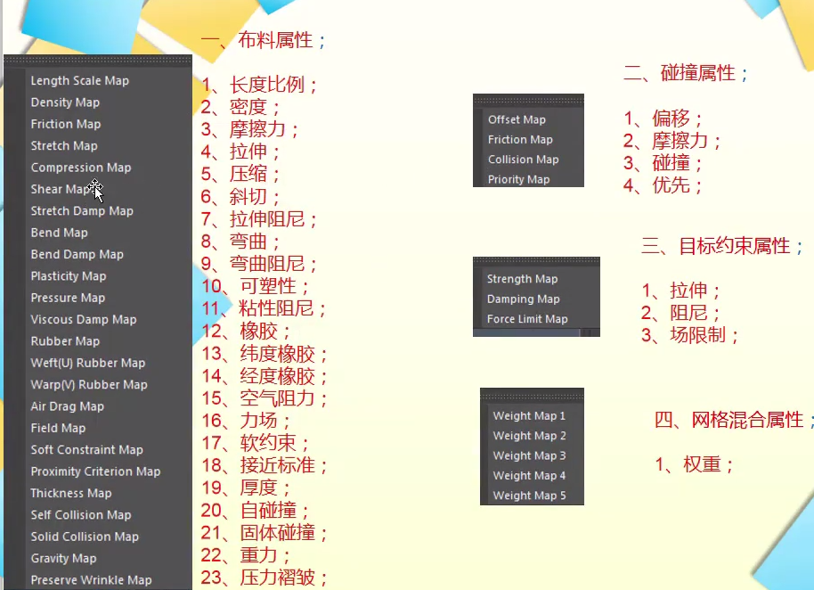

# 碰撞
- 
- 参数
	- 激活
	- 偏移：碰撞厚度
	- 摩擦力：如果碰撞两者都设置了摩擦力，则取而二者平均值
	- 碰撞优先级：数值越小，优先级越高。如果布料对象被两个碰撞体同时碰撞，则选择优先级高的那一个碰撞。
	- 
- 启用和禁用碰撞‘
	- 
- 为了提高效率，用户可能希望重新配置对象之间的冲突处理，如图所示。
- 
1. 选择布料1和布料3，然后单击 “Qualoth>Disable Collisions Between Two Objects”。
2. 选择Cloth 2 和 Collider 1，单击 “Qualoth>Disable Collisions Between Two Objects”。
3. 选择Cloth 1 和 Collider 1，单击 “Qualoth>Disable Collisions Between Two Objects”。.
# 迟滞

- 保存和加载迟滞现象（折痕）和属性贴图
# 绘制

- 可绘制属性：
	- 布料属性
	- 碰撞属性
	- 目标约束属性
	- 网格混合属性
	- 场过滤属性
