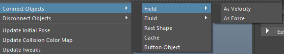
# 连接对象
- 场：先选择物体的顶点，执行命令
	- 作为速度：物体的表面法线对整个运动会产生影响;
	- 作为力量：物体的运动跟力场的力方向是一致的;
- 流体
	- 作为速度
	- 作为力量
I
- 静止形态：布料形态受其它具有相同拓扑结构的物体影响（先选择要变形的物体,再加选布料,执行命令）
	- 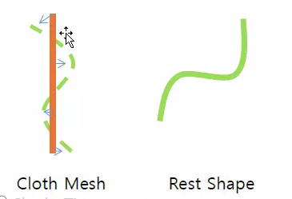
- 缓存：将布料变成缓存物体;
	- 缓存名称
	- 每帧缓存
	- 开始帧
- 按钮对象：可以将物体附加在布料上（先选择要附加的物体,再加选布料,执行命令）
# 断开对象
- 断开属性链接
	- 静止对象
	- 流体
# 每帧烘焙网格
- 每帧烘焙对象：烘焙布料物体动态

# VolumeAxis
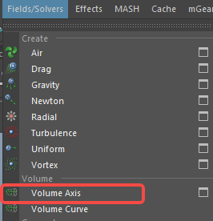
**Maya 中的 Volume Axis（体积轴场）** 是 Dynamics（动力学）系统里非常强大且灵活的一个场（Field），特别适合用来控制粒子（Particles）、nParticles、流体（Fluids）甚至部分 nCloth/nHair 的运动方向和细节。

它跟普通场（如 Gravity、Turbulence、Vortex）最大的区别在于：**它可以在一个指定的体积范围内部，按照你想要的方式“编程”粒子的运动方向和速度变化**，而不是简单地施加单一方向的力。

### 核心特点
- **作用范围是封闭体积**：只有进入这个体积范围内的粒子/对象才会受到影响
- **支持5种体积形状**（Volume Shape）：
  - Cube（立方体）
  - Sphere（球体）
  - Cylinder（圆柱）
  - Cone（圆锥）
  - Torus（甜甜圈/环面）

- **可以独立控制三个轴向的力**（X、Y、Z 方向），而且每个方向还可以设置不同的衰减方式

### 最重要的几个参数（最常用来做特效的）
| 参数名称              | 主要作用                               | 典型用法举例                              |
|-----------------------|----------------------------------------|-------------------------------------------|
| Volume Shape          | 决定影响范围的几何形状                 | 火、爆炸用 Sphere/Cone，龙卷风用 Cylinder+Torus |
| Direction X/Y/Z       | 每个轴向的基础速度/方向（可为负值）     | 向上喷发设 Direction Y = 10               |
| Speed Along Axis      | 沿着体积“主轴”方向的额外速度           | 圆柱里让粒子沿高度方向加速（像火箭尾焰）   |
| Directional Speed     | 朝向/远离中心点的径向速度              | 正值向外爆炸，负值向内吸                  |
| Rotational Speed      | 围绕体积中心轴的自旋速度               | 做漩涡、龙卷风、银河系旋转                |
| Torque                | 扭矩（让粒子自转）                     | 增加粒子混乱感                            |
| Away From Center      | 远离/朝向中心点的力                    | 爆炸向外推、黑洞吸入                      |
| Along Axis            | 沿着轴向（通常是Y轴）的额外推力        | 烟囱向上冲、喷泉                           |
| Around Axis           | 围绕轴的环绕力                         | 非常适合做龙卷风、漩涡                     |
| Attenuation           | 力在体积边缘的衰减程度                 | 0 = 体积内均匀，越大越在中心强边缘弱      |
| Max Distance          | 最大影响距离（有时会和体积形状结合使用）| 控制场的影响范围不无限大                  |

### 常见经典用法举例
1. **爆炸 + 蘑菇云**  
   Volume Shape → Sphere 或 Cone  
   Direction Y → 正值很大  
   Away From Center → 正值  
   Rotational Speed → 小到中  
   Attenuation → 0.5~1（中心强边缘弱）

2. **龙卷风 / 旋涡**  
   Volume Shape → Cylinder 或 Torus  
   Around Axis → 很大正/负值  
   Along Axis → 正值（向上吸）  
   Directional Speed → 负值（向中心吸）  
   Attenuation → 0.2~0.6

3. **火箭尾焰 / 喷射**  
   Volume Shape → Cone  
   Direction Y → 很大  
   Along Axis → 大正值  
   Away From Center → 小正值或0

4. **太阳耀斑 / 火舌**  
   Volume Shape → Cone  
   Direction Y → 大  
   Rotational Speed → 中等  
   Directional Speed → 正值（向外）  
   Attenuation → 0.3~0.7

5. **流体细节增强**（配合 Fluid）  
   在 Fluid 容器内部放一个 Volume Axis，做出更有方向感的卷曲、旋转、向上冲等运动，比单纯用 Turbulence 更可控。

### 小Tips
- 通常把 Volume Axis 的 **Magnitude** 设为 0，然后完全靠 Direction / Along / Around / Away 等参数来控制，这样更直观。
- 记得连接到正确的 solver（nucleus 或 classic particle），nParticles 对 Volume Axis 的响应通常更好。
- 想做更复杂的路径？可以试试 **Volume Axis Curve**（沿着曲线定义轴场），比普通 Volume Axis 更高级。
- 调试时先把 Attenuation 设为 0，看看最原始的力方向对不对，再慢慢加衰减和细节。

简单总结一句话：  
**Volume Axis 是 Maya 粒子/流体特效里“最万能的导演”，它能告诉你粒子：在空间的这个区域里，朝哪个方向走、多快、要不要转圈、要不要往中间挤。**

# 体积轴场添加到布料
## 制作布料
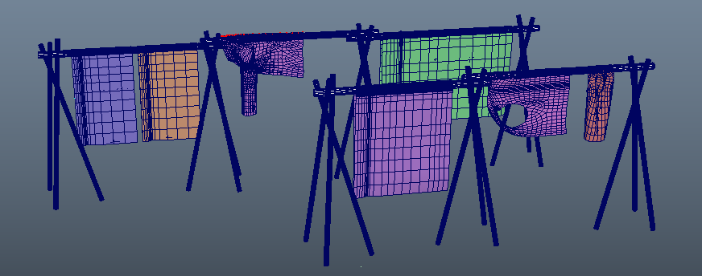
## 添加场
- 创建体积轴场并放大,使体积轴场将布料模型包裹在内
- 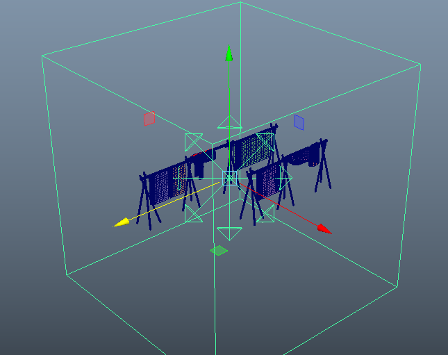
- 体积轴场属性调优
- 我们为体积轴场的方向编写表达式,生成随机的风向
- 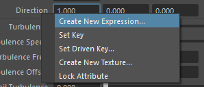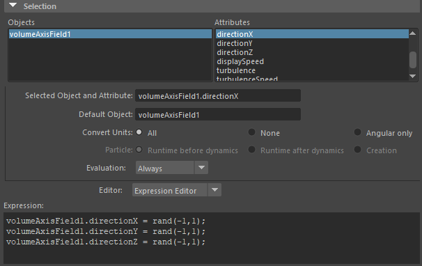
- 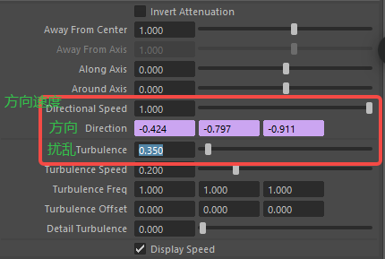
- 然后将布料模型添加到体积轴场,使其受到影响，选择布料模型（qlCloth4Out）的顶点和体积轴场（volumeAxisField1），选择命令
- 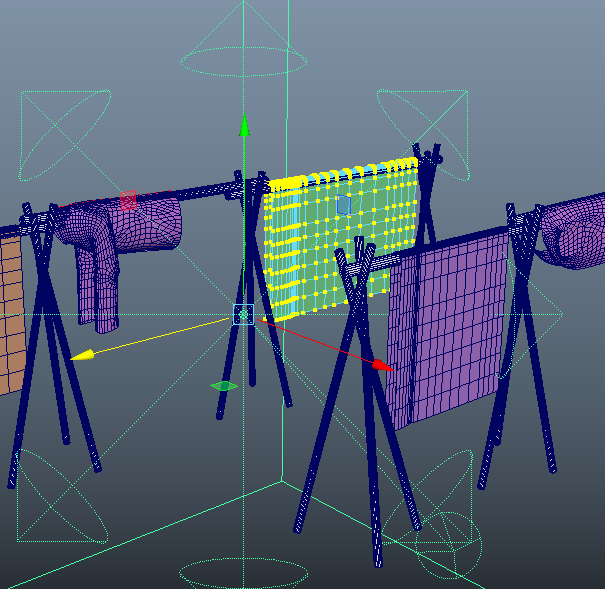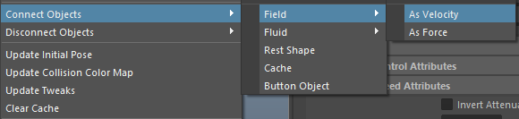
- 以此执行所有布料模型
## 属性调优
- 调整布料受体积轴场的影响度
- 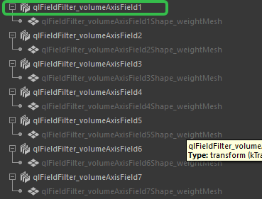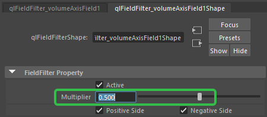
- 部分衣服会滑落，增加布料的摩擦力
- 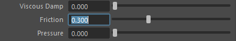